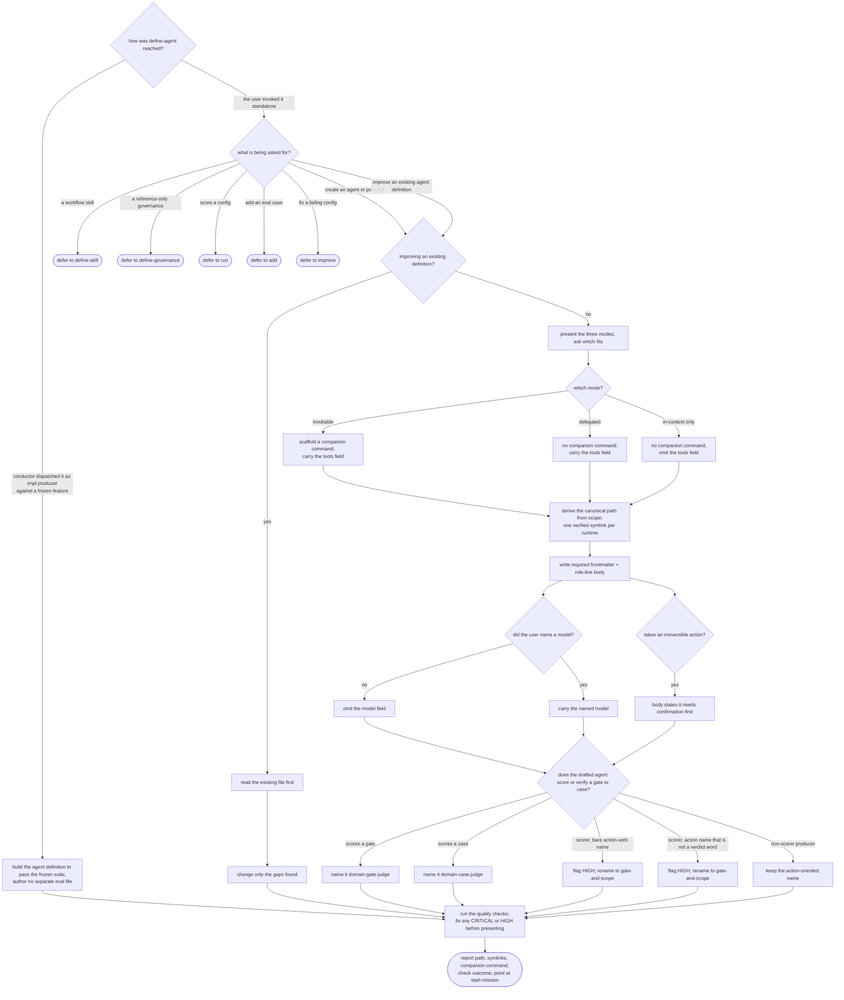

# define-agent — author an agent definition

## What

An **agent definition** is a single file encoding a named, reusable role — one an agent can delegate
to as a subagent, load in-context as a persona, or both. This capability authors one: it settles the
definition's **mode** and placement, gathers its shape, drafts the canonical file (and, for the
invokable mode, a companion command) to a fixed shape, symlinks it into every target runtime, runs the
quality checks, and hands off.

The problem it solves is that agent definitions written ad hoc drift. They are **scaffolded before the
mode is settled** — a delegated worker, an invokable dual-mode role, or an in-context-only persona —
so what gets built (a companion command or not, a `tools` field or not) is decided late and
inconsistently. They are **misplaced or unlinked**, so one runtime sees the agent and another does
not. And their **gate-scorer subagents are named for the action they perform** rather than the gate
they serve, so a scorer reads as a producer and self-activates. The people with this problem are the
authors of agent configuration: they need a role designed before it is built, loadable from every
runtime, and shaped so it can be evaluated.

This capability is reached two ways, and the way it was reached decides how it hands off. Dispatched by
the conductor as the ACED **impl-producer** against a frozen `.feature`, it builds the agent definition
to pass that suite — the frozen suite is the verification, so it authors **no separate eval file**
(any `eval.md` beside the suite keeps only the `subject` binding and run policy). Invoked
**standalone** by a user, it gathers the shape interactively, scaffolds, runs the quality checks, and
points at the ACED eval loop to spec and score the definition.

**Non-goals.** Authoring a workflow skill (`define-skill`). A reference-only rule set
(`define-governance`). Scoring a config against its suite (`run`), adding an eval case
(`add-scenario`), or diagnosing why its evals fail (`improve`). The agent-definition quality rubric
itself — that is the quality-check governance the skill loads, not this capability.

**Fit:** strong — the capability carries a genuine activation decision (an agent-definition request
versus sibling intents that share the same configuration vocabulary), and its mode selection,
placement, and drafting behavior are judged, not asserted.

## Use Cases

| Use case | Trigger / inputs | Outcome |
|---|---|---|
| Route a configuration request | a request to create or improve a named reusable role, versus a sibling intent (workflow skill, governance, scoring, case-adding, eval-diagnosis) carrying the same vocabulary | the capability handles an agent-definition request and defers each sibling intent to the skill that owns it |
| Choose the definition mode | the user wants a new agent suited to a delegated worker, an invokable dual-mode role, or an in-context-only persona | the three modes are presented and the chosen mode drives what is scaffolded — a companion command for the invokable mode, none otherwise |
| Resolve placement and runtimes | the scope (user-global / project / plugin) and target runtimes are unclear from context | the canonical path is derived from the scope and one symlink is created and verified per selected runtime |
| Draft the canonical file | a gathered name, role, responsibilities, output format, human-in-the-loop rules, and out-of-scope | a canonical agent file with the required frontmatter and body shape — the `model` field present only when named, the `tools` field present unless the agent is in-context-only, and a confirmation rule for any irreversible action |
| Improve an existing definition | the named target file already exists | the existing file is read first and only the gaps or issues found are changed |
| Name gate/case-scorer agents by role | the agent being authored has the role of scoring or verifying a gate or case | it is named in the gate-and-scope form; an action-named scorer is flagged HIGH and corrected — whether a bare verdict word or any other action name — while a non-scorer producer keeps its action name |
| Verify quality before handing back | a freshly drafted or improved definition | the quality checks run and any CRITICAL or HIGH failure is fixed before the file is presented |
| Hand off by entry mode | the entry the capability was reached through | standalone reports the artifacts and points at `start-mission`; the impl-producer entry builds against the frozen suite and authors no separate eval file |

## Control Flow

Two facts are set before the body runs and shape everything after: **how the capability was reached**
(the entry mode, fixed at dispatch) and **what is being asked for** (the route). The impl-producer
entry skips the interactive gather — it builds against the frozen suite, which is the spec a user would
otherwise supply.

## Scenario map

One row per edge in the graph above, one scenario per row. Rows follow the suite's section order.

| Edge | Path (Given) | Scenario |
|---|---|---|
| `ROUTE` → create | the user asks to create a delegated agent | `a request to create an agent definition triggers define-agent` |
| `ROUTE` → improve | the user asks to improve an agent they already have | `a request to improve an existing agent definition triggers define-agent` |
| `ROUTE` → `DS` | the user asks for a workflow skill | `a request to create a workflow skill defers to define-skill` |
| `ROUTE` → `DG` | the user asks for a reference-only rule set | `a request for a reference-only governance defers to define-governance` |
| `ROUTE` → `DR` | the user asks to score a config | `a request to score a config defers to run` |
| `ROUTE` → `DA` | the user asks to add an eval case | `a request to add an eval case defers to add` |
| `ROUTE` → `DI` | the user asks to fix a failing config | `a request to fix a failing config defers to improve` |
| `OFFER` (reach) | the user wants a new agent and has named no mode | `the three modes are offered before scaffolding` |
| `MODE` → invokable | the user picks the invokable dual-mode mode | `the invokable mode scaffolds a companion command` |
| `MODE` → delegated | the user picks the delegated mode | `the delegated mode scaffolds no companion command` |
| `PLACE` (path) | the user selects the project scope | `the canonical path is derived from the chosen scope` |
| `PLACE` (symlink) | the user targets Claude Code and Cursor | `a symlink is created for each selected runtime` |
| `DRAFT` (shape) | a gathered name, role, responsibilities, output, out-of-scope | `the agent file carries the required frontmatter and body shape` |
| `MODELQ` → omit | the user names no model | `the model field is omitted when the user names no model` |
| `MODELQ` → keep | the user names a model | `the model field carries the named model when the user names one` |
| `MODE` → in-context (omit tools) | the user picks the in-context-only mode | `the tools field is omitted for an in-context-only agent` |
| `MODE` → delegated/invokable (carry tools) | the user picks the delegated mode and names the tools | `the tools field is present for a delegated agent` |
| `IRRQ` → yes | the agent performs an irreversible action | `an irreversible action carries a confirmation rule` |
| `SHAPE` → `READ` | the named agent file already exists | `an existing file is read before any change` |
| `READ` → `GAPS` | an existing agent file with one missing field | `only the gaps found are changed when improving` |
| `QUALITY` (fix) | a drafted definition whose description fails a HIGH check | `a high-severity quality failure is fixed before the file is presented` |
| `QUALITY` → `REPORT` | a completed agent definition | `the report names the artifacts and the next step` |
| `ROLE` → gate | the agent's role is to score a named gate | `a gate-scorer agent is named by the gate and scope it serves` |
| `ROLE` → case | the agent's role is to score individual cases | `a case-scorer agent takes the case-judge form` |
| `ROLE` → bare-verb | a gate scorer drafted with a bare action-verb name | `a gate scorer drafted with a bare action-verb name is flagged and corrected before the file is presented` |
| `ROLE` → non-verdict action | a gate scorer named for its action, not a bare verdict word | `a gate scorer named for its action rather than its gate is flagged even when the name is not a bare verdict word` |
| `ROLE` → non-scorer | a producer agent that scores nothing | `a non-scorer producer agent keeps its action-oriented name` |
| `ENTRY` → impl-producer | the conductor dispatches it as impl-producer against a frozen feature | `dispatched as impl-producer against a frozen suite it writes only the definition` |
| `ENTRY` → standalone | define-agent is invoked with no frozen feature | `invoked standalone it produces only the definition` |

> **Corrected under owner re-open (CR 304-M2).** The `ENTRY` → impl-producer scenario previously froze
> the pre-doctrine behavior "co-produces … an eval suite carrying one eval per frozen scenario." Current
> SKILL.md — and the swept sibling `define-skill` — hold the opposite: the frozen `.feature` **is** the
> verification, so the impl-producer authors **no separate eval file**. The scenario was re-opened (owner
> ratified) and rewritten to the current contract; it now pairs with the standalone scenario to assert no
> eval file is written in either mode.
