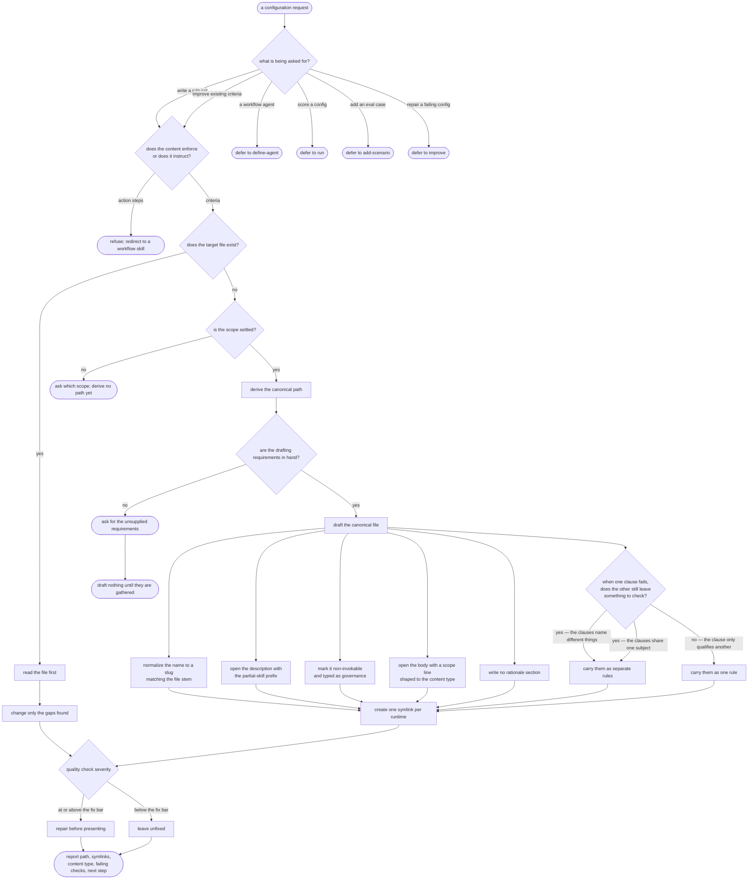

# define-governance — author a governance

## What

A **governance** is a file of criteria — a rubric, a constraint set, a checklist, a decision table,
or a mix of those — that other skills and agents load **by name when they need it**. It is reference
material, never a workflow: it says what to enforce, not how to do something.

The problem it solves is that criteria written ad hoc drift into three failure modes. They get
**auto-triggered** by a harness that mistakes them for a workflow skill, so they fire when nobody
asked. They get **scattered** across runtimes, so one copy is edited and the others rot. And they
accumulate **compound rules** — a single rule demanding two things — which cannot be failed against,
because a reviewer cannot say which half was violated. The people with this problem are the authors
of agent configuration: they need criteria other configurations can load, that stay loadable-only,
and that can actually be checked one rule at a time.

This capability takes a request for such criteria, settles what is missing by asking, writes one
canonical file plus a symlink per runtime the user targets, holds the file to a set of quality
checks, and hands back a report.

**Non-goals.** Authoring a workflow agent the user triggers directly (`define-agent`). Scoring a
configuration against its cases (`run`). Adding or repairing eval cases (`add-scenario` / `improve`).
The quality rubric applied to the drafted file is itself a governance this capability loads — owning
that rubric's content is not this capability's job.

**Fit:** strong — the capability carries a genuine activation decision (a governance request versus
`define-agent` / `run` / `add-scenario`, all sharing the same configuration vocabulary), and its
drafting behavior is judged rather than asserted.

## Use Cases

| Use case | Trigger / inputs | Outcome |
|---|---|---|
| Route a configuration request | a request to create or improve reference-only criteria, versus a sibling intent carrying the same configuration vocabulary | the capability takes a governance request and defers a workflow-agent, scoring, case-authoring, or repair request to the sibling that owns it |
| Classify the supplied content | content describing what to enforce, versus content describing how to perform a task | criteria are authored as a governance; action steps are refused and redirected to a workflow skill |
| Resolve placement and runtimes | a scope (user-global, project, or plugin) that the request may or may not settle, plus the runtimes to target | an unsettled scope is asked about before any path exists, then the canonical path follows from the chosen scope and one symlink is created per runtime |
| Gather what is missing | a request leaving some of the five requirements (name, topic, consumers, content type, rules) unstated | the unsupplied requirements are asked for, and nothing is written until the requirements the file template depends on are in hand |
| Draft the canonical file | the gathered requirements | a file whose frontmatter enforces the loadable-only contract, whose body opens with a scope line and matches the chosen content type, and which carries no rationale prose |
| Keep each rule checkable on its own | a supplied rule carrying more than one clause, whether or not the word "and" appears | a rule splits when its clauses each leave something to check independently, and stays whole when one clause only qualifies another |
| Improve an existing governance | the named file already exists | the file is read before anything changes, and only the gaps found are touched |
| Verify before handing back | a freshly written or edited governance | the quality checks run; failures above the fix bar are repaired before the file is shown, and failures below it are reported rather than silently dropped |
| Report the outcome | a completed governance | the canonical path, the symlinks, the content type and every failing check are named, and the user is pointed at the next step |

## Logic

## Scenario map

One row per edge in the graph above, one scenario per row, both directions. Rows follow the use
cases in the order they appear.

| Edge | Path (Given) | Scenario |
|---|---|---|
| `ROUTE` → `CLASSIFY` | the user asks for criteria other skills load on demand | `a request to write a rule set triggers define-governance` |
| `ROUTE` → `CLASSIFY` | the user asks to improve criteria they already have | `a request to improve an existing governance triggers define-governance` |
| `ROUTE` → `SIB1` | the user asks for a named role they can delegate a task to | `a request for a user-triggered workflow agent defers to define-agent` |
| `ROUTE` → `SIB2` | the user asks to run the evals for a configuration | `a request to score a config defers to run` |
| `ROUTE` → `SIB3` | the user asks to add a case for a failure they just saw | `a request to add an eval case defers to add` |
| `ROUTE` → `SIB4` | the user asks to fix a configuration whose cases are failing | `a request to fix a failing config defers to improve` |
| `CLASSIFY` → `EXISTS` | the supplied content describes a quality bar to enforce | `criteria content is treated as a governance` |
| `CLASSIFY` → `REDIRECT` | the supplied content describes a numbered sequence of actions | `step-by-step content is redirected to a workflow skill` |
| `SCOPE` → `ASKSCOPE` | the request settles no scope and nothing in context settles it | `an unclear scope is asked about before any path is derived` |
| `SCOPE` → `PATH` | the user selects the project scope | `the canonical path is derived from the chosen scope` |
| `LINK` | the user targets two runtimes | `a symlink is created for each selected runtime` |
| `GATHER` → `ASKREQ` | the request supplies only the topic | `the name, consumers, content type, and rules are asked for` |
| `ASKREQ` → `HOLD` | the request supplies only the topic | `no file is drafted until the drafting requirements are gathered` |
| `DRAFT` → `NAME` | the user names the governance in prose rather than as a slug | `a non-kebab-case name is normalized and matches the file stem` |
| `DRAFT` → `PREFIX` | a gathered name, topic, and rules | `the description carries the Partial Skill prefix` |
| `DRAFT` → `FLAGS` | a gathered name, topic, and rules | `the file is marked non-invokable and typed as governance` |
| `DRAFT` → `BODY` | the user selects the checklist content type and supplies the items | `the governance body opens with a scope line and matches the content type` |
| `DRAFT` → `NOWHY` | the user offers a justification for a rule | `no rationale section is written into the body` |
| `RULES` → `SPLIT` | a rule whose clauses name different subjects | `a compound rule is split into independently falsifiable rules` |
| `RULES` → `SPLIT` | a rule whose clauses share one subject | `a rule whose clauses share one object but state separate demands is split` |
| `RULES` → `WHOLE` | a rule whose second clause only qualifies the first | `a rule whose second clause qualifies the first is left as one rule` |
| `EXISTS` → `READ` | the named governance file already exists | `an existing file is read before any change` |
| `READ` → `GAPS` | an existing file missing the loadable-only field | `only the gaps found are changed when improving` |
| `CHECKS` → `FIX` | a drafted file whose failing check is at or above the fix bar | `a high-severity quality failure is fixed before the file is presented` |
| `CHECKS` → `KEEP` | a drafted file whose only failing check is below the fix bar | `a quality failure below the fix bar is still reported` |
| `REPORT` | a completed governance file | `the report names the artifacts and the next step` |

**On the two `RULES` split branches.** They reach one outcome from two different input shapes, and
both are kept deliberately. A rule that splits only when its clauses name *different* subjects is a
cheaper test than the one this capability actually applies, and it is indistinguishable from the real
test unless a same-subject rule that must still split is also covered. Collapsing these two branches
into one would leave that cheaper test passing.
