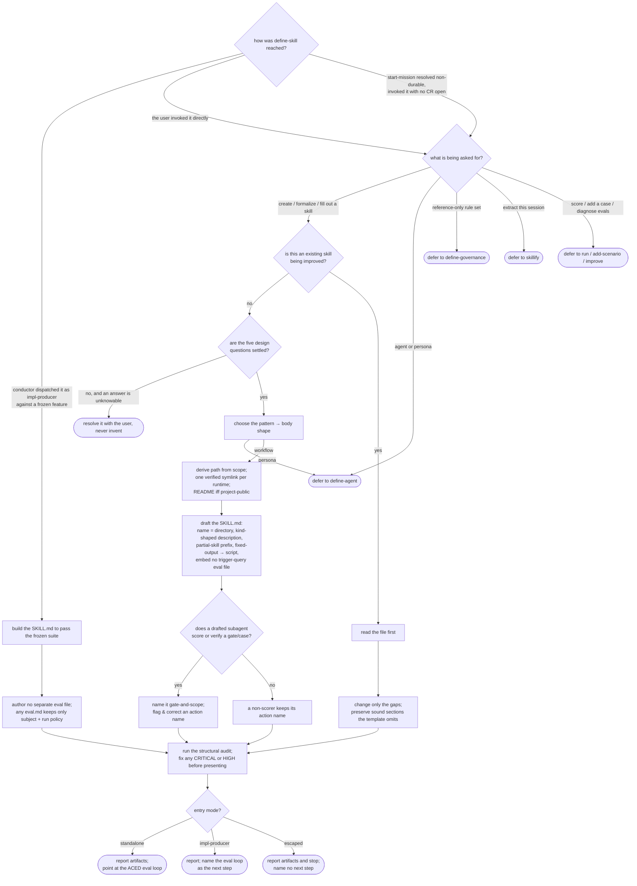

# define-skill — author a workflow skill

## What

A **skill** is a `SKILL.md` that packages one repeatable workflow an agent runs on demand — the unit
another agent loads to do a specific job. This capability authors one: it settles the skill's design,
scaffolds the canonical file and a runtime symlink per agent, drafts the body to a fixed shape, audits
it, and hands off.

The problem it solves is that skills written ad hoc drift in four ways. They are **scaffolded before
their design is settled**, so scope, trigger phrasing, and the output contract are discovered late and
inconsistently. They are **misplaced or unlinked**, so one runtime sees the skill and another does not.
Their **gate-scorer subagents are named for the action they perform** rather than the gate they serve,
so a scorer reads as a producer and self-activates. And they **bake a fixed-output step into prose**
the model re-derives each run instead of extracting it to a script. The people with this problem are
the authors of agent configuration: they need a skill designed before it is built, loadable from every
runtime, and shaped so it can be evaluated.

This capability is reached three ways, and the way it was reached decides how it hands off. Dispatched
by the conductor as the **impl-producer** against a frozen `.feature`, it builds the `SKILL.md` to pass
that suite — the suite is the verification, so it authors no separate eval file. Invoked **standalone**
by a user, it scaffolds and then points at the ACED eval loop. Invoked **escaped** — through the
non-durable escape hatch before any change request opens — it scaffolds, audits, reports, and stops.

**Non-goals.** Authoring an agent or persona the user delegates to (`define-agent`). A reference-only
rule set (`define-governance`). Extracting the current session into a skill (`skillify`). Scoring a
skill against its suite (`run`), adding a case (`add-scenario`), or diagnosing why its evals fail
(`improve`) — this capability's own improve mode fills gaps in a skill's *definition* at author time,
which is a different thing from diagnosing eval failures. Authoring the frozen `.feature` or its eval
cases — that is the ACED eval loop the handoff points at, not this capability.

**Fit:** strong — the capability carries a genuine activation decision (a skill-authoring request
versus seven sibling intents that share the same configuration vocabulary), and its drafting behavior
is judged, not asserted.

## Use Cases

| Use case | Trigger / inputs | Outcome |
|---|---|---|
| Route a configuration request | a request to create, formalize, or fill out a workflow skill, versus a sibling intent (agent/persona, governance, session extraction, scoring, case-adding, eval-diagnosis) carrying the same vocabulary | the capability handles a skill-authoring request and defers each sibling intent to the skill that owns it |
| Settle the design before building | a request that has not fixed scope, trigger phrasing, output contract, quality bar, and out-of-scope | the five design questions are answered — with the user, never invented — before any file is scaffolded |
| Choose the pattern | the workflow's shape, and the non-goal persona case | the chosen pattern drives the body shape; a persona request is redirected to `define-agent` |
| Resolve placement and runtimes | the chosen scope (project-public / user-global) and the target runtimes | the canonical path follows from the scope, a verified symlink is created per runtime, and a README is written for a project-public skill but not a user-global one |
| Draft the canonical file | the settled design | a `SKILL.md` whose name matches its directory, whose description fits the skill's kind, whose partial skills carry the anti-activation prefix, and whose fixed-output logic is extracted to a script |
| Improve an existing skill | the named skill already exists | the file is read first, only the gaps are changed, and a section the template never generates is preserved |
| Name gate-scorer subagents by role | a subagent whose role is to score or verify a gate or case | it is named in the gate-and-scope form; an action-named scorer is flagged and corrected, while a non-scorer producer keeps its action name |
| Audit before handing back | a freshly drafted or improved skill | the structural audit runs before presentation and any CRITICAL-or-HIGH finding is fixed first |
| Hand off by entry mode | the entry the capability was reached through | standalone and impl-producer point at the ACED eval loop; the escaped entry reports and stops; no legacy trigger-query eval file is embedded either way |

## Control Flow

Two decisions are set before the body runs and shape everything after: **how the capability was
reached** (the entry mode, fixed at dispatch) and **what is being asked for** (the route). The
impl-producer entry skips the interactive design questions — it builds against the frozen suite, which
is the spec a user would otherwise supply by answering them.

## Scenario map

One row per edge in the graph above, one scenario per row, both directions. Rows follow the suite's
section order.

| Edge | Path (Given) | Scenario |
|---|---|---|
| `ROUTE` → create | the user asks for a new workflow skill | `a request to create a new workflow skill triggers define-skill` |
| `ROUTE` → formalize | the user asks to formalize an existing ad-hoc workflow | `a request to formalize an existing ad-hoc workflow into a skill triggers define-skill` |
| `ROUTE` → fill out | the user asks to complete an incomplete skill definition | `a request to fill out an incomplete existing skill definition triggers define-skill` |
| `ROUTE` → `D1` (agent) | the user asks for an agent or persona | `a request to create an agent or persona defers to define-agent` |
| `ROUTE` → `D1` (persona) | the user asks for a persona role | `a request for a persona role defers to define-agent` |
| `ROUTE` → `D2` | the user asks for a reference-only rule set | `a request for a reference-only rule set defers to define-governance` |
| `ROUTE` → `D3` | the user asks to extract the current session | `a request to extract the current session into a skill defers to skillify` |
| `ROUTE` → `D4` (score) | the user asks to score an existing skill | `a request to score an existing skill defers to run` |
| `ROUTE` → `D4` (add case) | the user asks to add a golden-set case | `a request to add a golden-set case for an existing skill defers to add` |
| `ROUTE` → `D4` (diagnose) | the user asks why a skill's evals fail | `a request to diagnose why a skill's evals fail defers to improve` |
| `Q` (settled) | a request that has fixed none of the five questions | `the five design questions are settled before scaffolding` |
| `Q` → `ASK` | a design question that cannot be inferred from the request | `an unanswerable design question is resolved with the user, not guessed` |
| `PATTERN` (workflow) | the workflow's shape is named | `the skill pattern is chosen and drives the body shape` |
| `PATTERN` → `D1` | the request is for a persona | `a persona pattern request is redirected out of define-skill` |
| `PLACE` (path) | the user selects the scope | `the placement path is derived from the chosen scope` |
| `PLACE` (symlink) | the user selects the target runtimes | `a runtime symlink is created and verified for each selected agent` |
| `PLACE` (public README) | the chosen scope is project-public | `a project-public skill gets a README beside the SKILL.md` |
| `PLACE` (user-global path) | the chosen scope is user-global | `a user-global skill is still written at the user-global path` |
| `PLACE` (no README) | the chosen scope is user-global | `a user-global skill gets no README` |
| `DRAFT` (name) | the skill's directory name is fixed | `the SKILL.md frontmatter name is the kebab-case directory name` |
| `DRAFT` (description) | the skill is one the user invokes directly | `a user-triggered skill's description carries the capability, the trigger, and an implicit phrasing` |
| `DRAFT` (partial prefix) | the skill is a partial skill other skills call by name | `a partial skill's description carries the Partial Skill prefix to prevent accidental activation` |
| `DRAFT` (script) | a step produces deterministic fixed output | `deterministic fixed-output logic is extracted to a script rather than baked into the body` |
| `DRAFT` (no eval file) | the author asks to bake a trigger-query eval file in | `a request to bake a trigger-query eval file into the skill is answered with the ACED eval loop` |
| `SHAPE` → `READ` | the named skill already exists | `an existing skill is read before any change` |
| `GAPS` | an existing skill missing one field | `only the gaps found are changed when improving` |
| `GAPS` (preserve) | an existing skill carrying a section no template emits | `improving an existing skill preserves a section its own template never generates` |
| `ROLE` → `RENAME` (gate) | a subagent whose role is to score a gate | `a gate-scorer subagent is named by the gate and scope it serves` |
| `ROLE` → `RENAME` (case) | a subagent whose role is to score a case | `a case-scorer subagent takes the case-judge form` |
| `ROLE` → `RENAME` (bare verb) | a gate scorer drafted with a bare action-verb name | `a gate-scorer subagent drafted with a bare action-verb name is flagged and corrected before handoff` |
| `ROLE` → `RENAME` (non-verb) | a gate scorer named for its action but not a bare verdict word | `a gate scorer named for its action rather than its gate is flagged even when the name is not a bare verdict word` |
| `ROLE` → `KEEP` | a producer subagent that scores nothing | `a non-scorer producer subagent keeps its action-oriented name` |
| `AUDIT` (runs) | a freshly drafted skill | `the structural audit runs before the skill is presented` |
| `AUDIT` (CRITICAL) | a drafted skill with a CRITICAL finding | `a high-severity audit finding is fixed before handoff` |
| `AUDIT` (HIGH-only) | a drafted skill whose only finding is HIGH, no CRITICAL | `a HIGH audit finding with no CRITICAL alongside it is still fixed before handoff` |
| `HAND` → `POINT` | a standalone run producing a triggering skill | `the report names the artifacts and points at the ACED eval loop` |
| `HAND` → `POINT` (partial) | a standalone run producing a non-triggering partial skill | `a standalone run producing a non-triggering partial skill still points at the eval loop` |
| `HAND` → `POINT2` | an impl-producer run | `an impl-producer run reports the eval loop as the next step` |
| `HAND` → `STOP` | an escaped-entry run | `an escaped-entry skill is reported and stopped without pointing at the eval loop` |
| `IMPL` + `IMPLNO` | the conductor dispatches it as impl-producer against a frozen feature | `dispatched against a frozen suite it builds the SKILL.md to pass that suite` |
| `ENTRY` → standalone (produces only the skill) | the user invokes it standalone, no frozen feature | `invoked standalone it produces only the skill` |
