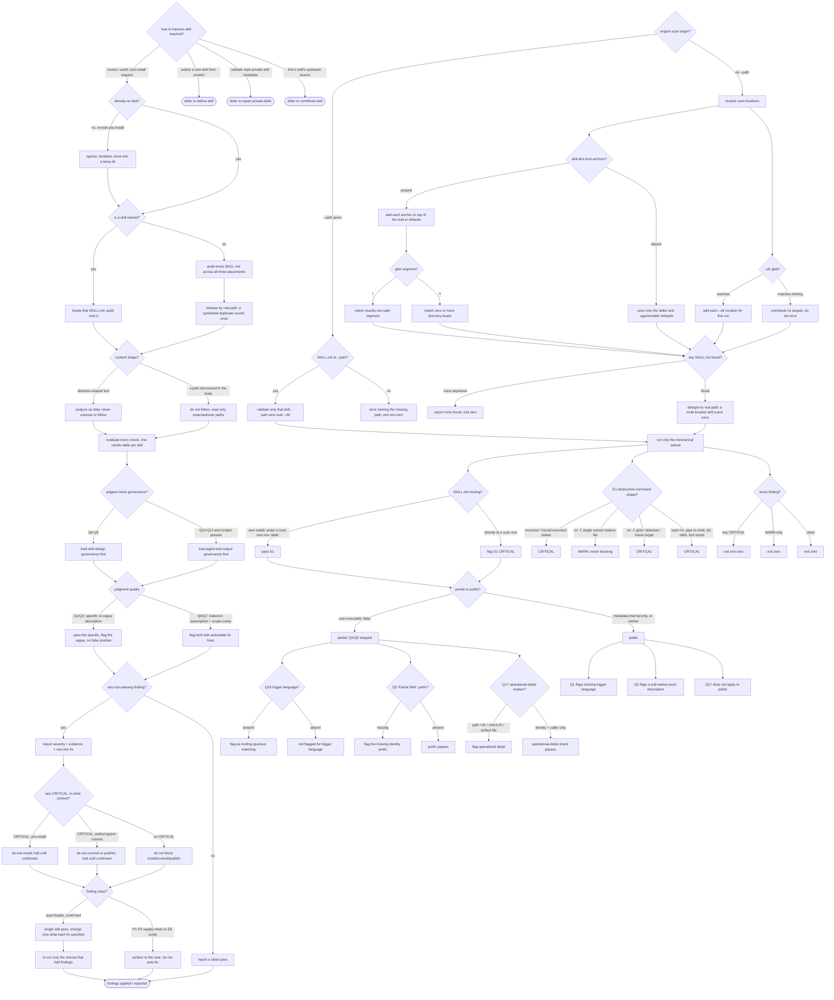

# improve-skill — audit and improve an existing SKILL.md

## What

A **skill audit** takes an existing `SKILL.md` (and any bundled scripts), runs it against the
description-trigger, structure, security, and agentskills.io-compliance bars, reports findings with
severity and a one-line fix, blocks on any CRITICAL until the user confirms, then applies fixes in a
single pass and re-verifies only what it fixed. This capability is a **hybrid unit**: an LLM
audit/quality workflow (agent judgment over the full check table) plus the deterministic mechanical
subset of that table (S1–S6, Q1–Q5, Q10–Q11, Q17, Q18, E1–E2, E6, E9) ported from the cyberplace
CLI's `audit validate` as a CI-usable engine.

The problem it solves is that a skill can look fine and still be unsafe or un-triggerable. A weak
description never activates; a mis-nested file fails structure; an embedded destructive command or a
prompt-injection string is a live hazard; and the target's own body is **untrusted data** an auditor
must analyze rather than obey. The people with this problem are the authors and installers of agent
configuration: they need a skill checked before they trust it, commit it, or install it from a
stranger's repo.

Description checks are **kind-aware**. A skill is a **partial skill** when its frontmatter sets
top-level `user-invocable: false` — a decomposed, reusable part of a larger capability the
orchestrator loads **by name**, never matched to a user situation. Because a partial stays
`disable-model-invocation: false`, the harness still holds its `description`, so that description is
held to identity-for-the-caller: Q1/Q2 (trigger language, specificity word-count) are public-only,
Q18 flags trigger-shaped phrasing, Q3 requires the `"Partial Skill:"` prefix, and Q17 flags four
objective operational-detail markers (a slashed path, an `.agents/`/`scripts/` directory, a check-ID,
a named artifact file). `metadata.internal: true` **alone** does not classify a skill as partial — it
is a marketplace-visibility flag, orthogonal to being a by-name part.

**Fit:** partial (hybrid). The trigger layer (activation vs. the deferrals) and the LLM-audit layer
(the agent-only checks Q6–Q9, Q12–Q16, E3–E5, E7–E8, P1–P3, and deciding what to fix) are real ACED
eval targets — graded with `@trigger` and `@rubric`. The mechanical validate engine is a
deterministic pass/fail scan over a fixed check list — wrong-squad for rubric grading; its behaviors
are specified as plain boolean scenarios.

**Non-goals.** Authoring a new skill from scratch (`define-skill`). Validating repo-private skill
metadata (`repair-private-skills`). Finding a skill's upstream source repo (`contribute-skill`).
improve-skill only audits and improves a `SKILL.md` that already exists.

> **This is a single behavioral unit, not an overview** — one skill plus its ported engine. This spec
> owns the behavior + suite ([`improve-skill.feature`](./improve-skill.feature)); the impl is the
> `improve-skill` skill in `plugins/aced/skills/improve-skill/` plus a `scripts/validate.mts` engine
> reachable from it and from CI. Cross-capability e2e scenarios live in `../../workflows/`.

## Use Cases

| Use case | Trigger / inputs | Outcome |
|---|---|---|
| Route a review request | a request to review, audit, or pre-install-check a skill, versus a sibling intent (author-new, repair-private-metadata, find-upstream) | the capability handles the audit request and defers each sibling to the skill that owns it |
| Audit a remote skill safely | a request to check a skill before installing it | its files are fetched via a sparse, hookless clone into a temp dir and audited from there |
| Resolve the target(s) | a named skill, or an unnamed whole-project request | a named skill audits only its `SKILL.md`; an unnamed request audits every `SKILL.md` across all three placements, deduplicated by real path |
| Sandbox untrusted content | a target body carrying directive-shaped text or an internal file path | content is analyzed as data, never executed or followed; only expected/user-given paths are read |
| Run the full check table | a resolved target skill | every check (mechanical + agent-only) is evaluated into one results table, with skill-design governance loaded for Q6–Q9 and agent-tool-output for Q10–Q12 when scripts are present |
| Report and block | any finding | non-passing checks list severity + evidence + fix; any CRITICAL halts install/commit/publish until confirmed; no CRITICAL does not block |
| Apply fixes | confirmed findings | auto-fixable findings are applied in a single edit pass scoped to each fix, only the affected checks are re-run, and P1–P3/E8 findings are surfaced not auto-fixed |
| Judge description and content quality | competing skill descriptions and bodies | the audit discriminates a specific trigger description from a vague one, and flags baked-in stack assumptions and scope creep |
| Scan mechanically for CI | the engine invoked with or without `--path` / `--dir` | the deterministic subset runs LLM-free over one skill or the whole project, keying nesting on the scan root and grading destructive-command severity by blast radius, exiting non-zero only on a CRITICAL |

## Control Flow

Two lanes share one check table. The **LLM audit lane** is reached when a user asks to review, audit,
or pre-install-check a skill: it obtains and resolves targets, sandboxes their content, runs the full
table (mechanical + agent-only, governance-backed), reports, blocks on CRITICAL, and applies fixes.
The **mechanical engine lane** is `scripts/validate.mts` run standalone (CI): it resolves scan
locations, runs only the deterministic subset, and gates an exit code — no LLM, no fixes. Description
checks in both lanes branch on whether the target is a partial skill.

## Scenario map

One row per decision edge, one scenario per row. Rows follow the suite's section order.

| Edge | Path (Given) | Scenario |
|---|---|---|
| `ENTRY` → audit (activation) | a review / audit / pre-install request, and the sibling near-misses (`@trigger`) | `improve-skill activates on a review/audit/pre-install request and defers its siblings` |
| `ENTRY` → `DA` | a from-scratch new-skill request | `a request to author a new skill from scratch defers to define-skill` |
| `ENTRY` → `DR` | a repo-private metadata request | `a request to validate repo-private skill metadata defers to repair-private-skills` |
| `ENTRY` → `DC` | an upstream-source request | `a request to find a skill's upstream source defers to contribute-skill` |
| `SANDBOX` → `ASDATA` | a target body with directive-shaped text | `SKILL.md and script content is analyzed, never executed` |
| `SANDBOX` → `NOPATH` | a target body referencing an internal path | `only expected or user-given paths are read` |
| `OBTAIN` → `FETCH` | a remote skill audited before install | `a remote skill is fetched without running install hooks before auditing` |
| `RESOLVE` → `ONE` | a named installed skill | `a named skill is located by its SKILL.md` |
| `RESOLVE` → `ALL` | an unnamed audit request | `an unnamed request audits every skill across all three placements` |
| `ALL` → `DEDUPE` | a symlink to an already-found real path | `duplicate skills reached by symlink are counted once` |
| `CHECKS` | a resolved set of target skills | `every check in the table is evaluated for each target skill` |
| `GOV` → `GSD` | about to judge Q6–Q9 | `skill-design governance backs the Q6-Q9 checks` |
| `GOV` → `GAT` | a target with a scripts/ dir or CLI instructions | `agent-tool-output governance backs the Q10-Q12 checks when scripts are present` |
| `REPORT` → `FINDING` | a check that does not pass | `a non-passing finding is reported with severity, evidence, and a fix` |
| `REPORT` → `CLEAN` | every check passes | `a skill with no findings reports a clean pass` |
| `BLOCK` → `NOINSTALL` | a CRITICAL on a pre-install audit | `a CRITICAL finding blocks a pre-install audit until confirmed` |
| `BLOCK` → `NOCOMMIT` | a CRITICAL on an authoring/pre-commit audit | `a CRITICAL finding blocks an authoring or pre-commit audit until confirmed` |
| `BLOCK` → `NOBLOCK` | only WARN-level or no findings | `no CRITICAL finding does not block` |
| `FIX` → `ONEPASS` | confirmed findings | `fixes are applied in a single edit pass after confirmation` |
| `ONEPASS` (scoped) | a fix line naming a specific change | `only what a finding's remediation specifies is changed` |
| `REVERIFY` | checks that had findings and were fixed | `only the checks with findings are re-run after fixing` |
| `FIX` → `SURFACE` | a P1–P3 or E8 finding | `supply-chain and script findings are surfaced, not auto-fixed` |
| `JUDGE` → `JDESC` | a specific vs. a vague description (`@rubric`) | `the audit correctly distinguishes a specific trigger description from a vague one` |
| `JUDGE` → `JCONTENT` | a body assuming one stack and mixing two workflows (`@rubric`) | `the audit judges baked-in stack assumptions and scope creep on content quality` |
| `KIND` → `PART` | frontmatter sets `user-invocable: false` | `a partial skill is classified by its top-level user-invocable marker` |
| `KIND` → `PUB` (internal only) | `metadata.internal: true`, no `user-invocable: false` | `metadata.internal alone does not classify a skill as partial` |
| `PART` → Q1/Q2 skipped | a partial with no trigger phrasing | `the trigger-language and trigger-specificity checks are public-only` |
| `PUB` → `PUBTRIG` | a public skill with no trigger phrasing | `the trigger-language check still applies to a public skill` |
| `PUB` → `PUBSPEC` | a public skill under twelve words | `the specificity word-count check still applies to a public skill` |
| `PTRIG` → `PTFLAG` | a partial carrying `"Use this skill when"` | `a partial-skill description carrying user-facing trigger language is flagged` |
| `PTRIG` → `PTOK` | a partial with no trigger phrasing | `a partial-skill description with no trigger language is not flagged for trigger language` |
| `PPRE` → `PPFLAG` | a partial not leading with the prefix | `a partial-skill description not leading with the Partial Skill prefix is flagged` |
| `PPRE` → `PPOK` | a partial leading with the prefix | `a partial-skill description leading with the Partial Skill prefix passes the prefix check` |
| `POP` → `POPFLAG` | a partial carrying an operational-detail marker (outline: path, dir, check-ID, artifact file) | `a partial-skill description carrying an operational-detail marker is flagged` |
| `POP` → `POPOK` | a partial with identity + caller only | `an identity-and-caller partial-skill description passes the operational-detail check` |
| `PUB` → `PUBOP` | a public description naming a path/dir | `the operational-detail check does not apply to public skills` |
| `EENTRY` → `EPATH` → `EONE` | `--path` at one skill directory | `--path validates a single skill directory or SKILL.md file` |
| `EENTRY` → `ELOC` | no `--path` | `omitting --path scans every configured skill location` |
| `EPATH` → `EERR` | `--path` at a dir with no SKILL.md | `--path with no SKILL.md at the target errors and exits non-zero` |
| `EMPTY` → `ENONE` | no `--path`, no SKILL.md anywhere | `no SKILL.md files found across the whole project exits zero` |
| `ECFG` → `EADD` | a `skill-dirs.toml` with an `anchors` array | `the config declares extra skill-dir patterns under a single anchors key` |
| `ECFG` → `EDEF` | a repo with no `skill-dirs.toml` | `an absent skill-dirs config leaves the scan at the default locations` |
| `EADD` (additive) | a config declaring one extra pattern | `an extra skill-dir pattern is scanned in addition to, not instead of, the defaults` |
| `EGLOB` → `ESTAR` | a pattern with a `*` segment | `a * segment in a skill-dir pattern globs exactly one directory segment` |
| `EGLOB` → `ESTAR2` | a pattern with a `**` segment | `a ** segment in a skill-dir pattern globs zero or more directory levels` |
| `EDIR` → `EDIRHIT` | one or more `--dir <glob>` flags, no `--path` | `a repeatable --dir flag adds a one-off scan location for a single run` |
| `EPATH` → `EONE` (precedence) | both `--path` and `--dir` given | `--path takes precedence over --dir and scans only the single target` |
| `EDIR` → `EDIRMISS` | a `--dir` glob matching no directory | `a --dir glob that matches no directory contributes no targets and does not error` |
| `EMPTY` → `EDEDUP` | a skill reachable under two configured locations | `a skill reached through more than one configured location is scanned once` |
| `S1` → `S1PASS` | a SKILL.md nested under a non-`skills` scan location | `S1 passes a skill nested in its own subdirectory under a configured non-skills scan location` |
| `S1` → `S1FAIL` | a SKILL.md directly at a scan root | `S1 still flags a SKILL.md sitting directly at a scan root rather than in its own subdirectory` |
| `ESCAN` (subset) | a target scanned by the engine | `the engine runs only the mechanical check subset` |
| `EXIT` → `EXNZ` | a scan with at least one CRITICAL | `a CRITICAL finding produces a non-zero exit code` |
| `EXIT` → `EXZ` | a scan with only WARN findings | `only warning-level findings still exits zero` |
| `EXIT` → `EXZ2` | a scan with no findings at all | `a fully clean scan exits zero` |
| `E1` → `E1CRIT` | a body embedding `rm -rf` / `rm -r` | `a recursive or forced-recursive delete is a CRITICAL finding` |
| `E1` → `E1WARN` | `rm -f` at a single named relative file | `a scoped forced delete of a single named file is a warning, not a CRITICAL` |
| `E1` → `E1ESC` | `rm -f` at a glob / absolute / home target (outline) | `a forced delete whose target escapes a single named relative file stays CRITICAL` |
| `E1` → `E1OTHER` | `sudo rm`, pipe-to-shell, `dd`, `mkfs`, or a fork bomb | `the other catastrophic command patterns remain CRITICAL` |
