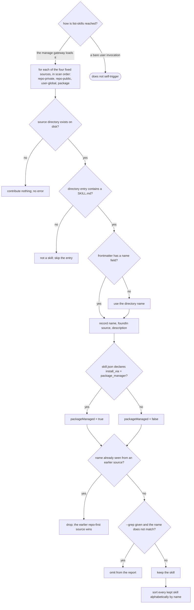

# list-skills — discover and summarize installed skills

## What

An **internal, non-invokable discovery engine** that inventories the agent skills installed across a
repo, the user's global install, and the cyberplace package's shipped skills — and reports a
name-sortable summary of each: its name, where it was found, its description, and whether it is
package-managed. It is reached only through the ACED `manage` gateway (`../../manage/`); it never
self-triggers from a bare user request.

The problem it solves is that skills live in **four fixed but scattered sources** — repo-private
(`.agents/skills`), repo-public (`skills`), user-global (`~/.agents/skills`), and the cyberplace
package's shipped `skills/` dir — and any real environment has only some of them present. An agent
that wants to know what is installed needs one read-only pass that scans every source that exists,
tolerates the ones that don't, dedupes a name that appears in more than one source (repo wins), and
reports a single sorted list. It is strictly **read-only**: it inspects `SKILL.md` frontmatter and an
optional `skill.json` manifest and writes nothing.

**Non-goals.** Validating or repairing skill content (`repair-private-skills` — read-only checks and
writes live there; this engine never mutates a file). Maintaining the per-model runner agent-def
family (`manage-model-runners`). Installing or scaffolding a skill (`create-skill`,
`contribute-skill`). It is **not user-invocable** — it is reached via `manage`.

**Fit:** partial — the operation is mechanical (scan fixed directories, parse frontmatter, dedupe,
filter, report) and is reached through the `manage` gateway rather than by an activation decision, so
trigger near-miss balance is N/A. The behavior layer still carries signal: source precedence, absent-
source tolerance, dedupe, glob-filter matching, the reported field set, and sort order.

> **This is a single behavioral unit, not an overview** — one engine skill. This spec owns the
> behavior + suite ([`list-skills.feature`](./list-skills.feature)); the impl is the non-invokable
> `list-skills` skill in `plugins/aced/skills/list-skills/`.

## Use Cases

| Use case | Trigger / inputs | Outcome |
|---|---|---|
| Reach the engine through the gateway | a user request to see what skills are installed | the `manage` gateway loads list-skills; the engine does not self-trigger from a bare user invocation |
| Scan the four fixed sources | a skill directory living under repo-private, repo-public, user-global, or the package's shipped skills dir | the skill is reported with the `foundIn` matching its source (`repo` / `global` / `package`) |
| Ignore non-skill and absent inputs | a directory with no `SKILL.md`, or a fixed source whose directory is absent on disk | the non-skill directory is not reported; the missing source contributes nothing and raises no error |
| Dedupe across sources | the same skill name present in more than one source | only the first-scanned (repo-precedence) copy is reported; later copies are dropped |
| Filter by name | an optional `--grep` glob pattern (`*`/`?`), or none | with a pattern, only names that match are reported; without one, every discovered skill is reported |
| Summarize each skill's fields | a discovered skill's frontmatter and optional `skill.json` | the summary carries name (directory-name fallback when frontmatter omits it), `foundIn`, description, and package-managed status |
| Return a stable order | the full set of surviving skills | the report is sorted alphabetically by name |

## Control Flow

The engine is mechanical: a single scan over four fixed sources in a fixed order, with a decision at
each stage — does the source exist, does the entry hold a `SKILL.md`, does frontmatter name it, is it
package-managed, has the name been seen already, does the filter admit it. Repo sources are scanned
first, so the dedupe decision is what encodes repo precedence.

## Scenario map

One row per edge in the graph above, one scenario per row. Rows follow the suite's section order.

| Edge | Path (Given) | Scenario |
|---|---|---|
| `REACH` → gateway / not self | a user request to see what skills are installed | `the engine is reached via the manage gateway, not a bare user invocation` |
| `SCAN` → repo-private (`repo`) | a skill directory under the repo's `.agents/skills` | `discovery scans the repo-private skills directory` |
| `SCAN` → repo-public (`repo`) | a skill directory under the repo's `skills` directory | `discovery scans the repo-public skills directory` |
| `SCAN` → user-global (`global`) | a skill directory under the user's global `.agents/skills` | `discovery scans the user-global skills directory` |
| `SCAN` → package (`package`) | a skill directory under the cyberplace package's skills directory | `discovery scans the cyberplace package's shipped skills directory` |
| `HASMD` → no | a directory under a scanned source with no `SKILL.md` file | `only a directory containing a SKILL.md is reported as a skill` |
| `EXIST` → no | one of the four fixed sources has no directory on disk | `a source directory that does not exist contributes no skills and raises no error` |
| `DEDUPE` → drop | the same skill name present under both a repo source and the global source | `a name found in more than one source is reported once, repo taking precedence` |
| `FILTER` → omit | a `--grep` pattern using `*` and `?` glob syntax | `a glob-style name filter restricts the report to matching skills` |
| `FILTER` → keep (no grep) | no `--grep` pattern is supplied | `omitting the name filter reports every discovered skill` |
| `FIELDS` | a discovered skill with frontmatter name and description | `each reported skill carries name, foundIn, and description` |
| `NAME` → fallback | a `SKILL.md` whose frontmatter omits the name field | `a skill with no frontmatter name falls back to its directory name` |
| `PKG` → true | a skill directory with a `skill.json` whose `distribution.install_via` is `package_manager` | `a skill declaring package-manager distribution is reported as package-managed` |
| `PKG` → false | a skill directory with no `skill.json` or one not declaring `package_manager` | `a skill with no manifest or a non-package install path is not package-managed` |
| `SORT` | a set of discovered skills in scan order | `the reported skill list is sorted alphabetically by name` |

Cross-capability e2e scenarios live in `../../workflows/`.
