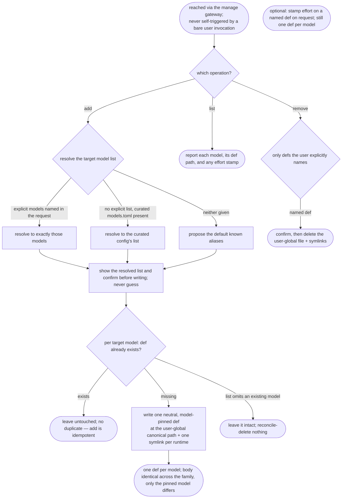

# manage-model-runners — manage the per-model runner agent-def family

## What

Maintain a family of **runner agent definitions — one per model** at user-global
`~/.agents/agents/model-runner-<model>.md`, each a **neutral executor** pinned to a single model so a
skill-under-test can be run as a real subagent under that model for cost/quality benchmarking. An
**internal, non-invokable** engine reached only through the ACED `manage` gateway (`../../manage/`);
it authors agent-definition artifacts, so it lives beside `define-agent` in `config-authoring/`.

The problem it solves is that ACED's eval loop only *simulates* behavior via a judge — it never runs a
skill under a real model, so effectiveness and token/cost under a specific model are unmeasured. A
model-pinned runner def turns "run this skill under model X" into a real subagent spawn. It has three
**additive** operations — **add** the missing runners, **list** the family, **remove** only runners
the user explicitly names — and its defining discipline is that it **never auto-removes**: a model a
target list omits is left alone (the user may run several harnesses, so a runner this engine did not
just create must not be culled).

**Non-goals.** Authoring a bespoke single agent definition is `define-agent`; formalizing a workflow
skill is `define-skill`; **auto-removing** runners a target list omits (never — a model this engine
did not just create is not culled); running the skills-under-test or capturing token/cost (a future
`eval-run` capability); varying **effort** as a def axis (one def per model — effort is stamped only
on request, never a model×effort def explosion). It is **not user-invocable** — it is reached via
`manage`.

**Fit:** partial — the operations are mechanical (add / list / remove runner def files), reached via
the `manage` gateway rather than by an activation decision, so trigger near-miss balance is N/A; the
behavior and structural layers still carry signal (the additive-only invariants — idempotent add,
never auto-remove, confirm before removal — and the one-def-per-model runner-def shape).

## Use Cases

| Use case | Trigger / inputs | Outcome |
|---|---|---|
| Reach the engine | a user request to set up per-model runners, routed by the `manage` gateway | the gateway loads the engine in-session; it never self-triggers from a bare user invocation |
| Resolve the target models (add) | an add request, with or without an explicit model list, and a curated `models.toml` maybe present | it resolves the list by precedence — explicit args → curated config → proposed default aliases — and confirms before writing, never guessing |
| Add the missing runners | a confirmed target list against the current family | it creates one neutral, model-pinned runner def per model that lacks one, at the user-global canonical path plus one symlink per runtime, and is idempotent for models already covered |
| List the family | a list request | it reports each model, its runner-def path, and any effort stamp — nothing else |
| Remove named runners | a remove request naming specific models/paths | it deletes only the named defs after confirmation, and never reconcile-deletes a model merely absent from a target list |
| Stamp effort (optional) | a request to stamp an effort on a model's def | it writes the `effort` field on that def while keeping exactly one def per model |

## Control Flow

Two invariants frame the whole engine: **additive-only** — it never reconcile-deletes a runner a
target list omits — and **confirm before writing or deleting** — it proposes and confirms a resolved
model list before writing, and confirms before removing a def. Everything below runs inside those.

## Scenario map

One row per edge in the graph above, one scenario per row, all three resolve sources and both write
branches covered. Rows follow the suite's section order.

| Edge | Path (Given) | Scenario |
|---|---|---|
| `GATEWAY` → `OP` | a user request to set up per-model runner agents | `the engine is reached via the manage gateway, not a bare user invocation` |
| `RESOLVE` → `DEF` → `CONFIRM` | an add request with no explicit model list | `add resolves and confirms the target model list before writing` |
| `RESOLVE` → `EXPL` | an add request that names an explicit model list | `add with an explicit model list resolves to exactly those models` |
| `RESOLVE` → `CUR` | an add request with no explicit list and a curated models config present | `add prefers the curated models config over the default aliases when it is present` |
| `WRITE` → `CREATE` | a confirmed target list with some models lacking a def | `add creates a runner def for each model that has none` |
| `WRITE` → `SKIP` | a target model whose runner def already exists | `add is idempotent for models that already have a runner def` |
| `CREATE` → `SHAPE` (one per model) | a runner family for a set of models | `the family varies over model only, one def per model` |
| `CREATE` → `SHAPE` (body) | manage-model-runners writes a runner def for a model | `each runner def is a neutral executor pinned to its model` |
| `WRITE` → `CREATE` (path) | manage-model-runners creates a runner def for a model | `a runner def is written at its user-global canonical path with runtime symlinks` |
| `OP` → `LIST` | an existing runner family | `list reports the current runner family` |
| `REMOVE` → `DEL` (named) | a remove request naming a specific model | `remove deletes only the runner defs the user explicitly names` |
| `WRITE` → `NOAUTO` (additive guard) | a target list that omits a model whose runner def exists | `a model absent from a target list is never auto-removed` |
| `REMOVE` → `DEL` (confirm guard) | a remove request for an existing runner def | `a user-global runner def is deleted only after confirmation` |
| `EFFORT` | a request to stamp an effort on a model's runner def | `an effort stamp may be applied to an existing runner def on request` |

Cross-capability e2e scenarios live in `../../workflows/`.
