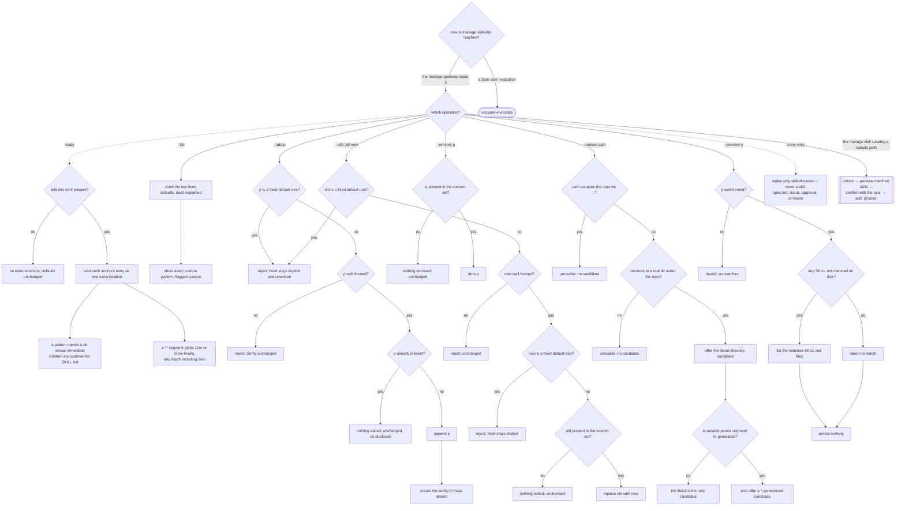

# manage-skill-dirs — curate the extra skill-scan locations

## What

An **internal, non-invokable** curation engine that declares and maintains the **extra skill-dir
patterns** the `improve-skill` mechanical validate engine scans on top of its two built-in default
roots (`skills/`, `.agents/skills/`). It is reached only through the ACED `manage` gateway
(`../../manage/`); it curates config the validate engine *reads*.

The problem it solves is that the validate engine must not bake a monorepo layout in (the repo's
"no baked-in opinions — detect the setup at runtime" rule): a single-package repo scanning `skills/`
alone must see no change, while this repo opts itself into `plugins/*/skills` and `packages/*/skills`.
So the extra locations live in an opt-in `.agents/aced/skill-dirs.toml` under a single `anchors` key —
a list of repo-relative directory patterns where `*` globs one segment and `**` globs zero or more
(any depth). There is **no capture token**: a skill's name comes from its own directory basename, so a
pattern containing `<` or `>` is malformed. The two fixed default roots are **implicit and always
scanned** — never listed, never curatable. The engine exists so a user curates through a clean
interface (list / add / remove / edit / induce / preview) instead of hand-editing the TOML, and it
validates on the **write** side so a bad pattern is never persisted. It reuses SDD's `spec-anchors`
grammar (ADR-0019), dropping only the `<project>` capture that spec discovery needs.

**Non-goals.** Scanning or validating skills (`improve-skill`'s validate engine, which *reads* this
config). Writing any skill content, `spec.md`, `status`, approval, or freeze — it writes **only**
`.agents/aced/skill-dirs.toml`, so `manage`'s write-ownership guard holds. A `<project>` capture
token. It is **not user-invocable** — it is reached via `manage`.

**Fit:** partial — the operations are mechanical (CRUD + induce + preview over a TOML array), reached
via the `manage` gateway rather than by an activation decision, so trigger near-miss balance is N/A.
The behavior and structural layers carry the signal: the config format, the additive-only defaults
invariant, the pattern validator, and the preview-before-persist flow. The one agentic behavior — the
manage skill previewing a pattern's matched skills and confirming before it writes — is the single
`@rubric` scenario.

> **This is a single behavioral unit, not an overview** — one engine skill. This spec owns the
> behavior + suite ([`manage-skill-dirs.feature`](./manage-skill-dirs.feature)); the impl is the
> non-invokable `manage-skill-dirs` skill in `plugins/aced/skills/manage-skill-dirs/`.

## Use Cases

| Use case | Trigger / inputs | Outcome |
|---|---|---|
| Read the config format | an `anchors` array of repo-relative patterns, or no config file | each entry loads as one extra scan location; an absent config yields no extra locations and leaves the defaults unchanged |
| List the scan locations | a `--list` request | the two fixed defaults (each explained, flagged `fixed`) plus every custom pattern (flagged `custom`) are reported |
| Add / remove / edit a custom pattern | a `--add` / `--remove` / `--edit` operation over the custom set | the config is updated (created if absent); a no-op operation leaves it unchanged with no duplicate |
| Guard every write | a fixed default root, or a malformed pattern, offered to add or edit | the write is refused before it persists; the config on disk is unchanged and the fixed defaults stay implicit |
| Induce a pattern from a sample path | a repo-relative directory containing skill subdirectories | a literal-directory candidate is offered, plus a `*`-generalization when there is a variable parent segment; a path outside the repo is refused |
| Preview a pattern's effect | a candidate pattern | the SKILL.md files it would discover are listed without persisting the pattern; a malformed pattern is refused, a zero-match pattern reports none |
| Stay within the write boundary | any curation operation | only `.agents/aced/skill-dirs.toml` is written — never a skill, `spec.md`, `status`, approval, or freeze |
| Confirm before persisting (agentic) | a user supplying a sample path to add | the manage skill induces, previews the matched skills, and confirms with the user before it writes (`@rubric`) |

## Control Flow

The engine dispatches on the operation; each operation runs its own guard chain before it touches the
config. Two invariants shape every branch: the two fixed default roots are never written (guarded on
add and edit, and unreachable on remove because they are never in the custom set), and no write
happens until the pattern is validated. `induce` and `preview` never persist; they are the read-side
of the curate-with-preview flow.

## Scenario map

One row per edge in the graph above, one scenario per row. Rows follow the suite's section order.
The fixed-default guard (`ADDFIX → AREJ`) is one scenario spanning add/edit/remove — a fixed root is
refused on add and edit, and unreachable on remove because it is never in the custom set.

| Edge | Path (Given) | Scenario |
|---|---|---|
| `CFG` → `PARSE` | a `skill-dirs.toml` with an `anchors` array of patterns | `the config declares extra skill-dir patterns under a single anchors key` |
| `PARSE` → `CHILDREN` | a skill-dir pattern naming a directory | `a skill-dir pattern names a directory whose children are scanned for a SKILL.md` |
| `PARSE` → `STARSTAR` | a pattern containing a `**` segment | `a ** segment in a skill-dir pattern globs zero or more directory levels` |
| `CFG` → `EMPTY` | a repo with no `skill-dirs.toml` | `an absent config yields no extra skill-scan locations` |
| `OP` → `LISTFIX` | any repo, `--list` | `list shows the two fixed default roots with an explanation each` |
| `LISTFIX` → `LISTCUST` | a config declaring custom patterns, `--list` | `list shows the custom patterns from the config` |
| `ADDDUP` → `AWRITE` | a custom pattern to add | `add writes a new custom pattern to the config` |
| `AWRITE` → `ACREATE` | no config yet, a pattern to add | `add creates the config file when none exists` |
| `ADDFIX` → `AREJ` | a curation request targeting a fixed default root (add/edit/remove) | `a fixed default root cannot be added, edited, or removed` |
| `ADDVAL` → `AINV` | a malformed pattern to add | `adding an invalid pattern is rejected before it is persisted` |
| `ADDDUP` → `ANOOP` | a config already containing the pattern | `adding a pattern already present changes nothing` |
| `RMPRES` → `RWRITE` | a config containing a custom pattern | `remove deletes a custom pattern from the config` |
| `RMPRES` → `RNOOP` | a config not containing the pattern | `removing a pattern absent from the config changes nothing` |
| `EPRES` → `EWRITE` | a config containing a custom pattern | `edit replaces one custom pattern with another` |
| `EPRES` → `ENOOP` | a config not containing the old pattern | `editing a pattern absent from the config changes nothing` |
| `EMAL` → `EMALREJ` | a config containing a custom pattern, malformed `new` | `editing a custom pattern to a malformed one is rejected` |
| `EFIX` → `EFIXREJ` | a config containing a custom pattern, `new` is a fixed root | `editing a custom pattern to a fixed default root is rejected` |
| `IDIR` → `ILITERAL` | a repo-relative sample dir containing skill subdirectories | `induce offers a literal directory candidate for a sample path` |
| `ISEG` → `IGLOB` | a sample path with a variable segment such as a plugin name | `induce offers a glob generalization for a sample path` |
| `ISEG` → `IONLY` | a repo-relative single-segment sample path | `induce offers only the literal candidate when the sample path has no variable segment` |
| `IDIR` → `IREJ2` | a sample path that does not exist under the repo root | `induce rejects a sample path that does not resolve inside the repo` |
| `IESC` → `IREJ1` | a sample path using `..` to point outside the repo root | `induce rejects a sample path that escapes the repo via ..` |
| `PMATCH` → `PLIST` | a candidate pattern with SKILL.md files on disk under it | `preview lists the skills a candidate pattern would discover` |
| `PLIST`/`PNONE` → `PNP` | a candidate pattern being previewed | `preview does not persist the candidate pattern` |
| `PMATCH` → `PNONE` | a candidate pattern matching no SKILL.md | `preview of a pattern that matches no skill reports an empty match` |
| `PVAL` → `PINV` | a malformed candidate pattern | `preview rejects a malformed candidate pattern` |
| `OP` → `BOUND` | any curation operation | `curation writes only the skill-dirs config` |
| `OP` → `CONFIRM` | a user supplying a sample path to add (`@rubric`) | `the manage skill previews the effect and confirms before it persists a new pattern` |

Cross-capability e2e scenarios live in `../../workflows/`.
