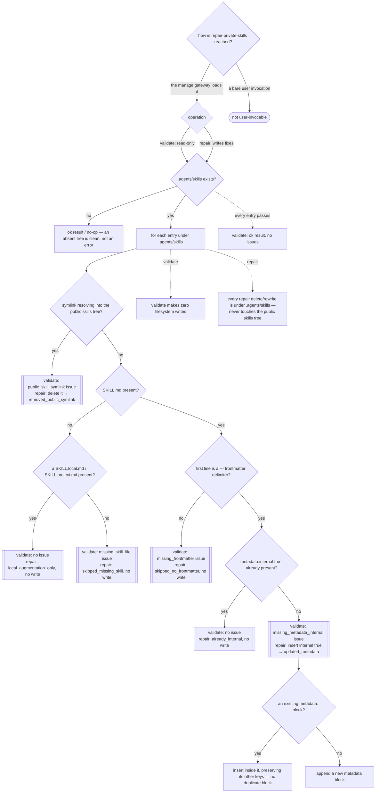

# repair-private-skills — validate and repair repo-private skill hygiene

## What

An **internal, non-invokable** engine that checks and fixes the hygiene of **repo-private skills
under `.agents/skills`**. It is reached only through the ACED `manage` gateway (`../../manage/`); it
inspects and fixes skill config artifacts, never self-triggers from a bare user request.

The problem it solves is that a repo-private skill can drift into two states that leak or break it: a
**stray symlink** left pointing into the public `skills/` tree (a private skill should be a real
repo-private directory, not a link into the public one), and a `SKILL.md` **missing
`metadata.internal: true`** — the flag that keeps a contributor-only skill from surfacing as a public
one. The engine offers two operations over the same per-entry checks: a read-only **validate** that
reports every issue and makes zero filesystem changes, and a **repair** that writes fixes — deleting
the stray symlink and inserting the missing metadata. A directory holding only `SKILL.local.md` /
`SKILL.project.md` (no `SKILL.md`) is an **augmentation-only** entry and is never flagged. Repair is
idempotent: an already-correct entry is left untouched, and an entry it cannot safely fix (missing
frontmatter, augmentation-only) is skipped with a recorded action rather than mutated.

**Write boundary.** `repair` is the only operation that mutates the filesystem, and only under
`.agents/skills`: it deletes a stray symlink there and rewrites a `SKILL.md` there. It reads the
public `skills/` tree (via a resolved realpath comparison) to detect a stray symlink, but it never
creates, modifies, or deletes anything under it.

**Non-goals.** Discovering or summarizing skills across all sources (`list-skills` — this engine only
ever looks at `.agents/skills`). Maintaining the per-model runner agent-def family
(`manage-model-runners`). Any hygiene check other than the public-symlink and `metadata.internal`
checks — content quality is `audit-skill` / `improve-skill`. It is **not user-invocable** — it is
reached via `manage`.

**Fit:** partial — the operations are mechanical (scan `.agents/skills`, classify each entry,
optionally write a fix), reached via the `manage` gateway rather than by an activation decision, so
trigger near-miss balance is N/A. The behavior layer carries the signal: the issue taxonomy, the
augmentation-only exemption, the read-only/write split, which issues repair can and cannot fix, and
the `.agents/skills`-only write boundary.

> **This is a single behavioral unit, not an overview** — one engine skill. This spec owns the
> behavior + suite ([`repair-private-skills.feature`](./repair-private-skills.feature)); the impl is
> the non-invokable `repair-private-skills` skill in `plugins/aced/skills/repair-private-skills/`.

## Use Cases

| Use case | Trigger / inputs | Outcome |
|---|---|---|
| Reach the engine through the gateway | a user request to check or fix repo-private skill hygiene | the `manage` gateway loads it; it does not self-trigger from a bare user invocation |
| Tolerate an absent private tree | a repo with no `.agents/skills` directory | validate reports ok / repair no-ops — the absent tree is clean, not an error |
| Classify each private entry | a symlink into the public tree, a missing `SKILL.md`, an augmentation-only dir, a `SKILL.md` missing frontmatter, or one missing `metadata.internal: true` | each entry is classified into exactly one issue kind, or passes clean |
| Validate read-only | the `validate` operation over the classification | every issue is reported, an ok result is returned when clean, and **no file** is created, modified, or deleted |
| Repair what it can | the `repair` operation over the classification | it deletes the stray symlink and inserts the missing `metadata.internal: true`, preserving an existing metadata block's other keys |
| Skip what it cannot safely fix | an augmentation-only dir, a missing `SKILL.md`, or a frontmatter-less `SKILL.md` under repair | no write is made and a skip/no-op action (`local_augmentation_only`, `skipped_missing_skill`, `skipped_no_frontmatter`, `already_internal`) is recorded |
| Stay within the write boundary | any repair write | the delete and the rewrite are both under `.agents/skills`; nothing under the public `skills/` tree is touched |

## Control Flow

Both operations run the **same per-entry classification** in the same order — symlink → SKILL.md
presence → augmentation exemption → frontmatter → internal-metadata — and differ only in what they do
at each terminal: `validate` records an issue and writes nothing; `repair` writes the fix (or records
a skip when it cannot). The `.agents/skills` directory being absent short-circuits both to a clean
result.

## Scenario map

One row per edge in the graph above, one scenario per row. Rows follow the suite's section order.
The shared-classification terminals (`SYMOUT`, `AUGOUT`, `MISSOUT`, `FMOUT`, `INTOUT`, `FIXOUT`) each
back one validate scenario and one repair scenario — the two operations reading the same edge.

| Edge | Path (Given) | Scenario |
|---|---|---|
| `REACH` → gateway / not self | a user request to check or fix repo-private skill hygiene | `the engine is reached via the manage gateway, not a bare user invocation` |
| `SYM` → `SYMOUT` (validate) | a repo-private entry that is a symlink into the public tree | `validate flags a repo-private entry that symlinks into the public skills tree` |
| `AUG` → `MISSOUT` (validate) | a repo-private entry with no SKILL.md and no augmentation file | `validate flags a repo-private entry with no SKILL.md and no augmentation file` |
| `AUG` → `AUGOUT` (validate) | a directory containing only a SKILL.local.md or SKILL.project.md | `validate allows an augmentation-only directory with no SKILL.md` |
| `FM` → `FMOUT` (validate) | a SKILL.md whose first line is not a frontmatter delimiter | `validate flags a SKILL.md missing YAML frontmatter` |
| `INT` → `FIXOUT` (validate) | a SKILL.md whose frontmatter has no metadata.internal true | `validate flags a SKILL.md missing metadata.internal true` |
| `DIR` → `OKALL` | a set of repo-private skills that all pass every check | `validate reports ok when every entry passes all checks` |
| `ENTRY` → `NOWRITE` | a repo-private skill tree containing every kind of issue | `validate makes no filesystem changes` |
| `DIR` → `CLEAN` (validate) | a repo with no `.agents/skills` directory at all | `validate reports ok when the private skills directory does not exist` |
| `DIR` → `CLEAN` (repair) | a repo with no `.agents/skills` directory at all | `repair makes no change when the private skills directory does not exist` |
| `SYM` → `SYMOUT` (repair) | a repo-private entry that is a symlink into the public tree | `repair deletes a stray symlink resolving into the public skills tree` |
| `INT` → `FIXOUT` (repair) | a SKILL.md whose frontmatter has no metadata.internal true | `repair inserts metadata.internal true into a SKILL.md missing it` |
| `BLOCK` → `BLKEXIST` | a SKILL.md with a metadata block carrying other keys but no internal true | `repair inserts internal metadata under an existing metadata block, preserving its other keys` |
| `INT` → `INTOUT` (repair) | a SKILL.md whose frontmatter already has metadata.internal true | `repair leaves a SKILL.md that already declares metadata.internal true unchanged` |
| `AUG` → `AUGOUT` (repair) | a directory containing only a SKILL.local.md or SKILL.project.md | `repair skips an augmentation-only directory with no SKILL.md` |
| `AUG` → `MISSOUT` (repair) | a repo-private entry with no SKILL.md and no augmentation file | `repair records a skipped_missing_skill for an entry with no SKILL.md and no augmentation file` |
| `FM` → `FMOUT` (repair) | a SKILL.md whose first line is not a frontmatter delimiter | `repair skips a SKILL.md missing frontmatter` |
| `ENTRY` → `BOUND` (repair) | a tree with a stray symlink and a SKILL.md missing internal metadata | `repair's writes are confined to .agents/skills` |

Cross-capability e2e scenarios live in `../../workflows/`.
