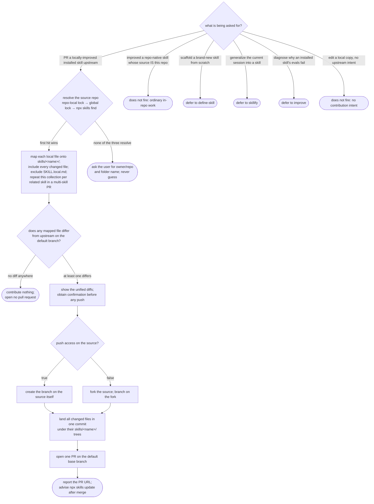

# contribute-skill — contribute a locally-improved installed skill back to its source repo

## What

You installed a skill from another repo, improved it locally, and want your improvement to land in
that skill's **source** repository. This capability does that: it resolves the source `owner/repo`
from the lockfiles, maps every local file onto the source's canonical `skills/<name>/…` tree, diffs
each mapped file against upstream, and — only when something really differs and you have confirmed the
diffs — forks if you lack push access, lands all changed files in a single commit, opens the PR, and
reports its URL.

The problem it solves is that a locally-improved installed skill has no clean path home. The improved
files sit under a consumer layout (`.agents/skills/<name>/` or a global `~/.agents/skills/<name>/`)
that does **not** match the source's `skills/<name>/` tree, so a naive contribution writes the wrong
paths, duplicates trees, or ships machine-local augmentations (`SKILL.local.md`). It is also easy to
push before the author has seen the diffs, to open a no-op PR when nothing actually changed, to branch
on a repo the author cannot push to, or to scatter the change across one-commit-per-file noise. The
people with this problem are consumers of installed skills who fixed one and want it upstream without
learning the source repo's layout by hand.

**Non-goals.** Scaffolding a **new** skill from scratch is `define-skill`; generalizing the **current
session** into a skill is `skillify`; diagnosing why a skill's evals fail is `improve`. Editing a
**repo-native** skill whose source IS this repo, or a local copy with no intent to send it upstream,
is ordinary editing — none of these fire this capability. The Git Data API blob→tree→commit→ref
plumbing is deterministic mechanics, not a graded behavior.

**Fit:** strong — the capability carries a genuine activation decision inside a confusable family
(contribute-upstream vs. `define-skill` scaffolding, `skillify` session-extraction, `improve`
eval-diagnosis) plus a hard **repo-native carve-out** (if this repo IS the source, it must not fire),
and its invoked behavior is non-deterministic judgment (path-mapping across layouts, file
inclusion/exclusion, diff-and-confirm, the no-op stop, the fork fallback), so all four eval layers
carry signal.

## Use Cases

| Use case | Trigger / inputs | Outcome |
|---|---|---|
| Route a contribution request | a request to PR a locally-improved installed skill upstream, versus a sibling intent (from-scratch scaffold, session generalization, eval diagnosis) or the repo-native / no-upstream carve-out | the capability fires on a contribution request and defers each sibling and carve-out to what owns it |
| Resolve the source repo | the improved skill's name | the source `owner/repo` is resolved from the repo-local lock, then the global lock, then `npx skills find`, first hit wins; an unresolved source is asked for, never guessed |
| Map local files onto the source tree | the consumer's improved files under `.agents/skills/<name>/` or a global install | each file maps to `skills/<name>/…` in the source even when the consumer `skillPath` points at another layout; every changed file is included and `SKILL.local.md` is excluded |
| Diff and stop-or-confirm | the mapped files against upstream on the default branch | it shows the unified diffs and gets confirmation before any push, and contributes nothing when every mapped file is identical |
| Prepare the branch by access | the current user's push access on the source | with push access it branches on the source; without it, it forks and branches on the fork |
| Land and open the PR | the confirmed, mapped changed files | all changed files (across one or several skills in one PR) land in a single commit under their `skills/<name>/` trees, and one PR is opened on the default base branch |
| Report the result | the opened PR | it outputs the PR URL and advises running `npx skills update` in the consumer after merge |

## Control Flow

Two guards frame the whole flow: **nothing is written outside `skills/<name>/`** in the source, and
**nothing is pushed before the diffs are shown and confirmed**. Everything below runs inside those.

## Scenario map

One row per edge in the graph above, one scenario per row, both directions of every decision. Rows
follow the suite's section order.

| Edge | Path (Given) | Scenario |
|---|---|---|
| `ROUTE` → `SOURCE` | a request to PR an improved installed skill upstream | `contribute-skill activates on a contribution request and defers its siblings` |
| `ROUTE` → `DN` | improved a repo-native skill whose source is this repo | `a request to PR an improved skill in this repo's own tree does not fire (repo-native carve-out)` |
| `ROUTE` → `DS` | scaffold a brand-new skill from scratch | `a request to scaffold a new skill from scratch defers to define-skill` |
| `ROUTE` → `DK` | generalize the current session into a skill | `a request to generalize the current session into a skill defers to skillify` |
| `ROUTE` → `DI` | diagnose an installed skill's failing evals | `a request to diagnose an installed skill's failing evals defers to improve` |
| `ROUTE` → `DL` | edit a local copy with no upstream intent | `a request to edit a local skill with no intent to send it upstream does not fire` |
| `SOURCE` → `COLLECT` (repo-local) | the skill is in this repo's skills lockfile | `the source repo is resolved from the repo-local lock before any other source` |
| `SOURCE` → `COLLECT` (global) | absent from the repo-local lock, present in the global lock | `the source repo falls back to the global lock when absent from the repo-local lock` |
| `SOURCE` → `COLLECT` (npx) | absent from both lockfiles | `the source repo falls back to npx skills find when absent from both lockfiles` |
| `SOURCE` → `ASK` | no entry in either lock and npx skills find returns nothing | `an unresolved source repo is surfaced for the user instead of guessed` |
| `COLLECT` (map) | a consumer `.agents/skills/<name>/` file whose `skillPath` points at another layout | `a consumer .agents/skills path maps to the source skills/<name>/ tree` |
| `COLLECT` (include all) | the skill folder changed both SKILL.md and scripts/run.mjs | `every changed file under the skill folder is contributed, not only SKILL.md` |
| `COLLECT` (exclude local) | the skill folder contains a machine-local SKILL.local.md | `a machine-local SKILL.local.md is excluded from the contribution` |
| `DIFF` → `SHOW` | at least one mapped file differs from upstream | `the diffs are shown and confirmed before any push` |
| `DIFF` → `STOP` | every mapped file is byte-identical to upstream | `an unchanged skill contributes nothing and stops` |
| `SHOW` (guard) | mapped files differ and the user has not confirmed | `nothing is pushed before the diffs are confirmed` |
| `ACCESS` → `ONSRC` (push true) | the source reports push access true | `with push access the branch is created on the source and the repo is not forked` |
| `ACCESS` → `FORK` (push false) | the source reports push access false | `no push access forks the source and branches on the fork` |
| `COMMIT` (single skill) | three changed files mapped under skills/<name>/ ready to contribute | `all changed files land in a single commit` |
| `COMMIT` (multi-skill) | two related skills confirmed in one PR | `several related skills confirmed for one PR land in a single commit across their trees` |
| `COMMIT` (guard) | a consumer skill installed under .agents/skills/<name>/ | `no path outside skills/<name>/ is written in the source` |
| `PR` (quality) | a confirmed set of changed files under skills/<name>/ | `the produced PR is scoped to the source skills tree on the correct base branch` |
| `REPORT` | the pull request has been opened | `the PR URL and the consumer refresh step are reported` |

Cross-capability e2e scenarios live in `../../workflows/`.
