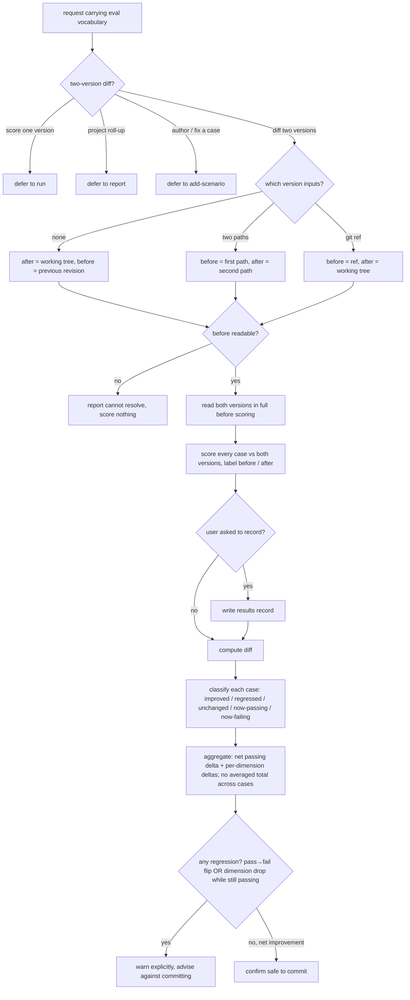

# compare — diff two config versions for regressions

Run the golden set against a before-version and an after-version and classify each case (improved /
regressed / unchanged / now-passing / now-failing), gating on regressions before a change is committed.

## Use Cases

**Subject** — scoring two versions of a target agent configuration against the same golden set and
diffing the results to catch regressions before a change is committed.
**Non-goals** — scoring a single version (`run`); the project-wide roll-up (`report`); authoring or
fixing cases (`add-scenario` / `improve`); deciding a single case's pass/fail (that is `aced-case-judge`).

**Fit:** strong — the capability carries a genuine activation decision (a two-version diff request
versus sibling eval intents — `run` / `report` / `add-scenario` — that share the same eval
vocabulary), and its version resolution, per-dimension diff classification, and regression-gate
behavior are judged, not asserted.

| Use case | Trigger / inputs | Outcome |
|---|---|---|
| Trigger on a comparison request | a request to compare / diff two versions or check for regressions, vs. a sibling intent (score one version, project roll-up, author a case) carrying the same eval vocabulary | `compare` fires for a two-version diff and defers when the intent belongs to `run` / `report` / `add-scenario` |
| Resolve the two versions | no explicit versions (default: working tree vs. previous revision), two explicit paths, or a git ref for the "before" | a before-version and an after-version are identified and both read in full |
| Score both versions | the resolved versions and the shared golden set | every case is scored against both versions and labeled before / after |
| Diff and classify | the before / after per-case results | each case is classified improved / regressed / unchanged / now-passing / now-failing, with a net pass-rate delta and per-dimension deltas; raw totals are never averaged across cases; nothing is persisted unless the user asks |
| Gate on regression | the classified diff | a regression — a pass→fail flip **or** a dimension drop while the case still passes — blocks with an explicit warning; a clean net-improvement is confirmed safe to commit |

## Control Flow

## Scenario map

One row per edge in the graph above, one scenario per row. Rows follow the suite's section order.

| Edge | Path (Given) | Scenario |
|---|---|---|
| `route` → diff two versions | a request to compare two versions of a configuration | `a request to diff two versions triggers compare` |
| `route` → defer to run | a request to score the current configuration | `a request to score one version defers to run` |
| `route` → defer to report | a request for eval health across all suites | `a request for a project-wide health summary defers to report` |
| `route` → defer to add-scenario | a request to add a new case to the suite | `a request to author or fix a case defers to add-scenario` |
| `resolve` → none (default) | no versions named | `the default compares the working tree against the previous revision` |
| `resolve` → two paths | two configuration paths provided | `two explicit paths are used as the two versions` |
| `resolve` → git ref | a git ref for the before version | `a git ref names the before version` |
| `readable` → no (abort) | a before version that cannot be read | `an unresolvable before version is reported` |
| `readable` → yes (read in full) | two resolved versions | `both versions are read in full before scoring` |
| score both vs golden set | two resolved versions and a golden set | `both versions are scored over the same golden set` |
| classify each case | the before and after results | `each case is classified by its change` |
| `aggregate` → net passing delta | the before and after results | `the net change across cases is reported` |
| `aggregate` → no averaged total | per-case totals whose maxima differ | `raw totals are not averaged across scenarios into one score` |
| `persist` → no (default) | a completed diff, no request to record | `a diff is not persisted by default` |
| `persist` → yes (on request) | the user asks to record the comparison | `a diff is persisted only on request` |
| `gate` → pass→fail flip → warn | a case dropped from passing to failing | `a regressed case blocks the commit with a warning` |
| `gate` → dimension drop while passing → warn | a case stays passing but a dimension dropped | `a dimension that drops while the case still passes is flagged as a regression` |
| `gate` → no regression → safe | no regressed case and a net improvement | `a clean net improvement is confirmed safe to commit` |

Cross-capability e2e scenarios live in `../../workflows/`.
