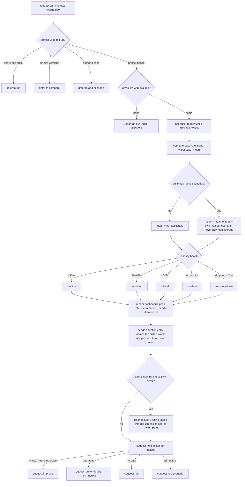

# report — project-wide eval health

Roll every eval suite in the project into one health dashboard: per-suite pass rate, trend versus the
previous run, a health classification, a needs-attention list, and the next action to take per suite.

## Use Cases

**Subject** — rolling every eval suite in the project into one health dashboard: per-suite pass
rate, trend versus the previous run, a health classification, and what needs attention.
**Non-goals** — scoring a single suite (`run`); diffing two versions (`compare`); authoring or
fixing cases (`add-scenario` / `improve`); deciding a single case's pass/fail (that is `aced-case-judge`).

**Fit:** strong — the capability carries a genuine activation decision (a project-wide roll-up request
versus sibling eval intents — `run` / `compare` / `add-scenario` — that share the same eval
vocabulary), and its discovery, five-way health classification, `%max` normalization, and next-action
routing are judged, not asserted.

| Use case | Trigger / inputs | Outcome |
|---|---|---|
| Trigger on a health-summary request | a request for the project-wide eval health / which configs need attention, vs. a sibling intent (score one suite, diff two versions, author a case) carrying the same eval vocabulary | `report` fires for a project-wide roll-up and defers when the intent belongs to `run` / `compare` / `add-scenario` |
| Discover the suites | the project's `artifacts/specs/` tree, or none | every suite with an `eval.md` is discovered, reading its latest and previous results; a no-suite message when none exist |
| Classify each suite's health | the latest and previous results per suite | each suite is classified healthy / degraded / critical / no-data / trending-down |
| Render the dashboard | the per-suite metrics | a dashboard of pass rate, mean `%max`, and trend per suite (mean normalized per scenario, never a raw-total average; `—` when a suite has no rubric scenario), plus a needs-attention list and an optional per-suite detail mode |
| Suggest the next action | each suite's health | the matching next skill is suggested per health (critical/trending-down → improve, degraded → run then improve, no-data → run, all-healthy → add) |

## Control Flow

## Scenario map

One scenario per row, following the suite's section order. Each CFG edge is bound; the `next` map
scenario is an enumeration that covers the healthy / critical / trending-down / no-data class→action
edges in one row, with `degraded` bound in its own row.

| Edge | Path (Given) | Scenario |
|---|---|---|
| `route` → project health | a request for the eval health across the project | `a request for project-wide health triggers report` |
| `route` → defer to run | a request to score a single configuration | `a request to score one suite defers to run` |
| `route` → defer to compare | a request to compare two versions | `a request to diff two versions defers to compare` |
| `route` → defer to add-scenario | a request to add a case for a failure | `a request to author a case defers to add` |
| `discover` → some | a project tree with several eval suites | `every suite with an eval is discovered` |
| `discover` → none | a project tree with no eval suite | `no suites reports that none is initialized` |
| `read` latest + previous | a suite with more than one results record | `the latest and previous results are read per suite` |
| `classify` → ≥90% | a suite passing at or above the healthy bar | `a high-passing suite is classified healthy` |
| `classify` → <70% | a suite passing below the critical bar | `a low-passing suite is classified critical` |
| `classify` → 70–89% | a suite passing between the bars | `a mid-band suite is classified degraded` |
| `classify` → no results | a suite with no results record | `a suite with no results is classified no-data` |
| `classify` → dropped ≥10% | a suite whose pass rate fell sharply | `a dropping suite is classified trending-down` |
| `dash` render | the per-suite metrics | `the dashboard shows each suite with its trend and attention list` |
| `mean` → normalized | a suite whose scenarios declare different maxima | `the mean column normalizes each scenario rather than averaging raw totals` |
| `hasrubric` → no (`—`) | a suite whose scenarios are all boolean or trigger | `a suite with no rubric scenarios shows no mean` |
| `worst` name in attention | a suite needing attention with a failing case | `the needs-attention entry names the suite's worst failing case` |
| `detail` → yes | a request for one suite's detail | `a request for one suite's detail lists its failing cases` |
| `next` map (all classes) | suites across several health classes | `each suite is given a matching next action` |
| `next` → degraded → run | a suite classified degraded | `a degraded suite is pointed at run for detail` |

Cross-capability e2e scenarios live in `../../workflows/`.
