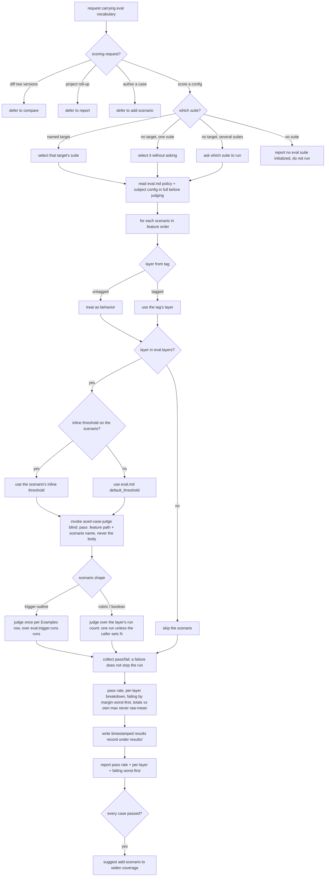

# run — score the current config against its frozen .feature suite

Resolve a target's frozen `.feature` suite and its `eval.md` run policy, judge every scenario via
`aced-case-judge` over the configured run count, then report the pass rate, per-layer breakdown, and
failing scenarios worst-first, and persist the run.

## Use Cases

**Subject** — scoring a target agent configuration against its frozen `.feature` suite (and its
`eval.md` run policy) over N runs and reporting the outcome.
**Non-goals** — authoring or fixing scenarios (`add-scenario` / `improve`); diffing two versions (`compare`);
the project-wide health roll-up (`report`); how a single case is scored (that is `aced-case-judge`).

**Fit:** strong — the capability carries a genuine activation decision (a scoring request versus
sibling eval intents — `compare` / `report` / `add-scenario` — that share the same eval vocabulary),
and its suite resolution, per-shape judge dispatch, blind-judge invocation, layer/run policy, and
scale-aware reporting are judged, not asserted.

| Use case | Trigger / inputs | Outcome |
|---|---|---|
| Trigger on a scoring request | a request to score / run evals for a config, vs. a sibling intent (diff two versions, project-wide roll-up, author a case) carrying the same eval vocabulary | `run` fires for a scoring request and defers when the intent belongs to `compare` / `report` / `add-scenario` |
| Resolve the suite to run | the user runs evals, optionally naming a target; zero, one, or several `.feature` suites exist | the one matching suite is selected, or the user is asked when several match, or a no-suite message when none exist |
| Score the suite | a resolved frozen `.feature` + its `eval.md`, and the target config | every scenario is judged by `aced-case-judge` (in `.feature` order, layer determined by tag with untagged defaulting to behavior, judged blind by path+name, a trigger outline once per Examples row over the configured run count) and collapsed to pass/fail; a failure does not stop the run |
| Report the outcome | the collected per-scenario results | a pass rate, per-layer breakdown, and the failing scenarios worst-first are reported, each total against its own maximum rather than a raw-total average |
| Persist the run | the computed results | a timestamped results record is written under the suite's `results/` |
| Guide the next step | an all-passing run | the user is pointed at `add-scenario` to widen coverage |

## Control Flow

## Scenario map

One scenario per row, following the suite's section order. Each CFG edge is bound.

| Edge | Path (Given) | Scenario |
|---|---|---|
| `route` → score a config | a request to run the evals for a configuration | `a request to score a config against its suite triggers run` |
| `route` → defer to compare | a request to compare two versions | `a request to diff two versions defers to compare` |
| `route` → defer to report | a request for the eval health across all suites | `a request for a project-wide health summary defers to report` |
| `route` → defer to add-scenario | a request to add a case for a failure | `a request to add a case defers to add` |
| `resolve` → one suite, no target | exactly one suite, no target named | `a single suite is selected automatically` |
| `resolve` → named target | the user names a target configuration | `a named target resolves to its suite` |
| `resolve` → several suites | several suites, no target named | `several suites prompt the user to choose` |
| `resolve` → no suite | no eval suite exists for the request | `no suite reports that none is initialized` |
| `readcfg` read subject in full | a resolved suite and its target configuration | `the full target config is read before judging` |
| `loop` .feature order | a frozen .feature of several scenarios | `every scenario runs in a stable order` |
| `skip` → no | an eval.md whose layers omit a layer | `layers absent from the suite config are skipped` |
| `layer` → untagged → behavior | a scenario with no layer tag | `an untagged scenario is treated as a behavior scenario` |
| `judge` blind (path + name) | a resolved suite and a scenario to score | `the judge receives the scenario location, not its body` |
| `thr` → inline overrides | a scenario with an inline pass bar + an eval.md default | `a scenario's own inline pass bar overrides the default` |
| `shape` → trigger outline per row | a trigger Scenario Outline with several Examples rows | `a trigger outline is judged once per Examples row` |
| `perrow` over run count | an eval.md whose trigger run policy sets more than one run | `the trigger layer is scored over its configured run count` |
| `once` non-trigger run count | a behavior scenario, no caller-set run count | `a behavior scenario is judged once unless the caller sets a run count` |
| `collect` failure does not stop | a frozen .feature where an early scenario fails | `a failing scenario does not stop the run` |
| `rep` pass rate + per-layer | a completed run | `the report states pass rate and per-layer breakdown` |
| `compute` totals vs own max | scenarios whose maxima differ | `totals are reported against their own maximum, not as comparable raw numbers` |
| `rep` failing worst-first | a completed run with at least one failing case | `failing cases are listed worst-first` |
| `write` timestamped record | a completed run | `the run is persisted as a timestamped record` |
| `allpass` → widen | a run in which every case passes | `an all-passing run points to widening coverage` |

Cross-capability e2e scenarios live in `../../workflows/`.
