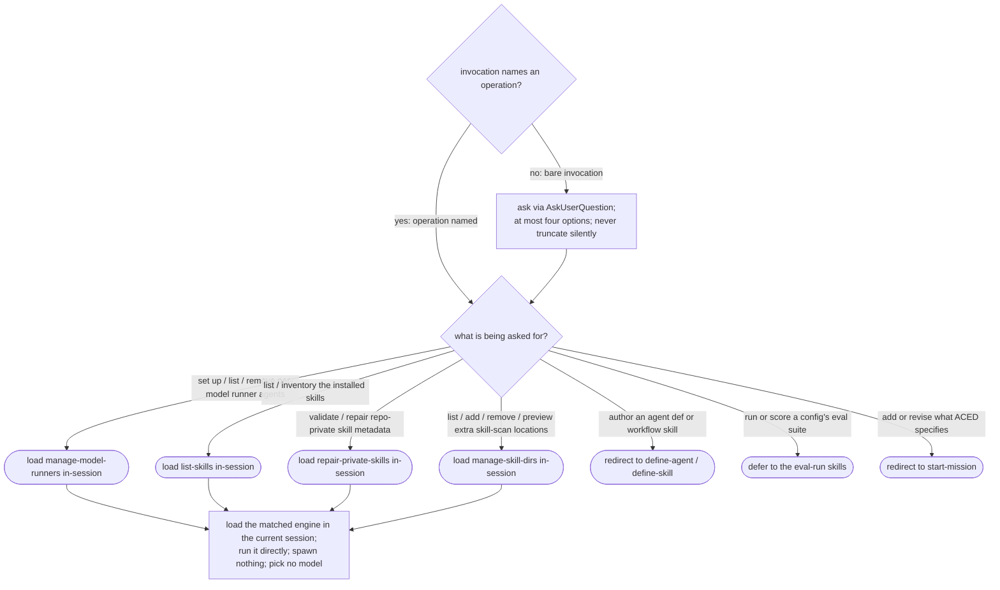

# manage — the ACED manage-level dispatcher

## What

The manage-level front door to ACED: `manage` is the user-facing handler for **non-mission** work on
the agent-config corpus — inspecting and maintaining the tooling ACED evaluates — as opposed to
**authoring** a config (`define-agent` / `define-skill`), **scoring** one (`run` / `add-scenario`), or
**changing what ACED specifies** (`start-mission`). Modeled on the SDD `manage` dispatcher, it is a
**thin dispatcher**: it classifies a manage request and **loads the matching engine in the current
session** so the session runs it directly.

The problem it solves is that the same tooling vocabulary — "runners", "skills", "validate" — is
carried by capabilities that *author*, *score*, or *re-specify* the corpus, so a bare "manage my
runners" is easy to mis-route into a define-* scaffold or a start-mission CR. `manage` makes the
manage-vs-not activation decision, resolves which of its engines handles the request, and loads that
engine — holding **no production logic**, loading **no governance**, and writing **no contract state**.

**Non-goals.** `manage` performs no operation itself beyond loading the matched engine; it **opens no
CR** and **invokes no gate**; it **picks no model** and **spawns no agent**. A request to **author** a
config (an agent, a skill), to **score** one, or to **add or revise** ACED's specified behavior is
**not** a manage operation — it is redirected to `define-agent` / `define-skill`, the eval-run skills,
or `start-mission`, which own that work.

**Fit:** strong — `manage` makes a genuine activation decision (a manage-level operation vs. the same
tooling vocabulary carried by `define-agent` / `define-skill` when the intent is to *author*, or by
`start-mission` when the intent is to *change what ACED specifies*) and its classification is
non-deterministic judgment, so the agent-behavior eval layers carry signal.

## Use Cases

| Use case | Trigger / inputs | Outcome |
|---|---|---|
| Route a named operation | an invocation that already names a manage operation | the matching engine loads directly, in-session, with no menu |
| Gather intent on a bare invocation | `manage` invoked with no operation named | a menu asks the user to pick, presenting at most four options and never truncating silently |
| Route to a manage engine | a request to set up runners, inventory skills, repair private-skill metadata, or curate skill-scan locations | the matching engine (`manage-model-runners` / `list-skills` / `repair-private-skills` / `manage-skill-dirs`) loads in the current session |
| Load the engine in-session | a resolved route in a live session | the matched engine loads and runs directly; `manage` spawns nothing and picks no model, deferring the model choice to the engine |
| Hold the manage boundary | any request `manage` classifies | it opens no CR, invokes no gate, writes no `status` / `approval`, loads no governance, and holds no production logic |
| Defer what is not manage | a request to author a config, to score one, or to change what ACED specifies | it redirects to `define-agent` / `define-skill`, the eval-run skills, or `start-mission` rather than handling it |

## Control Flow

Three guards frame the whole flow, holding on **every** request `manage` classifies: it **opens no CR
and invokes no gate**, it **writes no `status` / `approval`**, and it **loads no governance and holds
no production logic**. Everything below runs inside those.

## Scenario map

One row per edge in the graph above, one scenario per row, both directions of the intake fork and
every classify branch. Rows follow the suite's section order. The three framing guards are edges on
the classify/load path, each bound to its own scenario.

| Edge | Path (Given) | Scenario |
|---|---|---|
| `INTAKE` → `CLASSIFY` (named) | an invocation that names a manage operation | `a request naming an operation takes the fast path` |
| `INTAKE` → `MENU` (bare) | the user invokes manage with no operation named | `a bare invocation gathers intent via a menu` |
| `MENU` (four-option guard) | a derived list of more than four candidate operations | `an intake question never exceeds four options` |
| `CLASSIFY` → `MMR` | a request to set up, list, or remove per-model runner agents | `a model-runners request loads the manage-model-runners engine` |
| `CLASSIFY` → `LS` | a request to list or inventory the installed skills | `a skill-inventory request loads the list-skills engine` |
| `CLASSIFY` → `RPS` | a request to validate or repair repo-private skill metadata under `.agents/skills` | `a private-skill repair request loads the repair-private-skills engine` |
| `CLASSIFY` → `MSD` | a request to list, add, or preview the extra skill-scan locations the validate engine uses | `a skill-dirs curation request loads the manage-skill-dirs engine` |
| `CLASSIFY` → `AUTH` | a request to create an agent definition or a workflow skill | `an authoring request is not a manage operation` |
| `CLASSIFY` → `SCORE` | a request to run or score a config's eval suite | `a request to score a config is not a manage operation` |
| `CLASSIFY` → `SM` | a request to add or revise ACED's specified behavior | `a request to change what ACED specifies is redirected to start-mission` |
| `*` → `LOAD` (in-session) | manage resolves a route in a live user session | `a resolved route loads the engine in-session and runs directly` |
| `LOAD` (model) | manage resolves a route to an engine | `manage picks no model` |
| `CLASSIFY`/`LOAD` guard (non-mission) | any request manage classifies | `manage opens no change request and invokes no gate` |
| `LOAD` guard (write-ownership) | manage resolves a manage-level operation | `a routed operation writes no contract state` |
| `CLASSIFY` guard (thin classifier) | any request manage classifies | `classification holds no production logic and loads no governance` |

Cross-capability e2e scenarios live in `../workflows/`.
