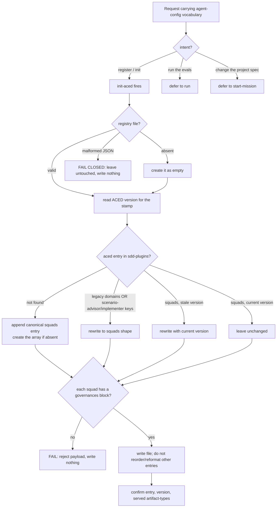

# registry — register ACED as the agent-config SDD plugin

Write the aced role-map entry to `.agents/universal-plugin.json` so the SDD conductor resolves the ACED
production-chain (`aced-scenario-writer`, `aced-spec-validator`, `aced-impl-judge`, and the ACED builder
bars) for the agent-config artifact-types — `skill`, `subagent`, `command`, `agents-section` — by
reading only that one lockfile. Idempotent and fail-closed: it upserts the canonical `squads[]` entry,
migrates a legacy shape or a stale stamp, and stops without writing on a corrupt file or a payload
missing its `governances` block. The `init-aced` skill implements it.

## Use Cases

**Fit:** strong — `init-aced` makes a genuine activation decision (a request to *register / initialize*
ACED as the SDD plugin vs. the same agent-config vocabulary carried by `run` when the intent is to *run
the evals* or by `start-mission` when the intent is to *change what ACED specifies*), and the
registration itself is agent-executed against a real file (upsert / migrate / fail-closed), so the
activation and behavior layers both carry signal. It is not a deterministic node:test engine.
**Subject** — registering ACED in the project's SDD plugin registry (`.agents/universal-plugin.json`)
so the conductor resolves the ACED production-chain for the agent-config artifact-types by reading only
that one file (the lockfile pattern).
**Non-goals** — resolving roles at runtime (the conductor reads the registry); authoring a spec
(`start-mission`); running the evals (`run`); the global marketplace catalog (a separate layer);
editing other plugins' entries.

| Use case | Trigger / inputs | Outcome |
|---|---|---|
| Trigger on a registration request | a request to register / init ACED as the SDD plugin, vs. a sibling intent (run evals, change the project spec) carrying agent-config vocabulary | `init-aced` fires for registration and defers when the intent belongs to `run` / `start-mission` |
| Register when absent | no `aced` entry, or no registry file at all, or a file with no `sdd-plugins` array | the canonical `squads[]` entry is appended, creating the file and the array if needed; other entries are untouched |
| Migrate an old-shape entry | an `aced` entry in a legacy shape — `domains[]`, or the legacy `scenario-advisor` / `implementer` role keys | it is rewritten to the `squads[]` shape |
| Refresh a stale stamp | an `aced` `squads[]` entry stamped with a different version | the entry is rewritten with the current ACED version (idempotent when already current) |
| Fail closed on a bad payload | a registry file that is malformed JSON, or a squad missing its required `governances` block | it stops with an error and writes nothing, leaving the file untouched |
| Confirm the result | a successful registration | it confirms the entry, its version, and the served artifact-types |

## Control Flow

Route first: a *register / init* request fires `init-aced`; a *run the evals* request defers to `run`;
a *change the project spec* request defers to `start-mission`. On a firing request, locate
`.agents/universal-plugin.json` — missing → create it as `{}`; present but malformed JSON → **fail
closed**, leave it untouched, write nothing. Read ACED's own version for the stamp. Find the
`"name": "aced"` entry in the `sdd-plugins` array: not found → append the canonical `squads[]` entry
(creating the array if absent); found in a legacy shape (either the `domains[]` shape or the legacy
`scenario-advisor` / `implementer` role keys) → rewrite it to `squads[]`; found in `squads[]` with a
stale version → rewrite with the current version; found current → leave unchanged. Validate the payload:
a squad with no `governances` block is rejected — **fail, write nothing**. Otherwise write the file
without reordering or reformatting other entries, then confirm the entry, its version, and its served
artifact-types.

## Scenario map

Every scenario binds 1:1 to a CFG edge.

| Edge | Path (Given) | Scenario |
|---|---|---|
| register intent → init-aced | a request to register / initialize ACED | `a request to register ACED triggers init-aced` |
| run-evals intent → defer to run | a request to run the evals | `a request to run evals defers to run` |
| change-spec intent → defer to start-mission | a request to add / revise the project spec | `a request to change the project spec defers to start-mission` |
| not found → append canonical | a registry with no aced entry | `an absent entry is appended as the canonical squad` |
| file absent → create then append | no registry file exists | `a missing registry file is created` |
| array absent → create array then append | a file that parses but has no sdd-plugins array | `a registry without an sdd-plugins array gets one created` |
| other entries untouched | a registry holding other plugins' entries | `other plugins' entries are left untouched` |
| legacy domains shape → rewrite | an aced entry in the legacy domains shape | `a legacy-shape entry is rewritten to squads` |
| legacy role keys → rewrite | an aced entry using scenario-advisor / implementer keys | `a legacy role-key entry is rewritten to squads` |
| squads stale version → rewrite | an aced squads entry stamped with a different version | `a stale version stamp is refreshed` |
| squads current version → unchanged | an aced squads entry already at the current version | `an up-to-date entry is left unchanged` |
| malformed JSON → fail closed | a registry file containing malformed JSON | `a corrupt registry stops without overwriting` |
| squad missing governances → reject | a payload whose squad has no governances block | `a squad missing its governances block is rejected` |
| success → confirm | ACED has been registered | `a successful registration confirms the entry` |
