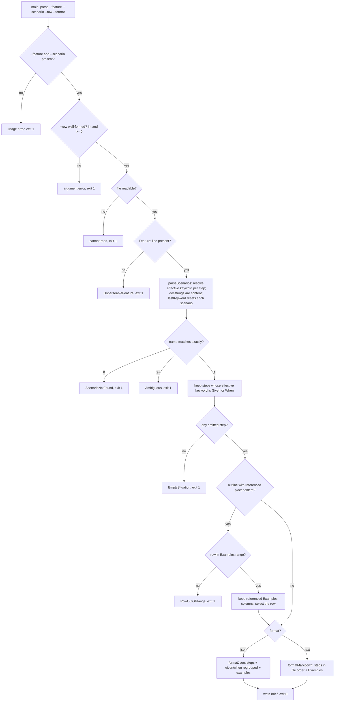

# extract-situation — the blind-brief extractor

Read one scenario out of a frozen `.feature` and emit only the **situation** — its `Given` and `When`
steps — so a simulating context can never be handed the answer key. Withholding is **structural**: the
engine tracks each step's *effective* keyword and emits by keyword, never judging whether a step reveals
the verdict. It is **read-only** — it writes no `.feature`, no brief, no other file.

## Use Cases

This engine is **not an ACED subject** — its output is deterministic and directly assertable by
`node:test`, not LLM-graded, so it carries **no `**Fit:**` line** and ACED's graded lenses do not apply
to it. Its suite is boolean throughout and binds to the engine's own tests.

**Subject** — when `judge` composes the brief for a simulating context, parsing the named scenario and
emitting its `Given`/`When` steps while withholding the name, every `Then`, the inline `@rubric`, the
tags, the `Feature:` description, and every sibling scenario.
**Non-goals** — simulating (that is the context `judge` dispatches); scoring or applying the threshold
(`judge`); authoring the rubric (`scenario-writer`); deciding *whether* a step is verdict-revealing
beyond the keyword rule — it withholds by structure, never by judgment.

| Use case | Trigger / inputs | Outcome |
|---|---|---|
| Emit the situation | a `.feature` path and an exact scenario name | it emits that scenario's `Given`/`When` steps verbatim, in the file's order, regrouping nothing |
| Withhold the answer key | a scenario carrying a name, a `Then`, and an inline `@rubric` | the name, every `Then`, and the rubric docstring appear nowhere in the output — in markdown or json |
| Honor keyword inheritance | a scenario with `And`/`But` steps under both a `Given` and a `Then` | the step under `Given` is emitted; the step under `Then` is withheld; the keyword never bleeds across a scenario boundary |
| Emit a situation docstring | a `Given`/`When` step carrying a docstring (routinely the prompt under test) | the docstring is emitted with its step; a docstring under a `Then` is withheld with its step |
| Survive a keyword-leading rubric | a rubric ladder whose lines open with `Given`/`When` | no docstring line is emitted, and the ladder does not capture the `And` steps below the docstring |
| Select one outline row | a `Scenario Outline` and a row index | only that row's values are emitted — one row is one case; an out-of-range or malformed row exits non-zero |
| Skip a commented row | a `Scenario Outline` whose `Examples` carry a commented-out row | it is neither emitted nor counted — it shifts no row index and inflates no row count |
| Fail closed | an empty situation, an absent/ambiguous name, an unreadable/`Feature`-less file, or a missing argument | it exits non-zero and emits **no** brief, rather than an empty one a caller could mistake for valid |

## Control Flow

The CLI validates arguments, reads and parses the file, matches the scenario exactly, filters to the
emitted keywords, selects an outline row, and renders in the requested format — every failure exits
non-zero with **no** brief.

## Scenario map

Every scenario binds 1:1 to a CFG edge.

| Edge | Path (Given) | Scenario |
|---|---|---|
| emit in file order | interleaved Given/When steps | `the emitted steps keep the order the file lists them` |
| And inherits Given | a Given followed by an And | `an And under a Given is emitted` |
| But inherits Given | a Given followed by a But | `a But under a Given is emitted` |
| docstring rides its step | a Given/When step carrying a docstring | `a docstring under a Given or When is emitted with its step` |
| docstring lines are content | a docstring whose lines open with Given/When | `a docstring's lines are content rather than steps` |
| name withheld | a name stating the verdict | `the scenario name is withheld` |
| Then withheld | a Then stating the outcome | `every Then step is withheld` |
| And inherits Then | a Then followed by an And | `an And under a Then is withheld` |
| But inherits Then | a Then followed by a But | `a But under a Then is withheld` |
| Then docstring withheld | a Then step carrying a docstring | `a docstring under a Then is withheld with its step` |
| rubric ladder is content | a rubric line opening with Given/When | `a rubric line opening with a step keyword is withheld` |
| ladder does not capture below | a ladder line opening with When, then an And under the Then | `a rubric line opening with a step keyword does not capture the steps below it` |
| backtick fence like quote fence | a docstring fenced with backticks | `a backtick-fenced docstring is withheld like a quoted one` |
| neighbors withheld | tags, Feature description, sibling scenarios | `the neighbors are withheld` |
| keyword resets per scenario | a Given-ending scenario, then one opening with an And | `a leading And does not inherit the previous scenario's keyword` |
| outline keeps referenced placeholders | an outline with placeholder tokens | `an outline keeps the placeholders its situation references` |
| row selects that row | an outline and a row index | `a requested row selects exactly that Examples row` |
| row out of table range | a row the Examples table lacks | `a row outside the Examples table fails closed` |
| commented row is not data | an Examples table with a commented-out row | `a commented-out Examples row is not data` |
| Then-only column withheld | a column referenced only by a Then | `an Examples column only a Then references is withheld` |
| empty situation fails closed | a scenario with a Then but no Given/When | `a scenario with no situation fails closed` |
| orphan And unresolved | an And with no step above it | `an And with no step above it is withheld` |
| absent name fails closed | a name the file does not hold | `an absent scenario name fails closed` |
| ambiguous name fails closed | two scenarios under one name | `an ambiguous scenario name fails closed` |
| unreadable file fails closed | a `.feature` path that cannot be read | `an unreadable .feature fails closed` |
| no Feature line fails closed | text with only mid-line Feature mentions | `text carrying no Feature line fails closed` |
| exact name match | a name differing only by case or as a substring | `the scenario name is matched exactly` |
| missing argument fails closed | `--feature` or `--scenario` absent | `a missing argument fails closed` |
| malformed row fails closed | a `--row` value negative or not an integer | `a malformed row argument fails closed` |
| json emits the situation | a Given and a When, in json format | `the json format emits the situation regrouped by keyword` |
| json withholds the answer key | name, Then, and rubric, in json format | `the json format withholds the answer key like the brief does` |
| read-only | any invocation | `it writes nothing` |
