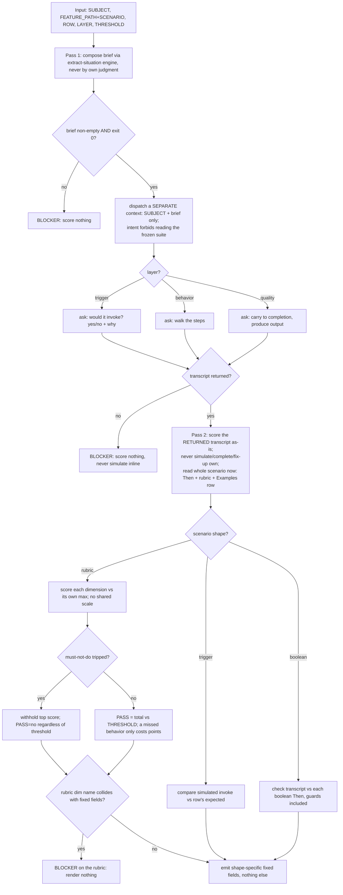

# judge — the internal scorer

Score a blind simulation of agent behavior against a rubric for a scenario and layer, emitting a
score per named rubric dimension collapsed to one verdict against the threshold. The work runs in
**two passes, in two separate contexts**: the *simulating* context sees only the situation; the
*scoring* context reads the whole scenario — `Then` steps included — because everything it gates on
lives there.

## Use Cases

**Fit:** partial — `judge` is invoked by name by `implementer` / `run` / `compare` and makes no
activation decision, so the trigger layer carries no signal for it (trigger-balance / near-miss is
N/A); its behavior and output remain LLM-graded.
**Subject** — when `implementer` (or the `run` / `compare` reporting skills) invokes it, producing one
simulated agent behavior **blind** (in a context shown the situation but not the rubric or the
expected outcome), scoring that simulation against the rubric for a single scenario and layer, and
emitting a score per named dimension plus PASS / WHAT WORKED / WHAT FAILED. The asymmetry is the
design: the simulating context is blind, while the scoring context reads the whole scenario — `Then`
steps included — because the guards and expected behaviors it gates on live only there.
**Non-goals** — rolling up the gate verdict or `IMPLEMENTATION_PASS` (that is `implementer`);
aggregating across N runs; deciding which evals exist or authoring the rubric (that is `scenario-writer`, inline in the frozen `.feature`);
running the suite (`implementer` / `run`).

| Use case | Trigger / inputs | Outcome |
|---|---|---|
| Score one rubric case | invoked with a subject and one test case (scenario, layer, expected behaviors, must-not-do, rubric) | it emits one score per named dimension plus PASS / WHAT WORKED / WHAT FAILED for that single case and nothing else |
| Simulate blind | any test case carrying a name, `Then`, and rubric alongside its `Given`/`When` | the simulating context receives the subject and the `Given`/`When` only; the name, `Then`, and rubric are withheld |
| Extract the brief mechanically | any test case | the `extract-situation` engine composes the brief; `judge` never decides by its own judgment what to withhold |
| Dispatch the simulator blind | any dispatch of a simulating context | the dispatch intent requires a context that cannot read the frozen suite; `judge` never passes it the suite path |
| Score the returned transcript | a blind context has returned its simulation transcript | every dimension's verdict derives from that transcript; the scoring context never simulates, completes, or fixes up a thin transcript of its own |
| Read the outcome when scoring | a case whose must-not-do guards and expected behaviors live in its `Then` steps | the scoring context reads those `Then` steps — the simulating context never does |
| Fail closed on a bad protocol | an empty brief despite a success exit, a dispatch returning no transcript, or a rubric dimension name that collides with the output fields | it reports a blocker and scores nothing, rather than simulating from nothing or rendering a colliding line |
| Score one outline row | a trigger `Scenario Outline` row | the invoke decision for that row alone; rows never collapse into one verdict |
| Score by layer | a case carrying the trigger, behavior, or quality layer | trigger reports invoke-vs-expected; behavior walks the steps against the expected / must-not-do lists; quality evaluates the produced output against the rubric |
| Score each dimension on its own scale | a rubric whose dimensions declare different maxima | each dimension is bounded by its own `max`, never a scale shared across dimensions |
| Gate on the must-not-do, cost on the miss | a simulation that trips a must-not-do (or merely misses an expected behavior) | a tripped guard withholds the top score and fails outright; a mere miss loses points and leaves PASS to the threshold |
| Emit the fixed output shape | any completed scoring of a rubric, trigger, or boolean case | it emits exactly that shape's fixed fields — dimension lines / INVOKE-EXPECTED / bare PASS — with no preamble or extra text |

## Control Flow

Two passes, two contexts. Pass 1 composes the brief mechanically, dispatches a **blind** simulator per
layer, and fails closed on an empty brief or a dead dispatch. Pass 2 scores the **returned** transcript
as-is, reads the whole scenario, branches on the scenario's shape, gates on any must-not-do, and emits
the shape's fixed output — failing closed if a rubric name collides with the output fields.

## Scenario map

Every scenario binds 1:1 to a CFG edge.

| Edge | Path (Given) | Scenario |
|---|---|---|
| score per named dimension | one rubric case for the behavior layer | `invoked for one rubric case it emits a score per named dimension` |
| no gate verdict | judge has finished scoring one case | `it does not render the gate verdict` |
| no cross-run aggregation | one run of one case | `it does not aggregate across runs` |
| two separate contexts | a subject and one test case | `the simulation is produced in a context separate from the scoring` |
| brief extracted mechanically | a case with name, Given/When, Then, inline rubric | `the simulating brief is extracted mechanically rather than composed by the judge` |
| simulator not shown the rubric | a case carrying an inline rubric | `the simulating context is not shown the rubric` |
| simulator can't reach the suite | judge dispatches a context to simulate | `the simulating context is dispatched without a reachable copy of the frozen suite` |
| simulator not shown the outcome | a case whose name and Then state the verdict | `the simulating context is not shown the expected outcome` |
| simulator shown the situation only | a case with Given/When alongside name/Then/rubric | `the simulating context is shown the situation and nothing else from the case` |
| score the returned transcript | a blind context returned its transcript | `the scored simulation is the one the blind context returned` |
| never complete a thin transcript | the blind context returns a thin transcript | `a thin transcript is scored as it stands rather than completed` |
| scoring reads the outcome | a case whose guards live in its Then steps | `the context that scores reads the expected outcome` |
| empty brief fails closed | the extractor emits an empty brief on success | `an empty brief fails closed whatever the extractor's exit code` |
| non-zero extractor exit fails closed | the extractor exits non-zero composing the brief | `a non-zero extractor exit fails closed` |
| dead dispatch fails closed | the dispatched context returns no transcript | `a dispatch returning no transcript fails closed` |
| one invocation, both passes | a caller holding a subject and one case | `one invocation covers both passes` |
| trigger scores invoke | a case carrying the trigger layer | `the trigger layer scores the invoke decision` |
| trigger has no dimensions | a trigger case with no rubric | `a trigger case carries no dimension scores` |
| one outline row is one case | a trigger outline with several rows | `one outline row is one case` |
| boolean has no dimensions | boolean Thens, no rubric, no trigger tag | `a boolean case emits the verdict without dimension scores` |
| behavior walks the steps | a behavior case with expected + must-not-do | `the behavior layer walks the simulated steps` |
| quality evaluates output | a case carrying the quality layer | `the quality layer evaluates the produced output` |
| per-dimension max | a rubric with different maxima | `each dimension is scored against its own declared max` |
| collapse vs threshold | a scored rubric case with one threshold, no guard tripped | `the dimensions collapse to one verdict against the threshold` |
| top score at every max | a simulation earning each dimension's max | `the top score is the total at every dimension's max` |
| rubric over taste | a rubric conflicting with the evaluator's preference | `the rubric overrides the evaluator's own taste` |
| must-not-do withholds top | a simulation tripping a must-not-do guard | `a triggered must-not-do withholds the top score` |
| miss costs points only | a simulation missing a behavior, no guard tripped | `a missed expected behavior costs points without forcing a non-passing verdict` |
| conservative under variance | a phrasing-dependent outcome | `phrasing-dependent outcomes are scored conservatively` |
| rubric output shape | any completed rubric evaluation | `the output carries every rubric dimension and nothing else` |
| trigger output shape | any completed trigger evaluation | `the output of a trigger case carries the fixed fields and nothing else` |
| boolean output shape | any completed boolean evaluation | `the output of a boolean case carries the fixed fields and nothing else` |
| rubric-name collision fails closed | a dimension named TOTAL/THRESHOLD/PASS or carrying a colon | `a rubric dimension name colliding with the output format is a blocker` |
| clean run reports nothing | a simulation meeting every behavior, no guard tripped | `a flawless simulation reports nothing failed` |
