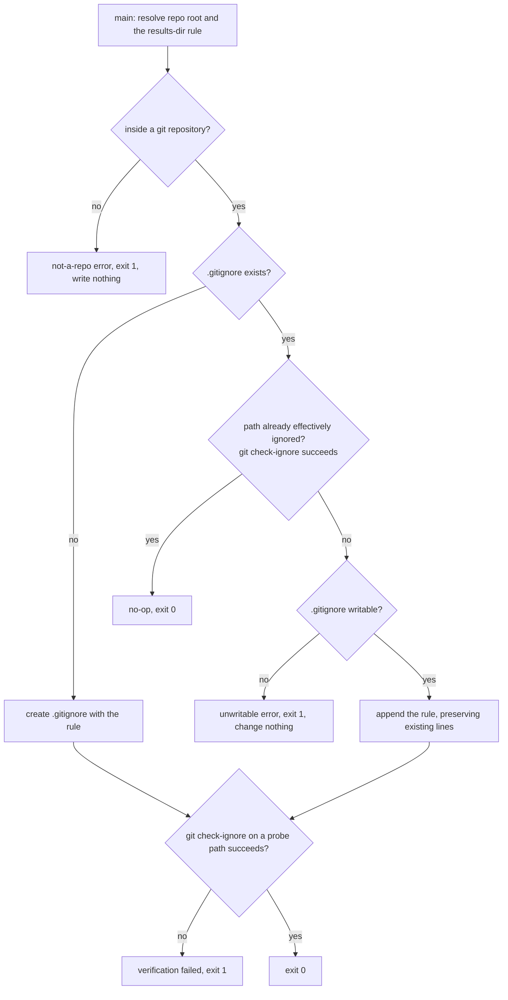

# ignore-run-output — keep ACED run output out of version control

Ensure the ACED run-output directory (`.agents/aced/results/`) is git-ignored, so a `run` never
commits timestamped, non-deterministic judge output into the tracked tree. The behavior is
**idempotent** (a second run adds nothing) and **fail-closed** (it changes nothing when it cannot
guarantee the result). The `init-aced` skill invokes this engine as one onboarding step; registering
ACED as the SDD plugin is the separate concern of `../../registry/`.

## Use Cases

This engine is **not an ACED subject** — its behavior is deterministic and directly assertable by
`node:test`, not LLM-graded, so it carries **no `**Fit:**` line** and ACED's graded lenses do not apply
to it. Its suite is boolean throughout and binds to the engine's own tests.

**Subject** — when `init-aced` prepares a repo, ensuring `.agents/aced/results/` is git-ignored at the
repo root: creating `.gitignore` if absent, appending the rule if the path is not already effectively
ignored, and leaving the file untouched when it already is.
**Non-goals** — writing the run output itself (that is `run`); registering the ACED role-map (that is
`registry`); choosing the results path (that is a shared binding, not this engine's decision); ignoring
anything beyond the ACED results directory.

| Use case | Trigger / inputs | Outcome |
|---|---|---|
| Create the ignore file | a repo with no `.gitignore` | it creates `.gitignore` carrying the results-directory rule |
| Add the missing rule | a `.gitignore` that does not already ignore the results directory | it appends the rule and leaves every existing line unchanged |
| Leave an already-ignored path alone | a `.gitignore` that already ignores the path, verbatim or via a broader pattern | it writes nothing — no duplicate entry is added |
| Guarantee the outcome | any starting state that succeeds | after it runs, a path under the results directory is reported ignored by git |
| Stay idempotent | the engine run a second time | exactly one matching rule remains and the path stays ignored |
| Fail closed outside a repo | an invocation where no git repository is present | it exits non-zero and writes nothing |
| Fail closed on an unwritable target | a `.gitignore` that cannot be written | it exits non-zero and changes nothing |

## Control Flow

The engine locates the repo root, reads or creates `.gitignore`, tests whether the results directory
is already effectively ignored, appends the rule only when needed, and confirms the outcome — every
failure exits non-zero having changed nothing.

## Scenario map

Every scenario binds 1:1 to a CFG edge.

| Edge | Path (Given) | Scenario |
|---|---|---|
| create when absent | no `.gitignore` at the repo root | `an absent gitignore is created carrying the rule` |
| append when missing | a `.gitignore` without the rule | `a gitignore missing the rule gains it` |
| preserve existing lines | a `.gitignore` carrying unrelated rules | `existing gitignore lines are left unchanged` |
| no-op when already ignored | a `.gitignore` already ignoring the path via a broader pattern | `an already-ignored path adds no duplicate` |
| the guarantee holds | any succeeding invocation | `the results directory is git-ignored after the engine runs` |
| idempotent re-run | the engine run twice | `a second run leaves exactly one matching rule` |
| fail closed outside a repo | no git repository present | `outside a git repository it fails closed` |
| fail closed on unwritable target | a `.gitignore` that cannot be written | `an unwritable gitignore fails closed` |
