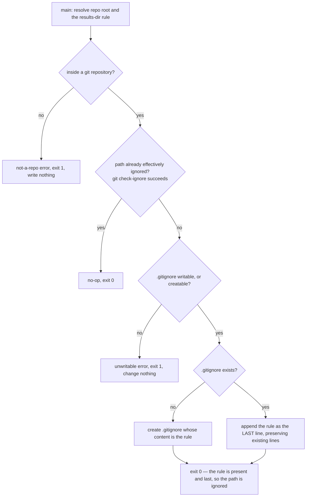

# ignore-run-output — keep ACED run output out of version control

Ensure the ACED run-output directory (`.agents/aced/results/`) is git-ignored, so a `run` never
commits timestamped, non-deterministic judge output into the tracked tree. The rule is appended as the
**last** line of `.gitignore`, so gitignore's last-match-wins makes the path ignored **by
construction** — the engine never needs, and never performs, a post-write re-check. The behavior is
**idempotent** (a second run adds nothing) and **fail-closed** (every failure exits before any write,
so it changes nothing it cannot guarantee). The `init-aced` skill invokes this engine as one
onboarding step; registering ACED as the SDD plugin is the separate concern of `../../registry/`.

## Use Cases

This engine is **not an ACED subject** — its behavior is deterministic and directly assertable by
`node:test`, not LLM-graded, so it carries **no `**Fit:**` line** and ACED's graded lenses do not apply
to it. Its suite is boolean throughout and binds to the engine's own tests.

**Subject** — when `init-aced` prepares a repo, ensuring `.agents/aced/results/` is git-ignored at the
repo root: creating `.gitignore` if absent, appending the rule as the last line if the path is not
already effectively ignored, and leaving the file untouched when it already is.
**Non-goals** — writing the run output itself (that is `run`); registering the ACED role-map (that is
`registry`); choosing the results path (that is a shared binding, not this engine's decision); ignoring
anything beyond the ACED results directory.

| Use case | Trigger / inputs | Outcome |
|---|---|---|
| Create the ignore file | a repo with no `.gitignore` | it creates `.gitignore` carrying the results-directory rule |
| Add the missing rule | a `.gitignore` that does not already ignore the results directory | it appends the rule as the last line and leaves every existing line unchanged |
| Leave an already-ignored path alone | a `.gitignore` that already ignores the path, verbatim or via a broader pattern | it writes nothing — no duplicate entry is added |
| Win over an earlier un-ignore | a `.gitignore` that re-includes the path via a later negation | it appends the rule last, so gitignore's last-match-wins leaves the path ignored |
| Guarantee the outcome | any starting state that reaches the write | after it runs, a path under the results directory is reported ignored by git |
| Stay idempotent | the engine run a second time | it finds the path already ignored, writes nothing, and exactly one matching rule remains |
| Fail closed outside a repo | an invocation where no git repository is present | it exits non-zero and writes nothing |
| Fail closed on an unwritable target | a `.gitignore` (or repo root) that cannot be written | it exits non-zero, before any write, and changes nothing |

## Control Flow

The engine locates the repo root, tests whether the results directory is already effectively ignored,
and — only when it is not — appends the rule as the **last** line (creating `.gitignore` if absent),
which by last-match-wins guarantees the path is ignored. Every failure (no repo, or an
unwritable/uncreatable target) exits non-zero **before any write**, having changed nothing.

There is no post-write verification branch: because the rule is appended last, no earlier pattern can
override it, so the write cannot leave the path unignored. This is what makes "changes nothing it
cannot guarantee" literally true — the only failures are the pre-write `X1` / `X2`.

## Scenario map

Every scenario binds 1:1 to a CFG edge; every edge has a scenario.

| Edge | Path (Given) | Scenario |
|---|---|---|
| `B` no → `X1` | no git repository present | `outside a git repository it fails closed` |
| `E` yes → `Z0` | a `.gitignore` already ignoring the path via a broader pattern | `an already-ignored path adds no duplicate` |
| `E` yes → `Z0` (idempotence) | the engine run twice | `a second run leaves exactly one matching rule` |
| `W` no → `X2` | a `.gitignore` that cannot be written | `an unwritable gitignore fails closed` |
| `C` no → `D` | no `.gitignore` at the repo root | `an absent gitignore is created carrying the rule` |
| `C` yes → `G` | a `.gitignore` without the rule | `a gitignore missing the rule gains it` |
| `C` yes → `G` (preserve) | a `.gitignore` carrying unrelated rules | `existing gitignore lines are left unchanged` |
| `C` yes → `G` (last wins) | a `.gitignore` re-including the path via a later negation | `an earlier un-ignore of the path is overridden by the appended rule` |
| `D`/`G` → `Z1` | any starting state that reaches the write | `the results directory is git-ignored after the engine runs` |
