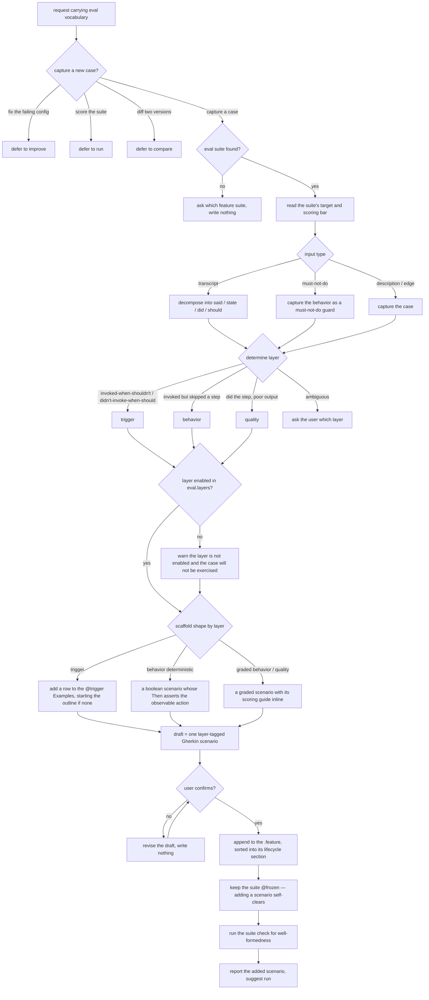

# add-scenario — add a test case to the frozen .feature suite

Capture a real failure, a production edge case, or a noticed gap as one new scenario, resolve its
layer, scaffold it in the shape its layer requires (a `@trigger` Examples row, a boolean behavior
scenario, or a graded scenario with its scoring guide inline), and — after confirmation — append it to
the frozen `.feature`, which stays `@frozen` because adding a scenario self-clears.

## Use Cases

**Subject** — adding one new test case to a target configuration's frozen `.feature` suite, drawn from a
real failure, a production edge case, or a noticed coverage gap.
**Non-goals** — fixing the configuration when cases fail (`improve`); scoring the suite (`run`);
diffing two versions (`compare`); how a single case is scored (that is `aced-case-judge`).

**Fit:** strong — the capability carries a genuine activation decision (a capture request versus
sibling eval intents — `improve` / `run` / `compare` — that share the same eval vocabulary), and its
suite location, input decomposition, layer inference, per-layer scaffold shape, and confirm-before-write
discipline are judged, not asserted.

| Use case | Trigger / inputs | Outcome |
|---|---|---|
| Trigger on a capture request | a request to capture a new case from a failure / edge / gap, vs. a sibling intent (fix the failing config, score, diff) carrying the same eval vocabulary | `add-scenario` fires for a capture request and defers when the intent belongs to `improve` / `run` / `compare` |
| Locate the eval suite | the user names or implies a feature; its eval config may or may not exist | the suite's target and scoring bar are read, or the user is asked when no suite is found |
| Capture the input | a pasted transcript, an edge-case description, a gap, or a must-not-do behavior | the input is decomposed into said / state / did / should, and a must-not-do becomes a guard |
| Determine the layer | the captured input | the trigger / behavior / quality layer is inferred, the user is asked when ambiguous, and a layer absent from the suite config is flagged |
| Scaffold the case | a captured input and a resolved layer | a layer-tagged Gherkin scenario is drafted in its layer's shape (trigger Examples row / boolean / graded with scoring guide inline) and shown for confirmation before anything is written |
| Write the case | a confirmed draft | the scenario is appended to the frozen `.feature` in its lifecycle section, the suite stays `@frozen`, the suite check confirms well-formedness, and `run` is suggested |

## Control Flow

## Scenario map

One scenario per row, following the suite's section order. Each decision edge is bound; the
`gather → description / edge` branch is the capture default (no decomposition or guard) and carries no
distinct behavior of its own.

| Edge | Path (Given) | Scenario |
|---|---|---|
| `route` → capture a case | a production failure to record as a new case | `a failure the user wants captured as a new case triggers add-scenario` |
| `route` → defer to improve | existing cases failing, asks why the config is wrong | `failing evals the user wants the config fixed for defers to improve` |
| `route` → defer to run | a request to score the config against its suite | `a request to score the suite defers to run` |
| `route` → defer to compare | a request to compare two versions | `a request to diff two versions defers to compare` |
| `locate` → found | a feature whose eval config exists | `an existing suite is read for its target and bar` |
| `locate` → not found | no feature named, no eval config found | `no suite found asks the user where it lives` |
| `gather` → transcript | a pasted agent transcript showing incorrect behavior | `a pasted transcript is decomposed` |
| `gather` → must-not-do | a behavior the agent must never do | `a must-not-do behavior becomes a guard` |
| `layer` → trigger | an input describing the agent firing when it should not | `the layer is inferred from the input type` |
| `layer` → behavior | an input where the agent invoked but skipped a step | `a skipped-step input is inferred as a behavior case` |
| `layer` → quality | an input where the agent did the step but produced poor output | `a poor-output input is inferred as a quality case` |
| `layer` → ambiguous → ask | an input that fits more than one layer | `an ambiguous input prompts the user for the layer` |
| `absent` → no (flag) | a case whose layer the suite config does not enable | `a layer absent from the suite config is flagged` |
| `draft` layer-tagged scenario | a captured input and a resolved layer | `the draft is a Gherkin scenario tagged with its resolved layer` |
| `shape` → trigger row | a captured input resolved to the trigger layer | `a trigger case is scaffolded as a trigger Examples row` |
| `shape` → boolean | a behavior input with an observable action | `a deterministic behavior case is scaffolded as a boolean scenario` |
| `shape` → graded inline | a graded behavior or quality case | `a graded case is scaffolded with its scoring guide inline` |
| `confirm` gate before write | a scaffolded draft | `the draft is shown before anything is written` |
| `confirm` → no (revise) | the user rejects the draft and asks for changes | `a rejected draft is revised instead of written` |
| `append` to .feature | the user confirms the draft | `a confirmed case is appended to the frozen .feature in its lifecycle section` |
| `frozen` self-clears | a confirmed draft appended to an already-frozen suite | `appending a scenario keeps the suite frozen` |
| `check` well-formedness | a scenario has just been appended | `the suite is checked for well-formedness after the write` |
| `report` added + suggest run | a case has just been written | `the written case reports the added scenario and points to scoring` |

Cross-capability e2e scenarios live in `../../workflows/`.
