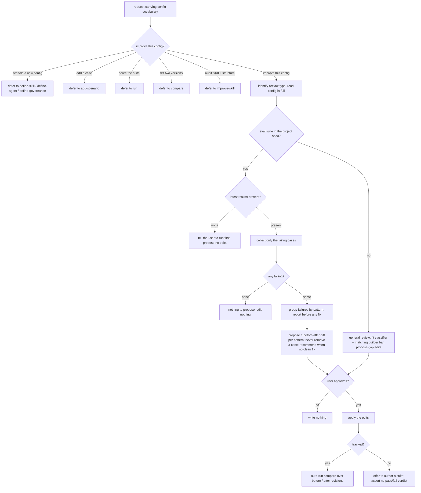

# improve — diagnose failures and propose fixes

The general entry point for improving an existing agent configuration. Route away narrower intents,
locate the target and its artifact type, then take the ACED-tracked path (diagnose failing evals →
group by pattern → propose before/after diffs → verify with `compare`) or, when the target has no eval
suite, a general review against the fit classifier and the matching builder bar.

## Use Cases

**Subject** — improving an existing agent configuration: for an ACED-tracked target, diagnosing its
failing evals, grouping them by failure pattern, proposing concrete before/after edits, and verifying
with `compare`; for an untracked target, a general review against the fit and builder bars.
**Non-goals** — scaffolding a brand-new config (`define-skill` / `define-agent` / `define-governance`);
authoring a case (`add-scenario`); scoring the suite (`run`); on-demand diffing (`compare`); auditing a
SKILL file's structure (`improve-skill`); how a single case is scored (that is `aced-case-judge`).

**Fit:** strong — the capability carries a genuine activation decision (a fix-the-config request versus
sibling intents — `define-*` / `add-scenario` / `run` / `compare` / `improve-skill` — that share the
same config vocabulary), and its tracked-vs-untracked routing, failure grouping, diff proposal, and
verify path are judged, not asserted.

| Use case | Trigger / inputs | Outcome |
|---|---|---|
| Trigger on a fix request | a request to diagnose / fix a config whose evals are failing, vs. a sibling intent (scaffold new, capture a case, score, diff, audit structure) carrying the same config vocabulary | `improve` fires for a fix-the-config request and defers when the intent belongs to `define-*` / `add-scenario` / `run` / `compare` / `improve-skill` |
| Locate the target | a config that may be a skill, subagent, command, or AGENTS.md section | the artifact type is identified and the config is read in full |
| Route the diagnostic path | whether the target has an eval suite in the project spec | ACED-tracked → diagnose failing evals; untracked → a general review against the fit classifier and the matching builder bar |
| Load the context (tracked) | the eval config, the target, and the latest results record | the target is read in full alongside the most recent results, or the user is pointed at `run` when no results exist |
| Identify and group | the latest results | only the failing cases are collected (nothing-to-propose when none fail), each classified into a failure pattern reported before any fix |
| Propose edits | a pattern grouping | each pattern yields a concrete before/after diff rather than prose, no fix ever removes a test case, and a recommendation is given when no clean fix exists |
| Apply and verify | user-approved edits | edits are applied only after approval; a tracked target auto-runs `compare`, an untracked target is offered a suite rather than a fabricated verdict |

## Control Flow

## Scenario map

One scenario per row, following the suite's section order. Each decision edge is bound.

| Edge | Path (Given) | Scenario |
|---|---|---|
| `route` → improve | failing cases, asks why the config is wrong | `failing evals the user wants the config diagnosed for triggers improve` |
| `route` → defer to add-scenario | a new failure to record as a case | `a fresh failure the user wants captured as a case defers to add` |
| `route` → defer to run | a request to score the config | `a request to score the suite defers to run` |
| `route` → defer to compare | a request to compare two versions | `a request to diff two versions defers to compare` |
| `route` → defer to define | a request to create a new config from scratch | `scaffolding a brand-new config defers to define` |
| `route` → defer to improve-skill | a request to check a SKILL file's structure | `auditing a SKILL file's structure defers to improve-skill` |
| `locate` identify + read | a skill / subagent / command / AGENTS.md target | `the artifact type is identified and the config read in full` |
| `tracked` → yes (read results) | a suite with an eval config and a results record | `the target and latest results are read together` |
| `results` → none | a suite never run, no results record | `no results yet points the user at run` |
| `tracked` → no (general review) | a target with no eval suite in the project spec | `an untracked config gets a general review instead of a failure diagnosis` |
| `collect` failing only | a results record mixing pass and fail | `only the failing cases are collected` |
| `nofail` → none | a results record where every case passes | `an all-passing run has nothing to propose` |
| `group` by pattern | a set of collected failing cases | `failures are grouped by pattern before any fix` |
| `propose` before/after diff | a grouping of failures under one pattern | `each pattern yields a concrete before/after diff` |
| `propose` never remove case | a case that would pass if deleted | `a fix never removes a test case` |
| `propose` no-clean-fix | high-variance failures with no clear edit | `no clean fix yields a recommendation instead` |
| `confirm` → no (hold) | proposed edits shown, not yet approved | `nothing is applied before the user approves` |
| `verify` → yes (auto-compare) | the user approves the proposed edits | `approved edits are applied and compare auto-runs` |
| `verify` → no (offer suite) | a reviewed untracked target with no suite to run | `an untracked config is not given a fabricated verdict` |

Cross-capability e2e scenarios live in `../../workflows/`.
