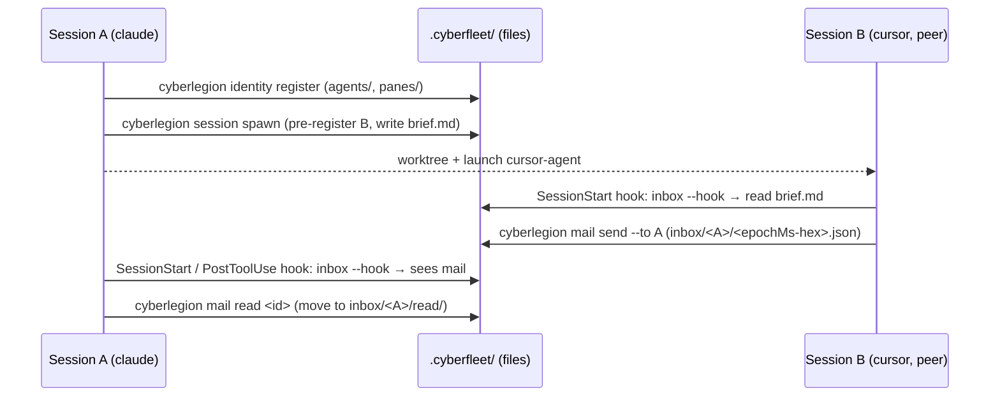

# cyberfleet plugin — the fleet & crew personas (agent behavior)

The **persona layer** of the fleet: the agent-behavior that decides *when* and *how* an agent
reaches for the fleet, recruits or discharges a crew, and re-tunes an automaton's program. Shipped
as the `cyberfleet` plugin (`plugins/cyberfleet`), distributed to the marketplace.

Every node here is a per-situation persona gateway skill (ACED carries all four eval layers —
activation and judgment). Each persona offloads every mechanic to a `cyberfleet` CLI call (or
another engine) and keeps its voice only in what it says around them.

This project is the **plugin half**. The deterministic engine — the `cyberfleet` CLI (register,
send, spawn, inbox, surfacing) — is the sibling `cyberfleet` project
(`../../packages/cyberfleet/.agents/spec`, source `packages/cyberfleet`). These personas depend on
that CLI by **intent**, never by its command slugs (ADR-0021); the dependency is one-way.

The end-to-end path the fleet personas orchestrate — register, spawn a peer, message, surface —
with the filesystem as the only shared state and no process between the two sessions:

Units:

- [**`pod`**](./pod/README.md) *(behavioral)* — the **Pod** persona (the `fleet` in-ship bridge):
  greet on entry, clear the inbox, run the mission through SDD, hail specialist crew, fan out
  worktree-ships, and speak the HAL tell when earned. Activates inside a ship; defers to Operator
  outside. Offloads all mechanics to the `cyberfleet` CLI.
- [**`operator`**](./operator/README.md) *(behavioral)* — the **Operator** persona (the `fleet`
  out-of-ship dispatcher): commission the first ship, list the fleet, route messages between ships,
  and prune dead ones. Activates outside any ship; defers to Pod inside. Offloads all mechanics to
  the `cyberfleet` CLI.
- [**`recruitment`**](./recruitment/README.md) *(behavioral)* — the **Crimp** persona: recruit or
  discharge a crew type from the Tavern (browse, install, register; uninstall, retire).
- [**`tuning`**](./tuning/README.md) *(behavioral)* — the **Tuner** persona: adjust an automaton's
  program (governance/model/effort/leash), re-chip its loadout, hot-swap the unit.

Scope: A voice-rubric dimension across the three persona nodes and a concrete in-session handler for
the leash route are deferred non-blocking follow-ups. This project has its own cross-capability
persona e2e; a future `acceptance/` node may formalize it.

Squad note: all four nodes are agent-behavior (ACED carries all four eval layers — activation and
judgment). The deterministic CLI behaviors (SDD-default + a script harness — boolean scenarios, no
rubric) are the sibling `cyberfleet` CLI project.
</content>
