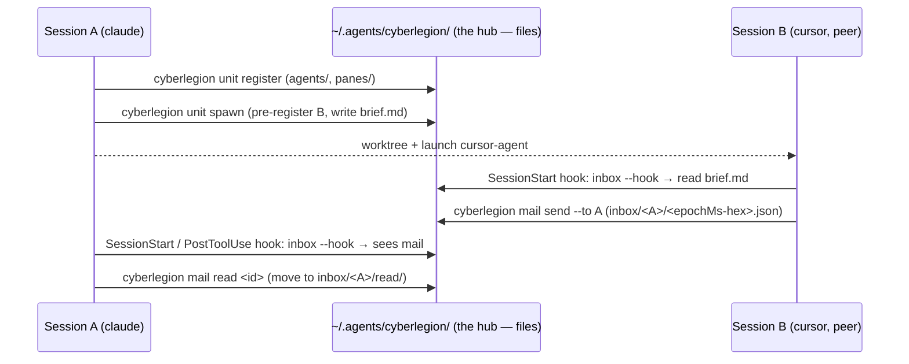

# cyberfleet plugin — the fleet & crew personas (agent behavior)

The **persona layer** of the fleet: the agent-behavior that decides *when* and *how* an agent
reaches for the fleet, recruits or discharges a crew, and builds or re-tunes an automaton. Shipped
as the `cyberfleet` plugin (`plugins/cyberfleet`), distributed to the marketplace.

Every node here is a per-situation persona gateway skill (ACED carries all four eval layers —
activation and judgment). Each persona offloads its mechanics to a CLI — `cyberlegion` for identity,
mail, and spawn; `cyberfleet` for mode, init, and missions — and keeps its voice only in what it says
around them. Where a mechanic belongs to neither (the merge backstop's `gh`/git/CI), it is offloaded
to that tool, never re-implemented.

This project is the **plugin half**. The deterministic engines are two sibling CLI projects: the
`cyberfleet` CLI (the SDD-derived mission view + gates — `../../packages/cyberfleet/.agents/spec`,
source `packages/cyberfleet`) and the `cyberlegion` CLI (identity, mail, spawn, mux —
`../../packages/cyberlegion/.agents/spec`, source `packages/cyberlegion`). These personas depend on
both by **intent**, never by their command slugs (ADR-0021); the dependency is one-way.

The end-to-end path the fleet personas orchestrate — register, spawn a peer, message, surface —
with the filesystem as the only shared state and no process between the two sessions:

Units:

- [**`pod`**](./pod/README.md) *(behavioral)* — the **Pod** persona (the `fleet` ship's bridge):
  greet on entry, clear the inbox, run the mission through SDD, hail specialist crew, and speak the
  HAL tell when earned. Never spawns — that is Operator's. No location precondition and no mode
  check: it is reached by what the Council asked, and `register` on entry is the only setup. Offloads
  its mechanics — `cyberlegion` for identity and mail, `cyberfleet` for missions.
- [**`operator`**](./operator/README.md) *(behavioral)* — the **Operator** persona (the `fleet`
  command-center dispatcher): **any spawn**, list the fleet, route messages between ships, and prune
  dead ones. Seated by invocation, never by a mode probe. Offloads its fleet mechanics — spawn, who,
  mail, prune — to the `cyberlegion` CLI.
- [**`recruitment`**](./recruitment/README.md) *(behavioral)* — the **Crimp** persona: recruit or
  discharge a crew type from the Tavern (browse, install, register; uninstall, retire).
- [**`mechanic`**](./mechanic/README.md) *(behavioral)* — the **Mechanic** persona: build a new
  automaton, or adjust an existing one's program (governance/model/effort/leash), re-chip its
  loadout, hot-swap the unit.

Scope: A voice-rubric dimension across the three persona nodes and a concrete in-session handler for
the leash route are deferred non-blocking follow-ups. This project has its own cross-capability
persona e2e; a future `acceptance/` node may formalize it.

Squad note: all four nodes are agent-behavior (ACED carries all four eval layers — activation and
judgment). The deterministic CLI behaviors (SDD-default + a script harness — boolean scenarios, no
rubric) are the sibling `cyberfleet` CLI project.
