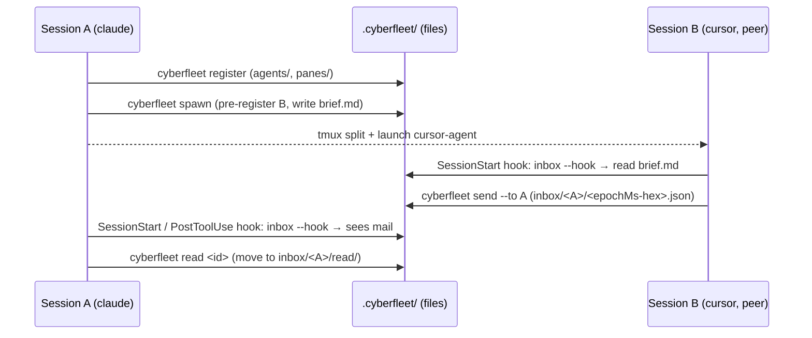

# fleet/ — harness-agnostic agent sessions + messaging (MCP-free)

Create new agent sessions and let them talk to each other, across harnesses (a Claude Code
session ↔ a Cursor session ↔ a Codex session) and **without MCP** — no server, no port, no
daemon. The transport is the filesystem (a project-scoped `.cyberfleet/` directory), the
interface is one shell command (`cyberfleet`), and delivery is surfaced through the same
per-harness hooks cyberspace already wires. Nobody speaks a vendor-specific protocol — peers
share files and one CLI, so the mechanism ports to every harness by construction.

The runtime engine lives in a new **`cyberfleet` CLI** — a peer of the `universal-plugin` CLI,
offloaded to the same way the rest of cyberspace offloads to a tool instead of spending tokens by
hand. The user-facing entry is the **`fleet` gateway skill** shipped in the cyberspace plugin.

The end-to-end path — register, spawn a peer, message, surface — with the filesystem as the only
shared state and no process between the two sessions:

Units:

- [**`gateway`**](./gateway/README.md) *(behavioral)* — the `fleet` skill: when to reach for the
  fleet, spawn a peer session, message etiquette (register on start, check inbox, ack, address by
  handle), and harness-agnostic awareness. Offloads all mechanics to the `cyberfleet` CLI.
- [**`identity`**](./identity/README.md) *(behavioral)* — `cyberfleet register` / `who`: an agent
  self-identifies (pane-keyed self-recall via `$TMUX_PANE`, harness auto-detection) and discovers
  its peers.
- [**`messaging`**](./messaging/README.md) *(behavioral)* — `cyberfleet send` / `inbox` / `read`:
  the per-recipient file queue, chronological collision-free delivery, and ack-by-move.
- [**`spawn`**](./spawn/README.md) *(behavioral)* — `cyberfleet spawn`: launch a new peer session
  in a tmux split, pre-register it, and hand it its brief through its own SessionStart hook.
- [**`surfacing`**](./surfacing/README.md) *(behavioral)* — `cyberfleet inbox --hook`: emit the
  SessionStart `additionalContext` payload so a session sees its unread mail, and register that
  emitter across harnesses reusing the existing per-vendor event mapping.

Scope: MVP is pull-via-hooks, project-scoped `.cyberfleet/`, tmux spawn. A live `send` nudge, a
zero-token watcher, message threads, a cross-repo root, and Copilot CLI are deferred to their own
change requests. Cross-capability e2e (init → register → spawn → exchange) previously pointed at
cyberspace's `../acceptance/` folder; that folder's own README scopes it to `bootstrap/` and
`plugin/` only (no fleet content ever landed there), and it stays with cyberspace since it wasn't
part of this move. `cyberfleet` has no `acceptance/` node of its own yet — flagged as a gap this
relocation surfaces rather than fabricated here; a future change request should add one if a
fleet-scoped cross-capability e2e is wanted.

Squad note: `gateway` is agent-behavior (ACED carries all four eval layers — activation and
judgment); `identity`, `messaging`, `spawn`, and `surfacing` are deterministic `cyberfleet` CLI
behaviors (SDD-default + a script harness — boolean scenarios, no rubric).
