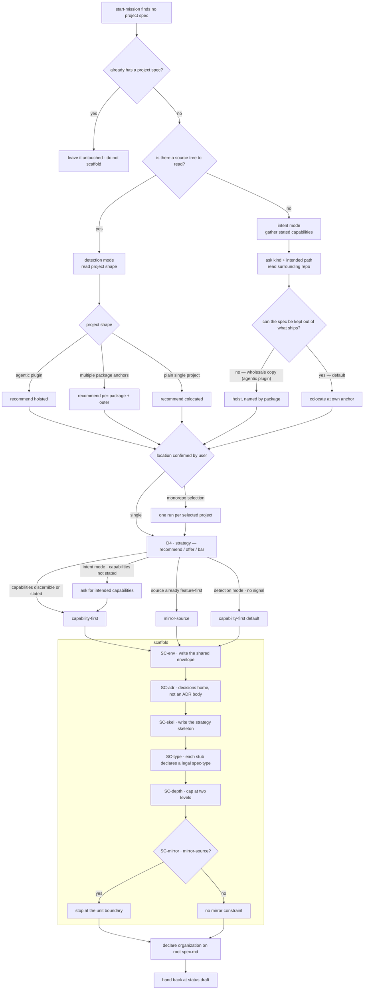

# scaffold-project-spec — lay out a project's spec

## What

The **project-level layout bootstrap**. When a project has **no spec yet**, it chooses an
organization **strategy**, scaffolds that skeleton, and **declares** the choice — so the per-unit
explore that follows slots work into known homes instead of inventing placement each time. It is the
structural answer to [#35](https://github.com/cyberuni/cyberplace/issues/35): placing a concept
correctly today needs the whole system in your head, which makes a newcomer slow and error-prone and
turns misplacement into structural debt the formation Warden must later reconcile.

It serves an **existing** project and a **greenfield** one through a single entry, branching on
**evidence mode**. The mode is **detected, not chosen** — the only question is whether there is
source to read:

- **detection mode** — the project's source exists, so shape and strategy are read from it.
- **intent mode** — the project's source does not exist yet, so its **kind**, its **intended path**,
  and its **capabilities** are asked instead. The strategy is never silently defaulted, and the spec
  location is **derived from the path** rather than asked separately.

The mode is scoped to the **project**, not the repo: a new package inside an existing monorepo is a
greenfield project in a populated repo, so intent mode still reads the surrounding repo for shape
and conventions.

Both modes converge on the same scaffold and the same declared organization.

It is **not a user-facing entry skill**. The single entry is `../../gateway/` → `start-mission`;
this unit is an internal step the conductor loads during explore, runs **once at bootstrap**, and
leaves the tree at `status: draft`.

**Key terms.** *Evidence mode* — whether recommendations are read from source (detection) or from
stated intent (intent). *Placement map* — the body table in root `spec.md` naming the chosen
strategy and routing a concept to its home. *Envelope* — the folders every strategy ships regardless
of choice.

**Non-goals.** It does not fill a node's `## Use Cases` or `.feature` (that is `../spec-producer/`
during explore); renders no gate verdict and freezes nothing (`../spec-gate/`); writes no control
frontmatter (`status` / `approval` / `produced-by`); does not **re-organize** an existing spec (the
formation Warden's, `../../formation/`); and does not implement the project it scaffolds.

It enacts the **structure-doc trio**: `../../design/spec-structure.md` (node taxonomy, concept axis,
two-level depth cap, screaming architecture), `../../design/spec-layout.md` (the strategy menu and
the body-declared organization), and `../../design/project-unit.md` (the external boundary and the
spec location).

## Use Cases

| Trigger | Inputs | Outcome |
|---|---|---|
| **bootstrap** — an existing project (or one package) with no project spec | the project source + the user's **location** and **strategy** choices | a scaffolded **draft** spec tree: shared envelope + strategy skeleton + stub nodes (each declaring a legal `spec-type`) + root `spec.md` carrying `project-path` and the body placement map, at `status: draft` |
| **greenfield** — a new project with no source tree yet | the capabilities the user states the project will have + the user's **location** and **strategy** choices | the same scaffolded **draft** spec tree, reached through **intent mode**: no source is read, and the strategy is never silently defaulted |
| **monorepo** — a repo with multiple package anchors | the repo + the user's per-project selection | one **bootstrap** per chosen package (each hoisted to `<repo>/.agents/specs/<pkg>/`) plus the outer project (`<repo>/.agents/spec/`) — several draft trees in one pass |

## Logic

All three use cases enter one graph; they differ only at **D1** (which evidence mode) and **D3**
(whether the run fans out per package).

**Barred branches** — options the graph never offers, enforced as their own scenarios: layering or
arc42 sections as the *top* level (they nest inside a capability), and ADR as a strategy (it is the
decisions facet).

## Scenario map

Grouped by use case. Each row is one **(path class, edge)** pair: `Path` is the scenario's `Given`
(the decisions already made), `Edge` is its `When` (the decision under test). An edge repeated with
different paths is **permutation coverage**; `Path = any` is a **convergence** claim — the outcome
does not vary across the paths reaching that edge.

### Shared graph — entry and evidence mode (all use cases)

| Edge | Path (Given) | Scenario |
|---|---|---|
| D0 | a project spec already exists | `a project that already has a project spec is not scaffolded` |
| D1 | project has a source tree | `a project that has a source tree enters detection mode` |
| D1 | project has no source tree | `a project that has no source tree enters intent mode` |
| DECL | any evidence mode *(convergence)* | `both evidence modes converge on the same declared organization` |

### bootstrap (detection mode)

| Edge | Path (Given) | Scenario |
|---|---|---|
| D2 | detection · agentic plugin | `an agentic plugin is detected and the hoisted location is recommended` |
| D2 | detection · plain single project | `a plain repo-level project is recommended the colocated location` |
| D3 | any recommended location *(convergence)* | `the recommended location is surfaced first and is overridable` |
| D3 | an agentic plugin · exactly one legal location *(convergence)* | `the location is never silently assumed` |
| D4-rec | detection · capabilities discernible | `a project with a discernible capability decomposition is recommended capability-first` |
| D4-rec | detection · src layer-organized | `a layer-organized project takes the capability-first default` |
| D4-offer | detection · source feature-first | `a feature-first code base navigated by code is offered mirror-source` |
| D4-offer | detection · src layer-organized | `a layer-organized code base is also offered mirror-source` |
| D4-cost | detection · src layer-organized | `mirror-source over a layer-organized source is offered with its cost stated` |
| D4-present | any recommended strategy *(convergence)* | `one recommendation and its alternative are presented for the user to choose` |
| D4-bar | detection mode · src/ organized by layer | `layering is never offered as the top-level body` |
| D4-bar | any project | `ADR is not offered as a strategy` |

### greenfield (intent mode)

| Edge | Path (Given) | Scenario |
|---|---|---|
| L4 | intent · source dir does not exist | `intent mode asks for the project path it cannot read` |
| L4 | intent · inside an existing monorepo | `intent mode still reads the repo around an empty project` |
| DER | intent · path established | `the spec location is derived from the project path in intent mode` |
| DER | intent · will be an agentic plugin | `a greenfield agentic plugin has its spec hoisted` |
| DER | intent · spec can be excluded from the package | `a greenfield nested package keeps its spec colocated` |
| D4-rec | intent · capabilities stated | `intent mode recommends a strategy from the capabilities the user states` |
| D4-rec | intent · capabilities not stated | `intent mode does not silently apply the capability-first default` |

### monorepo

| Edge | Path (Given) | Scenario |
|---|---|---|
| D2 | detection · multiple package anchors | `a monorepo is detected and a repo-wide backfill is offered` |
| FAN | several projects selected | `a monorepo run produces one draft tree per chosen project` |

### SC — scaffold

Location never reaches this stage: the scaffold depends on the **strategy**, not on where the spec
sits, so the four location classes collapse. Only `mirror-source` distinguishes.

Scaffold is a **stage, not one edge** — it makes six separable decisions, each with its own
observable outcome. Drawing it as a single node produced two rows sharing `SC | any strategy`, which
the same-edge-same-path duplicate rule correctly rejected.

| Edge | Path (Given) | Scenario |
|---|---|---|
| SC-env | any strategy *(convergence)* | `the shared envelope is scaffolded for every strategy` |
| SC-adr | any strategy *(convergence)* | `an ADR decisions home is created without organizing the spec by ADR` |
| SC-skel | a chosen strategy | `the chosen strategy's top-level skeleton is written` |
| SC-type | any scaffolded node *(convergence)* | `every scaffolded node declares a legal spec-type` |
| SC-depth | any strategy *(convergence)* | `the scaffolded skeleton respects the two-level depth cap for any strategy` |
| SC-mirror | mirror-source · nesting below a testable surface | `mirror-source scaffolding stops at the unit boundary` |

### DECL — declare the organization

| Edge | Path (Given) | Scenario |
|---|---|---|
| DECL | any strategy and location *(convergence)* | `the project-path frontmatter is written on the root spec.md` |
| DECL | name not reliably derivable | `a name that is not reliably derivable is confirmed with the user before writing` |
| DECL | colocated · repo-root dir name equals the derived name | `a colocated project with a correct repo-root name writes no name frontmatter` |
| DECL | any chosen strategy *(convergence)* | `the placement map naming the strategy is written into the root body` |
| DECL | writing the root spec.md | `the root spec.md reserves the generated by-concept index block` |
| DECL | a scaffolded tree | `the produced root passes the static state check` |

### HB — hand back

| Edge | Path (Given) | Scenario |
|---|---|---|
| HB | scaffolding finished | `the tree is left at draft` |
| HB | writing the root spec.md | `control frontmatter is not written` |
| HB | a scaffolded behavioral node stub | `node Use Cases and feature suites are left to per-unit explore` |
| HB | a scaffolded node stub | `concept tags are assigned during per-unit explore, not at scaffold` |
| HB | nodes placed | `placement is proposed for the Warden to confirm` |
