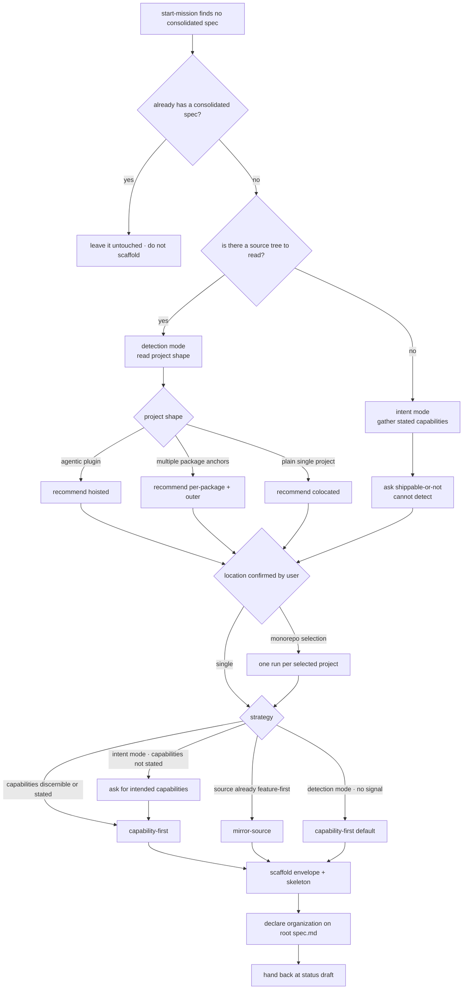

# scaffold-project-spec — lay out a project's spec

## What

The **project-level layout bootstrap**. When a project has **no consolidated spec**, it chooses an
organization **strategy**, scaffolds that skeleton, and **declares** the choice — so the per-unit
explore that follows slots work into known homes instead of inventing placement each time. It is the
structural answer to [#35](https://github.com/cyberuni/cyberplace/issues/35): placing a concept
correctly today needs the whole system in your head, which makes a newcomer slow and error-prone and
turns misplacement into structural debt the formation Warden must later reconcile.

It serves an **existing** project and a **greenfield** one through a single entry, branching on
**evidence mode**. The mode is **detected, not chosen** — the only question is whether there is
source to read:

- **detection mode** — the source tree exists, so shape and strategy are read from it.
- **intent mode** — no source exists, so both come from the capabilities the user states the project
  will have. The strategy is never silently defaulted.

Both modes converge on the same scaffold and the same declared organization.

It is **not a user-facing entry skill**. The single entry is `../../gateway/` → `start-mission`;
this unit is an internal step the conductor loads during explore, runs **once at bootstrap**, and
leaves the tree at `status: draft`.

**Key terms.** *Evidence mode* — whether recommendations are read from source (detection) or from
stated intent (intent). *Placement map* — the body table in root `spec.md` naming the chosen
strategy and routing a concept to its home. *Envelope* — the folders every strategy ships regardless
of choice.

**Non-goals.** It does not fill a node's `## Use Cases` or `.feature` (that is `../spec-producer/`
during explore); renders no gate verdict and freezes nothing (`../spec-gate/`); writes no control
frontmatter (`status` / `approval` / `produced-by`); does not **re-organize** an existing spec (the
formation Warden's, `../../formation/`); and does not implement the project it scaffolds.

It enacts the **structure-doc trio**: `../../design/spec-structure.md` (node taxonomy, concept axis,
two-level depth cap, screaming architecture), `../../design/spec-layout.md` (the strategy menu and
the body-declared organization), and `../../design/project-unit.md` (the external boundary and the
spec location).

## Use Cases

| Trigger | Inputs | Outcome |
|---|---|---|
| **bootstrap** — an existing project (or one package) with no consolidated spec | the project source + the user's **location** and **strategy** choices | a scaffolded **draft** spec tree: shared envelope + strategy skeleton + stub nodes (each declaring a legal `spec-type`) + root `spec.md` carrying `project-path` and the body placement map, at `status: draft` |
| **greenfield** — a new project with no source tree yet | the capabilities the user states the project will have + the user's **location** and **strategy** choices | the same scaffolded **draft** spec tree, reached through **intent mode**: no source is read, and the strategy is never silently defaulted |
| **monorepo** — a repo with multiple package anchors | the repo + the user's per-project selection | one **bootstrap** per chosen package (each hoisted to `<repo>/.agents/specs/<pkg>/`) plus the outer project (`<repo>/.agents/spec/`) — several draft trees in one pass |

## Logic

All three use cases enter one graph; they differ only at **D1** (which evidence mode) and **D3**
(whether the run fans out per package).

**Barred branches** — options the graph never offers, enforced as their own scenarios: layering or
arc42 sections as the *top* level (they nest inside a capability), and ADR as a strategy (it is the
decisions facet).

## Scenario map

Grouped by use case; every scenario in
[`scaffold-project-spec.feature`](./scaffold-project-spec.feature) names the decision it covers.

### Shared graph — entry and evidence mode (all use cases)

| Decision | Scenario |
|---|---|
| D0 — spec already exists | `a project that already has a consolidated spec is not backfilled` |
| D1 — source present → detection | `a project that has a source tree enters detection mode` |
| D1 — no source → intent | `a project that has no source tree enters intent mode` |
| D1 — modes reconverge | `both evidence modes converge on the same declared organization` |

### bootstrap (detection mode)

| Decision | Scenario |
|---|---|
| D2 — agentic plugin | `an agentic plugin is detected and the hoisted location is recommended` |
| D2 — plain single project | `a plain repo-level project is recommended the colocated location` |
| D3 — recommendation is overridable | `the recommended location is surfaced first and is overridable` |
| D3 — never silently assumed | `the location is never silently assumed` |
| D4 — capabilities discernible | `a project with a discernible capability decomposition is recommended capability-first` |
| D4 — source feature-first | `a feature-first code base navigated by code is offered mirror-source` |
| D4 — no signal → default | `a project with no discernible decomposition and no feature-first layout takes the default` |
| D4 — one recommendation + alternative | `one recommendation and its alternative are presented for the user to choose` |
| D4 — barred: layering | `layering is never offered as the top-level body` |
| D4 — barred: ADR | `ADR is not offered as a strategy` |

### greenfield (intent mode)

| Decision | Scenario |
|---|---|
| D4 — strategy from stated capabilities | `intent mode recommends a strategy from the capabilities the user states` |
| D4 — capabilities not stated → ask | `intent mode does not silently apply the capability-first default` |
| L4 — location cannot be detected | `intent mode asks for the spec location it cannot detect` |

### monorepo

| Decision | Scenario |
|---|---|
| D2 — multiple package anchors | `a monorepo is detected and a repo-wide backfill is offered` |
| D3/FAN — one run per selection | `a monorepo run produces one draft tree per chosen project` |

### SC — scaffold (shared by every use case)

| Decision | Scenario |
|---|---|
| envelope, strategy-independent | `the shared envelope is scaffolded for every strategy` |
| strategy skeleton | `the chosen strategy's top-level skeleton is written` |
| each stub declares a type | `every scaffolded node declares a legal spec-type` |
| mirror-source stops at the unit | `mirror-source scaffolding stops at the unit boundary` |
| depth cap under any strategy | `the scaffolded skeleton respects the two-level depth cap for any strategy` |
| decisions home without ADR-as-layout | `an ADR decisions home is created without organizing the spec by ADR` |

### DECL — declare the organization (shared)

| Decision | Scenario |
|---|---|
| `project-path`, no `spec-layout` block | `the project-path frontmatter is written on the root spec.md` |
| name not derivable → confirm | `a name that is not reliably derivable is confirmed with the user before writing` |
| name derivable → write none | `a colocated project with a correct repo-root name writes no name frontmatter` |
| placement map names the strategy | `the placement map naming the strategy is written into the root body` |
| by-concept block reserved, not filled | `the root spec.md reserves the generated by-concept index block` |
| result is a legal root tuple | `the produced root passes the static state check` |

### HB — hand back (shared)

| Decision | Scenario |
|---|---|
| left at draft | `the tree is left at draft` |
| no control frontmatter | `control frontmatter is not written` |
| node bodies left to explore | `node Use Cases and feature suites are left to per-unit explore` |
| concept tags left to explore | `concept tags are assigned during per-unit explore, not at scaffold` |
| placement proposed to the Warden | `placement is proposed for the Warden to confirm` |
