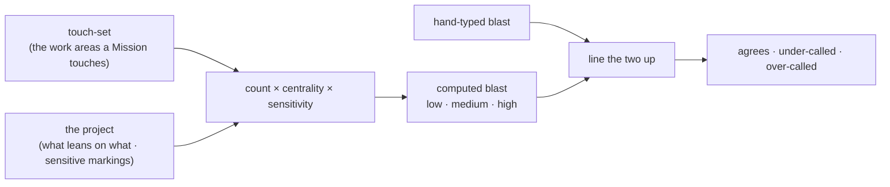

# blast-estimate — work out how much a Mission could disturb, instead of guessing

Every Mission on the shared work list carries a **blast** — a note of how much of the project that
Mission could disturb, its risk and reach. Today that note is **written by hand**: whoever adds the
Mission to the list types `low`, `medium`, or `high` from intuition. A hand-typed guess drifts —
it is written before the work, by one person, with no way to check it.

**blast-estimate** works the figure out instead. Give it the list of **work areas** a Mission touches
(its [touch-set](../touch-set-correction/README.md)) and it reads the project to answer: how *many*
areas is that, how **central** are they (how much of the rest of the project leans on them), and are
any of them **marked sensitive**. From those it computes a blast level, and lines that level up against
the hand-typed one — reporting whether the guess **agrees**, was **under-called** (the dangerous case:
the work is riskier than anyone wrote down), or was **over-called** (a harmless over-guess).

It **reports; it never writes.** The computed level is returned to the work list's single writer, who
records it — the same boundary [`touch-set-correction`](../touch-set-correction/README.md) and
`resolve-governances` keep.

## Key terms

Plain-language glossary; the word in parentheses is the technical term an engineer may know it by.

| Term | Plain meaning |
|---|---|
| **Mission** | one deliverable piece of work — roughly one branch / one pull request |
| **work area** (spec-node) | the atom a touch-set is written in: `project + capability`, e.g. `sdd/mission-graph` |
| **touch-set** | the work areas a Mission touches — the **input** here, never something this tool works out itself |
| **blast** | how much of the project a Mission could disturb — its risk and reach; one of `low` / `medium` / `high` |
| **declared blast** | the **hand-typed** blast already on the Mission — the guess being checked |
| **computed blast** | the level this tool works out from the project itself |
| **centrality** (dependency fan-in) | how many *other* work areas lean on a touched one — a hub disturbs more than a leaf |
| **coverage** (project-wide reach) | whether a touch-set reaches **every** work area of a project — reach measured *relative* to that project, as against **count**, which is reach in absolute terms. A project holding a single work area has no coverage to measure: there is nothing for the touch-set to cover *the rest of*. |
| **sensitive** | a work area a project has explicitly **marked** as needing extra care |
| **agrees / under-called / over-called** | the three-way line-up of the hand-typed guess against the computed level |

## Use Cases

**Subject** — a **read-only estimate**: given a Mission's touch-set and the project, compute a blast
level from **how many** work areas are touched, **how central** they are (dependency fan-in), and
**whether any is marked sensitive**; line the computed level up against the declared one; return both
plus the reasons. It **sharpens** the hand-typed field — it does not replace the writer's authority.

**Non-goals** — it does **not** *work out* a touch-set (it consumes one — pre-work declared, or the
corrected one [`touch-set-correction`](../touch-set-correction/README.md) returns post-work), **write**
the level into the work list (it *returns* it; the graph's single writer records it), judge
**compatibility / breakage** (the separate semver concern — `../design/autonomy-rubric.md`), rank a
Mission by **where its files sit** (mere surface location is not reach), decide **HITL vs AFK**, or make
any self-clear-vs-escalate verdict (that is a conductor's, and blast only *modulates* it — it never
decides on its own). It estimates; it does not schedule and it does not gate.

| What you want | What you give it | What you get back | Scenario |
|---|---|---|---|
| **stop guessing the risk** | a touch-set + the project | a computed blast level with the reasons behind it | `Scenario: a broad, central touch-set computes high blast` |
| **catch an under-called guess** — the work is riskier than written down | a declared blast + the computed one | `under-called`, naming the gap | `Scenario: a declared blast below the computed level is reported under-called` |
| **keep an honest over-guess harmless** | a declared blast above the computed one | `over-called` — surfaced, never an error | `Scenario: a declared blast above the computed level is reported over-called` |
| **trust the same input twice** | the same touch-set + project | the same level, every time | `Scenario: the estimate is deterministic for a fixed input` |
| **never lose an area it cannot place** | a touch-set naming an unknown area | the area is surfaced as unresolved, never dropped | `Scenario: a touch-set area that resolves to no known work area is surfaced` |
| **corroborate a barrier on reach alone** | a touch-set covering **every** work area of a project holding more than one | `high` — so a called-out barrier and the estimate agree by construction. On a project of **one** there is no coverage to measure, so reach adds nothing and the lone area scores on centrality and sensitivity alone — `low` when peripheral and unmarked, higher when not | `Scenario: a project-wide touch-set computes high blast` · `Scenario: a lone work area is its whole project but is not project-wide reach` |

Every scenario in [`blast-estimate.feature`](./blast-estimate.feature) maps to one of these entries or
to a cross-cutting guarantee (read-only, deterministic, reports-never-writes).

## The three inputs — and the two things blast is NOT

The rubric (`../design/autonomy-rubric.md`) fixes what blast measures: **the scope and sensitivity of
what's touched**. This node computes exactly that and nothing else.

| Input | Question | Why it moves blast |
|---|---|---|
| **count** | how many work areas does the Mission touch? | more areas = more of the project disturbed |
| **centrality** (fan-in) | how many *other* areas lean on the touched ones? | changing a hub reaches further than changing a leaf, even at count 1 |
| **sensitivity** | is any touched area **marked** sensitive? | a project may declare an area needs care regardless of its size or fan-in |

Two exclusions are load-bearing, and each has a scenario holding the line:

- **NOT compatibility / breakage.** Whether a change breaks callers is the **Compatibility** floor's
  semver class — a *separate* dimension of the rubric. A breaking one-line change is not high blast
  *for being breaking*.
- **NOT mere surface location.** A file sitting in a "public" or "core"-named folder is not reach.
  Only measured fan-in counts; a name is not evidence.

### Sensitivity is declared, never inferred

A project marks its sensitive work areas **explicitly**, in the opt-in `.agents/sdd/sensitive-paths.toml`
(the same opt-in-TOML shape as `spec-anchors.toml` / `artifact-types.toml`). With **no** file, no area is
sensitive and the estimate rests on count × centrality alone — an absent file is **not** an error. The
tool never guesses sensitivity from a path's name.

## Sharpening, not overriding — who still decides

The estimate **sharpens** the hand-typed field; it does not seize it.

- The declared blast is **left as it is** — this node writes nothing. It returns the computed level and
  the line-up; the graph's **single writer** decides what to record (`../mission-graph/README.md`).
- The computed level lands on the store **additively** — the store's schema is versioned from v1 for
  exactly this, so an auto-computed level arrives on newer entries with **no migration** and old entries
  keep folding.
- Blast is a **modulator**, never a decider (`../design/autonomy-rubric.md`). A computed `high` raises
  how much evidence a self-clear needs; it never escalates on its own, and it never sets a hard floor.
- A **barrier** — a project-wide act called out by the formation loop
  ([`../formation/README.md`](../formation/README.md)) — reaches across its whole project by definition,
  so on a project holding **more than one** work area its computed blast is `high`. The call-out and the
  estimate agree by construction rather than by hand, which is why a barrier escalates on reach alone.
  On a project holding **exactly one** work area the estimate does **not** corroborate the call-out
  **on reach**: coverage is reach *relative* to a project, and a project of one has none to cover, so
  coverage never fires and breadth stays flat. The lone area still scores on **centrality** and
  **sensitivity** — so it computes `low` only when it is peripheral *and* unmarked, and `medium` or
  `high` when it is not. The agreement is simply not guaranteed at that size, in either direction.
  That costs the barrier nothing — the call-out escalates on the formation loop's **own** reach
  finding, and the estimate only **corroborates** it. Nothing is gated on the agreement.

## Boundaries

Read-only, like its siblings: it composes the corpus read and the touch-set it is handed, and returns a
report. It owns no lifecycle state, writes no file, and mutates no store. `unknown` is a legal answer —
an area it cannot resolve is **surfaced**, never silently dropped, so a thin estimate is never mistaken
for a confident one.
