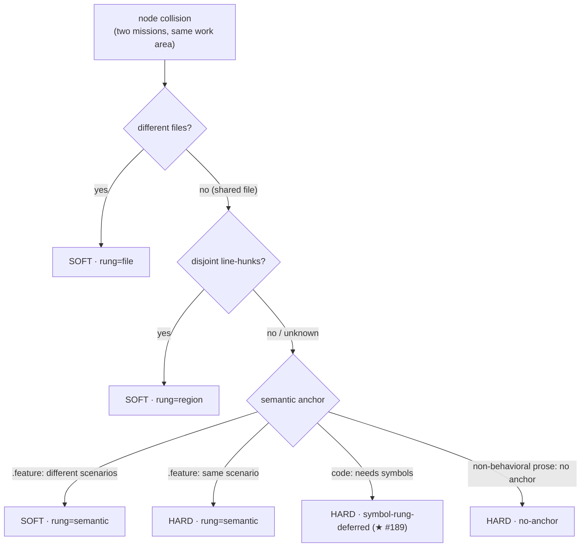

# collision-ladder — when two missions clash on the same work area, decide whether they truly conflict

The shared work list ([`mission-graph`](../mission-graph/README.md)) keeps two Missions apart when they
touch the **same work area** (a node collision) — conservatively, it treats *any* same-area overlap as a
real clash and **serializes** them. But most same-area clashes are false: a work area holds several files
and the two Missions usually touch **different** ones, or the same file in **different spots**. Serializing
those wastes the parallelism worktrees exist to provide.

**collision-ladder** is the disambiguator. Given a **known** node collision between two Missions, it
**descends a ladder of finer grains** — file → region → semantic — and stops at the first grain that can
tell a **hard** clash (must serialize) from a **soft** one (can run together, reconciled by rebase). It
runs **rarely**, only on the colliding pair, only to justify **downgrading a suspected false-hard** — never
as the baseline signal, never to find a collision (that is the work list's job).

- **hard** — the two Missions change the *same thing* (same scenario, or a code overlap that needs symbol
  analysis to clear) → they **must not run together**.
- **soft** — they touch the same area but provably **disjoint** parts (different files, disjoint line-hunks,
  or different scenarios) → they **can** run together.

The verdict is **data**: the ladder *returns* a hard-or-soft classification with the rung it was decided at
and a confidence; the scheduler consumes it. Like [`touch-set-correction`](../touch-set-correction/README.md),
it **writes nothing** to the mission graph.

## Key terms

Plain-language glossary; the word in parentheses is the technical term an engineer may know it by.

| Term | Plain meaning |
|---|---|
| **Mission** | one deliverable piece of work — roughly one branch / one pull request |
| **work area** (spec-node) | the atom a collision is written in: `project + capability`, e.g. `sdd/mission-graph` |
| **node collision** (WAW) | two Missions change the same work area — the work list holds them apart by default |
| **hard clash** | a *real* conflict on the same thing → the two Missions must not run at the same time |
| **soft clash** (WAR) | an overlap on *disjoint* parts → the two Missions can run together, reconciled by rebase |
| **the ladder** | the ordered finer grains the classifier descends: **file → region → semantic** |
| **rung** | the grain a collision was decided at — the ladder stops at the first rung that classifies it |
| **region** (line-hunk) | the set of line ranges a Mission changed in a file — two disjoint ranges are a soft overlap |
| **scenario** | the `.feature` unit the semantic rung anchors on (freeze-stable) — same scenario is hard, different is soft |
| **shared-thin file** | a file touched by *many* Missions (a CLI router / barrel / registry) — the case the downgrade protects from over-serializing |
| **confidence** | how much to trust a soft verdict — **decays down the ladder** (node stable → scenario/hunk churny) |
| **artifact-type** | what *kind* of thing a changed file is — chooses the semantic-rung behavior (prose has no anchor; code needs the deferred symbol rung) |

## Use Cases

**Subject** — a **read-only, pairwise collision classifier**: given two Missions' per-node touched detail
for **one shared (colliding) node** — each changed file with its artifact-type, its touched line-hunks, and
(for a `.feature`) its changed scenarios — descend the ladder **file → region → semantic** and return a
**hard-or-soft** verdict per shared file plus a node rollup (hard if **any** shared file is hard), each
carrying the **rung** it was decided at and a **confidence** that decays with depth. It reuses the
[`touch-set-correction`](../touch-set-correction/README.md) composition — `gherkin-cli diff` (changed
scenarios) and `resolve-governances` (artifact-type) — and adds one finer source, `git diff -U0` line-hunks
(the region rung).

**Non-goals** — it does **not** detect a collision (the [`mission-graph`](../mission-graph/README.md)
WAW-mutex does — the ladder runs only *after* a collision is found), **write** the verdict into the mission
graph or **schedule** anything (it *returns* the verdict; the scheduler consumes it), do **★ SSA lowering**
or **symbol-level** produce/consume dependency inference (issue #189's capstone — an overlapping-region
**code** file stays **hard**, flagged `symbol-rung-deferred`), descend past the scenario grain, or decide
whether to **split** a shared-thin file (it *surfaces* the smell; the architect decides). It classifies; it
does not schedule.

| What you want | What you give it | What you get back | Scenario |
|---|---|---|---|
| **stop over-serializing** — the two Missions touch the area but different files | the two touched details | a **soft** verdict decided at the **file** rung | `Scenario: two missions touching different files under the colliding node classify soft at the file rung` |
| **clear a same-file clash** — same file, different spots | each side's line-hunks for the file | a **soft** verdict at the **region** rung | `Scenario: a shared file changed in disjoint line-hunks classifies soft at the region rung` |
| **clear a same-suite clash** — same `.feature`, different scenarios | each side's changed scenarios | a **soft** verdict at the **semantic** rung | `Scenario: a shared .feature changed in different scenarios classifies soft at the semantic rung` |
| **hold a real clash** — same scenario of the same suite | each side's changed scenarios | a **hard** verdict at the **semantic** rung | `Scenario: a shared .feature changed in the same scenario classifies hard at the semantic rung` |
| **stay conservative** — a code overlap only symbols could clear | the shared code file + overlapping hunks | **hard**, flagged `symbol-rung-deferred` (the ★ capstone) | `Scenario: a shared code file needing symbol analysis to downgrade is held hard and flagged deferred` |
| **hold a no-anchor clash** — non-behavioral prose has no finer grain | the shared governance/reference file + overlapping hunks | **hard**, reason `no-anchor` (do not descend) | `Scenario: a shared non-behavioral-prose file with overlapping hunks stays hard with no finer anchor` |
| **protect a shared-thin file** — a router touched by many, in disjoint spots | the shared-thin file + disjoint hunks | the collision **downgrades hard→soft** instead of serializing | `Scenario: a shared-thin file changed in disjoint regions downgrades hard to soft` |
| **flag the smell** — a file touched by many is an architectural smell | the file's touching-mission degree | the file flagged **shared-thin**, surfaced to consider splitting | `Scenario: a file touched by at least the shared-thin degree threshold is flagged and surfaced as a smell` |
| **read the verdict** — data, not a schedule | any colliding pair | the hard-or-soft collision, decisive rung, confidence, per-file detail — never a graph write | `Scenario: classifying a collision does not write to the mission graph` |

Every scenario in [`collision-ladder.feature`](./collision-ladder.feature) maps to one of these entries or
to a cross-cutting guarantee (bounded descent, conservative defaults, deterministic for a fixed pair,
read-only, TOON-by-default / JSON-on-request output).

## How a collision is classified

The classifier descends **only until a rung answers**, then stops (bounded to the colliding pair, never
project-wide):

1. **file rung** — if the two Missions' changed files under the node are **disjoint**, they do not really
   collide: **soft**, decided at `file`, highest confidence. (Artifact-neutral; the common case — a node
   holds many files.)
2. **region rung** — for each **shared** file, if both sides record line-hunks and those hunks are
   **disjoint**, the file is a soft (textual) overlap: **soft** at `region`. If the hunks **overlap** — or
   either side records **no** hunk detail (disjointness cannot be proven) — descend.
3. **semantic rung** — for each still-unresolved shared file, split by artifact-type:
   - **behavioral prose** (a `.feature`, gated by the extension — the same structural gate
     `touch-set-correction` uses) → the **scenario**: different scenarios ⇒ **soft**, the **same** scenario
     ⇒ **hard**. The scenario is freeze-stable, so this rung is the freeze-anchored bottom for entangled
     same-suite work.
   - **code impl** → the **symbol** — but symbol-level analysis is the **★ deferred capstone** (issue #189).
     The file stays **hard**, flagged `symbol-rung-deferred`: conservative until the capstone lands.
   - **non-behavioral prose** (governance / reference — no suite to anchor) → **no finer anchor**; stay
     **hard**, reason `no-anchor` (these are rarer, often shared-thin indexes).
4. **node rollup** — the node collision is **hard if any shared file is hard**, else **soft**. The recorded
   rung is the decisive one and the **confidence decays down the ladder** (a `file`-rung soft outranks a
   `semantic`-rung soft), so the scheduler treats a low-rung soft conservatively.

**The shared-thin-file downgrade.** A file touched by **many** Missions (a CLI router, a barrel, a
registry) is the case the work list most over-serializes: every Mission that touches it would be held
against every other. The ladder's descent **is** the downgrade — a shared-thin file changed in disjoint
regions (or different scenarios) downgrades **hard→soft** instead of serializing. The classifier also
**flags** a file whose touching-mission **degree** reaches a threshold as `sharedThin` and surfaces it as an
**architectural smell** to consider splitting (design: over-serialization on a thin file is usually a smell,
with legitimate shared-thin files kept parallel by exactly this finer check). Surfacing the smell is as far
as it goes — it never performs the split.

Two safety properties carry from the design:

- **Confidence decays down the ladder** — a node/file verdict is stable; a hunk/scenario verdict is
  predicted and churny. A low-rung soft is lower-confidence, treated conservatively.
- **Conservative-first, relax-on-evidence** — the default is **hard (serialize)**; the ladder only ever
  **downgrades** to soft when a finer grain **proves** disjointness. It never optimistically parallelizes an
  unproven case (unknown hunks, no anchor, deferred symbol rung all stay hard).

The result is a plain data record. It is **read-only**: nothing is written to the mission graph — the
scheduler consumes the verdict.

## Why the ladder is a downgrade-only disambiguator (not a primary signal)

The mission graph's primary atom is the **spec-node** — stable, cheap, artifact-neutral — and a same-node
collision serializes by default. Finer grains (file, region, scenario) are **less stable and arrive later**
(monadic: Explore reveals scenarios, the diff reveals hunks), so they are used **only** to relax a suspected
false-hard, **never** to raise a new collision. This keeps the schedule **conservative-first**: it starts
node-serial and relaxes to parallel as finer evidence arrives. Design:
[ADR-0025](../../../../artifacts/adr/0025-mission-graph-compiler-scheduler-model.md) (the RAW/WAW/WAR hazard
model — soft = same file / different region, hard = same symbol's semantics) and the cyberfleet-batch design
brief's **Finer-than-node granularity (collision disambiguation)** section (the ladder, file-sets sourced
not derived, the shared-thin-file hard→soft downgrade).

## Delivery

Built as the **`collision-ladder`** engine — `plugins/sdd/skills/collision-ladder/` — a self-contained,
dependency-free script (the repo's node-≥23.6 / no-extra-tools convention). Pure derivations (the ladder
descent, the node rollup, the shared-thin flagging) take and return plain data — no fs/network access — kept
apart from a thin seam that sources each Mission's touched detail (`git diff -U0` line-hunks, and the
[`touch-set-correction`](../touch-set-correction/README.md) composition for changed scenarios +
artifact-type), so the derivations are unit-tested over **constructed** pairwise details, never a live diff
or the live store.

## Source

- **new** — no prior version. The **Op2** deferral of the **cyberfleet-batch** self-hosting-kernel
  (GitHub issue #189, **second bullet** — the finer-than-node ladder + shared-thin-file hard→soft
  downgrade). Builds on [`touch-set-correction`](../touch-set-correction/README.md) (PR #199, merged),
  reusing its composition. The **★ SSA-lowering / symbol-level** capstone (issue #189's third bullet)
  remains deferred — the PR references #189, it does not close it.
- **Why (design records):** [ADR-0025](../../../../artifacts/adr/0025-mission-graph-compiler-scheduler-model.md)
  (the WAW/WAR hard-soft hazard model) and the cyberfleet-batch design brief's **Finer-than-node
  granularity** section (the collision-time ladder + the shared-thin-file downgrade).
