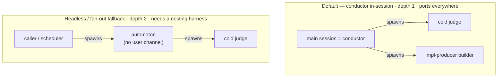

# Harness spawning constraints

The depth of agent nesting a harness allows is a **hard portability limit** on SDD's spawn model.
Companion to `specialists-and-squads.md` (spec/solution-producers run inline; impl-producer and judges spawn at depth 1) and `loops.md` (who runs the Mission Loop).

## The constraint

By default SDD's **conductor is the main (user) session** — not a spawned agent (`specialists-and-squads.md`).
The conductor **spawns cold judges** (`sdd-spec-judge`, `sdd-impl-judge`) for grader independence, and **spawns a builder** for the impl-producer — both **at depth 1 from the main session** (main → judge / builder).
Depth 1 is the floor and the ceiling for the default path: every harness here supports a main session spawning subagents, so the default model **ports everywhere** and grader independence is **always** preserved (the judge is a real subagent the author cannot reach).

The depth-2 case (`caller → spawned automaton → judge`) arises only in the **headless / fan-out fallback** below, where the automaton runs as a spawned subagent and spawns its own judges. That requires a harness that allows a subagent to spawn another.



## What each harness allows

**Depth** counts levels of subagents below the main session. Every harness here supports **at least depth 1** — the main session can spawn subagents. The question is whether a *subagent* can spawn another (depth ≥ 2); "depth 1" means it cannot, **not** that subagents are unavailable.

| Harness | Subagent → subagent? | Depth | Default |
|---|---|---|---|
| **Claude Code** | yes | up to 5 | on (named subagents, since ~v2.1.172) |
| **Cursor** | shallow | ~2 (main + direct subagents spawn; grandchild can't) | on (since 2.5) |
| **Codex CLI** | opt-in | `agents.max_depth`, default `1` | flat unless raised |
| **GitHub Copilot CLI** | undocumented | unknown | has `/delegate`, `/fleet`; recursion is an open feature request |
| **Gemini CLI** | no — explicitly banned | 1 (main spawns workers; workers can't) | flat by design (loop/token guard) |
| **Amp (Sourcegraph)** | no — flat by design | 1 (main spawns workers; workers can't) | flat by design |

Notes: Claude Code's separate **fork** (Agent tool with `subagent_type` omitted) inherits the full parent conversation, runs in the background to a single result, and is held to **one level** by a Recursive Fork Guard — it cannot spawn further. Named subagents are the path to depth.

## Consequence for SDD

- **One level is the floor (the default).** main session = conductor → cold judge / spawned builder. Every harness supports this, so the default conductor-in-session model ports everywhere **and keeps grader independence** — the judge is spawned from the main session, never folded into the author's context.
- **Headless / fan-out fallback — spawned automaton (depth 2).** When there is no live session to host the conductor — an unattended scheduler, or a multi-CR fan-out that spawns one automaton per CR — the automaton runs as a **spawned subagent** and spawns its own cold judges (`caller → automaton → judge`). This needs a harness that allows a subagent to spawn another (Claude Code; Cursor shallowly). On a flat harness (Gemini, Amp, Codex-default) the spawned automaton **cannot** spawn a cold judge, so either keep the conductor in the (headless) main session, or fold judging into the automaton's context — which **forfeits grader independence** and must be recorded as such.
  - **Alternative — spawn a fresh session from outside.** Instead of nesting, a tool such as tmux can launch a new top-level session (a peer, not a subagent) that runs the conductor with its own depth-1 budget. This needs headless invocation (`-p`) and may require an API key, so it is an out-of-harness escape hatch, not the in-session path.
- **Don't design for depth > 2.** Deep chains (a spawned automaton's plugin delegate spawning its own sub-delegates) only port to Claude Code; treat anything past two as Claude-Code-only.

Survey current as of mid-2026; depth/version figures come from changelogs and credible writeups. Copilot CLI nesting is genuinely **unknown**, not confirmed-flat.

## Naming the escape hatch: the `subagent | channel` dispatch seam (ADR-0023)

The two paths above map onto a general-purpose dispatch capability's two named strategies (ADR-0023):
the portable **depth-1 default** (main session spawns a cold judge/builder) *is* that capability's
**subagent** strategy — cold, one-shot, no live conversation. The **"spawn a fresh top-level session
from outside"** alternative above *is* that capability's **channel** strategy — a live peer session in
a multiplexer pane, escaping the calling harness's nesting depth entirely rather than nesting deeper.
A role that would need a live back-and-forth but has no pane to open resolves to that capability's
third strategy, **run-inline** — the caller does the work itself in-session, which is exactly what
SDD's conductor already does today.

This is referenced **by intent only** — "a harness-agnostic dispatch capability with a routing brain
that resolves an intent to `subagent`, `channel`, or `run-inline`" — never by a pinned mechanism, per
the depend-on-intent-not-slug discipline (ADR-0021). The routing brain is the Legate's
`dispatch-governance`; the CLI carries **no** `dispatch` verb (ADR-0024). The one load-bearing
realization, shown here only to make the shape concrete — `dispatch-governance` composing the CLI
primitives for the `channel` strategy:

```bash
npx cyberlegion@<version> unit spawn --agent <role> --brief-file <brief> --at <placement>
npx cyberlegion@<version> mail await --thread <thread-id> --max-wait <s>
```

### Wiring the seam — warm units, one mission, `unit clear` reset

The conductor **wires this seam when the capability is available** (detected at runtime), else keeps
the ported cold-subagent default above:

- **State intent, never a command.** The conductor hands the capability a **dispatch intent** —
  role, brief, expected verdict schema — and lets the capability's routing brain pick
  `subagent | channel | run-inline`. It pins no literal command (ADR-0021).
- **Prefer warm; warmth ≠ coldness.** The conductor **prefers a warm unit** (the `channel` peer)
  for roles that reuse context. **Warmth is a property of the unit/process; coldness of the
  context.** A judge's fresh cold context — the grader-independence invariant (ADR-0016) — is
  transport-agnostic: it is satisfied **either** by a newly spawned cold subagent **or** by a warm
  unit **cleared to a fresh context** before each judgment. So a judge may run on a warm
  *pane* yet still judge cold. A **warm producer** (the impl-producer builder) instead **keeps** its
  context across explore spikes and the deliver build (no clear between uses) so its learning carries.
- **One mission's lifetime.** Warm units stay warm for **one mission** — reused within it, then
  **cleared or torn down at handoff**, never carrying one mission's context into the next.
- **Fallback preserves everything.** With no capability present, every spawn is the portable cold
  subagent (depth-1) default — grader independence intact, no warmth.

Wiring the seam does **not** change the *outcomes* SDD's spawning guarantees — the impl-producer
still runs in a separate builder and every judge still runs in a fresh cold context the author
cannot reach; the seam only makes the **transport** swappable and lets an available capability keep
units warm. The context-reset intent is realized by the capability's own primitive —
`npx cyberlegion@<version> unit clear <ref>`, which injects the harness's fresh-context command (`/clear` on
Claude/Codex/Copilot, `/new-chat` on Cursor, fail-loud where no honest reset exists) while keeping
the pane warm — never a bare harness command the conductor cannot issue itself; the frozen contract
(`mission/conductor`) states the reset intent, not the command.
