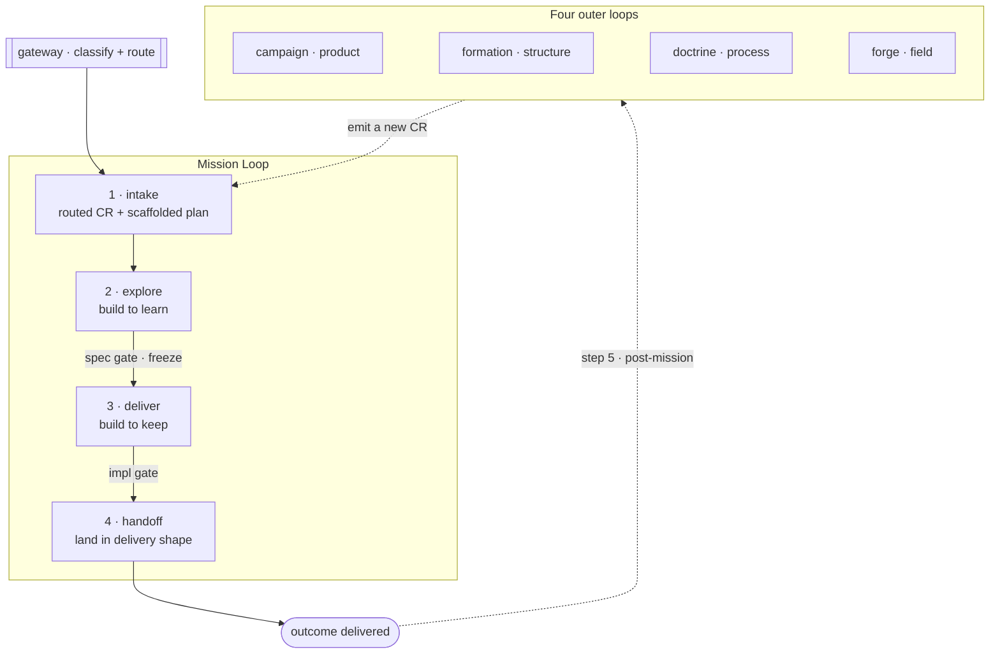

# The loop architecture

SDD has **one inner loop** — the **Mission Loop** — fed by exactly one intake, plus **four outer loops** that fire **post-mission** and can only re-enter as new CRs.
The vocabulary is load-bearing: a **cycle** is one full Mission-Loop pass (one CR carried to completion); **iteration** is the internal repeat *inside* a phase.
Never call this a "5-step loop" — the Mission Loop is **steps 1–4**, and step 5 (the outer loops) is **not part of the Mission Loop**.

The **freeze** at the spec gate is the explore→deliver boundary; the outer loops only ever re-enter as **new CRs** through the single intake (the dashed return edge).

## The Mission Loop — steps 1–4

The inner loop, sequenced by the conductor — the main session (`../mission/`; a spawned `automaton` in the headless fallback, `design/harness-spawning.md`).
A scheduler can pull one CR and run the loop to step 4 on its own.
The steps are **verbs** — actions taken — each producing a noun outcome.

| # | Phase | Home | Nature | Produces |
|---|---|---|---|---|
| 1 | **intake** | `../intake/` (feeds the loop) | the CR subsystem | a routed CR + a scaffolded plan |
| 2 | **explore** | `../authoring/` (invoked by the mission) | build to **learn** | a frozen spec + suite (+ learn-built impl) |
| 3 | **deliver** | `../mission/deliver/` | build to **keep** | a verified result |
| 4 | **handoff** | `../mission/handoff/` | landing | the project's delivery shape |

The mission **owns** deliver and handoff; it **invokes** `../authoring/` for explore; it is **fed** by `../intake/`.
The `../gateway/` routes a request into the loop but is **not a step**.

Each phase's mechanics live in its **home** — this file owns the topology, not the per-phase detail:

- **1 · intake** — CR sources, the escape hatch, and the plan scaffold → [`../intake/`](../intake/README.md).
- **2 · explore** — the grill, spikes, spec-producer ⇄ spec-judge iteration, the spec gate + freeze → [`../authoring/`](../authoring/README.md).
- **3 · deliver** — build against the frozen suite, impl-producer ⇄ cold impl-judge, the detail-adjustment report, the impl gate → [`../mission/deliver/`](../mission/deliver/README.md).
- **4 · handoff** — landing the verified result in the project-declared delivery shape → [`../mission/handoff/`](../mission/handoff/README.md).

> **The freeze is the boundary, not "code vs no code."** Implementation happens in **both** explore and deliver;
> explore builds to **learn** (discarded spikes, steering the contract), deliver builds to **keep**
> (against the frozen suite). The spec gate / freeze is the explore→deliver pivot.

## The four outer loops — post-mission (step 5)

Once a Mission cycle completes, the four outer loops may fire.
They are a **complete cover** of what a retrospective can decide needs to change, and each emits its findings as a **new CR** — so the outer loops are CR-generators that close the single-intake loop.
They are **not** part of the Mission Loop; nothing re-opens a closed cycle in place.

| Loop | Folder | Concern | Standing subject it evolves |
|---|---|---|---|
| **campaign** (product) | `../campaign/` | what the project delivers | the capability folders |
| **formation** (structure) | `../formation/` | how the corpus is organized | `../corpus/` |
| **doctrine** (process) | `../doctrine/` | how we work | `../design/` |
| **forge** (field) | `../forge/` | improve **SDD itself** from field corrections | end-user corrections across installations (**external** — no folder subject) |

The first three are **internal** (sourced from the project's own provenance — the combat log, the ledger, and the public trail, per `provenance-model.md`); **forge is external** — sourced from opt-in end-user corrections across installations, which is why it carries the **Consent** floor.
Only **explore** and **deliver** iterate **internally** (inside a single cycle); the outer loops fire **post-mission**, across cycles.

## Gates dissolved into the autonomy bar

There is no fixed approval station between phases.
Every write to spec/suite — the explore diff or a deliver in-flight adjustment — passes **one arbiter**: the autonomy self-clear-vs-escalate rubric (see `autonomy-rubric.md`).
The human decides *what to build* by raising the CR and reading the outcome/retro, not by gating each transition.
The only mandatory human escalations are the four-C hard floor (Clearance, Conflict resolution, Compatibility, Consent); the spec and impl verifications survive as the judge's backward face — the spec-judge applying the Oracle/Builder/Architect **lenses** and the impl-judge the Builder/Architect lenses (the spec-gate and impl-gate lens sets; see `specialists-and-squads.md`) — folded into `../authoring/` and `../mission/`, not as human checkpoints.

## Cross-cutting (not loop steps)

`design/` (the rules), `../corpus/` (spec-corpus tooling), `../plugin/` (SDD's plugin nature), and `../acceptance/` (the e2e suite deliver verifies against) are cross-cutting.
They are consumed by the loops but are not themselves steps.
