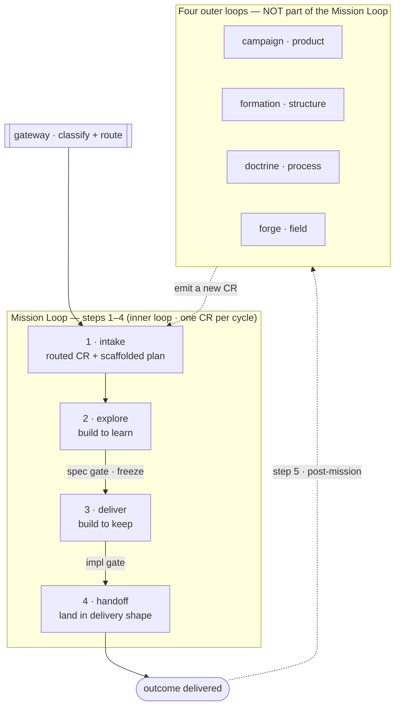

# The loop architecture

SDD has **one inner loop** — the **Mission Loop** — fed by exactly one intake, plus **four outer loops** that fire **post-mission** and can only re-enter as new CRs.
The vocabulary is load-bearing: a **cycle** is one full Mission-Loop pass (one CR carried to completion); **iteration** is the internal repeat *inside* a phase.
Never call this a "5-step loop" — the Mission Loop is **steps 1–4**, and step 5 (the outer loops) is **not part of the Mission Loop**.

The **freeze** at the spec gate is the explore→deliver boundary; the outer loops only ever re-enter as **new CRs** through the single intake (the dashed return edge).

## The Mission Loop — steps 1–4

The inner loop, sequenced by the conductor — the main session running the operator role (`../mission/`; a spawned `sdd-operator` in the headless fallback, `design/harness-spawning.md`).
A scheduler can pull one CR and run the loop to step 4 on its own.
The steps are **verbs** — actions taken — each producing a noun outcome.

| # | Phase | Home | Nature | Produces |
|---|---|---|---|---|
| 1 | **intake** | `../intake/` (feeds the loop) | the CR subsystem | a routed CR + a scaffolded plan |
| 2 | **explore** | `../authoring/` (invoked by the mission) | build to **learn** | a frozen spec + suite (+ learn-built impl) |
| 3 | **deliver** | `../mission/deliver/` | build to **keep** | a verified result |
| 4 | **handoff** | `../mission/handoff/` | landing | the project's delivery shape |

The mission **owns** deliver and handoff; it **invokes** `../authoring/` for explore; it is **fed** by `../intake/`.
The `../gateway/` routes a request into the loop but is **not a step**.

### 1 — intake

The only work-intake.
A CR arrives from a prompt, Asana, Jira, Linear, GitHub, or the local store (`../intake/`) and is routed to the capabilities it touches.
Nothing enters the system except as a CR.
Intake also **scaffolds the mission plan** (`.agents/plans/<cr-ref>.plan.md`) from a basic template — frontmatter `todos` plus a `## NEXT` anchor — so the plan exists from step 1; the **conductor** fills its `todos` (the execution task DAG) during explore. The plan is execution state, distinct from the per-unit **solution** (`spec-structure.md`).
This is the plan layer above the suite in the SDD stack (see `sdd-stack.md`); intake **feeds** the mission rather than living inside it.

### 2 — explore (build to learn)

Grill the **plan + spec + suite** into a concrete diff, building **to learn**: spikes (thrown away), spec-producer ⇄ spec-judge **iteration**, and **showing intermediate results to the user** to steer the spec + suite.
Explore also **builds the implementation to learn** — implementing surfaces what the contract is missing; it is **not** deferred wholesale to deliver (impl happens in **both** phases — the freeze, not "code vs no code," is the boundary; see the explore-vs-deliver note below).
By default a human drives explore **interactively in the main session** (the conductor runs `../authoring/` in-session, grilling live); unattended, the same capability runs autonomously (the headless fallback, `design/harness-spawning.md`).
There is **no mandatory human approval station**: the human is an escalation target the autonomy bar invokes.
The phase ends at the **spec gate**, where the `.feature` **freezes** — the boundary between explore and deliver.

### 3 — deliver (build to keep)

Build **to keep** against the **frozen** suite, with **iteration** between the impl-producer and the cold impl-judge.
The conductor serves in-flight expansion and minor fixes (not the human), recorded in a **detail-adjustment report** (a view of the mission **plan**'s mid-flight lines; see `provenance-model.md`).
`producer ≠ judge` survives the gate fold: the judge stays a distinct actor.
The human enters only on the hard floor.
The phase ends at the **impl gate**.

> **Explore vs deliver = the purpose of the build.** Implementation happens in **both**;
> explore builds to learn (discarded spikes, steering the contract), deliver builds to keep
> (against the frozen suite). The freeze is the boundary, not "code vs no code."

### 4 — handoff

Take step-3's verified result and land it in the **project-declared delivery shape**: commits broken down by unit of work to `main`; a branch pushed and a PR opened; a written chapter; etc. (`../mission/handoff/`).
Handoff is a verb like the other phases; the *outcome* is the noun it produces.

## The four outer loops — post-mission (step 5)

Once a Mission cycle completes, the four outer loops may fire.
They are a **complete cover** of what a retrospective can decide needs to change, and each emits its findings as a **new CR** — so the outer loops are CR-generators that close the single-intake loop.
They are **not** part of the Mission Loop; nothing re-opens a closed cycle in place.

| Loop | Folder | Concern | Standing subject it evolves |
|---|---|---|---|
| **campaign** (product) | `../campaign/` | what the project delivers | the capability folders |
| **formation** (structure) | `../formation/` | how the corpus is organized | `../corpus/` |
| **doctrine** (process) | `../doctrine/` | how we work | `../design/` |
| **forge** (field) | `../forge/` | improve **SDD itself** from field corrections | end-user corrections across installations (**external** — no folder subject) |

The first three are **internal** (sourced from the project's own provenance — the combat log, the ledger, and the public trail, per `provenance-model.md`); **forge is external** — sourced from opt-in end-user corrections across installations, which is why it carries the **Consent** floor.
Only **explore** and **deliver** iterate **internally** (inside a single cycle); the outer loops fire **post-mission**, across cycles.

## Gates dissolved into the autonomy bar

There is no fixed approval station between phases.
Every write to spec/suite — the explore diff or a deliver in-flight adjustment — passes **one arbiter**: the autonomy self-clear-vs-escalate rubric (see `autonomy-rubric.md`).
The human decides *what to build* by raising the CR and reading the outcome/retro, not by gating each transition.
The only mandatory human escalations are the four-C hard floor (Clearance, Conflict resolution, Compatibility, Consent); the spec and impl verifications survive as the judge's backward face — the spec-judge applying the Director/Builder/Architect **lenses** and the impl-judge the Builder/Architect lenses (the spec-gate and impl-gate lens sets; see `specialists-and-squads.md`) — folded into `../authoring/` and `../mission/`, not as human checkpoints.

## Cross-cutting (not loop steps)

`design/` (the rules), `../corpus/` (spec-corpus tooling), `../plugin/` (SDD's plugin nature), and `../acceptance/` (the e2e suite deliver verifies against) are cross-cutting.
They are consumed by the loops but are not themselves steps.
