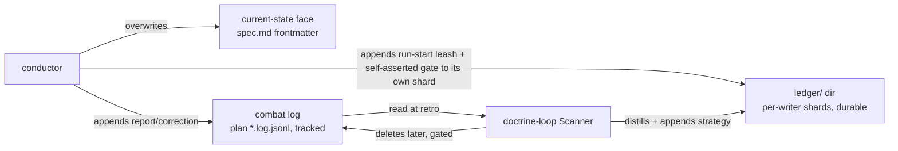

# Provenance model

The **shape** of production provenance.
Provenance spans **three tiers** by lifetime (below): a **tracked per-worktree plan** (transient in the tree, durable in git history), a durable **ledger**, and a durable **public** trail.
The durable record has **two faces** — a current-state face in `spec.md` frontmatter and the append-only **ledger**, a sibling `ledger/` directory of per-writer shard files.
This file owns the record shape, the entry shapes, the matchable `cause` enum, and write-ownership.
Recording *behavior* (when the conductor appends, how it resolves a producer) lives in `../mission/`; this is the shape only.

## Three provenance tiers

Provenance splits by **lifetime and audience** (rationale + the cross-harness survey: ADR-0015).
Mid-flight working detail is per-mission and committed with the work, then removed from the tree at retro (durable in git history); the durable record is sparse and outlives the CR.

| Tier | Home | Holds | Lifetime |
|---|---|---|---|
| **Private scratch — the plan** | `.agents/plans/<cr-ref>.plan.md` (brief) + `.agents/plans/<cr-ref>.log.jsonl` (**the combat log**) | grill analysis + task DAG + progress; the append-only `report` / `correction` lines + a **CR-scoped `seq`** | **transient in the tree, durable in history** — tracked, distilled then deleted at retro |
| **Durable internal — the ledger** | `ledger/` directory sibling to the **root** `spec.md`, holding one `<cr-ref>.<hash>.jsonl` shard per CR per writer | the conductor's run-start `leash` block, `gate` (verdict + `frozen[]`), and `strategy` (incl. the distilled recurrence) | durable |
| **Durable public — the trail** | the CR source conclusion + changesets + git history | what shipped, for the outer loops to read forward | durable, external |

**Naming (fleet metaphor).**
The mid-flight `*.log.jsonl` is the **combat log** — the blow-by-blow of the mission while it is fought.
The durable `ledger/` directory is the **ledger** — the sparse book of durable outcomes: the conductor **appends its run-start `leash` block and `gate`** lines to its own shard directly, and the doctrine loop **distills `strategy`** lines into its own shard from the combat log at retro.
"Combat log" always means the live per-mission log in the plan; "ledger" always means the durable sibling `ledger/` directory of the root `spec.md`.
They are never the same store.

**Why a directory of shards, not one file (ADR-0020).**
A single shared `ledger.jsonl` conflicts on every concurrent mission: two branches each append a line at end-of-file, so git sees overlapping EOF hunks and raises a merge conflict; worse, two sessions sharing **one working tree** (a fork) clobber the file with no git merge at all (last-writer-wins).
Sharding removes the shared path: each writer appends only to its **own** `<cr-ref>.<hash>.jsonl` shard, so no two writers ever touch the same file — conflicts and clobbers are **structurally impossible**, needing no merge driver. The reader **globs** `ledger/*.jsonl` (plus a legacy `ledger.jsonl` if present) and concatenates; the ledger is **one logical book, many physical shards**.

The shard name is `<cr-ref>.<hash>.jsonl` (Scanner strategy lines, often CR-less, shard as `strategy.<hash>.jsonl`). `<hash>` is **6 random hex minted once per writer-session** — random, **not** derived from a machine id, hostname, or user (deriving it would leak identity and violate the safe-to-publish floor). Same writer-session, same CR → same shard (append there); a different session or a different tree → a different hash → a different file, which is exactly what makes concurrent writes non-colliding.

The plan is also a **portable handoff artifact**: a self-contained Markdown brief, co-located with the worktree (not a home-dir session), readable by any agent or model that picks up the mission.
`<cr-ref>` is the source-qualified CR id (`github-34`, `asana-<gid>`, `local-<slug>`).
The `.agents/plans/` tree is **tracked** (committed with the work, kept in the PR — the `report`/`correction` trail is the decision + failure history reviewers want).
Concurrent missions never collide on it because each plan is keyed by `<cr-ref>` (source-qualified) and a CR is claimed by exactly one worktree at a time (the source-claim lock, `../intake/README.md`) — **not** because of gitignore.
`.agents/plans` is the real, tool-agnostic home; for Cursor interop the SDD `init` skill symlinks `.cursor/plans → .agents/plans` so a plan written by either tool is seen by both (setup + migration: `../plugin/README.md`).
The two faces below describe the **durable** record; the chatty mid-flight lines live in the plan.

### Plan frontmatter (Cursor-compatible)

`<cr-ref>.plan.md` opens with YAML frontmatter that **matches Cursor's plan schema** so the same file renders natively in Cursor's plan UI (the `.cursor/plans` symlink), plus two SDD fields.
Cursor ignores unknown keys, so the SDD additions are safe:

```yaml
---
name: <short plan title>                 # Cursor: the plan's display name
overview: <one-paragraph summary>        # Cursor: quote if it contains : or other YAML-special chars
cr: <cr-ref>                             # SDD: the source-qualified CR id (github-34, asana-<gid>, local-<slug>)
cr-url: <web URL of the CR>              # SDD: the CR's source link, so a reader opens it in one click
status: active                           # SDD: the mission's dispatch flag — active | approved (default active when absent)
todos:                                   # Cursor: the editable task list (the execution task DAG flattened to ordered todos; dependency = order, no edge field)
  - id: <kebab-id>
    content: <task description>
    status: pending                      # pending | in_progress | completed
isProject: false                         # Cursor: always false — SDD has no Cursor "project" plans
---
```

- **`cr` + `cr-url`** are the SDD extension.
  Always record **both**: `cr` is the matchable source-qualified id used for retirement (source-status query) and collision-free naming; `cr-url` is the human link (`github-<n>` → `https://github.com/<owner>/<repo>/issues/<n>`, `asana-<gid>` → the task URL, `local-<slug>` → omit or a local anchor).
  Anywhere the plan body or a conclusion references the CR, give the **URL** too, not just the ref.
- **`status`** is the SDD **mission dispatch flag** — a **top-level, plan-scoped** enum, the go-signal the headless dispatch loop selects on:
  - `active` — the default (and the meaning of an **absent** `status`): the mission is in-progress or not-yet-cleared; the automaton does not pick it up on its own.
  - `approved` — a human has **reviewed the brief** (todos, `## NEXT`, the run-level leash) and **cleared it for headless dispatch**; the gateway's `dispatch` loop runs `approved` briefs first, one at a time (`../gateway/dispatch/README.md`).

  The write is owned by `../mission/checkpoint/` (a human clearing the mission, e.g. `pause-mission --approve`); `discover-plans` **reports** it and `dispatch` **selects** on it, but neither sets it. It is **independent of the run-level leash**: `status: approved` says *run this mission*; the run-level `leash` block says *how far the automaton may self-assert on its own* — a tight leash simply makes an approved mission stop at its first gate and relay, which is safe.

  **Three distinct `status` fields, three scopes — do not conflate:** this **plan-level `status`** (`active | approved`, the *mission's* dispatch flag); each **todo's `status`** (`pending | in_progress | completed`, nested under a todo, a *task's* progress); and **`spec.md`'s `status`** (`draft | approved | implemented`, the *contract's* lifecycle, `lifecycle-model.md`). They share a word, not a scope; Cursor ignores the plan-level key, so the addition is safe.
- **`name` / `overview` / `todos` / `isProject`** are Cursor's own fields — populate them as Cursor does so the plan stays first-class in both tools.
- **The `todos` block is the execution task DAG** — flattened to an ordered list, dependency expressed as **order**, not a per-todo edge field. The **conductor** fills it during explore (execution planning) into the single `.plan.md` that **intake scaffolded** at step 1 from a basic template (frontmatter `todos` + a `## NEXT` anchor; `../intake/README.md`). The `.plan.md` carries **execution state only** — todos, working method, `## NEXT`, the combat log.
- **The solution (the old `plan.md`) is NOT here.** The per-CR functional spec was once folded into this file; it is now a **separate, durable, per-unit artifact** — `<unit>.solution.md`, beside the unit's spec and suite (`../design/spec-structure.md`). Folding durable design rationale into a retro-deleted file lost it; the split keys on scope and lifetime — **solution = per-unit + durable; task DAG = per-CR + transient**.

## Two faces, two homes

| Face | Home | Shape | Mutability | Holds |
|---|---|---|---|---|
| **Current-state** | `spec.md` frontmatter | `produced-by` (map by role) + `approval` (map by gate: `verdict` + `why`) | **overwritten** — last write wins | the authoritative *present*: who produced each artifact, and the **standing** verdict per gate (the latest CR's outcome) |
| **Ledger** | sibling `ledger/` dir — one `<cr-ref>.<hash>.jsonl` shard per CR per writer | one JSON object per line, appended to the writer's **own** shard | **immutable** — lines appended, never edited or removed | the durable *history*: every CR's run-start `leash` block + `gate` verdict + `strategy` (mid-flight detail lives in the plan) |

The current-state face answers *"who produced this, and what is the verdict now?"*
The ledger answers *"what was decided to get here?"*
They do not duplicate: a gate rejection overwrites nothing in `approval` (the eventual `approve` stands there), but the rejection is preserved forever as a `gate` line (`verdict: reject`) in the ledger.
This is the load-bearing reason the ledger exists — current-state alone loses every superseded verdict.
(The mid-flight `correction` that drove a rejection lives in the tracked plan — transient in the tree, durable in history — not here.)

**`approval` is standing, not historical.** The project has **one durable spec** that many CRs flow through; `spec.md` `approval` holds only the **latest** CR's gate verdict (overwritten each time), answering *"is the contract cleared right now, and who last ratified?"*
The **durable per-CR record** — *"CR #34's diff was approved by X, why Y"* — lives in the ledger as a `gate` line (below), keyed by `cr`.
The same two-face split that separates `produced-by` (standing) from `report` (historical) separates `approval` (standing) from `gate` (historical).
There is **no per-CR `approval` block** in frontmatter and no separate per-CR sidecar file.

**Every ledger line carries an optional `cr`.**
Because the one project ledger spans many change requests against the one durable spec, each entry tags the CR it belongs to (`"cr": 34`) so a reader groups a mission's lines across shards without the transcript.
Outer-loop `strategy` lines (cross-CR by nature) may omit it.

**The ledger is operational provenance, not contract.**
The `ledger/` shards are **never frozen and never gated**: writers keep appending across the whole lifecycle, including while `spec.md` and the `.feature` are frozen at `approved`.
The freeze and the gates govern the contract (`spec.md` + the `.feature`) only.

Write flow: the conductor **overwrites** the current-state face in `spec.md`, **appends** mid-flight `report` / `correction` / `halt` lines to the **combat log** (the plan's `*.log.jsonl`), and **appends** its run-start `leash` block and self-asserted `gate` lines to its **own shard** in the durable `ledger/`.
These mid-flight lines are **flushed to the committed `*.log.jsonl` during the mission, not at the end** — the doctrine loop reads the committed log **post-merge** (the session and its transcripts may be gone, possibly on another machine), so an unflushed line is a lost line.
At retro the doctrine-loop Scanner reads the concluded combat log, **distills** recurring causes, and **appends** `strategy` lines to the ledger.
**Deletion is decoupled from distill** (Plan retirement, below): the distill fires at `→ implemented`; the **tracked deletion** of the plan is a separate, later retro step, gated on source = `done`/merged **and** distilled.



## Current-state face — `produced-by` (+ `approval`)

`produced-by` records **which producer made each spec artifact**, in frontmatter, **always** — not only when two plugins contend.
Together with `approval` (the judging twin) it gives full per-artifact provenance: who **produced** it and who **judged** it.

| Field | Records | Keyed by | Written by |
|---|---|---|---|
| `produced-by` | who **made** each artifact | production role (`spec-producer`, `solution-producer`, `impl-producer`) | conductor, at production |
| `approval` | who **judged** each gate (`verdict` + `by` + `why`) | gate (`spec`, `impl`) | conductor (self-assert) / skill (ratify) |

Each `produced-by` value is the **plugin-qualified agent name** (`aced:aced-scenario-writer`, `quill:quill-doc-writer`, or `sdd:automaton` when SDD's own default chain produced it — the in-session conductor for an inline spec/solution-producer, or its spawned builder for the impl-producer; see `specialists-and-squads.md`).
Recorded **always**, on every production.
It plays two deliberately separated roles:

- a **historical record** — immutable provenance ("`X` produced this `.feature`"), the data ACED needs to measure result quality and trace a bad artifact to its producer;
- a **resume cache** — on a later run the conductor reuses the recorded producer if its plugin is still installed, so resume is decisive without re-asking.

```yaml
status: approved
produced-by:
  spec-producer: aced:aced-scenario-writer
  solution-producer: sdd:automaton
  impl-producer: sdd:automaton
approval:
  spec:
    verdict: approve
    by: unional
```

**Provenance is historical; resolution is live.**
"`X` produced this" stays true forever, even after `X` is uninstalled — never rewrite or erase it on the basis of current availability; annotate `[unavailable]` rather than drop it.
The registry (`.agents/universal-plugin.json`) is the source of truth for **who acts next**; `produced-by` is a **cache**, never an authority.

**The contested-type choice stays distinct from `produced-by`.**
The contested-type → chosen-plugin disambiguation is the forward-input choice for an ambiguous artifact-type (which plugin to resolve), recorded as `.agents/sdd/` resolution state; `produced-by` is the after-the-fact record of who actually produced each artifact.
Conflating the two was the original `sdd-plugin` impl-gate blocker; they are not the same record.

### Availability degrades; structural validity fails closed

The "never blocks" invariant is scoped to **availability**:

- **Availability** — a recorded producer whose plugin is **gone** is still valid history: it is **flagged** (`[unavailable]`), not blocked; live resolution re-resolves a new producer for the new production.
- **Structural validity** — fails **closed**: a **malformed** `produced-by` entry (not a well-formed plugin-qualified name) is not valid provenance and **blocks**; a role with **no resolvable producer** (not even an SDD default) **blocks**; an off-enum or absent `cause` (below) **blocks**.
  The consistent rule: **availability degrades gracefully (flag-not-block); structural validity fails closed (block)**.

## Entry shapes — across the plan and the ledger

One JSON object per line (JSON Lines).
Every line carries a **CR-scoped `seq`** (append order *within its shard* — restarting per shard, never a global counter), an optional pseudonymous **`handle`**, and a `kind`. **Combat-log** lines additionally carry a **write-time UTC `ts`**; **ledger** lines carry **no wall-clock time** (see below).
Six kinds, split by tier: **`report`**, **`correction`**, and **`halt`** are mid-flight → the **combat log** (the plan's `*.log.jsonl`); the conductor's run-start **`leash`** block, **`gate`**, and **`strategy`** are durable → the slim `ledger/` shards.

`seq` needs no cross-writer coordination: it is simply each shard's own line count, and each shard has exactly one writer, so two concurrent missions writing different shards can never mint a conflicting `(shard, seq)`.
The sharded storage makes concurrent appends **non-colliding by construction** — a merge driver is **not** used and none is needed; there is no shared `ledger.jsonl` for two branches (or two same-tree sessions) to contend over.
Concurrent-append reconciliation therefore never arises and **never** reaches the hard floor (which is for semantic frozen-scenario conflicts, not log storage).

**Safe-to-publish-by-construction floor (committed-record rule).**
The combat log is **committed**, so every line is **published to git history permanently** — the "deleted at retro" step removes it from the *tree*, never from history — and a distilled line may be carried **upstream by the Forge loop** (`../forge/README.md`).
Treat every field as forever-public; the floor binds **all** fields, not only free text:

- **Categorical only.** Structured fields are enums (`role` / `agent` / `outcome` / `correction-kind` / `cause`); counts are counts-of-classes; the free-text `summary` / `detail` describe the **decision or its class**, commit-message-grade.
- **Never in the committed record:** email, OS usernames, hostnames, absolute paths, session/machine ids, secrets, code, prompts, literal values, and **raw numbers** (token/cost). Those stay in the uncommitted raw `.jsonl` transcripts (read only for the pre-merge token-waste pass).
- **Identity is a pseudonym** (`handle`, below), never `user.email`.

The floor is **structural** — enforced by `combat-log-governance`; no redaction pipeline is needed for the committed record (the Forge loop redacts again before any cross-installation send).

**Write-time `ts` — combat-log lines only.**
Combat-log lines (`report` / `correction` / `halt`) carry a UTC `ts` (ISO-8601, second granularity) stamped **at write-time** — the session clock is the only place wall-clock is knowable, and the doctrine loop reads the committed combat log **post-merge, possibly on another machine** (the session is gone). Within a mission, `ts` orders those lines and feeds the **pre-merge coarse-duration** signal the efficiency dimension reads from the raw transcripts (`../doctrine/README.md`).
**Ledger lines (`leash` / `gate` / `strategy`) carry no `ts`.** They are the forever-public durable record; a wall-clock timestamp on a committed, cross-machine-read artifact leaks activity timing and timezone for no load-bearing gain — nothing reads ledger `ts`, ordering *within* a shard is `seq`, and the cross-mission timeline is git commit history. A machine-invariant *duration/effort* signal (engagement count, not wall-clock — wall-clock duration varies per machine) is a **separate coarse-categorical field**, deferred until the Scanner consumes it (so we never persist a field nothing reads).
(Legacy ledger lines written before ADR-0020 carry a `ts` and are grandfathered — append-only, never rewritten.)

**Identity — the per-entry `handle` (pseudonymous).**
Mid-flight lines (`report` / `correction`) and `strategy` carry a `handle`: the writer's pseudonym.
A `gate` line keeps `by` (the *ratifier* — a human name or `agent`), unchanged.
Resolution, at write-time:

- `SDD_HANDLE` (env) — if set, it is the `handle`.
- **unset** → omit `handle`; attribution falls back to the **git commit author** git records natively. SDD does **not** read `git config` — a committed line is already authored by its commit, so the inline handle is an optional override, not a required field.
- **never** `user.email`.

The in-file `handle` / `by` is **advisory, not proof**: a self-asserting automaton can write any string, so the doctrine loop never treats it as cryptographic evidence of a human act — the positional-authority rule plus the **git commit signature** are the control.

### `report` — per-subagent dispatch (plan, tracked)

One line appended **to the plan** per production-chain dispatch, so a later reader (or a handed-off agent) reconstructs what each delegate did without the transcript.
Removed with the plan at retro (a tracked deletion).

```jsonl
{"seq": 3, "ts": "2026-06-28T18:30:11Z", "handle": "unional", "kind": "report", "role": "spec-producer", "agent": "sdd:automaton", "outcome": "pass", "summary": "wrote 14 scenarios covering the ledger expansion"}
```

`role` is the production role dispatched; `agent` is the plugin-qualified agent name; `outcome` is `pass | fail`.

### `correction` — correction-with-cause (plan, tracked)

The hard requirement.
One line **in the plan** per correction: a gate rejection, a producer⇄judge iteration, or a Council kick-back.
The matchable `cause` is the **load-bearing field**.
Raw `correction` lines are transient in the tree (committed, then removed with the plan at retro); at retro the **doctrine loop** reads them and folds recurring `cause`s into the durable `strategy` line's running count (`../doctrine/README.md`).
Cross-mission recurrence is therefore tracked by the *distilled* count, not by scanning many specs' raw logs.

```jsonl
{"seq": 7, "ts": "2026-06-28T18:41:02Z", "handle": "unional", "kind": "correction", "correction-kind": "gate-reject", "cause": "coverage-gap", "detail": "spec gate rejected — no negative scenario for the malformed-entry path"}
```

- **`correction-kind`** — the closed set `gate-reject | judge-iteration | council-kickback`.
  This names the *occasion* of a correction, not its cause; do not conflate the two.
- **`cause`** — a **minimal, discovered enum**.
  The matchable category of *why* a correction happened, not free text.
  Three are grounded so far:

  | Cause | Means | Grounded in |
  |---|---|---|
  | `coverage-gap` | a use case or operation lacked a covering scenario | a gate rejection for a missing scenario was observed |
  | `design-overreach` | the design added a mechanism the architecture did not need (e.g. an unnecessary sentinel / path) | a Council rejection of a design that introduced a superfluous sentinel |
  | `spec-feature-contradiction` | the `spec.md` body and the `.feature` asserted contradictory behavior | a judge-iteration where the spec narrative and a scenario disagreed (sdd-warden) |

**Growth principle.**
The enum is **closed at any point in time** but **discovered from usage, not designed up front**: a new value is **added** only when a real, recurring correction has no existing category.
Fewer is better — speculative categories are not seeded.
Two growers: the **doctrine-loop Scanner's** recurring-pattern detection, and the opt-in **Forge loop** (`sdd-forge-loop`) collecting real corrections from plugin usage.

**Efficiency is a categorical class, discovered like the rest.**
The committed log is designed to carry a **coarse** efficiency signal — the conductor flagging notable token-waste as a `correction` (a class, **never raw counts**) — so the post-merge doctrine loop keeps the efficiency dimension without transcripts (`../doctrine/README.md`).
Its concrete `correction-kind` / `cause` are **not seeded**: they enter on first real recurrence by the same Council-ratified growth, and the numeric token-cost depth stays **transcript-only / pre-merge** — consistent with the safe-to-publish floor, no raw number ever enters the log.

**Who edits the enum.**
A grower *proposes* a value; **adding it is an edit to `combat-log-governance`, ratified by the Council** (a producer/judge/conductor never edits the enum on its own).
Until ratified, an off-enum `cause` still fails closed.

A `cause` value that is **absent or off-enum** is a **structural error** (it breaks cross-mission matchability), not valid provenance, and **fails closed**.

### `halt` — a mid-flight stop (plan, tracked)

A stop that is **not** at a gate: the agent halts mid-phase — a hard floor reached, an input it cannot supply, a blast radius it will not cross on its own.
The gate-time stop is a `gate` line (`verdict: pause`, in the ledger); this `halt` line is its **mid-flight twin**, so *"why I halted"* is recorded as durably as *"why I went"* — read at retro like any combat-log line, never lost when the session ends.

```jsonl
{"seq": 5, "ts": "2026-06-28T18:50:33Z", "handle": "unional", "kind": "halt", "phase": "explore", "why": {"floor": "clearance", "blast": "high — would drop scenarios from a frozen suite", "novelty": "low", "confidence": "high"}}
```

- **`phase`** — `intake | explore | deliver | handoff`, where the mission stopped.
- **`why`** — the **same categorical block** the `approval` map carries (`floor` / `blast` / `novelty` / `confidence`; `lifecycle-model.md`), **classes only** (safe-to-publish) — never the raw blocker content.

A gate-time `pause` stays a `gate` line; `halt` covers only the **non-gate** stop, filling the gap so a mid-flight stop is as accountable — and as recoverable — as a gate verdict.

### `gate` — the durable per-CR gate verdict

The durable record of *"this CR's diff was approved (or paused/rejected) at this gate."*
One line per gate verdict per CR — the immutable twin of the standing `approval` block in `spec.md` frontmatter.
Where `approval` is overwritten by the next CR, the `gate` line preserves every CR's verdict forever, keyed by `cr`.

```jsonl
{"seq": 2, "kind": "gate", "cr": 34, "gate": "spec", "verdict": "approve", "by": "unional", "cause": "dimension", "frozen": ["intake/intake.feature", "mission/mission.feature"]}
```

- **`gate`** — `spec | impl`, the gate this verdict closes.
- **`verdict`** — `approve | pause | reject`, mirroring the `approval` enum.
- **`by`** — the ratifier: a human name (ratified) or `agent` (self-asserted, provisional).
  A self-assertion additionally carries the `why` derivation, same as the frontmatter block; a human ratification needs none.
- **`cause`** — `dimension | ceiling`: what drove the verdict (a gradient dimension, or the human ceiling cap), mirroring the `approval` entry's `cause` (`lifecycle-model.md`).
  This is the **stop cause** — distinct from a `correction` line's matchable `cause` enum.
- **`frozen`** — the suite files this verdict **froze** (spec-gate `approve` only): the per-file freeze record.
  Freeze is a per-file `@frozen` tag on each `.feature` (see `lifecycle-model.md`); this list records *which* files the CR froze, so the ledger answers *"what was frozen as of CR #34"* standalone — no git walk.
  This is a **local** durable record (the gate's, per G); it is **not** what the Forge loop reads — Forge consumes the distilled `correction`-with-`cause`, not `frozen[]` (`../forge/README.md`).

The `gate` line is the **load-bearing answer to G**: with no per-folder `status`/`approval`, the durable "CR approved + scenarios frozen" record is this ledger entry, not a sidecar and not a growing frontmatter block.

### `leash` — the conductor's run-start autonomy block (ledger, durable)

The durable record of the run's **initial strategy evaluation**: the conductor's autonomy bar for the mission, written once at run start (before exploration). It carries the run-level `leash` reach and the `approach[]` containment methods; it is **not** the Scanner's `strategy` and is **never** counted as pending strategy (it has no `ratified` field).

```jsonl
{"seq": 1, "kind": "leash", "cr": "disambiguate-strategy-kind", "leash": "auto-spec", "by": "user", "blast": "medium", "approach": ["no-spike", "worktree"]}
```

- **`leash`** — the run-level reach: `auto-none | auto-spec | auto-all` (`lifecycle-model.md`).
- **`by`** — `derived` (the conductor assessed it) or `user` (user-specified).
- **`blast`** — the assessed blast radius that set the reach.
- **`approach[]`** — the containment methods (`no-spike`, `mocks`, `worktree`, …).
- The ceiling is **not** recorded (session-local). The conductor writes this block; it never writes `strategy` (the Scanner's alone). Pre-rename historical run-start blocks appear as `kind: strategy` and are grandfathered (append-only ledger).

### `strategy` — the slot this contract shapes but does not write (ledger, durable)

The Scanner records drafted strategy to the durable ledger.
This contract defines the **shape** of that line; the **write is owned by the doctrine-loop Scanner**, not by any provenance writer.
The `strategy` line also carries the **distilled recurrence count** for a `cause` (in `evidence`), maintained across missions because the raw `correction` lines that fed it are removed with each plan at retro.

```jsonl
{"seq": 1, "handle": "sdd-scanner", "kind": "strategy", "recommendation": "codify the coverage-gap pattern as a spec-format-governance check", "evidence": ["coverage-gap x3 across sdd-foo, sdd-bar, sdd-baz"], "ratified": false}
```

`evidence` lists the corrections that drove the recommendation; `ratified: false` means the Council holds keep-or-cut — unratified strategy never enters the corpus.

## The detail-adjustment report — a view of the plan

During implement-and-verify, the conductor serves expansion and minor fixes in-flight (not the human), recorded in a **detail-adjustment report** — a *view of the plan's `report` and `correction` lines*, not a separate journal. The human enters only on the hard floor (`autonomy-rubric.md`).
Live current-state is regenerated on demand; the durable record is the ledger.

## Write ownership

The mid-flight `report` / `correction` lines are appended to the **plan** (`*.log.jsonl`); the durable `leash` / `gate` / `strategy` lines are appended to the writer's **own shard** in the **ledger** (`ledger/<cr-ref>.<hash>.jsonl`).
No writer touches the ledger through `spec.md` frontmatter, and no writer appends to another writer's shard.
Both are append-only: lines are added with the next `seq` **within the writer's own shard**, never edited or deleted.

| Writer | May append | To | Never writes |
|---|---|---|---|
| **conductor** | `report`, `correction`, `halt` | the **plan** | strategy lines; human-ratified `gate` lines |
| **conductor** | **self-asserted `gate`** (`by: agent`, same boundary as `produced-by` / a self-asserted `approval`) | the **ledger** | human-ratified `gate` lines |
| **conductor** | run-start **`leash`** block (leash reach + `approach[]`, at run start) | the **ledger** | `strategy` lines |
| **gate skill (`spec-gate`), in-session** | **human-ratified `gate`** (`by: <name>`) | the **ledger** | report / correction / strategy lines |
| **doctrine-loop Scanner** | `strategy` (incl. distilled recurrence) | the **ledger** | report / correction / gate lines |
| **producers / judges** | nothing | — | the entire record — they do not know their own registry identity authoritatively |

A human-ratified `gate` line follows the **positional authority** rule (`lifecycle-model.md`): only the in-session position holding the real user channel writes `by: <name>`. By default the conductor *is* that position (main session), so it writes the ratification directly; a **headless spawned automaton** has no user channel and writes only `by: agent` self-assertions, emitting a verdict packet on a human gate.

## Readers split by path

| Reader | Reads | Never reads |
|---|---|---|
| `sdd` gateway (status scan) | `spec.md` frontmatter — `status` field only | the ledger or the plan |
| doctrine-loop Scanner | the concluded **plan** (`*.log.jsonl`, at retro) + the durable ledger | `spec.md` frontmatter |

The gateway performs a **status-only scan**.
The Scanner reads the concluded plan to distill recurrence and drafts `strategy` into the durable ledger; the plan itself is deleted later (a tracked deletion, gated — see Plan retirement).
Forge reads the distilled `correction`-with-`cause` from the ledger; campaign / formation read the durable **public** trail (CR source + changesets + git), **not** the plan (`../campaign/README.md`, `../formation/README.md`).

## Spec-folder shape

| File | Role | Frozen? | Gated? |
|---|---|---|---|
| `spec.md` | contract prose + standing current-state frontmatter | **never** (kept aligned) | yes |
| `<name>.feature` | contract scenarios | **per file**, via its own `@frozen` tag, set on a spec-gate `approve` that touched it (see `lifecycle-model.md`) | yes |
| `ledger/` (root sibling dir) | durable ledger — `leash` + `gate` + `strategy` only, one `<cr-ref>.<hash>.jsonl` shard per CR per writer (append-only; conflict-free by construction, no merge driver) | **never** | **never** |

The mid-flight **plan** (`.agents/plans/<cr-ref>.plan.md` + `.log.jsonl`) is **not** part of the spec folder: it is **tracked** per-worktree scratch (committed with the work, kept in the PR), removed from the tree at retro once distilled and its source is done/merged (ADR-0015).

Freeze is **per suite file**, not a single project-wide baseline: each `.feature` carries its own `@frozen` tag.
The standing `approval` in `spec.md` says the contract was last cleared; the set of `@frozen` files says *which* scenarios are currently the frozen contract; the `gate` ledger lines say *which CR* froze each.

## Plan retirement — distill early, delete late

The committed plan is **retired** in two decoupled acts, both owned by the **doctrine loop**:

- **Distill (early).**
  At `→ implemented` (before the PR exists), the Scanner reads the concluded combat log and distills recurring `cause`s into the ledger's `strategy` lines.
- **Delete (late).**
  The plan files (`<cr-ref>.plan.md` + `<cr-ref>.log.jsonl`) are removed from the tree as a **tracked deletion** — git history preserves them — only when **both** hold: the source is `done`/merged **and** the plan has been distilled.
  Never delete an un-distilled plan (the retro never ran).
  Deletion runs as doctrine's **last retro step**, after the distill writes to the ledger.
  The act is idempotent: a missing plan or an open CR is a no-op, so the retirement sweep is safe to re-run.

The provenance gain over the old gitignore model: history shows exactly **when** a plan was distilled and dropped, and reviewers keep the decision + failure trail in the PR.
