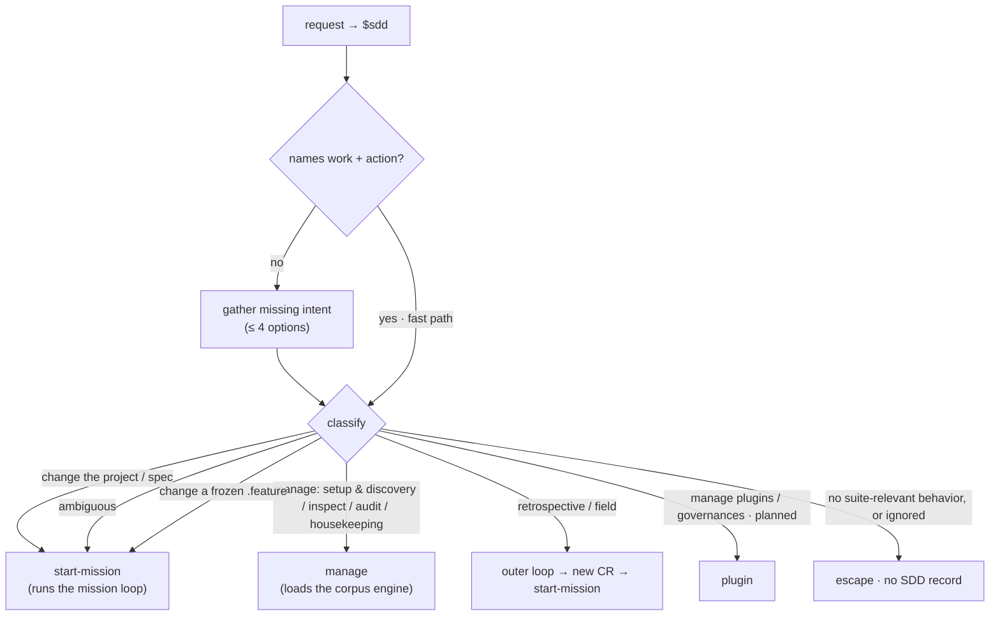

# gateway/ — the universal front door (the `sdd` skill)

The front door to the project, and the clearest case of **not part of any loop**. The gateway
**classifies** — activate SDD, gather missing intent, work out what the user wants to do to the
project — and then **loads the handling skill in-session**, where the session works the task
directly. It is a **thin classifier**: it holds no production logic, loads no governance, and writes
no contract state. It does not edit project files, register hooks, install packages, or require a CLI.

For an attended session the gateway **spawns nothing**: it loads the matched skill (for a change to
the project, `start-mission`) in the **main session** and the work proceeds there. The session itself
is the **conductor** — the user in the driver's seat. The only thing the gateway ever spawns is the
**automaton**: the headless driver, summoned when there is **no user channel** (an unattended
scheduler or a multi-CR fan-out).

> **This is a single behavioral unit, not an overview** — the gateway is one skill (`sdd`). This
> spec owns the **behavior + suite** ([`gateway.feature`](./gateway.feature)); the impl is the
> thin-classifier `sdd` skill in `plugins/sdd/skills/sdd/`.

## Use Cases

**Subject** — the gateway: classify a request (activate SDD, gather missing intent, classify) and
**load the handling skill in the current session**, so the session works it directly — a thin
classifier holding no production logic.

**Non-goals** — it holds **no** production logic, edits no project files, registers no hooks,
installs nothing, requires no CLI; it **never drafts or ratifies** strategy (only surfaces the
pending count) and **never resumes or retires** a mission (only surfaces the resumable briefs); and
it writes **no** `status` / `approval` (the gate / conductor own those).

Every scenario in [`gateway.feature`](./gateway.feature) maps to one of these behaviors:

| Behavior | What it covers |
|---|---|
| **activate** | `$sdd` / "use SDD" explicitly activates the gateway |
| **gather missing intent** | a bare invocation gathers intent before loading any skill; it does not begin work until the route is known |
| **fast path** | an invocation naming both work and action loads the handling skill directly, no menu — including concrete utterances ("add a start-mission skill to sdd", "work on <issue url>") |
| **partial intake** | a partially-specified request resolves what it can and asks only for the missing piece, within the four-option rule |
| **load the skill in-session** | a resolved route loads the matched skill in the **current session** and works directly — the gateway spawns nothing |
| **change → start-mission** | a request to change the project / spec loads `start-mission` in-session |
| **the four-option rule** | an intake question presents at most four options, never truncating silently |
| **two-level menu** | a bare invocation conducts intake as a two-level menu (never a flat list) whose top level presents **exactly four** options |
| **write-ownership guard** | a routed change writes no `status` / `approval` — the gateway writes no contract state |
| **thin-classifier guard** | classifying loads no governance and holds no production logic, only loading the matched skill |
| **surface pending strategy** | on Council re-entry, surface the count of unratified `strategy` lines globbed from the root `ledger/` shards as an entry point — never draft or ratify |
| **surface in-progress missions** | on re-entry, surface the resumable mission plan briefs (via the `discover-plans` engine) as a resume entry point — never resume or retire |
| **status scan (help me choose)** | on a "help me choose" request, scan the project's spec statuses via the `discover-specs` engine to surface the most-actionable spec — reads frontmatter only, never a spec body |
| **no spec found offers spec anchors** | when `discover-specs` finds no spec for a target project, offer `manage-spec-anchors` alongside `backfill-project-spec` — a missing spec may mean never scaffolded, or scaffolded off-convention and needing an anchor |
| **headless → automaton** | with no user channel, the gateway spawns the **automaton** (the headless driver) instead of working in-session |
| **dispatch the approved queue** | a "run the approved missions" request (or an unattended trigger) enters the **dispatch** loop (`./dispatch/README.md`) — run each `approved` brief headless in a fresh automaton, sequentially |
| **ambiguity routes into a mission** | a request that may touch behavior but names no skill loads `start-mission` so the grill decides |
| **escape** | a non-CR (no suite-relevant behavior, or an ignored touched artifact) proceeds outside the lifecycle, leaving no SDD record |
| **freeze** | a request to change a frozen `.feature` loads `start-mission` to re-open it through the grill, never an in-place edit |

## Intake

Treat `$sdd`, "use SDD", and "use Spec-Driven Development" as explicit activation. **Most**
requests that activate the gateway are CRs (see `../intake/README.md`); classification decides
which source carried it and which skill handles it. A **task that is not a CR** — no
suite-relevant behavior — **escapes** (the task-vs-CR boundary, below); recognition is the grill,
not an up-front classifier, so ambiguity is routed in and decided during explore.

- **Fast path.** When the invocation already names enough to act — a change and a target
  ("add a start-mission skill to sdd", "work on <issue url>"), or a self-evidently classifiable
  request — skip the menu and load the handling skill directly. A **partially-specified** request
  resolves what it can and asks only for the missing piece, within the four-option rule.
- **Gather missing intent.** When the request is bare, do not guess; conduct intake as a **two-level
  menu** (never a flat list) whose top level presents **exactly four** options, to recover the
  missing piece (the work, or the action), then classify.
- **Surface pending strategy.** When the Council re-enters, surface the count of pending
  (unratified) `strategy` lines globbed from the project's **root `ledger/` shards** (the durable
  sibling of the root `spec.md`) — the doctrine loop's keep-or-cut — as an entry point. The gateway
  only *surfaces* the count: it never drafts strategy (the Scanner's job) nor ratifies it (the
  Council's positional act). A zero count is not surfaced. Only `kind: strategy` lines with
  `ratified: false` are counted — the conductor's `kind: leash` run-start blocks are **not** strategy
  and never counted. (`strategy` lives in the durable `ledger/` shards, never in the
  per-mission `*.log.jsonl` combat log — `../common-governances/combat-log/`.)
- **Surface in-progress missions.** On re-entry, surface the **resumable missions** — the plan
  briefs under `.agents/plans` — as a resume entry point, via the **`discover-plans`** engine
  (`../intake/plan-discovery/`). A present `*.plan.md` is an unretired mission (retirement deletes
  the brief), so each one the engine lists is resumable; the gateway shows the CR ref, its todo
  tally, and the `## NEXT` lead so the user can pick one up via `resume-mission`. The gateway only
  *surfaces*: it never **resumes** (that loads `resume-mission`) nor **retires** (the doctrine
  loop's `plan-retirement`). An empty set is not surfaced. This is the **resumable-mission** sibling
  of surface-pending-strategy — two distinct concerns: pending strategy is the doctrine loop's
  unratified ledger lines for the Council; in-progress missions are paused work to continue.
- **Status scan (help me choose).** When the user asks the gateway to help choose the
  most-actionable spec, scan the project's spec **statuses** via the **`discover-specs`** engine
  (`../corpus/discovery/`) and surface them. The scan reads each spec's **frontmatter only** —
  never a spec body. The gateway only *surfaces* the statuses as an entry point; it routes the
  chosen target onward (a change loads `start-mission`), it does not itself work the spec.
- **No spec found offers spec anchors.** When `discover-specs` finds **no** spec for a target
  project, do not assume the project was simply never scaffolded — its spec may sit off the three
  fixed conventions and need a declared **extra anchor**. Offer **`manage-spec-anchors`**
  (`./manage/README.md`, curate `.agents/sdd/spec-anchors.toml`) alongside `backfill-project-spec`
  as entry points, rather than routing straight to backfill.
- **Never ask more than four options (hard rule).** A single `AskUserQuestion` carries at most four
  options — the intake tool rejects more than four (`too_big, maximum 4`). When a derived list would
  exceed four, present only the most-actionable few (≤ 4) or ask the user to name the target
  directly; never enumerate into an over-four question and never truncate silently.

## The routing table is the user-skill→capability index

Classification routes a request to the **skill** that handles it. The capabilities are the SDD
project's screaming-architecture folders, so the routing table doubles as the index of what a user
can invoke. No separate `skills.md` is needed.

Almost every change to the project is **one entry — `start-mission`** — which runs the mission loop
(the CR workflow) over the one durable project spec; whether the CR adds a capability, revises
behavior, or reconciles overlap is decided during its **explore** phase, not by a separate entry
skill. Ambiguity routes **into** a mission (the grill decides during explore); a frozen `.feature`
is re-opened through a mission, never edited in place.

| User intent | Skill (handler) |
|---|---|
| Make any change to the project / spec (add, revise, implement, land) | **`start-mission`** — opens a CR against the project spec and runs the mission loop |
| Manage the corpus — setup & discovery, inspect, audit, or housekeeping (non-mission) | **`manage`** (`./manage/README.md`) — the manage dispatcher; loads the matching corpus engine in-session |
| A task with no suite-relevant behavior, or confined to an ignored surface (not a CR) | **escape** — proceeds outside the lifecycle, leaves no SDD record |
| Product / structure / process retrospective, or field corrections | the **campaign / formation / doctrine / forge** loop — emits a new CR (→ `start-mission`) |
| Manage domain plugins (install / list / remove), author a governance, or register to the marketplace | the **plugin** capability (`../plugin/README.md`) — *planned, deferred CR* |

There is no `project` vs `feature` structural axis and no spec fleet — one project is one spec — so
routing classifies *what a user wants to do to the project*, never *which spec in a fleet*.

## Load the handling skill in-session

When the route resolves, the gateway **loads the matched skill in the current session** and the
session works the task directly — it **spawns nothing**. For a change to the project (the common
case) that skill is **`start-mission`**, which runs the mission loop over the project spec. The
session itself is the **conductor** — the user in the driver's seat, holding the user channel
directly — and every skill it loads (`start-mission`, the internal gates, the inline producers) runs
in that one session, spawning only the **cold judges** and the **impl-producer builder** at depth 1
where grader independence requires it.

**The gateway does not pick the model.** The model + effort a piece of work needs is determined by
the **skill the gateway loads** — `start-mission` advises a capable model for the live grill, a
corpus tool may need less. The routed skill **advises** the level and the user switches manually.
(Harness gap: the gateway cannot switch the session model itself; ideally it would pause and ask the
user to change model on route.)

### Headless — the automaton

When there is **no user channel** to host the conductor (an unattended scheduler, or a multi-CR
fan-out), the gateway spawns the **automaton** — the headless driver (the orchestrator delegate;
`../design/specialists-and-squads.md`, `../design/harness-spawning.md`). The automaton runs the same
mission loop with **no human in the seat**: it self-asserts at the autonomy bar and batches
`needs-input` rather than asking live, and whatever spawned it relays those questions. The automaton
is **not** a separate orchestrator role — it is the driver run headless.

The **multi-CR fan-out** is a distinct behavior with its own node: `dispatch` (`./dispatch/README.md`)
— the gateway's **approved-plan dispatch loop**. When the work is a queue of already-reviewed missions
(each brief cleared with `status: approved`), the gateway runs them **sequentially, one automaton per
brief, each freshly spawned** so nothing carries across missions (the token floor). It is entered by
an attended "run the approved missions" request or an unattended trigger. `dispatch` still spawns and
relays only — it writes no contract state.

### Write-ownership is preserved

The gateway writes **no** contract state. The internal spec / impl gates own the `status` write and
the human ratification of `approval`; the conductor (the in-session user, or the automaton when
headless) owns any provisional self-assertion. The gateway writes neither.

## Recognize the escape and the freeze

- **Escape.** A **task that is not a CR** escapes: state that the work is leaving the lifecycle,
  create no draft, invoke no gate, and **write no record** (a non-CR is not SDD's to track; a
  spec-prose-only change is already in git). Two independent triggers make a task a non-CR: **no
  suite-relevant behavior**, or an **ignored** touched artifact (resolved via
  `../intake/resolve-tracking/README.md` — explicit override, then the project's
  `.agents/sdd/.sddignore`, then a fixed agent-config location convention, then fail-closed to
  tracked). Recognition is the **grill + impact analysis**, not a gateway classifier — the grill may
  also carve a CR out of a task and escape the rest, or carve a CR out of the tracked parts of a
  mixed request and escape the ignored ones. Ambiguity defaults *into* the lifecycle and is
  decided during explore (see `../intake/README.md`).
- **Freeze.** SDD freezes the `.feature` at approval. A request to change a frozen scenario is not
  edited in place; it loads **`start-mission`**, which grills the spec back open through the
  explore phase before scenarios may be revised.

## Scenarios (colocated)

The behavior suite is [`gateway.feature`](./gateway.feature) — activation + intake, loading the
handling skill in-session (the `start-mission` default / the headless automaton), and the
classification edges (ambiguity routes in, non-CR escapes, frozen feature re-opened through a
mission). Cross-capability outcomes that run a CR end-to-end through the gateway live in
`../acceptance/`.
