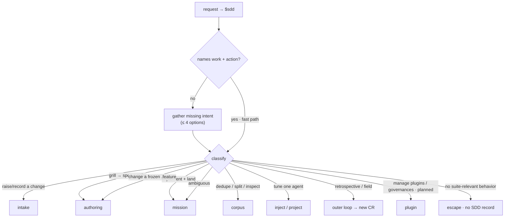

# gateway/ — the universal router/door (the `sdd` skill)

The front door to the project, and the clearest case of **not part of any loop** — it is
**not** part of the Mission Loop. The gateway does two things: **classify** — activate SDD,
gather missing intent, classify the request — and **route**, where its routing table **is**
the user-skill→capability index (there is no separate skills file). It routes a request to a
**mission** (via `../intake/`), to a `../corpus/` tool, or to an **outer-loop operation**. It
is a **thin relay**: it holds no production logic, it only classifies, relays the Council's
answers down, and carries escalations up. It does not edit project files, register hooks,
install packages, or require a CLI.

> **This is a single behavioral unit, not an overview** — the gateway is one skill (`sdd`). This
> spec owns the **behavior + suite** ([`gateway.feature`](./gateway.feature)); the impl is the
> thin-relay `sdd` skill in `plugins/sdd-new/skills/sdd/`.

## Use Cases

**Subject** — the gateway: classify a request (activate SDD, gather missing intent, classify) and
route it to the handling capability, then hand the work to the conductor — a thin relay holding no
production logic.

**Non-goals** — it holds **no** production logic, edits no project files, registers no hooks,
installs nothing, requires no CLI; it **never drafts or ratifies** strategy (only surfaces the
pending count); and it writes **no** `status` / `aligned` / `approval` (the gate station / conductor
own those).

Every scenario in [`gateway.feature`](./gateway.feature) maps to one of these behaviors:

| Behavior | What it covers |
|---|---|
| **activate** | `$sdd` / "use SDD" explicitly activates the gateway |
| **gather missing intent** | a bare invocation conducts intake before routing; it does not begin work until the route is known |
| **fast path** | an invocation naming both work and action routes directly, no menu |
| **the four-option rule** | an intake question presents at most four options, never truncating silently |
| **surface pending strategy** | on Council re-entry, surface the count of unratified `strategy` lines as an entry point — never draft or ratify |
| **hand off to the conductor (default)** | a resolved route runs the conductor in-session and spawns nothing |
| **headless fallback** | with no live session, spawn the operator as a subagent and relay its `needs-input` to the Council |
| **ambiguity routes in** | a request that may touch behavior but names no capability routes into the mission for the grill to decide |
| **escape** | a non-CR (no suite-relevant behavior) proceeds outside the lifecycle, leaving no SDD record |
| **freeze** | a request to change a frozen `.feature` routes back through authoring, never an in-place edit |

## Intake

Treat `$sdd`, "use SDD", and "use Spec-Driven Development" as explicit activation. **Most**
requests that activate the gateway are CRs (see `../intake/README.md`); classification
decides which source carried it and which capability handles it. A **task that is not a CR**
— no suite-relevant behavior — **escapes** (the task-vs-CR boundary, below); recognition is
the grill, not an up-front classifier, so ambiguity is routed in and decided during explore.

- **Fast path.** When the invocation already names enough to act — an artifact and an
  action, or a self-evidently classifiable request — skip the menu and route directly.
- **Gather missing intent.** When the request is bare, do not guess; conduct intake to
  recover the missing piece (the work, or the action), then classify.
- **Surface pending strategy.** When the Council re-enters, surface the count of pending
  (unratified) `strategy` lines in the project's `ledger.jsonl` — the
  doctrine loop's keep-or-cut — as an entry point. The gateway only *surfaces* the count:
  it never drafts strategy (the Scanner's job) nor ratifies it (the Council's positional
  act). A zero count is not surfaced.
- **Never ask more than four options (hard rule).** A single `AskUserQuestion` carries at
  most four options — the intake tool rejects more than four (`too_big, maximum 4`). When a
  derived list would exceed four, present only the most-actionable few (≤ 4) or ask the
  user to name the target directly; never enumerate into an over-four question and never
  truncate silently.

## The routing table is the user-skill→capability index

Classification routes a request to the **capability** that handles it. The capabilities are
the SDD project's screaming-architecture folders — so the routing table doubles as the
index of what a user can invoke. No separate `skills.md` is needed.

Ambiguity routes **into** the mission (the grill decides during explore); a frozen `.feature`
routes back through **authoring**, never edited in place.

| User intent | Capability (handler) |
|---|---|
| Raise / record a change | **intake** — open a CR through a source (`../intake/README.md`) |
| Grill a CR into spec + suite deltas; review the diff at the spec gate | **authoring** (owns the spec gate) |
| Implement + verify against the acceptance suite, then land it in the delivery shape | **mission** (owns the impl gate + handoff step 4; the autonomous orchestrator) |
| Dedupe, split, reconcile, or inspect the corpus | **corpus** |
| Zoom into one inner-loop agent (live) | **inject** (`../intake/README.md`) |
| Durably tune an inner-loop agent | **project** (`../intake/README.md`) |
| A task with no suite-relevant behavior (not a CR) | **escape** — proceeds outside the lifecycle, leaves no SDD record |
| Product / structure / process retrospective, or field corrections | the **campaign / formation / doctrine / forge** loop — emits a new CR |
| Manage domain plugins (install / list / remove), author a governance, or register to the marketplace | the **plugin** capability (`../plugin/README.md`) — *planned, deferred CR* |

There is no `project` vs `feature` structural axis and no spec fleet — one project is one
spec — so routing classifies *what a user wants to do to the project*, never *which spec in
a fleet*.

## Hand the work to the conductor

When the route is resolved, the gateway hands the work to the **conductor** — the **operator
role run in the main session** (`../mission/`, `../design/specialists-and-squads.md`). By default
the gateway **spawns nothing**: the authoring, validation, and mission stations are stations the
conductor runs **in-session**, and the cold judges + impl-producer builder are spawned later by
the conductor itself (depth 1). The conductor *is* the main session, so it holds the user channel
directly — the grill and every escalation happen in-session, with no relay between the Council and
the work.

The conductor escalates to the Council **only at the autonomy bar** (a gate go/no-go, or a scrub
kill) — but in-session, by asking directly, not by returning up a relay.

### Headless fallback — the gateway as relay

When there is no live session to host the conductor (an unattended scheduler, or a multi-CR
fan-out), the gateway **spawns the operator** (`sdd-operator`) as a subagent and acts as its
**relay** (`../design/harness-spawning.md`): it spawns the operator for the segment, relays each
`STATUS: needs-input` (batched `QUESTIONS`) to the Council, re-spawns with the answers, and
repeats until `complete` / `blocked`. The spawned operator has no user channel and never asks the
Council directly — every escalation is carried by the relay.

### Write-ownership is preserved

Neither drive mode changes *who writes what*. The gate station owns the `status` write and the
human ratification of `approval` — by default the in-session conductor performs it directly; in
the headless fallback the in-session relay position performs it on a returned verdict packet. The
conductor owns `aligned` and any provisional self-assertion. The gateway-as-relay writes neither.

## Recognize the escape and the freeze

- **Escape.** A **task that is not a CR** — no suite-relevant behavior — **escapes**: state
  that the work is leaving the lifecycle, create no draft, invoke neither gate, and **write
  no record** (a non-CR is not SDD's to track; a spec-prose-only change is already in git).
  Recognition is the **grill + impact analysis**, not a gateway classifier — the grill may
  also carve a CR out of a task and escape the rest. Ambiguity defaults *into* the lifecycle
  and is decided during explore (see `../intake/README.md`).
- **Freeze.** SDD freezes the `.feature` at approval. A request to change a frozen scenario
  is not edited in place; it re-enters as a CR that grills the spec back open through
  `authoring/` before scenarios may be revised.

## Scenarios (colocated)

The behavior suite is [`gateway.feature`](./gateway.feature) — activation + intake, handoff to the
conductor (in-session default / headless fallback), and the classification edges (ambiguity routes
in, non-CR escapes, frozen feature routes back through authoring). Cross-capability outcomes that
run a CR end-to-end through the gateway live in `../acceptance/`.
