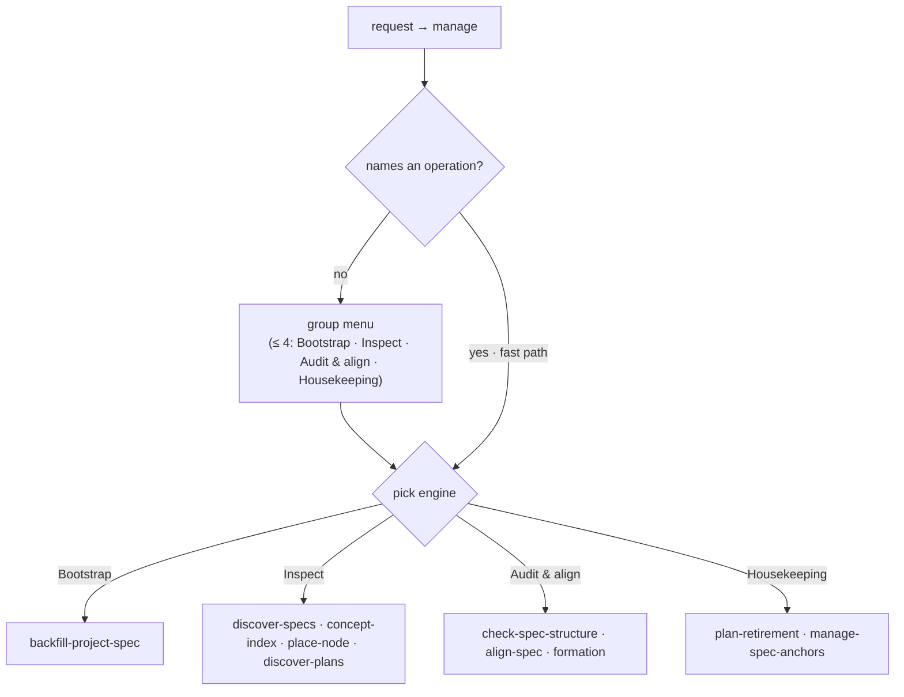

# gateway/manage/ — the manage-level dispatcher (the `manage` skill)

The second front door, beside the gateway: `manage` is the user-facing handler for **manage-level
(non-mission) work** on the project — bootstrap, inspect, audit, housekeeping — as opposed to
`start-mission`, which *changes what the project specifies*. Like the gateway it is a **thin
dispatcher**: it classifies a manage request and **loads the matching engine in the current
session**, holding no production logic, loading no governance, and writing no contract state. It is
the handling skill for the gateway's **"Manage the corpus"** route (`../README.md`).

`manage` is **non-mission**: it opens **no CR**, invokes **no gate**, and performs **no behavior
change** itself. When an operation surfaces a needed change to the project's behavior (a `formation`
reconcile, an `align-spec` drift needing spec edits), it **hands off to `start-mission`** — it never
edits the spec/suite itself.

> **This is a single behavioral unit, not an overview** — `manage` is one skill. This spec owns the
> **behavior + suite** ([`manage.feature`](./manage.feature)); the impl is the thin-dispatcher
> `manage` skill in `plugins/sdd-new/skills/manage/`.

## Use Cases

**Subject** — the manage dispatcher: classify a **manage-level** request (bootstrap / inspect /
audit / housekeeping) and **load the matching engine in the current session**, so the session
runs it directly — a thin dispatcher holding no production logic.

**Non-goals** — it holds **no** production logic, loads no governance, and performs no operation
itself beyond loading the matched engine; it **opens no CR** and **invokes no gate**; it **never
edits** the spec/suite (a needed behavior change is **handed off to `start-mission`**); and it writes
**no** `status` / `approval`.

Every scenario in [`manage.feature`](./manage.feature) maps to one of these behaviors:

| Behavior | What it covers |
|---|---|
| **fast path** | a request naming a manage operation loads its engine directly, no menu |
| **two-level menu** | a bare invocation conducts intake as a two-level menu whose top level presents the four operation groups |
| **the four-option rule** | an intake question presents at most four options, never truncating silently |
| **bootstrap → backfill** | a "set up the project spec for the first time" request loads `backfill-project-spec` |
| **inspect → read-only engine** | an inspect request loads the matching read-only engine (`discover-specs` / `concept-index` / `place-node` / `discover-plans`) |
| **audit → engine** | an audit request loads `check-spec-structure` / `align-spec` / `formation` |
| **housekeeping → engine** | a housekeeping request loads `plan-retirement` (retire completed mission plans) or `manage-spec-anchors` (curate discovery's extra spec anchors) |
| **load the engine in-session** | a resolved route loads the matched engine in the **current session** and runs it directly — `manage` spawns nothing |
| **hand off a behavior change** | when an operation surfaces a needed behavior change, `manage` hands off to `start-mission` rather than editing the spec/suite |
| **non-mission guard** | `manage` opens no CR and invokes no gate |
| **write-ownership guard** | a routed operation writes no `status` / `approval` — `manage` writes no contract state |
| **thin-classifier guard** | classifying loads no governance and holds no production logic, only loading the matched engine |
| **model advice** | `manage` picks no model; it advises the model the loaded engine needs |
| **not a manage request** | a request to change the project (or a non-manage request) is redirected to `start-mission` / the gateway rather than handled here |

## The four operation groups

Manage-level work is grouped so a bare invocation resolves within the four-option rule (`../README.md`):

| Group | Operations (engines it loads) |
|---|---|
| **Bootstrap** | `backfill-project-spec` — scaffold a project's spec envelope for the first time (`../../authoring/backfill-project-spec/`) |
| **Inspect** | `discover-specs` (list specs + statuses) · `concept-index` (by-concept view) · `place-node` (where a concept belongs) · `discover-plans` (in-progress missions) — the read-only engines (`../../corpus/`, `../../project-spec/`, `../../intake/plan-discovery/`) |
| **Audit & align** | `check-spec-structure` (node-shape) · `align-spec` (prose↔suite drift) · `formation` (corpus-wide audit/split/reconcile) — an audit that needs a behavior change hands off to `start-mission` (`../../corpus/`, `../../formation/`) |
| **Housekeeping** | `plan-retirement` (retire completed mission plans) (`../../doctrine/plan-retirement/`) · `manage-spec-anchors` (list / CRUD / induce / preview discovery's extra spec anchors) (`../../corpus/spec-anchors/`) — reviewing pending strategy stays gateway-owned (the gateway's episodic pending-count, option 3), not a manage engine |

## Load the engine in-session

When the route resolves, `manage` **loads the matched engine in the current session** and the session
runs it directly — it **spawns nothing**. Read-only engines (`discover-*`, `check-spec-structure`,
`place-node`, `concept-index --check`) run in place; write-capable operations stay **owned by their
engine** — `backfill-project-spec` scaffolds the skeleton, `plan-retirement` performs its gated
deletion, `concept-index --write` refreshes the generated block, `manage-spec-anchors` writes its
own `spec-anchors.toml` config (operational config, never spec content). `manage` only routes.

**Manage picks no model.** Like the gateway, the model + effort a piece of work needs is determined
by the **engine `manage` loads** — the `.mts` engines are light; a `backfill` or `formation` grill
wants a capable model. The loaded engine advises; the user switches manually.

## Non-mission — hand a behavior change to start-mission

`manage` maintains and inspects the corpus; it **never changes what the project specifies**. It opens
no CR, invokes no gate, and writes no `status` / `approval`. When an operation surfaces a needed
**behavior** change — a `formation` reconcile, an `align-spec` drift whose fix edits the spec/suite —
`manage` **hands off to `start-mission`**, which opens a CR and runs the mission loop. A request that
is itself a change to the project is redirected to `start-mission`, not handled here.

## Scenarios (colocated)

The behavior suite is [`manage.feature`](./manage.feature) — intake (fast path / two-level group
menu / four-option rule), the group routes (bootstrap / inspect / audit / housekeeping), loading the
engine in-session, and the boundaries (non-mission, hand-off to `start-mission`, write-ownership,
thin-classifier). Cross-capability e2e scenarios live in `../../acceptance/`.
