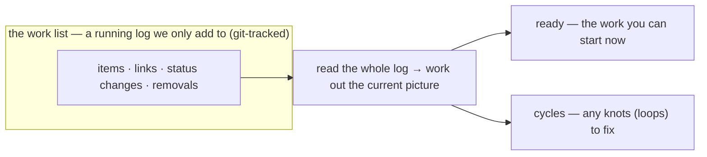

# mission-graph — the shared work list that says what can start now

Think of a project's work as a to-do list where some tasks must **wait** for others, and some tasks
would **step on each other** if worked at the same time. The **mission-graph** is where we write that
list down — the work items and the links between them — and it comes with a small program that answers
two questions over the list at any moment:

1. **"What can we start right now?"** — the `ready` view.
2. **"Did we accidentally tie the plan into a knot?"** (task A waiting on B while B waits on A) — the
   `cycles` view.

The list lives **as plain files inside the project's own git repository** (one list per project), so it
travels with the code and its full history is kept. We only ever **add** to it — a finished task, a new
link, a removed link are all *new entries*, never edits over the old ones — which keeps an honest record
of how the plan grew. One person (or, later, one automated coordinator) is the sole writer, so entries
never clash.

This is the **first, smallest version** ("v1"): the list is written **by hand**, and only the two views
above are computed. Everything cleverer — figuring out the links automatically, running the tasks,
assigning them to people or agents — is **deliberately left for later** (see **Non-goals**), each its
own future piece of work.

## Key terms

Plain-language glossary; the word in parentheses is the technical term an engineer may know it by.

| Term | Plain meaning |
|---|---|
| **Mission** | one deliverable piece of work — roughly one branch / one pull request; it gets built and tested on its own |
| **Operation** | a group of Missions that together deliver something shippable |
| **node** | one item written in the list — a Mission or an Operation |
| **edge** | a one-way link between two items (e.g. "A must finish before B") |
| **dependency** (RAW) | B needs something A produces → **A must finish before B can start** |
| **collision** (WAW) | two Missions would change the *same thing* → they **must not run at the same time** |
| **soft overlap** (WAR) | two Missions touch the same file in *different spots* → can run together, reconciled at merge (not used in v1) |
| **touch-set** | the list of things a Mission will change — used to spot collisions |
| **frontier** | the set of Missions that can be **started now** (nothing blocking them) |
| **fold** | read the whole running log and work out the current answer (like re-tallying a ledger) |
| **retired** | a Mission that is finished and merged |
| **in-flight** | a Mission someone has started but not yet finished |
| **capstone** | the one Mission that marks an Operation "done enough to ship" |
| **release floor** | the smallest set of Missions that must finish before that Operation can ship |
| **tombstone** | a "this was removed" marker — we never delete history, we mark an item/link retracted |
| **cycle** | a loop in the plan (A waits for B, B waits for A) — always a mistake to surface, never to run |
| **needs-a-human** (HITL — "human in the loop") | a person must approve this step before it proceeds |
| **runs-on-its-own** (AFK — "away from keyboard") | safe to run automatically, with no person present |
| **blast** | how much of the project a Mission could disturb — its risk / reach |
| **schema version** | a version number stamped on every entry so the format can grow later without breaking old entries |

## Use Cases

**Subject** — the project's work list and the read-only answers computed from it: adding items to the
list (work items, links, status changes, removals), working out what can start now (`ready`), spotting
knots in the plan (`cycles`), and checking whether a group of work is shippable and how far along it is.

**Non-goals** — it does **not** decide *how to split* a request into Missions (a person does that by
hand for now), *work out* which things a Mission touches (that stays hand-written), tell apart a real
collision from a false one at a fine grain (in v1 any same-item overlap is treated as a real collision),
*run* or *assign* the Missions (that is other tooling), decide the *merge order*, or coordinate a fleet
of parallel agents (all later work). It **plans and reports**; it does not do the work.

| What you want | What you give it | What you get back | Scenario |
|---|---|---|---|
| **add to the list** — the writer records the plan as it firms up | a work item, a link, a status change, or a removal | it is appended; the current picture honors the newest status and drops anything marked removed | `Scenario: a tombstone event retracts an edge from the fold` |
| **see what can start now** | the work list | the Missions with nothing left to wait for and no clash with started work — the same answer every time for the same list | `Scenario: a mission whose RAW predecessor is retired is in the frontier` |
| **keep clashing work apart** — two Missions would change the same thing | the list + each Mission's touch-set | at most **one** of a clashing pair is ever offered at once (the other waits its turn) | `Scenario: a candidate whose touch-set intersects an in-flight mission is held back` |
| **catch a knotted plan** — the links accidentally form a loop | the work list | it never crashes; every Mission caught in the loop is set aside, and the loop is reported as something to fix | `Scenario: the fold quarantines a cycle instead of failing` |
| **check a shippable group** — is this Operation shippable, and how far along | an Operation's declared Missions + its capstone | whether nothing needed is missing (missing prerequisites flagged), what the smallest ship-set is, and a done-so-far count | `Scenario: an Operation whose capstone closure exceeds the declared set is flagged` |

Every scenario in [`mission-graph.feature`](./mission-graph.feature) maps to one of these entries or to
a cross-cutting guarantee (same-answer-every-time, read-only, the list is the source of truth).

## The store — what gets written down

The list is a **running log we only add to**; the current plan is what you get by **reading the whole
log back** (fold) — the newest status of each item wins, and anything marked removed (tombstone) drops
out.

- **Schema version, from the very first entry.** Every entry carries a version number. New fields we add
  later (finer collision detail, an auto-computed risk score, the human-vs-automatic flag) simply arrive
  on newer entries; reading the log copes with a mix of old and new entries and ignores fields it does
  not recognize, so nothing ever needs rewriting.
- **Nodes (the items)** — an **Operation** (a group of Missions plus its capstone) or a **Mission** (one
  deliverable piece of work). Each item records: its **id** (a short local name — no external ticket
  number needed), whether it is an Operation or a Mission, its **status** (not-started / started /
  finished), the **touch-set** (what it will change), its **blast** (risk/reach), whether it
  **needs-a-human** or **runs-on-its-own**, what *kind* of thing it produces, which model tier should do
  it, a pointer to its detailed brief, and the original request(s) it came from (kept for the record).
- **Edges (the links)** — three kinds, explained in the **Edge kinds** table below. Note that
  **collisions and soft overlaps are *not* written down as links** — they are worked out on the spot from
  the touch-sets, and only ever across the small set of currently-relevant work.
- **One writer, so no splitting the file.** A single decider makes every change (for now, a person; later,
  one automated coordinator), so there is no need to split the list into per-writer pieces. Keeping only
  additions is for the **honest history** of how the plan grew, not to avoid write clashes.
- **Removals use a "tombstone" marker.** Since we only add, taking a link or item out is done by adding a
  **tombstone** ("this was removed") entry that the reader honors. It is a first-class part of the format
  from day one, used to untangle a knotted plan or re-cut work later.

**Edge kinds.** A link is one-way (`A → B`). Its kind fixes what it means and whether the two views act
on it:

| Kind | `A → B` means | Acted on? | Role |
|---|---|---|---|
| **dependency** (RAW) | A must finish before B can start | **yes** — `ready` keeps B waiting until A is finished; `cycles` looks for loops of these | the real "wait for" link |
| **grouping** (parent-child) | B is a Mission inside Operation A | **yes** — the shippable-group check + the done-count | which Missions make up an Operation |
| **came-from** (discovered-from) | B was created while working on A | **no** (v1) — recorded, but nothing acts on it | keeps the trail of how the plan grew |

> **Why record "came-from" if nothing acts on it?** Because it captures the **history** — a reader can
> later ask "where did this Mission come from?" — and that fact can *only* be captured at the moment the
> Mission is created; it can't be reliably reconstructed afterward. So we write it down from day one even
> though the current version does nothing with it. Its future uses are all deferred: spotting badly-split
> work (a Mission that spawns many children was cut too coarsely), an audit of how planning unfolded,
> flagging orphaned work whose reason went away, and hints for stacking one branch off another.

## `ready` — "what can we start now?"

`ready` **reads the list without changing it** and returns every Mission that is both:

- **not waiting on anything** — every dependency (RAW) it points back to is already finished; and
- **not clashing with started work** — its touch-set does not overlap a Mission already in-flight.

Key points:

- **Keeping clashing work apart (the collision rule).** If a Mission would change the same thing as one
  already started, it is held back until that one finishes (done one-at-a-time on purpose, because undoing
  a clash later is expensive). And if two *not-yet-started* Missions would clash, only **one** is offered
  — chosen by a **fixed rule** (lowest id first), never at random — so a coordinator can never pick both.
- **Same list in, same answer out.** Reading the same list always gives the same set in the same order.
  (The list itself changes over time as work is added and finished; each reading of a *given* list is
  steady.)
- **Read-only.** `ready` never changes the list; writing is a separate path.
- **What each answer carries** — for each ready Mission: its id, its **kind** (`node` — Mission or
  Operation), its Operation, its blast, whether it needs-a-human or runs-on-its-own, its model tier, a
  pointer to its brief, and *why* it is ready. (Ranking and finer overlap detail are left for later.
  The `node` field's meaning is a known follow-up — the word collides with SDD's "spec-node"; to be
  disambiguated at the Op1.M2 distillation.)

## `cycles` — "did the plan tie itself in a knot?"

A knot means the plan is **wrong** — two Missions each waiting on the other, so *neither* can ever start.
That is a bad split of the work, and the point is to **surface** it, never to crash on it. Three parts,
all in v1:

1. **A gentle guard when writing.** When someone adds a "wait for" link that would close a loop, the write
   path pushes back — but the writer can **override** it to record a genuinely-discovered mutual
   dependency.
2. **Never crash when reading.** Reading a knotted list always succeeds. Every Mission caught in a loop is
   **set aside** (excluded from `ready`), and anything waiting behind the loop is held too. `cycles`
   reports each loop as a thing to fix.
3. **Fixing = re-cutting.** Merge the tangled Missions or remove the offending link (a tombstone entry).
   A plan with no loops reports nothing to fix.

## Operations — "is this group shippable, and how far along?"

An **Operation** is a **hand-declared group of Missions plus one capstone** (the Mission that marks it
"done enough to ship"). Grouping is a judgment call, written down as grouping links — not something the
program guesses. From that, the program checks and reports:

- **Nothing needed is missing.** Everything the capstone depends on must be inside the declared group; a
  missing prerequisite is **flagged**. Extra "support" Missions in the group that the capstone doesn't
  strictly need are **fine** — that's what support is.
- **The smallest ship-set (release floor).** The Operation can ship once the capstone and everything it
  depends on are finished. Support Missions ride along but do **not** hold up shipping.
- **How far along.** A simple **finished-out-of-total** count over the declared Missions.

## The list is the source of truth, not the brief

Each Mission also has a detailed **brief** (a `.plan.md` file) with its to-dos and notes. When the two
disagree about whether a Mission is finished, **the list wins** — it is the authority on scheduling
status. A brief left lying around after its Mission is finished is just cleanup debt, never a second
version of the truth.

## How it's tested

The frozen behavior file describes each rule as a small **made-up example list** ("given a list with a
dependency from A to B where A is finished, B can start") — checked against **hand-built examples**,
**never against the real live list** (which changes every time a Mission finishes, so pinning exact
answers to it would be flaky). The real-world example **#135/#136/#137** (three linked GitHub issues in
this repo) is boiled down into one such example. The ultimate proof is **dogfooding**: the system must be
able to plan its *own* remaining work — checked once at the end (Op1.M2), not as a frozen example.

## Delivery

Built as the **`mission-graph`** engine — `plugins/sdd/skills/mission-graph/` — a self-contained,
dependency-free script (the repo's node-≥23.6 / no-extra-tools convention, with a by-hand fallback when
`node` is absent) plus its tests over the hand-built examples. It offers the two read-only views (`ready`
and `cycles`) and the separate write path (add an item / link / status change / removal, with the gentle
loop-guard). How the files are reached is kept behind a small internal boundary (a **seam**), so a
later move (to a shared, branch-independent store) never disturbs the two views. The capability and its engine share the
`mission-graph` name.

## Source

- **new** — no prior version. First built as the **cyberfleet-batch** change request (Op1.M1), the
  hand-made seed of a larger system that turns requests into a scheduled set of Missions. The name
  "mission graph" and the wording **Campaign > Operation > Mission > Task** are settled; the broader
  system name and its permanent design write-ups (project spec + decision records) are finalized at the
  Op1.M2 handoff.
