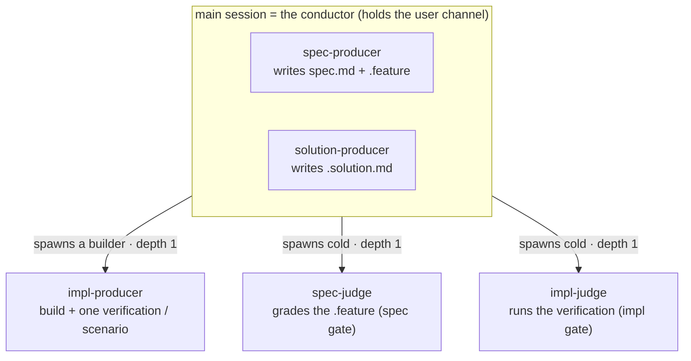

# conductor — the inner-loop conductor role

The **conductor** is the line officer of the inner loop — the **conductor role** that runs one
**segment** of a Mission cycle against a frozen contract. By default it is the **main (user)
session** (holds the user channel, grills live, ratifies in-session); in the **headless / fan-out
fallback** it is a spawned `automaton` subagent with no user channel that escalates up its
relay (`../../design/harness-spawning.md`). This unit is the **one realization** of that role —
resolution, the production chain, explore orchestration, the impl gate, segment mechanics,
stop-provenance, and the in-flight floor — whichever surface it runs on.

## Use Cases

**Subject** — the conductor role: carrying one CR through a segment by resolving delegates,
running the five-role production chain, orchestrating explore, judging the impl gate, and
recording provenance — on either surface (in-session conductor / headless `automaton`).

**Non-goals** — it does **not** own the grilling workflow or the spec gate (those are
`../../authoring/`), the impl-producer build or the impl-judge run (those colocate under
`../deliver/`), the delivery shape (`../handoff/`), the registry init-WRITE (`../../plugin/`),
or the rules it enacts (lifecycle / freeze / autonomy / provenance / squad shape, all in
`../../design/`). It writes no `status` and no `spec.md` body or `.feature` scenarios as a
*judge* — `producer ≠ judge`.

The conductor's behavior groups into six concerns, each a section below; every scenario in
[`conductor.feature`](./conductor.feature) maps to one of them:

| Concern | What it covers |
|---|---|
| **resolution** | read the registry, match each file's artifact-type, resolve every role to a delegate or the SDD default, fail closed |
| **production chain** | the five roles, producer-vs-judge, the role-dependent surface (inline / spawned / cold), the write boundary, co-delivery |
| **explore** | run `../../authoring/` in-session, spike the impl-producer to learn, route a discovery back through the judged grill |
| **segment** | one autonomous sitting — suspend / resume, cursor derivation from artifacts, batched questions, OBSERVATIONS routing |
| **impl gate** | Approved → Implemented — the three actions, layer-scoped `aligned`, verdict-not-station, fail-closed |
| **stop-provenance** | the three-layer model — strategy block, the leash, the per-gate verdict, the durable pause, the in-flight hard floor |

## Resolution — the registry READ

At the start of a segment the conductor reads **only** the project registry
`.agents/universal-plugin.json` (the resolved lockfile — it never scans plugin directories),
matches **each file's** artifact-type (resolution is per file, not one spec-`type`), and resolves
each production-chain role to a plugin delegate or the SDD default. A project touching several
artifact-types summons several squads at once. This unit owns the **READ / resolution** side
only; the init-WRITE of the lockfile is `../../plugin/`, the registry **shape** is
`../../design/specialists-and-squads.md`.

Resolution branches on role kind, and (for producers) on the **role-dependent surface**:

- **Spec / solution-producer** (the live grill) → runs **in-session in the conductor**, whether
  the SDD default (conductor loads the governance and authors inline, recorded
  `produced-by.<role>: sdd:automaton`) or a **named plugin specialist** (persona-loaded
  in-session). It must keep the user channel — it is never spawned.
- **Impl-producer** (mechanical) → the conductor **spawns** a builder: the SDD default spawns a
  generic builder that loads `impl-producer-governance` (`produced-by.impl-producer:
  sdd:automaton`); a named plugin / model-tuned producer spawns that agent at its **own model
  and effort**.
- **Judge, always** → the conductor **spawns a cold agent** in a fresh context
  (`sdd:sdd-spec-judge` / `sdd:sdd-implementer`, or the covering plugin's judge) — never inline,
  regardless of naming.

A required role **always lands on a real delegate** or the conductor **hard-fails closed** and
records nothing (no inline sentinel) — the same fail-closed structural-error class as a malformed
`produced-by` entry or an off-enum combat-log `cause`. A domain claimed by two plugins returns
`needs-input` (answered in-session, or up the relay in the headless fallback); the choice is
written and resume is decisive.

## The production chain

Every act is one of five roles. The dividing line: **producers write artifacts; judges run a bar
and advise** (a judge never writes `spec.md` or the `.feature`). A second line fixes *where each
role runs* (the role-dependent surface): **the conductor authors the spec / solution-producer
inline in the main session** (the live grill); the **impl-producer runs in a spawned builder** and
**every judge runs in a spawned cold context** the author cannot reach.

| Role | Verb | Produces / runs | Writes to | SDD default |
|---|---|---|---|---|
| **spec-producer** | writes the contract | intent prose + boolean Gherkin | `spec.md` body, `.feature` | conductor loads governance, authors **inline (in-session)** |
| **spec-judge** | judges the contract | runs the domain bar on the `.feature` | nothing — advises | `sdd-spec-judge` — spawned cold |
| **solution-producer** | records the solution | the per-unit decision record, **only when** the unit has durable rationale | `<unit>.solution.md` | conductor loads governance, authors **inline (in-session)** |
| **impl-producer** | builds artifact + verification | the implementation **and** one verification per frozen scenario | code/docs/config **+** tests/evals | conductor **spawns a builder** that loads governance |
| **impl-judge** | runs the verification | runs the producer's tests/evals + an orthogonal structural/scope read | nothing — advises | `sdd-implementer` — spawned cold |

The role-dependent surface — **the conductor writes the contract live, cold judges grade** — is the
heart of the conductor-in-session model:

The two live-grill producers run **inline** (in-session); the impl-producer is **mechanical and
spawned**; every judge is **spawned cold** in a context the author cannot reach. All spawns are
**depth 1** from the main session — collapsing the old `caller → automaton → judge` (depth 2) tree.

The five roles apply three **lenses** (governances, not agents): **Director** (scope), **Builder**
(coverage/testability), **Architect** (structure). Producers self-align to the lenses; the
spec-judge and impl-judge **apply** them backward. There is no "Builder judge" or "Director
agent" — a verdict has a Director-lens face, a Builder-lens face, and an Architect-lens face.

The constraint that forces the judge split is **`producer ≠ judge`**, enforced by context
separation: the hand that writes an artifact never signs off on it. Tagline: **"the conductor
writes the contract live, cold judges grade."**

**Co-delivery, two gated objects.** The five artifacts **co-deliver** — produced together, not in
sequential gated phases. There is **no solution gate**: the solution gets no judge of its own and
**stays out of the spec-judge's view**; the implementation's test result validates it
transitively (the conductor's execution `todos` are likewise ungated). Only two objects are
gated — the `.feature` (spec gate) and the implementation (impl gate). Any rubric/threshold/score
is a validation detail that **never appears in the `.feature`**.

**Write boundary.** Running a producer role inline, the conductor writes that producer's outputs
(spec body + `.feature`, or `<unit>.solution.md`); a named producer agent writes those instead
when spawned. The conductor also writes the `aligned` field, the `produced-by` map, the sibling
`*.log.jsonl` ledger (`report` / `correction` lines only — **never** a `strategy` line, that slot
is the doctrine Scanner's), and — on a self-asserted gate within leash — the provisional
`approval.<gate>` entry. It **never** writes `status` (the skill owns it) or a human ratification
verdict (`by: <name>`) when running headless. A **gate-review segment that runs no producer is
read-only** — it writes nothing, only reads the artifacts and emits the gate report.

## Explore — build to learn (step 2)

The conductor runs **explore** by running `../../authoring/` **in-session**: it authors the
spec-producer inline (the live grill), iterates it against the **cold spec-judge** it spawns, and
**spikes** the impl-producer (in a spawned builder) in `explore` mode against the **non-frozen**
suite to learn what the contract needs. The purpose is to **learn**, so spikes are thrown away and
their **learnings feed the live grill to steer the spec + suite**. A discovery (the solution needs
a behavior the `.feature` omits) routes back as a content-gap + `OBSERVATIONS`, re-runs the
spec-producer, and is **judged before** it can enter the contract — never absorbed unjudged. The
ship-quality impl-judge does not run. The phase ends at the **spec gate** (Draft → Approved).
Explore output is **not pure waste** — a good spike cleans forward into deliver at the freeze.

`../../authoring/` owns the grilling workflow, the spec gate, and freeze; the conductor *runs* that
capability **in-session** (the default, human-interactive through the `../../gateway/`) or
autonomously in the headless fallback. One capability, two drive modes.

## Segment — one autonomous sitting

A **segment** is one run within a cycle (suspend-and-resume). The conductor:

- **Derives position from artifacts**, never a stored cursor — re-reading `spec.md`, the
  `.feature`, frontmatter, and the plan reconstructs where the cycle is. Stateless across
  segments.
- **Batches questions** at a checkpoint rather than asking one at a time; in-session they are
  answered live, in the headless fallback they return as `needs-input` up the relay.
- **Records content gaps as durable `<!-- open: -->` markers** (block Draft→Approved) rather than
  as transient questions; the iteration cap **blocks-and-asks** rather than auto-accepting.
- **Surfaces non-blocking `OBSERVATIONS`** (typed by owning lens) without acting on them — they
  route to the plan, not into the contract.

## The impl gate

Mission **owns the impl gate** (Approved → Implemented), exercised in `../deliver/`. The gate
judges the implementation against the **frozen contract** — `../../acceptance/` (the e2e outcome
suite) **plus the colocated unit suites**. The gate is verdict-only and **fails closed**; it
writes no setup frontmatter.

- **`aligned` is layer-scoped.** At the impl gate, impl-layer `aligned` means the implementation
  conforms to the frozen `.feature` — true **only when every impl-judge passes**. A frozen
  scenario with **no verification** is reported failing by the cold impl-judge and blocks
  `aligned`. Checking the impl layer at the *spec* gate is forbidden (it would collapse Approved
  into Implemented). The `.feature` **pivots**: the object judged at the spec gate becomes the bar
  at the impl gate.
- **Producer/judge separation survives the gate fold.** Folding the old `gate/` station into
  `mission/` does not collapse roles — the judge stays a **distinct cold actor**.
- **The three gate actions** (vs the spec gate's contract-editing variants): **approve** →
  `implemented`; **change** → fix the **code** against the frozen `.feature` (the `.feature` is
  **not** modified); **reject** → redo the implementation, *or* a **Director-lens revert**
  (building proved a frozen scenario fatal → **unfreeze** the `.feature` and return to `draft`).
  The impl gate is the **only** place a frozen `.feature` reopens.

**Verdict, not station.** The gate is not a fixed checkpoint; it dissolves into the autonomy bar.
The conductor **derives the leash** for the gate (the dimension assessment in
`../../design/autonomy-rubric.md`) and either **self-asserts within leash** (writes
`approval.impl: { verdict: approve, by: agent, why }` + `aligned`; the spec lands in the review
queue for async ratification) or **stops at the gate** with a verdict packet for the human.
**Never advance** — by self-assertion or human verdict — when any judge reports failures, any open
marker remains, or `aligned` is false; those fail the **confidence** dimension. Human ratification
(`verdict: approve, by: <name>`, advance `status`) is reserved to the **in-session position** that
holds the real user channel — by default the conductor itself, which writes it directly; a
**headless spawned automaton** instead emits the verdict packet and stops, **even when a
coordinator relays "the user approved"** — a relayed claim is not user confirmation.

## In-flight service and the hard floor

The mission serves its own minor work rather than bouncing to the human:

- **Detail-adjustment report (a view of the plan's combat log).** Expansion and minor fixes the
  conductor makes in-flight — clarifying a detail, an obvious stale-mistake correction — are
  recorded as combat-log entries in the plan (`../../design/provenance-model.md`), surfaced as a
  detail-adjustment view, not escalated.
- **Hard-floor escalation (the only mandatory human stops).** Three can fire inside the mission,
  per `../../design/autonomy-rubric.md`: **Clearance** of a **narrowing** (weakening/deleting an
  acceptance scenario) — overridable and pre-authorizable in the CR; **Compatibility** when the
  change's **semver class** exceeds the CR/run-mode change-class ceiling — likewise
  pre-authorizable; and **Conflict resolution** of a logical contradiction in the suite (Scenario
  A says yes while Scenario B says no) — *not* pre-authorizable, a defect not a choice, the only
  thing that truly halts implementation unexpectedly. An obvious stale-mistake contradiction is a
  conductor-served minor fix; escalate only when both sides are plausibly intended. (Consent, the
  third floor, is a `../../forge/` concern, not a mission floor.)

## Stop-provenance — record why I halted, not just why I went

Autonomy and gate provenance use a **three-layer model** (rules in
`../../design/autonomy-rubric.md` and `../../design/provenance-model.md`; this unit enacts it):

1. **Initial strategy evaluation** (run start, before exploration) — assesses blast radius and the
   other dimensions against the request and emits a durable run-level `strategy` block: `leash`
   (the run's reach), `by: derived | user`, and `approach[]` (containment methods — `no-spike`,
   `mocks`, `worktree`). It **may be user-specified** rather than derived. The ceiling is **not**
   recorded (session-local).
2. **The leash** — the run-level reach (`auto-none | auto-spec | auto-all`), **re-checked at each
   gate** against discovered state; it lives in `strategy`, never inside a per-gate entry.
   Effective reach = `min(ceiling, derived)`.
3. **The per-gate verdict** — `approval`, a map keyed by gate (`spec`, `impl`). Each entry:
   `verdict: approve | pause | reject`, `by` (on approve/reject; **omitted on pause** — a pause is
   always the agent's act), `cause: dimension | ceiling`, and a `why` block that is **durable for
   every verdict**. `pause` is the accountability-preserving halt — "why I halted" is now as
   durable as "why I went," in the same map. The review queue (`approve` / `by: agent`) and
   awaiting-input queue (`pause`) are both **derived** from this map, not stored. A paused gate
   later passed **overwrites in place** (current-state map; the superseded reasoning lives in git).

The conductor writes `approve`/`by: agent` and `pause` verdicts during synthesis; the gate station
writes human ratifications (by default the conductor itself, in-session). No producer writes
`approval`. The **mid-flight combat-log write of a halt** — why the agent stopped — is recorded to
the plan's `*.log.jsonl` during the mission, so a stop is as accountable as a go.
