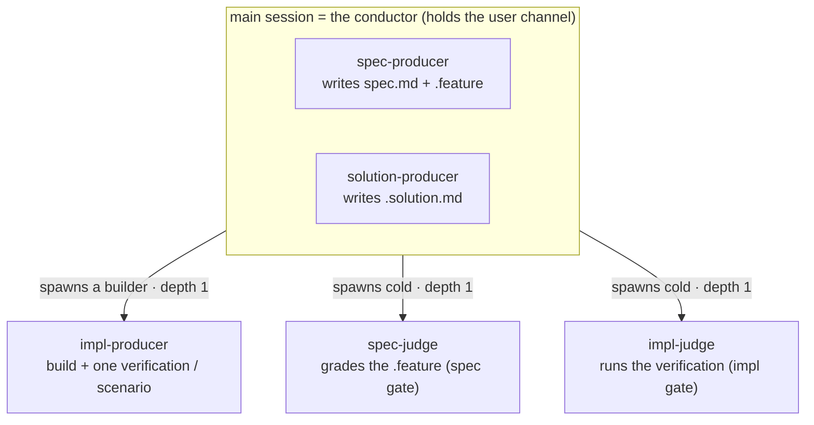

# conductor — the inner-loop conductor role

The **conductor** is the line officer of the inner loop — the **conductor role** that runs one
**segment** of a Mission cycle against a frozen contract. By default it is the **main (user)
session** (holds the user channel, grills live, ratifies in-session), realized by the user-facing
**`start-mission`** skill; in the **headless / fan-out fallback** it is a spawned `automaton`
subagent with no user channel that escalates up its relay (`../../design/harness-spawning.md`).
This unit is the **one realization** of that role — resolution, the production chain, explore
orchestration, the impl gate, segment mechanics, stop-provenance, and the in-flight floor —
whichever surface it runs on.

## Use Cases

**Subject** — the conductor role: carrying one CR through a segment by resolving delegates,
running the five-role production chain, orchestrating explore, judging the impl gate, and
recording provenance — on either surface (in-session conductor / headless `automaton`).

**Non-goals** — it does **not** own the grilling workflow or the spec gate (those are
`../../authoring/`), the impl-producer build or the impl-judge run (those colocate under
`../delivery.md`), the delivery shape (`../handoff/`), the registry init-WRITE (`../../plugin/`),
or the rules it enacts (lifecycle / freeze / autonomy / provenance / squad shape, all in
`../../design/`). It writes no `status` and no `spec.md` body or `.feature` scenarios as a
*judge* — `producer ≠ judge`.

The conductor's behavior groups into ten concerns, each a section below; every scenario in
[`conductor.feature`](./conductor.feature) maps to one of them:

| Concern | What it covers |
|---|---|
| **classification** | decide each file's artifact-type — convention-first, the optional `.agents/sdd/` tiebreaker on ambiguity (confirm-not-guess, write-back) |
| **resolution** | read the registry, match each file's artifact-type to a squad, resolve every role to a delegate or the SDD default, fail closed |
| **production chain** | the five roles, producer-vs-judge, the role-dependent surface (inline / spawned / cold), the write boundary, co-delivery |
| **dispatch transport** | the transport-abstract spawn seam — state a dispatch intent (never a pinned command), route through an available dispatch capability preferring a warm unit else a portable cold-subagent fallback; warm = the unit, cold = the context (context-clear via `npx cyberlegion@<version> unit clear` per judgment keeps judge independence; the warm builder keeps its context); warm units live one mission, reset at handoff |
| **governance provenance relay** | forward the spec-producer's declared `governances_loaded` through the dispatch channel as `producer_governances_declared` (a brief field for a cold subagent, a mail envelope field for an agent pool) — a pure relay, rendering no opinion on which governances were required |
| **explore** | run `../../authoring/` in-session, spike the impl-producer to learn, route a discovery back through the judged grill; or the plan-mode-preview drive mode (reason without writing, render into the plan file, end at ExitPlanMode) |
| **segment** | one autonomous sitting — suspend / resume, cursor derivation from artifacts, batched questions, OBSERVATIONS routing |
| **impl gate** | Approved → Implemented — the rebase-onto-target last deliver act, the three actions, the suite-run pass condition, verdict-not-station, fail-closed |
| **in-flight floor** | detail-adjustment served in-session vs the three mission hard floors (Clearance / Compatibility / Conflict) that mandate a human stop |
| **stop-provenance** | the three-layer model — `leash` block, the leash reach, the per-gate verdict, the durable pause, and the mid-flight `halt` entry |
| **combat-log telemetry** | every appended line carries a write-time UTC `ts` and the pseudonymous `handle` (`SDD_HANDLE`, else omitted), flushed to the committed log during the mission; the safe-to-publish floor keeps email / raw identifiers / raw numbers out |
| **correction-line durability** | a judge-reject→fix→pass self-assert appends a discrete `correction` line (`correction-kind: judge-iteration` + a matchable `cause`) before the gate `why`, never leaving the iteration only as prose; a clean gate appends none; at finalize, a mission carrying a correction whose line was never flushed writes it — creating the combat log if absent (a combat-log `correction`, never a ledger line; a mission with no correction forces none) |
| **mission statusline** | during the loop only, overwrite the statusline file (`.agents/sdd/statusline`) with the current phase on each transition and clear it on every exit (handoff / pause / halt); written only while a mission is in flight, no heartbeat (static staleness), distinct from the lifecycle `status` field — the opt-in reader is wired by `../../gateway/init/` |

## Classification — a file's artifact-type

Before it can resolve, the conductor must know each file's artifact-type — **resolved per file,
never stored** (`../../design/artifact-type.md`). It classifies **by convention/context first** (a
`SKILL.md` under `skills/` is a `skill`); the file **extension never decides**. Only on a **genuine
ambiguity or a path the user flags** does it consult the optional tiebreaker map
`.agents/sdd/artifact-types.toml` (most-specific glob wins); still unresolved, it **confirms with
the user — never guesses** — and **writes the binding back**, so a later segment classifies the same
path deterministically without asking.

## Resolution — the registry READ

At the start of a segment the conductor reads **only** the project registry
`.agents/universal-plugin.json` (the resolved lockfile — it never scans plugin directories),
matches **each file's** artifact-type (resolution is per file, not one spec-`type`), and resolves
each production-chain role to a plugin delegate or the SDD default. A project touching several
artifact-types summons several squads at once. This unit owns the **classification + READ /
resolution** side; the init-WRITE of the lockfile is `../../plugin/`, the registry **shape** is
`../../design/specialists-and-squads.md`.

Resolution branches on role kind, and (for producers) on the **role-dependent surface**:

- **Spec / solution-producer** (the live grill) → runs **in-session in the conductor**, whether
  the SDD default (conductor loads the governance and authors inline, recorded
  `produced-by.<role>: sdd:automaton`) or a **named plugin specialist** (persona-loaded
  in-session). It must keep the user channel — it is never spawned.
- **Impl-producer** (mechanical) → the conductor **spawns** a builder: the SDD default spawns a
  generic builder that loads `impl-producer-governance` (`produced-by.impl-producer:
  sdd:automaton`); a named plugin / model-tuned producer spawns that agent at its **own model
  and effort**.
- **Judge, always** → the conductor **spawns a cold agent** in a fresh context
  (`sdd:sdd-spec-judge` / `sdd:sdd-impl-judge`, or the covering plugin's judge) — never inline,
  regardless of naming.

The lockfile itself need not exist: an **absent** `.agents/universal-plugin.json` is **legal** — it
resolves to zero plugins, so every role falls to its SDD default. A **malformed** lockfile (not
valid JSON, or missing the `sdd-plugins` array) instead **hard-fails closed** — the same
structural-error class below — because a registry that cannot be read cannot be trusted to resolve.
The per-role branch itself — named delegate / omitted-key `<plugin>-<role>` convention / explicit-`null`
SDD default / no-squad-match SDD default — is the matcher unit's own contract (`../resolution/`).

A required role **always lands on a real delegate** or the conductor **hard-fails closed** and
records nothing (no inline sentinel) — the same fail-closed structural-error class as a malformed
`produced-by` entry or an off-enum combat-log `cause`. A resolved delegate that **recuses** from a
subject (declares it outside its domain and produces nothing) is **distinct** from a missing
delegate: recusal is **not** a structural error — the conductor **re-resolves that unit's chain to
the SDD defaults** (default producer + SDD-default bars + judge) and proceeds, recording the recusal
as a combat-log line (`design/lifecycle-model.md`). A domain claimed by two plugins returns
`needs-input` (answered in-session, or up the relay in the headless fallback); the choice is
written and resume is decisive.

## The production chain

Every act is one of five roles. The dividing line: **producers write artifacts; judges run a bar
and advise** (a judge never writes `spec.md` or the `.feature`). A second line fixes *where each
role runs* (the role-dependent surface): **the conductor authors the spec / solution-producer
inline in the main session** (the live grill); the **impl-producer runs in a spawned builder** and
**every judge runs in a spawned cold context** the author cannot reach.

| Role | Verb | Produces / runs | Writes to | SDD default |
|---|---|---|---|---|
| **spec-producer** | writes the contract | intent prose + boolean Gherkin | `spec.md` body, `.feature` | conductor loads governance, authors **inline (in-session)** |
| **spec-judge** | judges the contract | runs the domain bar on the `.feature` | nothing — advises | `sdd-spec-judge` — spawned cold |
| **solution-producer** | records the solution | the per-unit decision record, **only when** the unit has durable rationale | `<unit>.solution.md` | conductor loads governance, authors **inline (in-session)** |
| **impl-producer** | builds artifact + verification | the implementation **and** one verification per frozen scenario | code/docs/config **+** tests/evals | conductor **spawns a builder** that loads governance |
| **impl-judge** | runs the verification | runs the producer's tests/evals + an orthogonal structural/scope read | nothing — advises | `sdd-impl-judge` — spawned cold |

The role-dependent surface — **the conductor writes the contract live, cold judges grade** — is the
heart of the conductor-in-session model:

The two live-grill producers run **inline** (in-session); the impl-producer is **mechanical and
spawned**; every judge is **spawned cold** in a context the author cannot reach. All spawns are
**depth 1** from the main session — collapsing the old `caller → automaton → judge` (depth 2) tree.

**Dispatch transport — the spawn seam is transport-abstract.** "Spawn" names an **outcome** — the
role runs in a **separate context** (a builder for the impl-producer; a **fresh cold** context the
author cannot reach for a judge) — not a transport. The conductor states a **dispatch intent**
(role, brief, expected verdict schema) and never pins a literal command, per the depend-on-intent
discipline (`../../design/harness-spawning.md`, ADR-0023). When a **harness-agnostic dispatch
capability** is available (e.g. cyberlegion), the conductor routes the spawn through its
`subagent | channel | run-inline` seam and **prefers a warm unit**; when none is available it
**falls back** to a portable cold subagent spawn — the ported default. Warmth is a property of the
**unit/process**, coldness of the **context**: a judge's fresh cold context is realized **either** by
a newly spawned subagent **or** by **clearing a warm unit** (`npx cyberlegion@<version> unit clear <ref>`) before each judgment —
both satisfy grader independence, so a warm judge unit never weakens it. A **warm producer**
(the impl-producer builder) instead **keeps** its context across explore spikes and the deliver
build (no reset between uses) so its learning carries. Warm units live **no longer than one
mission** — reused within the mission, then cleared (`npx cyberlegion@<version> unit clear`) or torn down at handoff (`../handoff/`),
never shared into another mission's context.

The five roles apply three **lenses** (governances, not agents): **Oracle** (scope), **Builder**
(coverage/testability), **Architect** (structure). Producers self-align to the lenses; the
spec-judge and impl-judge **apply** them backward. There is no "Builder judge" or "Oracle
agent" — a verdict has an Oracle-lens face, a Builder-lens face, and an Architect-lens face.

The constraint that forces the judge split is **`producer ≠ judge`**, enforced by context
separation: the hand that writes an artifact never signs off on it. Tagline: **"the conductor
writes the contract live, cold judges grade."**

**Co-delivery, two gated objects.** The five artifacts **co-deliver** — produced together, not in
sequential gated phases. There is **no solution gate**: the solution gets no judge of its own and
**stays out of the spec-judge's view**; the implementation's test result validates it
transitively (the conductor's execution `todos` are likewise ungated). Only two objects are
gated — the `.feature` (spec gate) and the implementation (impl gate). Any rubric/threshold/score
is a validation detail that **never appears in the `.feature`**.

**Write boundary.** Running a producer role inline, the conductor writes that producer's outputs
(spec body + `.feature`, or `<unit>.solution.md`); a named producer agent writes those instead
when spawned. The conductor also writes `project-path` (at scaffold), the `produced-by` map, the
sibling `*.log.jsonl` ledger (`report` / `correction` lines only — **never** a `strategy` line, that
slot is the doctrine Scanner's), and — on a self-asserted gate within leash — the provisional
`approval.<gate>` entry. It **never** writes `status` (the skill owns it) or a human ratification
verdict (`by: <name>`) when running headless. A **gate-review segment that runs no producer is
read-only** — it writes nothing, only reads the artifacts and emits the gate report.

## Governance provenance relay

The spec-producer's structured output declares `governances_loaded` (`../../authoring/spec-producer/README.md`)
— the governances it loaded before writing. The conductor forwards that set through the dispatch
channel it is already using for the spec-judge, keyed **`producer_governances_declared`**: a brief
field when the judge is dispatched as a cold subagent, a mail envelope field when it runs through an
agent pool. The conductor **stays a pure relay** — it forwards the declared set verbatim (including
an empty one) and renders **no opinion** on which governances were actually required; that judgment
belongs to the spec-judge's own pre-flight check (`../../authoring/spec-gate/README.md`).

## Explore — build to learn (step 2)

The conductor runs **explore** by running `../../authoring/` **in-session**: it authors the
spec-producer inline (the live grill), iterates it against the **cold spec-judge** it spawns, and
**spikes** the impl-producer (in a spawned builder) in `explore` mode against the **non-frozen**
suite to learn what the contract needs. The purpose is to **learn**, so spikes are thrown away and
their **learnings feed the live grill to steer the spec + suite**. A discovery (the solution needs
a behavior the `.feature` omits) routes back as a content-gap + `OBSERVATIONS`, re-runs the
spec-producer, and is **judged before** it can enter the contract — never absorbed unjudged. The
ship-quality impl-judge does not run. The phase ends at the **spec gate** (Draft → Approved).
Explore output is **not pure waste** — a good spike cleans forward into deliver at the freeze.

**Plan-mode preview (a third drive mode).** When the harness signals **plan mode** (only the plan
file is writable), the conductor runs explore's **reasoning** but writes no repo files: it
classifies the node, collects seed intent, and drafts the `spec.md` prose and the `.feature`
scenario list — then **renders them into the plan file** (a `## Proposed Spec` / `## Proposed
Scenarios` preview) rather than to their repo paths. It **keeps the cold spec-judge** over the
in-memory draft (surfacing open markers) but **does not spike the impl-producer**, and it ends at
**ExitPlanMode**, not the spec gate — no freeze, no `status`. Plan mode is detected **in-body** from
the harness signal, never from the `start-mission` trigger `description`, so a mission fires on
change-intent alone and the branch never re-fires per turn — the non-re-fire guarantee is enforced
by the harness's skill-dispatch layer, out of this suite's scope to assert directly (the `.feature`
tests the detection source as the closest in-domain proxy). On approval the **next non-plan-mode
explore adopts the preview as the settled draft** (via the intake `<cr-ref>.design.md` seam) —
writing the spec + `.feature`, validating with a build-to-learn spike, and reaching the spec gate
without re-grilling; a preview carrying a failing spec-judge verdict or unresolved open markers is
resolved first, never blind-adopted.

`../../authoring/` owns the grilling workflow, the spec gate, and freeze; the conductor *runs* that
capability **in-session** (the default, human-interactive through the `../../gateway/`),
autonomously in the headless fallback, or as a **plan-mode preview** that reasons without writing.
One capability, three drive modes.

## Segment — one autonomous sitting

A **segment** is one run within a cycle (suspend-and-resume). The conductor:

- **Derives position from artifacts**, never a stored cursor — re-reading `spec.md`, the
  `.feature`, frontmatter, and the plan reconstructs where the cycle is. Stateless across
  segments.
- **Batches questions** at a checkpoint rather than asking one at a time; in-session they are
  answered live, in the headless fallback they return as `needs-input` up the relay.
- **Records content gaps as durable `<!-- open: -->` markers** (block Draft→Approved) rather than
  as transient questions; the iteration cap **blocks-and-asks** rather than auto-accepting.
- **Surfaces non-blocking `OBSERVATIONS`** (typed by owning lens) without acting on them — they
  route to the plan, not into the contract. When **several** producers each surface observations in
  one segment, the conductor forwards **every** one — dropping or filtering none — and **spawns no
  spec of its own** from them (a split observation becomes the plan's or the user's call, never the
  conductor's).

## The impl gate

Mission **owns the impl gate** (Approved → Implemented), exercised in `../delivery.md`. The gate
judges the implementation against the **frozen contract** — `../../workflows/` (the workflow outcome
suite) **plus the colocated unit suites**. The gate is verdict-only and **fails closed**; it
writes no setup frontmatter.

- **Impl-sync is the suite run, not a stored flag (ADR-0017).** At the impl gate, the
  implementation conforms to the frozen `.feature` **only when every impl-judge passes** — that
  run is what advances `status` to `implemented`. A frozen scenario with **no verification** is
  reported failing by the cold impl-judge and blocks the advance. Checking the impl layer at the
  *spec* gate is forbidden (it would collapse Approved into Implemented). The `.feature` **pivots**:
  the object judged at the spec gate becomes the bar at the impl gate.
- **Producer/judge separation survives the gate fold.** Folding the old `gate/` station into
  `mission/` does not collapse roles — the judge stays a **distinct cold actor**. The judge's
  verdict is *"does the frozen contract hold,"* not *"did the producer's tests pass"*: the
  impl-producer's own green run is a **pre-filter**, and the cold impl-judge **re-derives** the
  oracle from each frozen scenario rather than trusting the producer's assertions
  (`../impl-judge/`, ADR-0016).
- **The cold impl-judge is a different model from the impl-producer where the harness allows.**
  Cold context alone removes only the author's *conversational* bias, not a same-model grader's
  *correlated* blind spots — so the conductor dispatches the impl-judge on a **different model /
  tier** than the producer (the lever that breaks correlated error), escalating toward a diverse
  panel only at high blast radius. Verification **rigor scales with the leash**: the impl-judge
  applies its objective behavioral-exercise backstop on **high-blast-radius** scenarios, not flatly
  — the stronger evidence a larger blast demands (`../../design/autonomy-rubric.md`).
- **The three gate actions** (vs the spec gate's contract-editing variants): **approve** →
  `implemented`; **change** → fix the **code** against the frozen `.feature` (the `.feature` is
  **not** modified); **reject** → redo the implementation, *or* a **Oracle-lens revert**
  (building proved a frozen scenario fatal → **unfreeze** the `.feature` and return to `draft`).
  The impl gate is the **only** place a frozen `.feature` reopens.

### Rebase onto the target before the gate

The impl gate must judge **the tree that will actually land**, not the tree as it stood at branch
point. So the conductor's **last deliver act, before running the impl gate**, is to **rebase the CR
branch onto the current tip of the declared target** (for a commit-to-main project, the equivalent
`pull --rebase` onto the latest `main`). The impl gate then runs the frozen suite against that
**merged** tree — keeping a clean linear history and guaranteeing impl-sync holds on what lands, so
**handoff stays a pure consumer that never re-verifies** (`../handoff/`).

- **Clean or conflicted, the gate always follows the rebase.** A textual conflict is resolved as
  **deliver code work** against the frozen `.feature` (never a `.feature` edit) and the gate then
  runs on the resolved tree; a clean replay proceeds straight to the gate. Either way the frozen
  suite re-runs on the merged tree, which also catches a semantic conflict git could not detect.
- **A conflict the conductor cannot resolve *confidently* halts — it is never guess-resolved.** The
  frozen suite covers *this CR's* behavior, not the incoming target change's, so a wrongly-resolved
  conflict on the other side's code could still pass the gate and land broken. So a low-confidence
  resolution is a **confidence-dimension stop**, not an autonomous act: the conductor **stops and
  escalates** (in-session it asks the user; headless it returns `needs-input` up the relay) and
  records a `halt` entry (`../../design/provenance-model.md`), rather than guessing and landing.
- **No new hard floor.** Rebasing an *unmerged* CR branch is git-reversible (reflog), so the rebase
  itself is **not** a gated or escalated act — consistent with the handoff-layer's rejected
  irreversible-execution floor (`../handoff/`). A conflict resolution that would **narrow** a frozen
  scenario still fires the existing **Clearance** floor, a semver class over the ceiling the existing
  **Compatibility** floor, and a genuine contradiction **Conflict** — no *new* floor is introduced.
- **The push must win against a moving target.** The rebase-then-gate is optimistic: if the target
  **advances again** between the passing gate and the push (another CR merged in the window), the
  conductor **re-rebases onto the new tip and re-runs the impl gate** — it **does not push until the
  gate passes on the re-rebased tree**, looping until the push wins. So what lands is always a tree
  the gate saw green, even under concurrent merges. **The loop is bounded, not forced:** a target
  that keeps advancing past a small cap of attempts is a **liveness stop**, not an infinite spin —
  the conductor **stops and escalates** (records a `halt`) rather than retrying indefinitely, the same
  confidence-dimension stop the unconfident conflict takes.

**Verdict, not station.** The gate is not a fixed checkpoint; it dissolves into the autonomy bar.
The conductor **derives the leash** for the gate (the dimension assessment in
`../../design/autonomy-rubric.md`) and either **self-asserts within leash** (writes
`approval.impl: { verdict: approve, by: agent, why }`; the spec lands in the review
queue for async ratification) or **stops at the gate** with a verdict packet for the human.
**Never advance** — by self-assertion or human verdict — when any judge reports failures, any open
marker remains, or (at the impl gate) any frozen scenario's verification does not pass; those fail
the **confidence** dimension. Human ratification
(`verdict: approve, by: <name>`, advance `status`) is reserved to the **in-session position** that
holds the real user channel — by default the conductor itself, which writes it directly; a
**headless spawned automaton** instead emits the verdict packet and stops, **even when a
coordinator relays "the user approved"** — a relayed claim is not user confirmation.

## In-flight service and the hard floor

The mission serves its own minor work rather than bouncing to the human:

- **Detail-adjustment report (a view of the plan's combat log).** Expansion and minor fixes the
  conductor makes in-flight — clarifying a detail, an obvious stale-mistake correction — are
  recorded as combat-log entries in the plan (`../../design/provenance-model.md`), surfaced as a
  detail-adjustment view, not escalated.
- **Hard-floor escalation (the only mandatory human stops).** Three can fire inside the mission,
  per `../../design/autonomy-rubric.md`: **Clearance** of a **narrowing** (weakening/deleting an
  existing frozen or e2e scenario) — overridable and pre-authorizable in the CR; **Compatibility** when the
  change's **semver class** exceeds the CR/run-mode change-class ceiling — likewise
  pre-authorizable; and **Conflict resolution** of a logical contradiction in the suite (Scenario
  A says yes while Scenario B says no) — *not* pre-authorizable, a defect not a choice, the only
  thing that truly halts implementation unexpectedly. An obvious stale-mistake contradiction is a
  conductor-served minor fix; escalate only when both sides are plausibly intended. (Consent, the
  third floor, is a `../../forge/` concern, not a mission floor.)

## Stop-provenance — record why I halted, not just why I went

Autonomy and gate provenance use a **three-layer model** (rules in
`../../design/autonomy-rubric.md` and `../../design/provenance-model.md`; this unit enacts it):

1. **Initial strategy evaluation** (run start, before exploration) — assesses blast radius and the
   other dimensions against the request and emits a durable run-level `kind: leash` block: `leash`
   (the run's reach), `by: derived | user`, and `approach[]` (containment methods — `no-spike`,
   `mocks`, `worktree`). It **may be user-specified** rather than derived. The ceiling is **not**
   recorded (session-local). The block is `kind: leash`, **not** `strategy` — `strategy` is the
   Scanner's Council-decidable recommendation alone (`../../doctrine/scanner/`), and the conductor
   never writes it.
2. **The leash** — the run-level reach (`auto-none | auto-spec | auto-all`), **re-checked at each
   gate** against discovered state; it lives in the `leash` block, never inside a per-gate entry.
   Effective reach = `min(ceiling, derived)`.
3. **The per-gate verdict** — `approval`, a map keyed by gate (`spec`, `impl`). Each entry:
   `verdict: approve | pause | reject`, `by` (on approve/reject; **omitted on pause** — a pause is
   always the agent's act), `cause: dimension | ceiling`, and a `why` block that is **durable for
   every verdict**. `pause` is the accountability-preserving halt — "why I halted" is now as
   durable as "why I went," in the same map. The review queue (`approve` / `by: agent`) and
   awaiting-input queue (`pause`) are both **derived** from this map, not stored. A paused gate
   later passed **overwrites in place** (current-state map; the superseded reasoning lives in git).

The conductor writes `approve`/`by: agent` and `pause` verdicts during synthesis; the gate station
writes human ratifications (by default the conductor itself, in-session). No producer writes
`approval`. A stop that is **not at a gate** is recorded as a `kind: halt` combat-log line (the
categorical `why` block; `../../design/provenance-model.md`, `combat-log-governance`), **flushed to
the committed `*.log.jsonl` during the mission, not at the end** — the doctrine loop reads only the
committed log post-merge (the session may be gone, possibly on another machine), so a stop is as
accountable, and as recoverable, as a go.

**Correction-line durability.** The same "as durable as a go" rule binds gate *iterations*, not just
halts. When the conductor self-asserts a gate it reached via a judge-reject→fix→pass, it appends a
discrete `correction` line (`correction-kind: judge-iteration` + a matchable `cause`,
`combat-log-governance`) **before** the gate `why` — the iteration is never left recorded only as
prose inside the verdict `why`, because the doctrine loop's Recurring-pattern detector reads distilled
`cause` recurrence and is blind to prose. A gate that passed clean, with no iteration, appends none.
And because a correction can occur outside the gate self-assert path (or a mission can conclude
having skipped the flush), the conductor runs a **finalize backstop**: a mission that ends carrying a
real correction whose `correction` line was **never flushed** writes it now — **creating the combat
log if none exists** and appending the `correction` line (`correction-kind` + a matchable `cause`).
The line stays a combat-log `correction` (the seven-kind tier split is invariant — `correction` never
lands in the ledger); durability comes from the Scanner distilling the committed log into `strategy`
ledger lines before retro deletes it, so the `cause` survives even the no-log mission class. A
mission that concluded with **no** correction forces nothing.

## Mission statusline — surface the phase during the loop

An **opt-in** surface: while a mission runs, the conductor overwrites a single-line statusline file
(`.agents/sdd/statusline`) with the **current phase** on each phase transition, so an enabled Claude
Code status line shows what the mission is working on. The write happens **only during the loop** —
at rest no file is written — and each write **overwrites** the prior value (a single value, never
appended). The conductor **clears** the file on **every exit path**: a clean **handoff**, a **pause**
(the conductor owns the clear — `../checkpoint/` stays boundaried to *writes only the plan brief*),
and an **abort/halt**. There is **no heartbeat** — the SDD loop is turn-based, so the conductor
starts no background process to refresh the file; a slow-but-alive phase simply shows its last-written
phase, and a hard crash that bypasses the clear leaves a **stale** value until the next mission
overwrites it (**static staleness**, accepted). This statusline value is **distinct from the
lifecycle `status` frontmatter field** — writing it is not a `status` write. The conductor writes the
**value**; the opt-in **reader** (the `statusLine` command in project `.claude/settings.json`) is
wired separately by `../../gateway/init/`, which also gitignores the file.
