# mission/handoff/ — the handoff phase (step 4)

## What

The **handoff phase** of the Mission Loop — step 4. Take step-3's verified result (from
`../delivery.md`) and land it in the **project-declared delivery shape**. `handoff` is a verb,
like the other mission phases; the **outcome** is the noun this action produces (a set of
commits, a PR, a published chapter). The orchestrator that sequences this phase is
`../README.md` (the [`conductor`](../conductor/README.md) unit).

> **This is a single behavioral unit, not an overview** — handoff has no sub-skills; the behavior
> is enacted by the conductor (the [`conductor`](../conductor/README.md) realization, built in
> `core-agents`). This spec owns the **behavior + suite** ([`handoff.feature`](./handoff.feature)).

**Non-goals.** It does not **re-verify** (the deliver phase already did, and handoff consumes that
result); it does not edit the **contract** — it may **relocate** a node, a pure rename, but never
touches a scenario or a frontmatter field; it raises **no** new hard floor; it does not **retire**
the mission plan (the doctrine loop deletes it later); it does not **admit** a follow-up to the
mission graph (it proposes — the graph's single writer admits); it does not **dispatch** the
follow-up work it proposes; and it does not **adjudicate** the sibling risk it identifies — it
records that the risk exists, and never rules on whether the sibling really was outrun.

**Key terms.**

| Term | Plain meaning |
|---|---|
| **delivery shape** | how this kind of project turns a verified result into a durable outcome — commits on `main`, a branch + PR, a deploy, a published chapter. The project declares it **once**; it is never a per-CR choice |
| **outcome** | the noun handoff produces (the commits, the PR, the release) — `handoff` itself is the verb |
| **unit of work** | one co-committable change; a cycle spanning several lands as several outcomes, never one blob |
| **follow-up** | work the mission noticed but held out of scope, carried through record → classify → propose → drain |
| **blocking / backlog** | the two follow-up classes. `blocking` **contradicts a completion claim the mission already made**; `backlog` is genuinely new territory. The class decides **graph admission**, never whether it is filed |
| **the drain** | filing outstanding follow-ups to the issue forge — the one stage that can be **refused** |
| **frozen** | a `.feature` marked `@frozen` — the agreed contract; its content may not be narrowed without Clearance |
| **touched set** | the nodes this mission changed. Handoff's placement pass and its sibling follow-up are both scoped by it |
| **shared primitive** | a capability many other nodes' contracts are written against — a transport, a storage layout, an identifier scheme. Changing one can outrun a contract no gate in this mission reads |
| **declared term** | a word the project has declared a shared primitive **owns** — the vocabulary a sibling contract uses when it writes itself against that primitive. The declaration is what makes the at-risk set computable |

## Use Cases

**Subject** — the handoff phase: landing a verified result in the project's declared delivery
shape, decomposed by unit of work, writing the CR's public conclusion back to its source, and
carrying the mission's **follow-ups** through record → classify → propose → drain — both those the
mission handed it and the one class it **identifies itself**, the shared-primitive sibling follow-up.

**Non-goals** — it does **not** re-verify (it consumes the verified result), does **not** touch the
contract **content** or write spec/suite frontmatter (it may **relocate** a node — a pure rename that
preserves freeze — but never edits a scenario or a frontmatter field), introduces **no** new hard
floor, does **not** retire the mission plan (the doctrine loop deletes it later), does **not**
**admit** a follow-up to the mission graph (it proposes; the graph's single writer admits — see
`../../mission-graph/`), does **not** dispatch the follow-up work it proposes, and does **not**
adjudicate the sibling risk it identifies. The impl-gate
verdict that produced the verified result is the [`conductor`](../conductor/README.md) unit's, not
this phase's.

Every scenario in [`handoff.feature`](./handoff.feature) maps to one of these behaviors:

| Behavior | What it covers |
|---|---|
| **finalize placement** | relocate this mission's provisionally-placed nodes to their blessed home via a pure rename (freeze survives), scoped to the touched nodes, logged — in the same change |
| **land in the declared shape** | detect the project's single declared shape and land accordingly (commit-to-main / branch+PR / deploy / chapter) |
| **decompose by unit of work** | a multi-unit cycle lands as multiple commits / a unit-split PR, never one blob, never two unrelated concerns together |
| **conditional status write-back** | when the source closes by reference, handoff writes the auto-close reference (`Closes #N`) into the PR body so the source closes on merge; a non-close-capable source gets none; direct-to-`main` work transitions the source to `done` on push |
| **distilled public summary** | append an outward-facing conclusion + follow-ups (which re-enter as new CRs **through a later mission**, never opened by handoff) to the source — not the combat log |
| **the shared-primitive sibling follow-up** | when this mission changed a shared primitive's **behavior**, sweep for the terms the project declares that primitive owns; every node carrying one whose suite is **frozen** and sits **outside** the touched set is at risk, and one follow-up names the primitive, those nodes, and the terms — the one class of follow-up handoff identifies rather than receives |
| **record every follow-up** | each identified follow-up is appended as a durable `followup` line to the CR's own ledger shard — unconditional: no permission, no forge, no human |
| **classify a follow-up** | `blocking` (it contradicts a completion claim the mission already made) or `backlog` (genuinely new territory); a finding that the mission's own frozen contract was wrong is an Oracle-lens revert, not a follow-up at all |
| **propose, never admit** | handoff emits the classified proposal + its evidence and writes no node or edge itself; admission is the graph's single writer's act |
| **drain to the forge** | file one issue per outstanding follow-up, deduped against existing issues (**open or closed**), forge-conditional — a drain on the durable record, refusable, retryable, and loud when refused |
| **the outward-publish floor** | a filed issue body is self-contained and carries no production-internal artifact reference — a **stricter** bar than the committed-record floor |
| **the agent-filed marker** | a filed follow-up carries a marker identifying it as agent-filed and names the mission it was discovered from, so intake can tell agent- from human-filed and the branching factor is measurable |
| **no new floor** | handoff raises no new mandatory escalation; earlier hard floors already fired |
| **the plan is kept, not landed, not retired** | the `.plan.md` stays in the PR as scratch, is not landed as a delivery artifact, and is not retired early |
| **nudge the formation loop** | surface a reminder after landing that a corpus-wide formation pass is due (via `sdd:manage`) — spawn nothing, gate nothing |

### Entry point

Handoff is invoked **one way**: the conductor enters it after the impl gate passes. There is no CLI
verb and no second caller — the behaviors in the table above are the stages of that single
invocation, not alternative entry points, so they all enter the one control-flow graph below.

| Trigger | Inputs | Outcome |
|---|---|---|
| **the conductor enters handoff** (mission-loop step 4, once the impl gate has passed) | the verified result of deliver: the implementation passed the impl gate, the frozen suite runs green, and the colocated unit suites plus `../../workflows/` are green — plus the mission's touched set, its identified follow-ups, the project's declared delivery shape, and the **declared terms** of any shared primitive whose behavior the mission changed | the declared shape's outcome (commits / a branch + PR / a deploy / a chapter), decomposed by unit of work; the source's conditional `status` write-back and a distilled public summary; every follow-up durably recorded and, where a forge exists and filing is permitted, drained to it; the mission's warm units reset; and a one-line formation nudge |

## Control Flow

One graph, entered once. The stages run in order, and the ordering is load-bearing in exactly one
place — **recording a follow-up precedes any attempt to file it**, so a refused drain cannot lose the
thread.

```mermaid
graph TD
  A[conductor enters handoff with the verified result] --> B{node in its blessed home?}
  B -- no --> C[relocate by pure rename, freeze preserved, logged]
  B -- yes --> D[no relocation]
  C --> E{declared delivery shape}
  D --> E
  E -- "commit-to-main" --> F[commit by unit of work onto main]
  E -- "PR flow" --> G[push a branch, open a pull request]
  E -- "deploy / chapter" --> H[produce that shape's outcome]
  F --> I{source closes by reference?}
  G --> I
  H --> I
  I -- yes --> J[write the closing reference into the PR body]
  I -- no --> K{landed directly on main?}
  K -- yes --> L[transition the source to done on push]
  K -- no --> M[no status write-back]
  J --> N[append the distilled public summary to the source]
  L --> N
  M --> N
  N --> O{a shared primitive whose behavior this mission changed?}
  O -- no --> Q[the identified follow-ups only]
  O -- yes --> P1[take that primitive's declared terms]
  P1 --> P2{any spec node carries one of those terms?}
  P2 -- no --> Q
  P2 -- yes --> P3{is that node outside the mission's touched set?}
  P3 -- no --> Q
  P3 -- yes --> P4{is that node's suite frozen?}
  P4 -- no --> Q
  P4 -- yes --> P5[collect the node as at-risk]
  P5 --> R[identify one follow-up naming the primitive, every collected node, and the terms matched]
  R --> Q
  Q --> S[record every follow-up to the ledger shard, before any filing]
  S --> T{contradicts a completion claim the mission made?}
  T -- yes --> U[class: blocking, naming the claim]
  T -- no --> V[class: backlog]
  U --> W[emit the proposal with its evidence; write no node or edge]
  V --> W
  W --> X{an issue forge?}
  X -- no --> Y[file nothing; the records stand]
  X -- yes --> Z{filing permitted?}
  Z -- no --> AA[report the refusal loudly; never report them filed]
  Z -- yes --> AB{an existing issue matches, open or closed?}
  AB -- yes --> AC[skip it; file no duplicate]
  AB -- no --> AD[file one issue per outstanding follow-up]
  Y --> AE[reset the mission's warm units]
  AA --> AE
  AC --> AE
  AD --> AE
  AE --> AF[surface the formation nudge; spawn nothing, gate nothing]
```

A finding that the mission's **own frozen contract** was wrong never enters this graph at all — it is
an Oracle-lens revert inside the mission, not a follow-up.

## Scenario map

### Land in the project-declared delivery shape

| Edge | Path (Given) | Scenario |
|---|---|---|
| declared shape → produce that outcome | a single declared shape | `handoff lands the result in the project's declared shape` |
| declared shape → produce that outcome | the PR flow | `a PR-flow project lands a branch and a pull request` |
| declared shape → produce that outcome | commit-to-main | `a commit-to-main project lands commits on main` |
| consume the verified result → no re-verification, no contract edit | a verified result from deliver | `handoff does not re-verify or touch the contract` |

### Finalize placement (the scoped Warden pass)

| Edge | Path (Given) | Scenario |
|---|---|---|
| provisional home ≠ blessed home → relocate | the routing table names a different home | `handoff relocates a provisionally-placed node to its blessed home` |
| relocate → pure rename, freeze preserved | a frozen .feature among the touched nodes | `relocating a node is a pure rename that preserves freeze` |
| scope the pass → the touched nodes only | unrelated nodes elsewhere in the project spec | `placement finalization is scoped to the mission's touched nodes` |
| provisional home = blessed home → no relocation | already in its blessed home | `a correctly-placed node is not relocated` |
| relocate → log it as a detail-adjustment | a relocation happened | `a relocation is logged and keyed by node name` |

### Nudge the post-mission formation loop

| Edge | Path (Given) | Scenario |
|---|---|---|
| landed → nudge, never spawn | the mission landed in the declared shape | `handoff nudges a formation pass after landing, without spawning` |

### Reset the mission's warm units

| Edge | Path (Given) | Scenario |
|---|---|---|
| handoff completes → reset or tear down every warm unit | the mission dispatched warm units | `handoff resets the mission's warm units` |

### Decompose by unit of work

| Edge | Path (Given) | Scenario |
|---|---|---|
| several units → one outcome per unit | work spanning several units of work | `a multi-unit cycle lands as multiple units` |
| several units → one outcome per unit | two unrelated concerns in one cycle | `two unrelated concerns are not landed together` |

### Conditional status write-back

| Edge | Path (Given) | Scenario |
|---|---|---|
| source closes by reference → write the reference into the PR body | the source supports closing by reference | `a PR-flow handoff writes the source's auto-close reference into the PR` |
| source does not close by reference → write none | the source does not support it | `a CR with no close-by-reference source gets no closing reference` |
| the PR merges → the source closes by the merge | a PR whose source closes by reference | `a merged PR closes the source without a separate close` |
| the PR has not merged → no transition | an unmerged pull request | `an unmerged pull request leaves the source open` |
| landed on main → transition the source on push | work delivered directly to main | `direct-to-main work transitions the source to done on push` |
| write the conclusion back → an outward public summary | a completed cycle | `a distilled public summary is written back to the source` |
| a reported follow-up → a later mission's CR, never one opened here | a follow-up named in the conclusion | `a reported follow-up becomes a new CR` |

### Follow-ups: the shared-primitive sibling follow-up

| Edge | Path (Given) | Scenario |
|---|---|---|
| `P4 -- yes` → identify one follow-up naming primitive, node, term | behavior changed; exactly one at-risk node | `a frozen suite outside the touched set carrying a declared term yields a sibling follow-up` |
| `P2 -- no` no node carries a declared term → identify none | behavior changed; the one outside node uses its own vocabulary | `a declared term no suite outside the touched set carries yields no sibling follow-up` |
| `P3 -- no` the carrier is inside the touched set → identify none | behavior changed; the one carrier is touched | `a declared term carried only inside the touched set yields no sibling follow-up` |
| `P4 -- no` the outside carrier is unfrozen → identify none | behavior changed; the one outside carrier is unfrozen | `a declared term carried outside the touched set by an unfrozen suite yields no sibling follow-up` |
| `O -- no` no behavioral delta → identify none | a pure rename, with a frozen outside carrier | `a mission that only relocated the primitive yields no sibling follow-up` |
| `P4 -- yes` → identify one follow-up naming primitive, node, term | behavior changed; three at-risk nodes | `several at-risk siblings yield one follow-up naming them all` |
| classify → the class does not vary with origin | a sibling follow-up and an identified one, neither contradicting a claim | `a sibling follow-up is classified by the same test as one the mission identified` |
| identify → record only; the adjudicating edges are barred | a sibling follow-up naming a frozen node | `identifying a sibling follow-up adjudicates nothing` |

### Follow-ups: record, unconditionally

| Edge | Path (Given) | Scenario |
|---|---|---|
| identified follow-ups → record before any filing is attempted | follow-up work identified at handoff | `every identified follow-up is recorded durably before anything else` |
| record → needs no permission, no forge, no human | no human present and no issue forge | `recording a follow-up needs no permission, no forge, and no human` |
| record to the ledger → outlives the mission | a recorded follow-up, the plan retired later | `the follow-up record outlives the mission` |

### Follow-ups: classify as a proposal

| Edge | Path (Given) | Scenario |
|---|---|---|
| contradicts a completion claim → blocking, naming the claim | an identified follow-up that contradicts one | `a follow-up contradicting a completion claim is classified blocking` |
| contradicts no completion claim → backlog | an identified follow-up that contradicts none | `a follow-up on genuinely new territory is classified backlog` |
| the mission's own frozen contract was wrong → not a follow-up at all | such a finding | `a finding that the frozen contract was wrong is not a follow-up` |

### Follow-ups: propose, never admit

| Edge | Path (Given) | Scenario |
|---|---|---|
| emit the proposal → carries its class and its evidence | a follow-up classified blocking | `a classified follow-up is emitted as a proposal carrying its evidence` |
| propose → write no node and no edge | follow-ups classified for this mission | `handoff never writes the mission graph` |
| propose → dispatch nothing | a recorded blocking follow-up | `handoff dispatches no follow-up work` |
| filing an issue → not opening a change request | a filed follow-up issue | `a filed follow-up re-enters SDD only through a later mission` |

### Follow-ups: drain the record to the forge

| Edge | Path (Given) | Scenario |
|---|---|---|
| no existing issue matches → file one per follow-up | several follow-ups no open issue covers | `the drain files one issue per unmatched follow-up` |
| a mixed match set → file only the unmatched | some match existing issues, some do not | `a mixed follow-up set files only the unmatched follow-ups` |
| the drain is class-agnostic | a blocking follow-up no existing issue covers | `a blocking follow-up is filed like any other` |
| no issue forge → file nothing, the records stand | a source with no issue forge | `a project with no issue forge files nothing and keeps the record` |
| the line carries no filed-state → re-derive what is outstanding | a recorded follow-up being drained | `the record carries no filed-state, so a later drain re-derives it` |
| a closed issue matches → skip it, never re-file | a follow-up whose filed issue has since closed | `a follow-up whose filed issue was later closed is not filed again` |

### Follow-ups: the drain can be refused

| Edge | Path (Given) | Scenario |
|---|---|---|
| filing refused → records stand, report loudly | recorded follow-ups and a refused filing | `a refused drain leaves the record standing and fails loudly` |
| permission granted later → file from the durable record | a drain that was refused | `a refused drain is retryable from the durable record` |

### Follow-ups: the outward-publish floor and the agent-filed marker

| Edge | Path (Given) | Scenario |
|---|---|---|
| compose the issue body → self-contained, no internal reference | a follow-up to be filed | `a filed follow-up body meets the outward-publish floor` |
| the outward floor is stricter than the committed-record floor | a repo-relative reference the committed floor permits | `the outward floor excludes a reference the committed-record floor permits` |
| file the issue → carry the agent-filed marker and the mission | an issue created for a follow-up | `a filed follow-up is marked as agent-filed` |

### No new floor, and the plan

| Edge | Path (Given) | Scenario |
|---|---|---|
| handoff lands → raises no new mandatory escalation | a change-class already cleared earlier in the loop | `handoff introduces no new mandatory escalation` |
| the plan → kept as scratch, not landed as a delivery artifact | the plan committed with the work | `the plan is kept in the delivery but not landed as a delivery artifact` |
| the plan → not retired here | a completed handoff | `handoff does not retire the plan early` |

## Inputs

The verified result of the deliver phase: the implementation passed the impl gate, impl-sync holds
(the frozen suite runs green), and the colocated unit suites plus `../../workflows/` are green.
Handoff **consumes** this; it does not re-verify and it does not touch the contract.

## Placement finalization — the scoped Warden pass

Before landing, handoff finalizes **where** the mission's nodes live. Explore placed each new node in
a *provisional* home (`../../design/spec-layout.md`); now that the work is built and verified — the
moment of best information — handoff runs a Warden placement pass **scoped to the mission's touched
nodes**, applies the placement-map routing table (`../../design/spec-layout.md`), and **relocates** any
misplaced node to its blessed home via `git mv`, in the **same change** so the delivery shows every
node already in the right place — no follow-up formation CR.

- **A relocation is a pure rename, never a content edit.** A frozen `.feature` stays frozen across the
  move (`../../design/lifecycle-model.md`, freeze-protects-content-not-path); the move touches the
  spec/suite node only — never the impl — so the impl-gate verdict is path-independent, and squad
  resolution (by `artifact-types`, not folder) is unchanged.
- **Scoped, not corpus-wide.** This finalizes only *this mission's* placement; cross-mission structural
  drift (node-shape audit + align across missions) is the **separate** corpus-wide formation loop
  (`../../formation/`), not this pass.
- **Logged, keyed by name.** Each relocation is recorded as a detail-adjustment in the combat log
  (`../../design/provenance-model.md`), referencing the node by its **stable name**, so the move never
  dangles a reference.
- **Usually a no-op.** With the routing table + `place-node` (`../../project-spec/`), explore's provisional
  pick is usually already the blessed home, so most missions relocate nothing.

**Nudging the corpus-wide pass.** After landing (below), handoff **does not spawn** the Warden. It
**surfaces a one-line reminder** that a corpus-wide formation pass is due, pointing to `sdd:manage`
("audit the corpus structure" → `formation-loop`). The pass is **on-demand**, run deliberately when
someone chooses — a full corpus scan on every mission landing is costly and noisy, and `sdd:manage`
already owns the on-demand trigger. Handoff gates nothing on it and reads back nothing; the loop's
own behavior (what the pass does once running) is owned entirely by `../../formation/`. The
formation loop's documented "post-mission" cadence is unchanged — only its trigger moves from an
auto-spawn to this nudge.

## The delivery-shape contract

The **delivery shape** is a property the **project declares once** — it is part of the
project's harness, not a per-CR choice. The shape names how a verified result becomes a
durable outcome for *this kind of project*. SDD does not assume one shape; it detects the
project's declared shape and lands the result accordingly.

| Project kind | Declared delivery shape | Outcome (the noun) |
|---|---|---|
| repo / package (commit-to-main) | commits broken down by unit of work, committed to `main` | a sequence of commits on `main` |
| repo / package (PR flow) | a branch pushed, opened as a pull request | a branch + PR |
| website / app | a deploy of the verified build | a released site/app version |
| article / book | a written chapter or section landed in the manuscript | a published chapter |

The set is **open** — a project can declare another shape — but a project has exactly one
declared shape, so handoff is deterministic at run time.

## The unit of delivery

Delivery is decomposed by **unit of work** — one coherent, independently revertable change —
the same granularity the repo's commit discipline already enforces. A multi-unit cycle lands
as multiple commits (or a PR whose commits are split by unit), never as one undifferentiated
blob and never two unrelated concerns together. This keeps the outcome auditable and
revertable at the same grain the work was reasoned about.

## No handoff-layer hard floor

Handoff introduces **no new mandatory human escalation**. The only hard-floor escalations are
the ones raised earlier in the loop (see `../../design/autonomy-rubric.md`): **Clearance** (a
**narrowing** — weakening or deleting an e2e scenario), **Compatibility** (the change's **semver
class** over the authorized ceiling), and **Conflict resolution** (a logical contradiction inside
the suite). A separate handoff-layer floor for irreversible execution acts (force-push, data loss,
history rewrite) was **considered and rejected** — those are not a gate: SDD work is git-reversible,
and genuinely irreversible acts are out of scope (externally guarded) or pre-authorized
(`../../design/autonomy-rubric.md`). If a narrowing or a breaking change-class is in scope it was
already cleared in step 2/3 before any code was written, so handoff never has to halt mid-flight.

## Provenance

What was delivered, in what shape, broken into which units, lands in the durable **public
trail** — the CR-source conclusion, the changesets, and git history (see
`../../design/provenance-model.md`) — never the combat log (committed but transient, deleted
from the tree at retro). Handoff does not write spec/suite frontmatter; the contract is
already firmed.

### Conclusion write-back to the source

Handoff is where the CR's **public conclusion** is written back to its source (the mechanics
live in `../../intake/README.md`):

- **Status.** Conditional, never bookkeeping: when the source **supports closing by reference**
  (a same-forge issue — GitHub, GitLab), handoff **writes the auto-close reference** (`Closes #N`,
  naming the source) **into the PR body**, so the source auto-closes on merge — SDD adds no
  separate close. A CR with **no close-by-reference source** (a bare prompt, or a cross-system
  source such as Asana/Jira) gets **no closing reference**; work landed **directly on `main`**
  transitions the source to `done` on push, and a cross-system source is moved natively (`../../intake/README.md`).
- **Distilled summary.** A short, **public-worthy** conclusion — what shipped, in what shape,
  and any **follow-up tasks** (which re-enter SDD as new CRs only when a **later mission** is started
  from them — filing is not opening a CR, and handoff opens none) — is appended to the source. This
  is deliberately the *outward* distillate, not the internal combat log: it is part of the
  **public trail** the campaign / formation outer loops read forward via their cursor, so they
  resume from conclusions instead of cold-scanning the product.

### Follow-ups — record, classify, propose, drain

A **follow-up** is work the mission identified but held out of scope. Handoff carries it through four
stages, and **only the first always works** — the split is the point.

| Stage | Act | Can it be denied? |
|---|---|---|
| **1. Record** | append a `followup` line to the CR's own **ledger shard** (`../../common-governances/combat-log/`) | **no** — no permission, no forge, no human, no channel |
| **2. Classify** | mark it `blocking` or `backlog` | no |
| **3. Propose** | emit the classified proposal + evidence to the graph's single writer | no |
| **4. Drain** | file it to the forge | **yes** — permission-gated and forge-conditional |

**Record is load-bearing, and it is first.** The record is written **before any filing is attempted**,
so a refused drain cannot lose the thread. It goes to the **ledger**, not the combat log: the combat
log is deleted from the tree at retro (`../../design/provenance-model.md`), and a follow-up must
outlive its mission. The shard is per-CR-per-writer (ADR-0020), so two pods identifying the same
follow-up are reconciled by **reading**, not by racing the forge.

**Classification is a proposal, not a verdict** — and it is a **privilege boundary**, not a taxonomy:
`blocking` is the class that may enter the graph, become `ready`, and get dispatched. A mission that
classified generously would be spawning its own work — grading its own homework on *"should more work
be spawned for me?"*. So handoff **proposes and never admits**: it appends no node and no edge, and
dispatches nothing.

| Finding | Class | Where the **work** goes |
|---|---|---|
| the **contract** was wrong — the mission is not done | *not a follow-up* | an **Oracle-lens revert** inside this mission (`../../design/lifecycle-model.md`) |
| the **graph** was wrong — the mission is done per its contract, but the operation has a gap | **`blocking`** | proposed as a mission node — "needed next to complete the operation" |
| neither — genuinely new territory | **`backlog`** | the backlog |

**The class decides graph admission, not filing.** The column above names where the *work* is
destined, not the only artifact created. **The drain is class-agnostic**: every outstanding follow-up
is filed, `blocking` and `backlog` alike — a `blocking` follow-up is *additionally* proposed for
admission. The two are orthogonal, and reading the table as an either/or is the trap: a `blocking`
follow-up whose proposal has nowhere to land yet would otherwise be silently dropped from the forge,
which is the thread-loss this whole design exists to prevent.

**The containment bar:** `blocking` means **the follow-up contradicts a completion claim already
made**. That class is finite and shrinking — there are only so many completion claims, and each
either holds or does not. The unbounded class (ideas begetting ideas) is `backlog`, where it costs
nothing to hold.

**Draining is a drain on the record, not the primary act.** It dedupes against the forge's existing
issues and files **one issue per outstanding follow-up** — the **mixed** set files the unmatched and
skips the matched, never all-or-nothing. It is **forge-conditional** (a source with no issue forge
files none; the records still stand). The `followup` line carries **no filed-state** — the ledger is
append-only, so what is outstanding is **re-derived** at each drain by that same dedupe, which is what
makes a retry both correct and idempotent.

**Dedupe matches any existing issue, open or closed** — not open alone. Because the record is
append-only and never marked filed, matching only *open* issues would re-file a duplicate for every
follow-up whose issue was already filed and resolved: the retry path is exactly where that lands, and
re-filing settled work is the runaway the containment bar exists to prevent. A **closed** match is
skipped, and nothing is lost by skipping it — the `followup` record still stands in the ledger, so a
follow-up wrongly closed is recoverable from the durable record rather than by re-filing.

**A refused drain is a defined path, not an undefined one.** Filing is permission-gated and can be
refused (an unattended mission has no channel to grant it). When it is: the **records stand**, handoff
**reports the refusal**, and it **never reports the follow-ups as filed** — a fallback indistinguishable
from success is the failure being avoided. The drain retries later from the durable record.

### The shared-primitive sibling follow-up — the one handoff identifies itself

Every follow-up above arrives **identified**: the mission noticed it and handed it over. One class
never arrives, because the phase that could have noticed it structurally cannot — **a spec gate
grades only its own diff**. A change to a **shared primitive** (a transport, a storage layout, an
identifier scheme) can leave an **already-frozen** sibling contract quietly outrun, and no gate in
the mission is reading that sibling. Discovery is otherwise incidental, at a later and unrelated CR,
and by then the fix is a contract rewrite that costs a **Clearance** stop.

So handoff finds this one itself. It cannot read intent, and it does not try to. It reads
**vocabulary**: a sibling contract that hard-wires itself to a primitive does so **in words**, and
those words are declarable.

**The rule, closed form.** Let `V` be the terms the project declares are **owned by** a shared
primitive **whose behavior this mission changed** (empty when the mission changed no such primitive).
Let `T` be the mission's touched set. Then

> `D` = { spec node `N` : `N`'s suite carries a term in `V`, **and** `N` ∉ `T`, **and** `N`'s suite is
> `@frozen` }

Handoff identifies **one** follow-up for that primitive when `D` is non-empty, and **none** when it is
empty.

**Each conjunct is an over-fire guard**, and dropping any one of them makes every mission file a
follow-up until the record stops meaning anything:

| Drop this conjunct | What then fires wrongly | Why the conjunct is there |
|---|---|---|
| *the mission changed the primitive's **behavior*** | a pure rename files one | a rename is freeze-preserving reconciliation (ADR-0021 rule 4); a contract with zero behavioral delta cannot have been outrun |
| *the node's suite **carries a declared term*** | every node in the corpus files one | the declared vocabulary is the whole signal — without it there is no evidence of coupling at all |
| *the node is **outside** `T`* | the primitive's own node files against itself | the spec gate graded the touched nodes **in-diff**; that is precisely the case it *can* see |
| *the node's suite is **`@frozen`*** | a draft sibling files one | freeze is what makes a claim **agreed**, and so outrunnable; an unfrozen suite will be graded against this change by its own spec gate |

Freeze here is the **`@frozen` tag on the suite file** and nothing else. A capability node carries no
lifecycle status of its own — the project has one lifecycle, on the root `spec.md`
(`sdd:lifecycle-governance`) — so "is this sibling settled?" is answered by the tag, per file.

**Why vocabulary, and not the spec graph.** The relation this needs is *"whose frozen assumption did
my behavior change break"*, and that relation **is not recorded anywhere in the corpus**. A
cross-reference resolves a named slug to a live unit (ADR-0021) — that solves rename drift, not
obsolescence. `produced-by` records which *agent* wrote a spec, not which artifact implements it. A
path-keyed lookup over the corpus returns nothing for the one incident this rule exists to catch. The
declared term is the only signal that is both present today and specific to the coupling.

**One follow-up per primitive, naming every at-risk sibling** — never one per sibling. A widely used
primitive would otherwise file an issue per consumer, which is exactly the branching-factor runaway
the containment bar above exists to prevent.

**Content is what makes the line usable.** The line names the **primitive**, names each at-risk node
by its **stable name**, and names the **terms** that matched. It does not claim the sibling *is*
obsolete — the term is evidence of coupling, not a verdict.

**It routes through the existing channel, whole.** This is a rule about *what gets identified*, not a
new pipeline. Once identified, the sibling follow-up **is** an identified follow-up: recorded,
classified, proposed, and drained exactly like any other, with no new stage, no new class, no second
channel, and no origin marker on the `followup` line. **Classification is not overridden either** —
`backlog` by default, because a sibling that *may* be outrun contradicts no completion claim **this**
mission made, and `blocking` only on the same test every other follow-up takes.

**Handoff records the risk; it does not adjudicate it.** It does **not** verify whether the sibling is
actually outrun, does **not** edit the sibling's frozen suite, does **not** spawn the Warden, and
**withholds nothing** on the result — the non-spawn stance above is unchanged. Whether the assumption
really broke is the corpus-wide (`../../formation/`) lens's call, on its own pass. This behavior only
guarantees the thread is never dropped.

**Known limits — carried deliberately, not discovered later.**

- **False positives are expected, and are the right direction.** A node that mentions a declared term
  in passing will match. A noisy line in one follow-up costs a reader a minute; a missed one costs a
  Clearance stop a cycle later.
- **Recall is partial, and the gap is benign.** A sibling written against the *abstraction* rather
  than the primitive carries none of its terms and matches nothing — but that abstraction is exactly
  what lets it survive the change. The nodes that hard-wire the vocabulary are the ones at risk.
- **A primitive with generic vocabulary sweeps badly.** A distinctive term discriminates; a common
  verb or a bare field name matches most of the corpus. The outcome is still **one** line — containment
  holds and nothing is suppressed — but it is a line naming half the corpus, which is a
  **mis-declaration** to fix at the declaration, not a case for handoff to filter. Handoff does not
  adjudicate its own signal.

**Out of scope, deliberately.** Two adjacent questions are **not** settled here, and settling either
would turn a behavioral contract into an engine change:

- **Where the declaration is stored.** The declared terms reach handoff as an **input**, alongside the
  touched set and the identified follow-ups. Whether the project records them in a tracked registry
  (the shipped precedent is a declared registry plus a corpus-wide sweep — `sdd:check-retired-terms`)
  or per-CR is the storage question, and it belongs with the engine.
- **The sweep engine.** This node specifies **the decision** — which nodes are at risk, and what the
  follow-up says. The matcher that walks tracked suites is a sibling capability; the same precedent
  supplies its shape.

### The outward-publish floor — stricter than the committed record

A filed issue body is a **new outward channel**, and outward channels carry a floor. The
committed-record floor (`../../common-governances/combat-log/`) governs artifacts **tracked in the
repo**; a **public tracker** needs a stricter one, because that floor bans absolute paths, `$HOME`,
usernames, and machine-local locations — and a **ledger shard filename is repo-relative and passes it
cleanly**. The issue body floor adds:

- **Self-contained** — the finding is stated so a reader who cannot see the mission's internal
  artifacts can still act on it. No "see the ledger line", no gate/judge/leash prose.
- **No production-internal artifact reference** — no ledger shard filename (it carries the writer's
  random per-session hash — a session id), no combat-log reference, no plan-brief path.
- **Everything the committed-record floor already bans**, unchanged.

The distilled public summary above is a sibling outward channel; this bar is scoped to the **issue
body** it was written for.

**The agent-filed marker.** A filed follow-up carries a marker identifying it as **agent-filed** and
**names the mission it was discovered from**. Without it, intake cannot tell agent-filed from
human-filed and the loop's branching factor cannot be measured at all — a fact that is cheap to record
now and impossible to reconstruct later.

### The plan is a portable handoff artifact

The mission **plan** (`.agents/plans/<cr-ref>.plan.md`) is itself a self-contained, portable
brief (`../../design/provenance-model.md`): a different agent or model can pick up an
in-flight mission from it. It is **tracked worktree-local scratch** — committed with the work
and kept in the PR (the decision + failure trail reviewers want), but handoff does **not**
treat it as a delivery artifact to land in the declared shape. The doctrine loop **deletes it
from the tree later** (a tracked deletion, once distilled and the source is done) — handoff
neither retires it early nor specially preserves it.

## Scenarios (colocated)

Unit scenarios for handoff (decompose-by-unit, land in the declared shape, the PR-flow vs
commit-to-main branch, no new floor) **colocate** in this folder. Cross-capability outcomes
that run a CR end-to-end through handoff live in `../../workflows/`.

## Source

- new (from `../../DESIGN-NOTES.md`) — the project delivery-shape contract. No prior spec.
