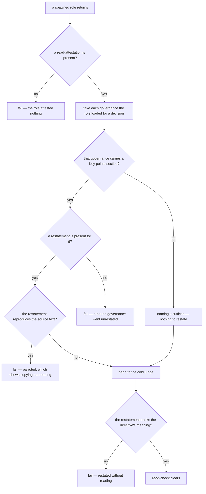

# read-check — did the role actually load and read its governance

## What

Verifies that a spawned role **honestly loaded and read** the governances it was bound by, by
requiring it to return a **read-attestation**: the governances it loaded for the decisions it made,
each with a restatement of that governance's `## Key points (read-check)` **in its own words**.

`mission/resolution` answers *which* bars apply. Nothing answered *whether the role read them*. Ten
governances head a section `## Key points (read-check)` naming the load-bearing directives — the ones
whose misreading is expensive — but no gate, judge, or conductor ever asked a role to restate them,
so the section was inert content and the label named no mechanism.

**Key terms.** *Read-attestation* — the role's returned record of what it loaded and what it
understood. *Restatement* — the role's own-words account of one governance's key points. *Parroting*
— a restatement that reproduces the source text rather than re-expressing it, which demonstrates
copying rather than reading.

**The check is honesty, not comprehension.** "In its own words" is evidence the text was read, not a
grade on how well it was understood. A role that cannot restate a directive did not read it.

**Split, per `authoring/suite-format`'s form-vs-judged rule.** Attestation **presence** and
**parroting** are mechanical and linted; whether a restatement tracks the directive's *meaning* is
**judged**. A green lint clears no honesty question — it only proves nothing was copied and nothing
is missing.

**Non-goals.** It does **not force eager loading**. `../../design/governance-resolution.md` loads a
governance body "only at the decision or gate that invokes it"; read-check attests **what the role
actually loaded for the decisions it made**, never the full declared bar set — a rule demanding
attestation for every declared bar would silently convert lazy loading into eager loading. It is
**not a comprehension score** — there is no rubric and no threshold on restatement quality. It does
**not verify the claim of loading against the harness** — a role that fabricates a governance it
never opened is out of reach here; the restatement is the only evidence.

## Use Cases

| Trigger | Inputs | Outcome |
|---|---|---|
| **attest** — a spawned role finishes and returns | the decisions it made and the governances it loaded for them | a read-attestation accompanying its normal return |
| **lint** — the gate runs its fail-closed pre-judge checks | a returned attestation and the governances it names | pass, or a named failure: absent, incomplete, or parroted |
| **judge** — the cold judge grades the role's work | a lint-clean attestation | a verdict on whether each restatement tracks its directive's meaning |

## Logic

**Why parroting is linted and meaning is judged.** Verbatim overlap is *certain* evidence in one
direction only: high overlap proves the text was copied, so the lint can fail on it without judgment.
Low overlap proves nothing — a fluent paraphrase of an unread directive is still hollow — so the
positive direction must be judged. Linting a similarity score as if it measured understanding would
be the toothlessness this doctrine exists to remove, dressed as a number.

**Why six governances are exempt from restatement.** `lifecycle`, `gate-validation`, `combat-log`,
`plugin-contract`, `solution-producer`, and `spec-producer` carry no `## Key points (read-check)`
section. Naming them satisfies the check: a section that does not exist cannot be restated, and
failing a role for its absence would fail every role bound by them.

## Scenario map

| Edge | Path (Given) | Scenario |
|---|---|---|
| D1 | a role returns its work with no attestation | `a role that attests nothing fails the read-check` |
| D1 | a role returns its work with an attestation | `a role that attests what it loaded proceeds to the lint` |
| D2 | a loaded governance carrying no key-points section | `a governance with no key points is satisfied by naming it` |
| D2 | a loaded governance carrying a key-points section | `a governance with key points requires a restatement` |
| D3 | one bound governance restated, another omitted | `an omitted restatement fails even when the others are present` |
| D3 | every bound governance restated | `an attestation covering every bound governance clears the lint` |
| D4 | a restatement copied from the source text | `a parroted restatement fails the lint` |
| D4 | a restatement written in the role's own words | `an own-words restatement clears the lint` |
| D5 | a fluent restatement contradicting its directive | `a restatement that misses the directive's meaning fails the judge` |
| D5 | a restatement tracking its directive | `an accurate restatement clears the read-check` |
| BOUNDARY | a role that loaded two of its five declared bars | `only the governances actually loaded are attested` |
| BOUNDARY | a lint-clean attestation | `a green lint renders no verdict on honesty` |

## References

- `../resolution/` — the registry read that names which bars apply; read-check attests they were read.
- `../../design/governance-resolution.md` — the lazy-load rule this unit must not break.
- `../../authoring/suite-format/` — the form-vs-judged split this unit's lint/judge boundary follows.
