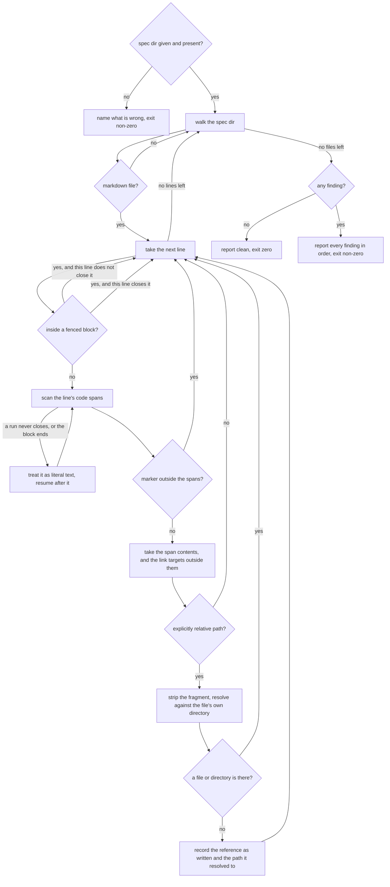

# check-spec-references — every relative reference in a spec node resolves

## What

Walk every `.md` under one project spec, extract each **explicitly-relative** reference, resolve it
**against the file's own directory**, and fail on any that resolves to nothing. Read-only,
deterministic, and — unlike its [`../check-spec-structure/`](../check-spec-structure/README.md)
sibling — **single-severity**: a reference that does not resolve is always a defect, never a
judgment candidate. That is why it has **one mode** rather than an audit mode and a gate mode: a
report mode would differ from the guard by exit code alone, and nobody wants the finding list
without wanting it fixed.

**Why it exists.** The failure is invisible to review. The recurrence this was distilled from was
not a typo but a **consistent off-by-one**: every reference of one shape in a spec corpus was one
directory level short, and every one of them read as entirely plausible — right filename,
right-looking depth, wrong level. Re-reading a reference by eye is not a check on it. Only resolving
it is.

| Stakeholder | Feels it as |
|---|---|
| **the spec author** | writes an anchor with no way to confirm it lands, since the wrong one looks exactly like the right one |
| **the next reader of that spec** | follows an anchor into empty space, having assumed someone verified it — a spec that cites an artifact which does not exist is **worse than one that cites nothing**, because it claims to be anchored while pointing at nothing |
| **`check-project-specs`** | the one invoking actor: needs a verdict it can gate on, uniform across every project |

**Non-goals.** It never judges whether a reference is the *right* artifact to cite (only that the
cited path exists), never follows a reference's content, never checks **link text**, never reaches
outside the spec dir it is given, and never fixes anything (`../align-spec/` is the only engine in
this family that writes).

## Use Cases

One actor invokes it, so there is one use case; everything else the capability decides is a
**divergence within that run**, carried as an extension rather than as a sibling use case with a
stakeholder's name pasted into an actor column.

| # | Actor & goal | Inputs | Main success | Extensions |
|---|---|---|---|---|
| **U1** | **`check-project-specs`** — gate a project on whether its spec's references still resolve | the project-spec directory | every relative reference resolves; exits **zero** | E1 the spec dir is absent or not there → refuse by name; E2 a reference resolves to nothing → report it, naming what it resolved to, and exit non-zero; E3 the text is not a reference (not explicitly relative, in a fence, in a span whose content is not a path, a link inside a span) → not extracted; E4 the target is a directory → resolves; E5 the line is marked → its references are not extracted |

## What counts as a reference

Two forms, and **only when the path is explicitly relative** — it begins with a single- or
double-dot path segment:

- a **markdown link target**, outside any code span — in whichever inline form carries it: plain,
  angle-bracket-wrapped, with a title, or written as a reference-style definition (`[label]: path`).
  The form changes where the path is written, never what it points at. An angle-bracket target may
  carry a space — that is the form's reason to exist — where a bare target and a code span may not.
- an **inline-code span whose whole content is the path** — *whole* meaning exactly that: a span
  holding a path followed by further text is prose that begins with a path, not a citation

**Everything else is prose, not a reference.** This is the rule that makes the repo-root-relative
case pass *by construction* rather than by exception. A spec corpus is full of bare paths that are
illustrative or relative to somewhere other than the repo — a harness config path, a home-relative
tool file, a glob — and a check that resolved them would reject nearly all of them. Requiring the
relative prefix is what separates *this file points there* from *this text mentions a path*. A URL,
an absolute path, and a `~/`-relative path fail that test too.

**A fenced code block is excluded** — it holds a sample command or a diagram, never a citation. The
fence is tracked by **which character opened it and how long the run was**, and closes only on a run
of that same character at least as long. A bare in-fence toggle would flip on any fence-shaped line:
a reference genuinely inside a fence would then be extracted, and — the dangerous direction — a
fence-shaped line nested inside another fence would leave the parity inverted, silently swallowing
every genuinely broken reference after the block.

**Code spans are read as CommonMark delimits them**: a run of N backticks opens, the next run of
exactly N closes, a run that never closes is **literal text the scan resumes after**, and a span
**may wrap across a line break** — the line ending folds to a space, so the span is still one span
and its content is still just the path. Prose here hard-wraps, so a long path in backticks landing
across a break is ordinary rather than exotic, and a line-by-line scan would read two halves and
report neither. A span is bounded by its **block**: inline parsing happens inside one block, so a
span reaches no further than the next blank line, heading, list item, blockquote, thematic break, or
fence. That bound is what makes the wider scanning window safe — without it one unclosed backtick
left by a typo pairs with the first backtick of the next block, swallowing the span about to open
and every reference after it in the flow. A wrapped span's finding is reported against the line it
**opens** on — the line a reader would put a marker beside. That
single rule settles the exhibit case without an exception. A span written around another span has
content that still carries backticks, so it is not a path and not a reference — which is how a spec
shows the reference form it specifies without firing on its own illustration. A span written around
a bare path has that path as its content, so it **is** a reference however many backticks opened it.
A markdown link inside a code span is text on display, so it is not scanned as a link. And a stray
backtick never swallows the rest of its line: abandoning the scan there would let one typo silently
hide every reference after it — this engine's own failure class wearing a different hat.

> An earlier draft excluded *every* doubled-backtick span outright, on the theory that such a span
> exhibits markup. That exclusion was unconditional, so a genuinely broken reference written that
> way escaped silently — reproducing, inside the exclusion, the exact *looks anchored, isn't*
> failure this engine exists to close. It was cut. There is **one** escape hatch, and it is
> explicit.

## Resolution

Against the **directory of the file that carries the reference** — never against the spec root, and
never against the repo root. A trailing fragment is stripped first. A reference **resolves** when
the resulting path exists as a **file or a directory**; a trailing slash is immaterial.

The finding names **both** the reference as written and the path it resolved to. Naming only the
former reproduces the review failure this engine exists to close: the reference as written is
exactly the half that already looked correct.

## The escape hatch

One class of false positive is real and recurs: **prose that quotes a path relative to something
other than the file it sits in** — the text held inside a bridge file, a symlink target relative to
a harness directory. Such a path is structurally indistinguishable from a genuine anchor, so no
narrowing rule separates them; only the author knows.

A line carrying `<!-- spec-ref-ignore -->` has **none of its references** extracted. The marker
takes an optional reason, and the convention is to write one — it sits **beside the prose it
excuses**, so the justification stays where the next reader will meet it, rather than in a registry
that drifts away from what it covers. Its scope is exactly the line it appears on; the rest of the
file stays guarded.

It is matched as a **complete comment**, never as a substring. A marker whose name merely *starts*
with this one's — a typo, a future sibling — does not inherit its power to hide a reference; the
only thing that suppresses is the thing that says so.

And it is read from **outside the code spans**, like every other decision here — no exception for
the escape hatch. Read from the raw line it would fire on a line that merely *quotes* it, which is
how this very node documents it, and that line's genuine references would vanish. An escape hatch a
*description* of the escape hatch can trigger hides exactly what this engine exists to find.

## Control Flow

## Scenario map

One row per scenario. `Edge` names the decision in the graph above that the scenario puts under
test — its `When`, not a decision reached on the way there; `Path` is its `Given`, the state already
reached when that decision is taken. The last rows name a **cross-cutting property** rather than a
single edge (ordering across the whole walk; the write boundary), and say so rather than borrowing
an edge name they do not exercise.

| Edge | Path (Given) | Scenario |
|---|---|---|
| J→K (link form) | a node whose README links a relative path with no file or directory at it | `a markdown link to a path that does not exist is reported` |
| H (link forms) | links to the same missing path written plain, with a title, in angle brackets, and as a reference definition | `a link target is extracted whichever inline form carries it` |
| J→C (link form) | a node whose README links a relative path that exists | `a markdown link to a path that exists is not reported` |
| J→K (code-span form) | a node whose README carries a relative path in an inline-code span with nothing at it | `an inline-code path that does not exist is reported` |
| J→C (code-span form) | a node whose README carries a relative path in an inline-code span that exists | `an inline-code path that exists is not reported` |
| I (own directory) | two files at different depths carrying the same relative reference text | `a reference resolves against the directory of the file that carries it` |
| J→K (one level short) | a reference whose target exists one level further up than the reference reaches | `a reference one directory level short of its target is reported` |
| K (finding shape) | a reference that resolves to nothing | `the finding names the path the reference resolved to` |
| G→C (bare path) | a node carrying a path in inline code that starts with neither a dot-slash nor a dot-dot-slash | `a repo-root-relative path is not extracted` |
| G→C (URL) | a node whose README links an absolute URL | `a URL is not extracted` |
| G→C (absolute / home) | a node carrying an absolute path and a home-relative path in inline code | `an absolute or home-relative path is not extracted` |
| D→C (in a fence) | a node whose fenced code block contains a relative path that does not exist | `a relative path inside a fenced code block is not extracted` |
| D→C (fence identity) | a fenced block whose interior carries a line shaped like a fence of the other delimiter character | `a fence closes only on its own delimiter character, at its own length or longer` |
| G→C (span is not only a path) | a code span whose content is a relative path followed by further text | `a code span carrying a path plus other text is prose` |
| F (wrapped span) | a code span whose relative path lands across a line break, the path resolving to nothing | `a code span that wraps across a line break is still one span` |
| F→F2 (block bound) | an unclosed backtick run, then a line starting a new block, then a code span holding a relative path that does not exist | `a code span does not reach past a block boundary` |
| K (line attribution after a fence) | a fenced block followed by a code span holding a relative path that does not exist | `a finding after a fenced block reports its own line number` |
| F→F2 (blank-line bound) | an unclosed backtick run, a blank line, and then a code span holding a relative path that does not exist | `a code span does not cross a blank line` |
| F (nested span) | a code span whose content is itself an inline-code span around a relative path | `a code span holding another code span is not a path` |
| F (doubled span, bare path) | a code span opened with doubled backticks whose whole content is a relative path that does not exist | `a code span in doubled backticks whose content is a bare path is a reference` |
| F (run-length matching) | a doubled-backtick span whose content carries a nested span followed by a relative path | `a code span closes on a backtick run of its own length` |
| F→F2 (unmatched run) | a line carrying a backtick run that never closes, followed by a code span holding a relative path that does not exist | `an unmatched backtick run does not suppress a later reference on the same line` |
| H (link inside a span) | a code span whose content exhibits a markdown link to a path that does not exist | `a markdown link written inside a code span is not a link` |
| J→C (directory) | a reference whose target is a directory | `a reference resolving to a directory resolves` |
| J→C (trailing slash) | two references to the same existing directory, one with a trailing slash and one without | `a trailing slash on a directory reference is immaterial` |
| I (fragment) | a reference to an existing file followed by a heading fragment | `a heading fragment is stripped before the path is resolved` |
| E→C (marked line) | a line carrying an unresolvable reference and the spec-ref-ignore marker | `a line carrying the ignore marker has none of its references extracted` |
| E→H (marker inside a span) | a line whose code span exhibits the marker, carrying a link to a path that does not exist | `a marker quoted inside a code span does not suppress the line` |
| E→H (marker form) | a line carrying an unresolvable reference and a comment whose name merely starts with the marker's | `the marker is matched as a complete comment, not as a prefix` |
| E→C (marker scope) | one line carrying the marker and a following line carrying an unresolvable reference | `the marker suppresses only the line it appears on` |
| L→N | a project-spec carrying at least one unresolved reference | `an unresolved reference exits non-zero` |
| L→M | a project-spec whose every relative reference resolves | `a spec whose every reference resolves exits zero` |
| X→Y (E1, absent argument) | no project-spec directory is named | `a missing spec dir is refused rather than defaulted` |
| X→Y (E1, bad path) | a named project-spec directory that is not there | `a spec dir that does not exist is refused by name` |
| A→L (all files) | a project-spec carrying several unresolved references across several files | `every unresolved reference is reported, not only the first` |
| cross-cutting (ordering) | a project-spec carrying unresolved references in more than one file | `findings are ordered deterministically` |
| B→C (markdown, any depth) | a project-spec with markdown nested several folders deep beside non-markdown files | `the walk covers markdown at any depth and reads nothing else` |
| cross-cutting (write boundary) | a project-spec carrying unresolved references | `the audit writes nothing` |

## Determinism and the write boundary

- **Pure derivation.** A finding is a function of the file's text and the filesystem alone.
  Findings are ordered by file, then line, then reference, so two runs over an unchanged tree are
  byte-identical.
- **Every finding, not the first.** A single off-by-one lands as a whole family of broken
  references; reporting one at a time would take as many runs to clear as there are levels wrong.
- **Writes nothing.** It emits findings and edits no file. Fixing a reference is an author's edit
  or, at corpus scale, a formation pass ([`../../formation/`](../../formation/README.md)).

## Where it runs

Beside its siblings, from the same per-project entry point. The engine lives at
`../../../../../plugins/sdd/skills/check-spec-references/`, and
`../../../../../plugins/sdd/skills/check-project-specs/` invokes it against the resolved spec dir —
so every project's coverage stays identical and no path is written into a package's scripts.
