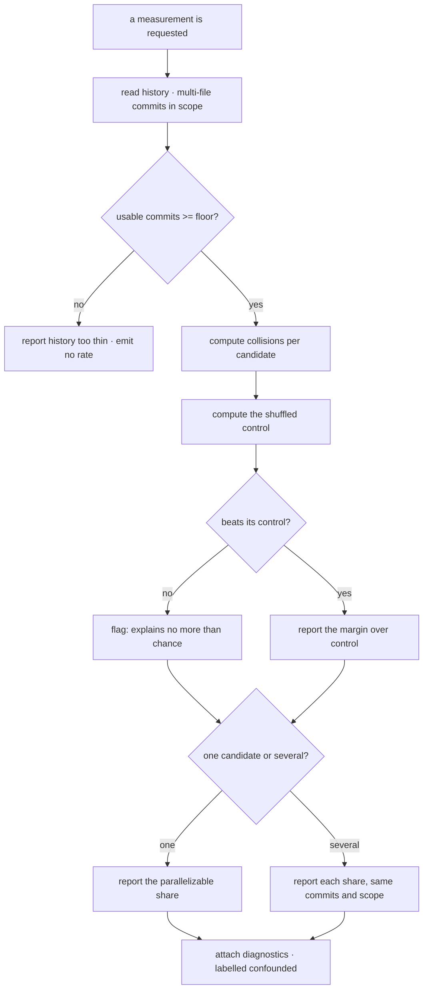

# check-partition-quality — does this layout permit parallel work

## What

Measures, from a project's **own git history**, how much parallel work its layout actually permits —
and compares candidate layouts on the same evidence.

The mission scheduler cuts **one mission per spec-node**, so two changes touching a shared node must
serialize. A layout that scatters a capability across nodes therefore makes ordinary changes collide,
and the schedule degrades toward serial (`../../design/spec-layout.md`, ADR-0025). That argument was
long **asserted rather than measured**; this unit produces the number, per project.

**Key terms.** *Collision* — two changes touching at least one node in common, so they cannot run in
parallel. *Parallelizable share* — one minus the collision rate; the headline. *Control* — the same
measurement over a shuffled partition of identical node sizes, which is what the number must beat to
mean anything.

**Non-goals.** It is **not a gate** — it reports and blocks nothing, because layout is the owner's
call. It is **not automatic** — reading history is slow on a large repo and meaningless on a young
one, so both call sites are opt-in. It is **not a restructuring tool** — it never moves a file.

## Use Cases

| Trigger | Inputs | Outcome |
|---|---|---|
| **measure** — a maintainer asks what parallelism the current layout permits | the repo, a scope, and the current partition | the parallelizable share, its control margin, and the confounded diagnostics labelled as such |
| **compare** — a strategy is being chosen or reconsidered | the repo, a scope, and two or more candidate partitions | each candidate's parallelizable share over the same commits, so the choice is made on the project's own numbers |
| **signal** — a formation pass wants the layout-quality reading it already describes | the repo and the declared partition | the same measurement, surfaced as the advisory layout-quality signal (`../../formation/`) |

## Logic

All three use cases enter one graph and differ only at **D3** (one partition or several).

**Why the headline is collision rate and not the obvious alternatives.** Two metrics were tried first
and both preferred a *layered* partition — the wrong answer — because both are confounded by node
count: a coarser partition scores well for being coarse, and a single-node partition scores perfectly
while permitting no parallel work at all. They are kept as labelled diagnostics precisely so a later
reader does not "simplify" the engine back onto one of them.

## Scenario map

| Edge | Path (Given) | Scenario |
|---|---|---|
| READ | history mixes single- and multi-file commits | `only multi-file changes inform the measurement` |
| READ | a commit spans in-scope and out-of-scope files | `paths outside the measured scope are excluded` |
| D1 | usable commits below the floor | `history below the usable floor is reported rather than scored` |
| D1 | usable commits at or above the floor | `history at or above the floor is measured` |
| D2 | two changes from measured history | `the collision rate is the share of change pairs sharing a node` |
| D2 | a partition of one node | `a partition of one node collides with itself on every pair` |
| CTRL | any measured partition *(convergence)* | `every run reports a shuffled control alongside the measurement` |
| D4 | no better than control | `a partition no better than its control is flagged as explaining nothing` |
| D4 | better than control | `a partition better than its control reports the margin` |
| D3 | several candidates | `two candidate partitions are compared on the same history` |
| REP | a computed rate | `the parallelizable share is reported as the headline` |
| CMP | a completed comparison | `the comparison reports the parallelizable share of each candidate` |
| DIAG | any report *(convergence)* | `the confounded diagnostics are labelled as confounded` |
| DIAG | a coarse and a fine partition | `a coarser partition does not win on the headline by being coarser` |
| BOUNDARY | a completed measurement | `the engine writes nothing to the repository` |
| BOUNDARY | a poor parallelizable share | `the measurement renders no verdict on the layout` |

## References

- **Collision rate is the blast-radius question in the scheduler's terms.** MacCormack, Rusnak &
  Baldwin's **propagation cost** — "the percentage of elements affected, on average, when a change is
  made to one element" — is the same quantity measured over static dependencies; this unit measures it
  over **co-change**, which is what the scheduler actually contends on.
  [Exploring the Structure of Complex Software Designs](https://www.hbs.edu/ris/Publication%20Files/05-016.pdf)
- **Co-change is a legitimate basis for a modularity measure**, not only static imports — propagation
  and clustering cost computed from what changes together.
  [A DSM approach for measuring co-change modularity](https://www.cs.uleth.ca/~gaur/papers/msr2018-43.pdf)
- **Architecture measurably moves the number, and coupling shows up as churn** — tightly coupled
  components never stabilize while loosely coupled ones do, which is why a poor partition costs
  repeated re-opening rather than a one-time loss.
  [Empirical evidence for code modularity](https://swizec.com/blog/empirical-evidence-for-code-modularity/)
