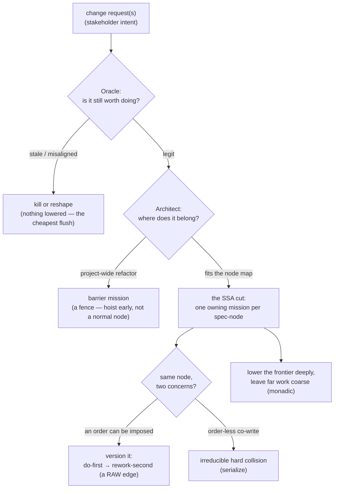

# ssa-lowering — decide how one change request is cut into parallel missions

> **Working node name.** `ssa-lowering` is a placeholder — the final capability/engine name is
> deliberately **not settled yet** (tracked as SQ-name, issue #195). Everything below describes the
> **judgment**, not the name.

When a change request (a stakeholder's "please do X") lands, someone has to decide **how to chop it
up** into the actual pieces of work the fleet will build in parallel. That decision is not mechanical:
it asks *should we even do this?*, *where does each piece belong?*, and *which pieces are allowed to
run at the same time?* This node is the **doctrine** (a skill the coordinator runs while planning)
that guides an agent through making that cut well.

It sits **above** the already-shipped deterministic machinery — the shared work list
([`mission-graph`](../mission-graph/README.md)), the git-diff reconciler
([`touch-set-correction`](../touch-set-correction/README.md)), and the clash classifier
([`collision-ladder`](../collision-ladder/README.md)). Those three are pure functions that *record*
and *compute* over a plan; this node is the **reasoning front-end** that decides **what the plan
should be** in the first place. The design states plainly that this front-end **cannot be
unit-tested** — its output is a *judgment call*, so it is specified and graded the way judgment is:
by **rubric** (graded scenarios), not by exact-answer assertions. That is why it is an
agent-configuration (a skill) and why this suite is an ACED suite.

## Key terms

Plain-language glossary; the word in parentheses is the technical term an engineer may know it by.

| Term | Plain meaning |
|---|---|
| **change request** (CR) | one stakeholder ask ("add X", "fix Y") — the *intake* unit, before it is cut into work |
| **Mission** | one deliverable piece of work — roughly one branch / one pull request, built and tested on its own |
| **Operation** | a group of Missions that together deliver something shippable |
| **write-set** | everything a change request would create or modify — the raw material the cut partitions |
| **spec-node** (`project + capability + artifact-type`) | SDD's stable work atom — the capability a Mission owns, its contract being its frozen `.feature`; the thing the cut hands out |
| **the cut** (lowering) | the act of splitting a change request's write-set into Missions — the core judgment this node guides |
| **SSA — one owning mission per spec-node** (single static assignment) | the target shape of a good cut: **exactly one** Mission is allowed to write each spec-node, so two Missions can never fight over the same capability |
| **single-writer** | the property that follows from SSA — no spec-node is assigned to two Missions at once |
| **cohesion** | keeping tightly-coupled work *together* in one Mission instead of scattering it — the opposite failure from splitting a node |
| **contention** | two different concerns both wanting to write the **same** spec-node — the case versioning resolves |
| **versioned-RAW** | resolving a contention by **imposing an order**: do concern A first, then rebase/rework concern B on top — turning a "they clash" into a plain "B waits for A" dependency |
| **RAW** (read-after-write) | a true dependency: B needs something A produces → A must finish before B starts |
| **WAW** (write-after-write) | two Missions writing the same thing → they must not run at the same time; **reducible** to a versioned-RAW whenever an order can be imposed, **irreducible-hard** only when the two writes are order-less concurrent co-writes |
| **barrier** (fence) | a project-wide change (an architecture refactor, a rename) that touches almost everything — it owns no single node, so it must be **called out explicitly and hoisted early**, never scheduled as a normal node-owning Mission |
| **Oracle lens** | the "should we?" judgment — is the change request still legitimate, or has it gone **stale** (already solved) or **misaligned** (wrong product direction)? Kills or reshapes a dead CR **before** lowering wastes effort |
| **Architect lens** | the "how?" judgment — node placement (screaming architecture), barrier detection, and the cohesion of the cut |
| **frontier** | the near-term work about to be started; the far horizon is speculation |
| **monadic / lazy lowering** | cut the **frontier** in detail now; leave far work **coarse** until it approaches, then refine it — "commit near, speculate far" (monadic = the plan is discovered as you go, not known all at once) |
| **conservative-first** | when the touch-set is uncertain (low confidence), treat a suspected clash as a **real** clash (serialize) rather than optimistically running the two Missions together |
| **provenance** | the record of *where a Mission came from* — its originating change request(s), kept on the Mission even after the cut regroups work across CR boundaries |
| **mission-ref minted locally** | a Mission gets its **own local id** (from the work list) rather than a tracker ticket — because a Mission is a *local decomposition* of intent, not a 1:1 copy of a CR |

## Use Cases

**Fit:** strong

**Subject** — the **cut**: the judgment of turning one-or-more change requests into a partitioned set
of Missions, applying the **Oracle** lens (should we do this at all?), the **Architect** lens (where
does each piece belong, is it a barrier?), and the **SSA** target (one owning Mission per spec-node),
resolving same-node contention by **versioning** it into an ordered dependency, and lowering only the
**frontier** deeply while leaving far work coarse. It is a doctrine the coordinator runs by hand
during intake/Explore.

**Non-goals** — it does **not** build the Missions (the mission loop does), **record** the plan (the
[`mission-graph`](../mission-graph/README.md) store does — this node *decides* what to record), detect
or classify a collision at a fine grain (the [`collision-ladder`](../collision-ladder/README.md)
does), reconcile a declared touch-set against a real diff (the
[`touch-set-correction`](../touch-set-correction/README.md) does), or **automate the emit** of its
own decision-evidence (that is a separate deferred mission, SQ-F5 #194 — in this v1 the coordinator
records the judgment by hand). It also does not finalize the capability's **name** (SQ-name #195) or
automate the Oracle/Architect **intake vetting** (SQ-intake #196). It **decides the cut**; it does not
execute, store, or classify.

| What you want | The situation you give it | What a good cut produces | Scenario |
|---|---|---|---|
| **not waste effort on dead work** — a CR filed long ago may be stale | a change request whose goal a shipped change already covers | the CR is **killed or reshaped before lowering**; a killed CR lowers to **zero** Missions | `Scenario: a stale change request is killed or reshaped before any lowering` |
| **hoist a fence** — a project-wide refactor can't ride a normal schedule | a CR that renames/re-shapes something touching most of a project | it is called out as a **barrier** and **hoisted early**, not scheduled as a normal node-owning Mission | `Scenario: a project-wide refactor is recognized as a barrier and hoisted early` |
| **place each piece where it screams** — new work needs a home | a CR that introduces two distinct new capabilities | each capability lands in its **own** screaming-architecture spec-node | `Scenario: the cut places each new capability in its own node` |
| **never let two Missions fight over one capability** | a write-set spanning several spec-nodes | **exactly one** owning Mission per spec-node (single-writer) | `Scenario: every spec-node in the write-set is owned by exactly one mission` |
| **keep coupled work together** — don't scatter a tightly-linked change | a CR whose changes to one spec-node are tightly coupled | the coupled work stays in **one cohesive** Mission — not over-split | `Scenario: coupled work in one spec-node stays in a single cohesive mission` |
| **regroup by ownership, not by ticket** | two CRs that both touch a shared capability | Missions **cross CR boundaries** — N CRs → M Missions, each recording its originating CR(s) as provenance, its ref minted locally | `Scenario: two change requests regroup by ownership into missions that cross CR boundaries` |
| **turn a clash into an order** — two concerns want the same node | a same-node contention where an order **can** be imposed | it becomes a **versioned-RAW** (do-first, rework-second), **not** two concurrent writers | `Scenario: a same-node contention is resolved by imposing an order into a versioned-RAW edge` |
| **hold a genuine hard clash** — no order to impose | two order-less concurrent co-writes of one node | left as an **irreducible hard** collision (serialized), flagged as needing rework | `Scenario: an order-less concurrent co-write is left as an irreducible hard collision` |
| **commit near, speculate far** | a CR with a knowable frontier and a fuzzy far horizon | the **frontier** is lowered in detail; far work is left **coarse** until it approaches | `Scenario: only the frontier is deeply lowered while far work is left coarse` |
| **stay safe when unsure** | a low-confidence, partially-predicted touch-set | a suspected clash is treated as **hard** (serialized), not optimistically parallelized | `Scenario: a low-confidence touch-set is treated as a hard collision` |
| **don't over-serialize a clean split** | a write-set of genuinely independent spec-nodes | the Missions carry **no fabricated dependency** between independent nodes — they can run in parallel | `Scenario: independent spec-nodes are lowered without a fabricated dependency between them` |
| **see the reasoning behind the cut** | any cut — a killed CR alongside one lowered across several nodes | a **decision-evidence record** accompanies the partition, stating each Oracle and Architect verdict and its cause | `Scenario: the produced partition is accompanied by a decision-evidence record` |

Every scenario in [`ssa-lowering.feature`](./ssa-lowering.feature) maps to one of these entries or to
its activation (the `@trigger` outline). The graded ("does it judge well?") behaviors are `@rubric`
scenarios; the structural invariants a cut must **never** violate (single-writer, a killed CR lowers
to nothing, a barrier is never a normal node, the decision-evidence record accompanies the partition)
are plain boolean guards. The split is deliberate: **presence** of an artifact is a boolean guard,
**quality of a judgment** is a rubric dimension — never the reverse.

## How the cut is judged — the two lenses, then the mechanics

The front-end is **judgment first, mechanics second**. Two SDD actor lenses are pulled *forward* from
the spec gate into planning, applied with **strong weight**, so a bad change request never reaches the
partitioner:

1. **Oracle — should we?** Is the CR still legitimate: does it still **improve the product**? A CR can
   be **stale** (a better solution shipped since it was filed) or **misaligned** (wrong product
   direction). The Oracle **kills or reshapes it before lowering** — the cheapest possible flush,
   because nothing is lowered. This is **re-checked monadically**: a far-horizon CR legit at filing can
   go stale while parked, so it is re-validated when it approaches the frontier, never trusted blindly.
2. **Architect — how?** Node placement (screaming architecture), **barrier detection** (a project-wide
   refactor is a fence, hoisted early — it owns no one node, so it cannot be a normal node-owning
   Mission), and the **cohesion** of the cut.

Then the **SSA cut** partitions the write-set toward **one owning Mission per spec-node**:

- **Single-writer.** Each spec-node the write-set touches is assigned to **exactly one** Mission. A
  new node is single-writer by construction; contention only ever arises on an **existing shared** node.
- **High cohesion.** Tightly-coupled work in one node stays in one Mission — don't over-split coupled
  work into many thin Missions.
- **Crosses CR boundaries.** Missions regroup work by **ownership**, not by originating CR — so N CRs
  can produce M Missions (not 1:1). The regroup is **local**: a Mission lists its originating CR(s) as
  **provenance** and its ref is **minted locally** (the tracker speaks intent, not decomposition).
- **Resolve contention by versioning.** Two concerns writing the same node X → version it
  (`X_v1` by A, then `X_v2` by B) with a **RAW edge** between them. A WAW is **only irreducibly hard**
  when the two writers are otherwise independent — order-less concurrent co-writes with no order to
  impose. Whenever an order *can* be imposed, versioning **is** the resolution (serialize at issue:
  do-first, rebase/rework-second). The coarser the atom, the more a same-node clash biases to serial.
- **Lower lazily.** Deeply lower only the **frontier**; leave far work coarse until it approaches.
  Start **conservative-first** — a low-confidence or unproven overlap is treated as a hard clash and
  relaxed to parallel only as finer evidence arrives, never optimistically parallelized.

## How it's tested

The judgment **cannot be unit-tested** — lowering and the Oracle/Architect verdicts are *calls*, not
pure functions, so there is no fixture that pins "the one right cut". Instead the doctrine is graded
by **ACED**: each `@rubric` scenario presents a described change request (and repo state) and grades
the produced partition against a rubric frozen in the scenario. The **structural invariants** a valid
cut must never break — single-writer, a killed CR lowering to nothing, a barrier never scheduled as a
normal node — are plain **boolean** guards checkable over the produced partition.

Two rules keep the rubrics **binding** (issue #221 — the suite previously scored 9/9 runs at ceiling
with zero variance, i.e. it could not register a miss):

- **Presence is never graded; only judgment is.** Whether the decision-evidence record *exists* is a
  **boolean guard** (`Scenario: the produced partition is accompanied by a decision-evidence record`),
  not a rubric dimension — a dimension scoring "the verdict was written down" is unloseable, because
  the doctrine emits it unconditionally. Rubric dimensions grade whether the *call* was **right**.
- **Every dimension must be independently loseable, and the threshold sits one point below the
  dimensions' combined max.** So dropping a whole dimension fails the scenario, while a correct cut
  that scores partial credit on one dimension still passes. Restatements of a sibling dimension are
  folded into it rather than counted twice.

The decision-evidence a planning pass leaves behind (its shown-work) is recorded **by hand** in v1;
the **automated emit** of that evidence is a separate deferred mission (SQ-F5 #194) and is out of
scope here. The boolean guard asserts that record accompanies the partition, so **no rubric dimension
depends on SQ-F5** — the by-hand record is checked once, structurally, rather than presumed by the
scoring.

### What this suite can and cannot detect

Stated plainly, because this node's previous gate recorded a discrimination claim that was later
**measured false**:

**It can detect** a doctrine that drops a whole judgment — one that fails to catch a stale or
misaligned CR, lowers a dead CR anyway, misses a barrier or schedules it late, fuses two capabilities
into one node, splits a shared node per-CR, calls an order-imposable contention irreducible, lowers
the far horizon, or parallelizes an unproven overlap. Each such loss costs a full dimension, which is
more than the one point of slack **this suite's** thresholds carry — a slack measured against **this
suite's** judge, and (see below) one that did not reproduce. No threshold anywhere is entitled to a
point of slack by default: the margin is the judge's noise at the cut, which is measured per suite,
never decreed.

**It cannot detect:**

- **Ordering — the kill-before-lowering blind spot.** The doctrine's step 1 kills dead work *before*
  partitioning, and the cost of getting this wrong is a property of the **trace** (effort spent
  lowering work that was then thrown away). But every assertion here observes the **produced
  partition**, where kill-then-lower and lower-then-kill are **extensionally identical** — both end
  with zero missions for a killed CR. A "lower first, then prune the dead missions" doctrine
  therefore **passes this suite**. The `-before-lowering` ordering clauses were removed from the
  rubrics rather than left in, because grading step order against a doctrine whose step 1 is *titled*
  "before lowering" measured procedural compliance, not judgment — it was unloseable, not protective.
  This gap is accepted **by design**: closing it needs an observation of the **trace** (e.g. asserting
  no mission was ever cut for a CR that was then killed) rather than of the produced partition — a new
  observation surface this suite does not have, and out of scope for #221.
- **Memorization.** These scenarios are fixed and public to the graded doctrine. An agent that
  pattern-matches a probe to a remembered answer still earns the live dimensions without exercising
  the judgment. Re-cutting the probes off the doctrine's worked examples (#211/#215) raised the cost
  of recall but does not close it. **One probe now bites on memorization** (#222): every other Oracle
  scenario is a clean single-branch instantiation of §1's two-branch taxonomy, so a memorizing agent
  shape-matches it to full marks; `the Oracle gate judges a change request that carries two separate
  asks` is dual-branch, matches no template, and is measured to fail both memorizing reads (see
  *Where the margin is thin*). It is **one** probe against **one** taxonomy — the rest of the suite
  still raises the bar against a *sloppy* doctrine rather than a *memorizing* one, so treat the
  memorization limit as **narrowed, not closed**.
- **Partial degradation within a dimension.** A doctrine that reasons weakly but arrives at the right
  call can still score full marks, since scoring reads the produced partition, not the deliberation
  quality behind it.

**Where the margin is thin.** Stated so a future pass does not mistake a narrow pass for a comfortable
one — and, for the one probe that has a measured failing read, so a future pass does not mistake a
*measured* margin for an assumed one:

- **`the Oracle gate judges a change request that carries two separate asks` — measured across five
  conditions (#222), the only Oracle probe with a measured *failing* read.** Production was separated
  from scoring: each plan was produced by an agent that never saw the rubric, then scored by a cold
  `aced-case-judge` that saw only the scenario and one anonymized plan. Scores are
  `spacing-part-on-supersession` / `cursor-part-on-direction-fit`, threshold 5 of 6.

  | condition | scores | result |
  |---|---|---|
  | full doctrine, genuine reasoning | 3 / 3 = 6 | PASS |
  | full doctrine, memorizer fires the **stale** template wholesale | 3 / 0 = 3 | FAIL |
  | full doctrine, memorizer fires the **misaligned** template wholesale | 0 / 3 = 3 | FAIL |
  | mutant: §1's **Misaligned** branch deleted, its vocabulary scrubbed | 3 / 1 = 4 | FAIL |
  | mutant: §1's **Stale** branch deleted, its vocabulary scrubbed | 3 / 3 = 6 | **PASS** |

  Two things this buys and one it does not. The **independence** of the two dimensions is
  *demonstrated, not asserted* — the two memorizing reads land at `(3,0)` and `(0,3)`, so each
  dimension is observed at both full marks and zero, and neither is free points. The
  **`cursor-part-on-direction-fit`** dimension is bound to §1's Misaligned branch: deleting that
  branch drops the scenario to 4/6.
  **`spacing-part-on-supersession` is NOT the guard for §1's Stale branch** — deleting that branch
  left the scenario at 6/6, because *When to run* independently carries "re-validate it — never trust
  the filing-time verdict", which is enough to derive the supersession. The dimension binds to the
  doctrine redundantly, not to that one paragraph. Do not cite this scenario as Stale's guard.
- **No impl-gate PASS on this scenario can ever equal the table above — the reason is structural, not
  a fixable protocol bug.** An impl gate runs the **correct-doctrine arm only**. The table's other four
  arms — two memorizing reads and two rule-deletion mutants — are what establish that the dimensions
  are loseable and bound to a rule; a passing gate run does not execute them and therefore cannot
  re-establish it. **A green impl gate says the doctrine still reasons; only an ablation says the probe
  can still fail.** Re-run the arms when the doctrine's Oracle lens changes — a pass is not a substitute.
- **A second, *fixable* hazard sits underneath that one: `aced-case-judge` simulates the agent and
  scores it in one context**, holding the scenario's name and its inline rubric — the answer key —
  while simulating (**#252**; this scenario's title withholds what it can, but the rubric's dimension
  comments still state the correct call, and the sibling titles leak outright — **#253**). A judge is
  **not obliged** to score that way: #222's own impl gate separated production from scoring by hand and
  measured 6/6 across three runs. So treat this as a hazard to **defeat per run**, not a standing
  discount — and do not let defeating it be mistaken for discharging the paragraph above, which it
  never touches.

- **`catches-misalignment` has been measured twice and the two disagree — 2.33/3 and 3.00/3, both
  against a *correct* doctrine.** The 2.33 is what `threshold = combined max − 1` was calibrated on,
  and it **did not reproduce**: a later run measured 3.00/3 with zero variance, clearing the
  threshold of 5 by a full point rather than the 0.33 the 2.33 implied. Treat the one-point slack as
  calibrated on a value that does not replicate — a sample of two, not a measurement. This pass also
  *added* load to that dimension (folding `not-mistaken-for-stale` into it, so it must now judge on
  direction-fit *rather than* supersession), which is a reason to keep the slack rather than tighten
  it, but the slack is **not** evidence-backed and must not be reported as though it were.
- **`barrier`'s margin is now *unmeasured*, and that is a change from what was once measured.** The
  only dimension this suite has ever measured with real run-to-run variance was
  `fleet-rebase-reasoned` (1, 1, 2 against a *correct* doctrine). That variance was **instrument
  error, not signal** — the dimension graded a rule the doctrine never states — so it was removed
  (see the coverage note). Removing it was right, and it leaves `barrier` at two dimensions both of
  which measure at ceiling against a correct doctrine (6.00, SD 0). `barrier`'s slack is no longer
  reasoned — it is **measured by ablation**: with step 2's barrier rule deleted, the scenario scores
  **3.67 and fails 3 of 3** against a threshold of 5. It binds. Note the binding runs opposite to
  what was first reasoned here: the ablation drops `hoisted-early` to **1.33** while `barrier-detected`
  holds at **2.33**, so it is *hoisting* — not naming the fence — that a doctrine lacking the rule
  loses. Generic engineering sense apparently reaches "call this a big cross-cutting rename" more
  easily than it reaches "therefore nothing else may start until it retires".
- **`irreducible` is the weakest rubric.** Its situation states that the two concerns *"must both
  write the same spec-node with no order that avoids rework either way"* — which hands over **both**
  answers the rubric grades (the irreducibility *and* the rework). A doctrine lacking step 4's rule
  can parrot the situation to roughly 3 against a threshold of 4, failing by a single point — and on
  a generous read it can reach **4 and pass outright** (2 for the parroted irreducibility, 2 for the
  rework the situation names). This is the one rubric a parroting doctrine can plausibly clear, and
  it is held down only by the fold of `serialized-not-parallel` into `irreducible-recognized`, which
  adds an *act* the situation does not hand over. Treat this cell as not yet trustworthy. Closing it
  needs a situation that withholds the answer, i.e. a Given edit — out of scope here.
- **`misaligned` contradicts this suite's own `@trigger` outline, and reds a correct doctrine about a
  third of the time** ([#249](https://github.com/cyberuni/cyberplace/issues/249)). The outline says
  the doctrine must **not** run on *"a single-capability change to one artifact-type"*, and the
  `misaligned` situation is exactly that shape (one CR, one capability). Measured N=3 against the
  correct doctrine: **1 of 3 producers took the doctrine's own do-not-run exit**, emitted no
  partition, and scored **0/6 against a threshold of 5**. The rubric graded that empty artifact
  *correctly* — this is not a rubric defect, it is the scenario disagreeing with the outline in the
  same frozen file. Until #249 resolves which side is right, a red on `misaligned` should be read as
  this contradiction before it is read as doctrine error.
- **`contention`/`order-imposed` and `far-horizon`/`re-checked-not-trusted` are cued** — their
  situations hand over part of the answer (the order's existence; that the ground has shifted), so a
  doctrine lacking the rule starts above zero. Both still bind, but with less room than the
  arithmetic suggests.

### Calibration — and what the impl gate should measure

- **`threshold = combined max − 1`** is calibrated against the **one** off-ceiling score ever measured
  on this suite (`catches-misalignment`, 2.33/3 mean, produced by a **correct** doctrine). If an
  `eval.judge.model` swap shifts the scoring distribution, the one-point slack must be **re-measured,
  not assumed**.
- **`cohesion` is a boolean guard, not a rubric — because ablation proved its dimension unloseable.**
  It was first kept as a single-dimension rubric at `threshold = max`, on the reasoning that its
  situation admits exactly one judgment. The impl gate tested that by **deleting the cohesion rule
  from the doctrine entirely** and re-scoring: the scenario still scored **3/3, three runs of three**.
  Judges were scoring it off **single-writer** — the situation confines the work to *one* spec-node,
  and "exactly one owning Mission per spec-node" already guarantees one node lands in one Mission.
  `cohesion-preserved` could not register a miss, which is the exact defect this suite was reworked
  to remove.

  So it goes where an unloseable assertion belongs: a **boolean guard**. That is honest — it stops
  claiming to *grade* a judgment it cannot grade, and asserts the invariant it can actually check.
  Grading real cohesion judgment needs a situation planting an **over-split temptation** — coupled
  work whose seams read as separable capabilities — which is a Given edit and out of #221's scope,
  filed as [#250](https://github.com/cyberuni/cyberplace/issues/250). Note the direction: cohesion's
  miss is **over-split** (scattering one node into fragments). An *over-merge* temptation would not
  de-entail the assertion — single-writer still forces the coupled node into one mission however many
  other nodes exist — and over-merge is already graded by `disjoint-nodes-not-fused`.

  **Method note for the next pass, which cost this one a cycle:** the pre-registered trigger here was
  *"if the impl gate measures `cohesion-preserved` below a 3.0 mean → demote."* It could never fire.
  3.00 was the dimension's **floor**, not a pass — the condition presumed the loseability that was
  itself in doubt. **A measured ceiling is not evidence a dimension works; it is consistent with a
  dimension that cannot fail.** Test loseability by **ablating the rule and re-scoring**, never by
  watching the mean against a correct subject.
- **`relax-on-evidence`** grades the correctness of the relaxation *condition* (finer evidence proving
  disjointness) rather than its emission. It is the dimension closest to the presence-grading this
  pass removed; if it measures at ceiling with zero variance across runs, re-examine it next.

**Coverage note — step 2's fleet-rebase rule is a boolean guard, not a dimension.** This rule states
that *"the fleet rebases onto the new world after the fence, then fans out"*. Grading it as a rubric
dimension was tried and **reverted**: a first pass at this rework kept `fleet-rebase-reasoned` (max 2)
and, in trying to lift it out of presence-grading, restated it as *"the feature missions are planned
against the post-rename world"* — a requirement **the doctrine does not state**. Measured against the
correct doctrine it scored 1, 1, 2, docked precisely because the rubric asked for something the
subject was never told to do. A dimension that grades an unstated rule reds a correct doctrine; it
does not measure it.

The rule is presence, not judgment — the doctrine says the rebase happens, and the plan either records
it or does not — so it now lives where presence belongs: as a clause on the barrier boolean guard,
worded to the doctrine's own words. The rule keeps its coverage; `barrier` keeps two orthogonal graded
dimensions at a threshold of 5. If a rubric dimension for this rule is ever wanted, the doctrine must
first say what the dimension would grade.

## Delivery

Built as a **skill** — the reasoning-front-end doctrine the coordinator runs during intake/Explore. It
is **not** an engine: it emits no `.mts`, computes nothing deterministically, and holds no state. It
**decides** the partition (Missions, RAW edges, per-Mission touch-sets and provenance) that the
deterministic back-end then records into the [`mission-graph`](../mission-graph/README.md) store and
classifies with the [`collision-ladder`](../collision-ladder/README.md). In v1 the two judgment lenses
(Oracle, Architect) are applied **by hand** — they are not new roles, just the existing spec-gate bars
exercised earlier in the loop. The capability/engine **name is not final** (SQ-name #195); this node
uses `ssa-lowering` as its working name.

## Source

- **new** — no prior version. Built as the **cyberfleet-batch** change request, Op2 ★ capstone
  (GitHub issue #189, the third-bullet's **second half** — the reasoning front-end above the shipped
  deterministic back-end: [`mission-graph`](../mission-graph/README.md),
  [`touch-set-correction`](../touch-set-correction/README.md),
  [`collision-ladder`](../collision-ladder/README.md)). This mission closes #189.
- **Why (design records):** the compiler/CPU-scheduler model — CR-parallelism as an optimizing-compiler
  lowering pass — is [ADR-0025](../../../../artifacts/adr/0025-mission-graph-compiler-scheduler-model.md);
  the full procedure (the SSA-lowering steps, the Oracle+Architect intake lenses, barrier missions,
  the CR↔Operation↔mission mapping, planning provenance) is the **cyberfleet-batch** design brief. The
  decision-evidence *emit* automation (SQ-F5 #194), the name finalization (SQ-name #195), and the
  intake-vet automation (SQ-intake #196) are cited there as **deferred**, out of this node's scope.
