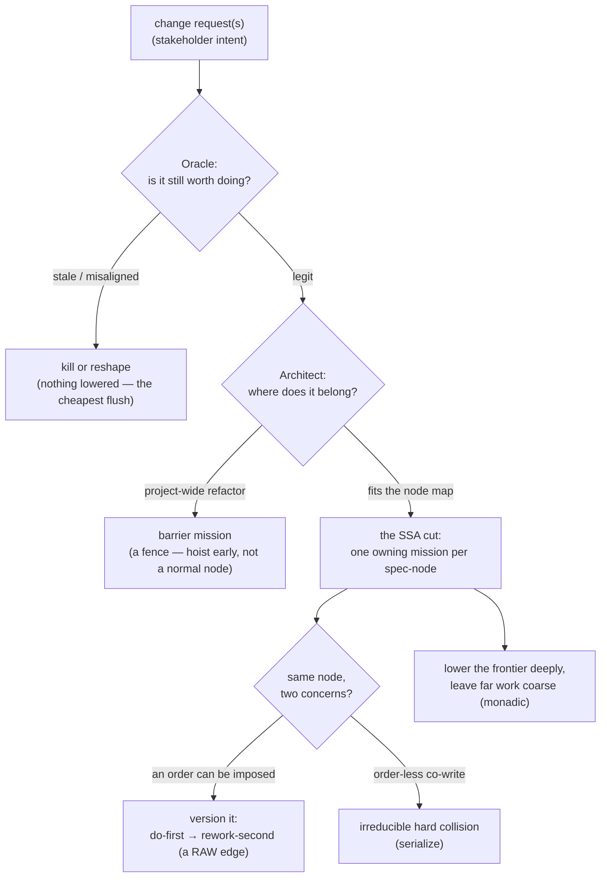

# ssa-lowering — decide how one change request is cut into parallel missions

> **Working node name.** `ssa-lowering` is a placeholder — the final capability/engine name is
> deliberately **not settled yet** (tracked as SQ-name, issue #195). Everything below describes the
> **judgment**, not the name.

When a change request (a stakeholder's "please do X") lands, someone has to decide **how to chop it
up** into the actual pieces of work the fleet will build in parallel. That decision is not mechanical:
it asks *should we even do this?*, *where does each piece belong?*, and *which pieces are allowed to
run at the same time?* This node is the **doctrine** (a skill the coordinator runs while planning)
that guides an agent through making that cut well.

It sits **above** the already-shipped deterministic machinery — the shared work list
([`mission-graph`](../mission-graph/README.md)), the git-diff reconciler
([`touch-set-correction`](../touch-set-correction/README.md)), and the clash classifier
([`collision-ladder`](../collision-ladder/README.md)). Those three are pure functions that *record*
and *compute* over a plan; this node is the **reasoning front-end** that decides **what the plan
should be** in the first place. The design states plainly that this front-end **cannot be
unit-tested** — its output is a *judgment call*, so it is specified and graded the way judgment is:
by **rubric** (graded scenarios), not by exact-answer assertions. That is why it is an
agent-configuration (a skill) and why this suite is an ACED suite.

## Key terms

Plain-language glossary; the word in parentheses is the technical term an engineer may know it by.

| Term | Plain meaning |
|---|---|
| **change request** (CR) | one stakeholder ask ("add X", "fix Y") — the *intake* unit, before it is cut into work |
| **Mission** | one deliverable piece of work — roughly one branch / one pull request, built and tested on its own |
| **Operation** | a group of Missions that together deliver something shippable |
| **write-set** | everything a change request would create or modify — the raw material the cut partitions |
| **spec-node** (`project + capability + artifact-type`) | SDD's stable work atom — the capability a Mission owns, its contract being its frozen `.feature`; the thing the cut hands out |
| **the cut** (lowering) | the act of splitting a change request's write-set into Missions — the core judgment this node guides |
| **SSA — one owning mission per spec-node** (single static assignment) | the target shape of a good cut: **exactly one** Mission is allowed to write each spec-node, so two Missions can never fight over the same capability |
| **single-writer** | the property that follows from SSA — no spec-node is assigned to two Missions at once |
| **cohesion** | keeping tightly-coupled work *together* in one Mission instead of scattering it — the opposite failure from splitting a node |
| **contention** | two different concerns both wanting to write the **same** spec-node — the case versioning resolves |
| **versioned-RAW** | resolving a contention by **imposing an order**: do concern A first, then rebase/rework concern B on top — turning a "they clash" into a plain "B waits for A" dependency |
| **RAW** (read-after-write) | a true dependency: B needs something A produces → A must finish before B starts |
| **WAW** (write-after-write) | two Missions writing the same thing → they must not run at the same time; **reducible** to a versioned-RAW whenever an order can be imposed, **irreducible-hard** only when the two writes are order-less concurrent co-writes |
| **barrier** (fence) | a project-wide change (an architecture refactor, a rename) that touches almost everything — it owns no single node, so it must be **called out explicitly and hoisted early**, never scheduled as a normal node-owning Mission |
| **Oracle lens** | the "should we?" judgment — is the change request still legitimate, or has it gone **stale** (already solved) or **misaligned** (wrong product direction)? Kills or reshapes a dead CR **before** lowering wastes effort |
| **Architect lens** | the "how?" judgment — node placement (screaming architecture), barrier detection, and the cohesion of the cut |
| **frontier** | the near-term work about to be started; the far horizon is speculation |
| **monadic / lazy lowering** | cut the **frontier** in detail now; leave far work **coarse** until it approaches, then refine it — "commit near, speculate far" (monadic = the plan is discovered as you go, not known all at once) |
| **conservative-first** | when the touch-set is uncertain (low confidence), treat a suspected clash as a **real** clash (serialize) rather than optimistically running the two Missions together |
| **provenance** | the record of *where a Mission came from* — its originating change request(s), kept on the Mission even after the cut regroups work across CR boundaries |
| **mission-ref minted locally** | a Mission gets its **own local id** (from the work list) rather than a tracker ticket — because a Mission is a *local decomposition* of intent, not a 1:1 copy of a CR |

## Use Cases

**Fit:** strong

**Subject** — the **cut**: the judgment of turning one-or-more change requests into a partitioned set
of Missions, applying the **Oracle** lens (should we do this at all?), the **Architect** lens (where
does each piece belong, is it a barrier?), and the **SSA** target (one owning Mission per spec-node),
resolving same-node contention by **versioning** it into an ordered dependency, and lowering only the
**frontier** deeply while leaving far work coarse. It is a doctrine the coordinator runs by hand
during intake/Explore.

**Non-goals** — it does **not** build the Missions (the mission loop does), **record** the plan (the
[`mission-graph`](../mission-graph/README.md) store does — this node *decides* what to record), detect
or classify a collision at a fine grain (the [`collision-ladder`](../collision-ladder/README.md)
does), reconcile a declared touch-set against a real diff (the
[`touch-set-correction`](../touch-set-correction/README.md) does), or **automate the emit** of its
own decision-evidence (that is a separate deferred mission, SQ-F5 #194 — in this v1 the coordinator
records the judgment by hand). It also does not finalize the capability's **name** (SQ-name #195) or
automate the Oracle/Architect **intake vetting** (SQ-intake #196). It **decides the cut**; it does not
execute, store, or classify.

| What you want | The situation you give it | What a good cut produces | Scenario |
|---|---|---|---|
| **not waste effort on dead work** — a CR filed long ago may be stale | a change request whose goal a shipped change already covers | the CR is **killed or reshaped before lowering**; a killed CR lowers to **zero** Missions | `Scenario: a stale change request is killed or reshaped before any lowering` |
| **hoist a fence** — a project-wide refactor can't ride a normal schedule | a CR that renames/re-shapes something touching most of a project | it is called out as a **barrier** and **hoisted early**, not scheduled as a normal node-owning Mission | `Scenario: a project-wide refactor is recognized as a barrier and hoisted early` |
| **place each piece where it screams** — new work needs a home | a CR that introduces two distinct new capabilities | each capability lands in its **own** screaming-architecture spec-node | `Scenario: the cut places each new capability in its own node` |
| **never let two Missions fight over one capability** | a write-set spanning several spec-nodes | **exactly one** owning Mission per spec-node (single-writer) | `Scenario: every spec-node in the write-set is owned by exactly one mission` |
| **keep coupled work together** — don't scatter a tightly-linked change | a CR whose changes to one spec-node are tightly coupled | the coupled work stays in **one cohesive** Mission — not over-split | `Scenario: coupled work in one spec-node stays in a single cohesive mission` |
| **regroup by ownership, not by ticket** | two CRs that both touch a shared capability | Missions **cross CR boundaries** — N CRs → M Missions, each recording its originating CR(s) as provenance, its ref minted locally | `Scenario: two change requests regroup by ownership into missions that cross CR boundaries` |
| **turn a clash into an order** — two concerns want the same node | a same-node contention where an order **can** be imposed | it becomes a **versioned-RAW** (do-first, rework-second), **not** two concurrent writers | `Scenario: a same-node contention is resolved by imposing an order into a versioned-RAW edge` |
| **hold a genuine hard clash** — no order to impose | two order-less concurrent co-writes of one node | left as an **irreducible hard** collision (serialized), flagged as needing rework | `Scenario: an order-less concurrent co-write is left as an irreducible hard collision` |
| **commit near, speculate far** | a CR with a knowable frontier and a fuzzy far horizon | the **frontier** is lowered in detail; far work is left **coarse** until it approaches | `Scenario: only the frontier is deeply lowered while far work is left coarse` |
| **stay safe when unsure** | a low-confidence, partially-predicted touch-set | a suspected clash is treated as **hard** (serialized), not optimistically parallelized | `Scenario: a low-confidence touch-set is treated as a hard collision` |
| **don't over-serialize a clean split** | a write-set of genuinely independent spec-nodes | the Missions carry **no fabricated dependency** between independent nodes — they can run in parallel | `Scenario: independent spec-nodes are lowered without a fabricated dependency between them` |

Every scenario in [`ssa-lowering.feature`](./ssa-lowering.feature) maps to one of these entries or to
its activation (the `@trigger` outline). The graded ("does it judge well?") behaviors are `@rubric`
scenarios; the structural invariants a cut must **never** violate (single-writer, a killed CR lowers
to nothing, a barrier is never a normal node) are plain boolean guards.

## How the cut is judged — the two lenses, then the mechanics

The front-end is **judgment first, mechanics second**. Two SDD actor lenses are pulled *forward* from
the spec gate into planning, applied with **strong weight**, so a bad change request never reaches the
partitioner:

1. **Oracle — should we?** Is the CR still legitimate: does it still **improve the product**? A CR can
   be **stale** (a better solution shipped since it was filed) or **misaligned** (wrong product
   direction). The Oracle **kills or reshapes it before lowering** — the cheapest possible flush,
   because nothing is lowered. This is **re-checked monadically**: a far-horizon CR legit at filing can
   go stale while parked, so it is re-validated when it approaches the frontier, never trusted blindly.
2. **Architect — how?** Node placement (screaming architecture), **barrier detection** (a project-wide
   refactor is a fence, hoisted early — it owns no one node, so it cannot be a normal node-owning
   Mission), and the **cohesion** of the cut.

Then the **SSA cut** partitions the write-set toward **one owning Mission per spec-node**:

- **Single-writer.** Each spec-node the write-set touches is assigned to **exactly one** Mission. A
  new node is single-writer by construction; contention only ever arises on an **existing shared** node.
- **High cohesion.** Tightly-coupled work in one node stays in one Mission — don't over-split coupled
  work into many thin Missions.
- **Crosses CR boundaries.** Missions regroup work by **ownership**, not by originating CR — so N CRs
  can produce M Missions (not 1:1). The regroup is **local**: a Mission lists its originating CR(s) as
  **provenance** and its ref is **minted locally** (the tracker speaks intent, not decomposition).
- **Resolve contention by versioning.** Two concerns writing the same node X → version it
  (`X_v1` by A, then `X_v2` by B) with a **RAW edge** between them. A WAW is **only irreducibly hard**
  when the two writers are otherwise independent — order-less concurrent co-writes with no order to
  impose. Whenever an order *can* be imposed, versioning **is** the resolution (serialize at issue:
  do-first, rebase/rework-second). The coarser the atom, the more a same-node clash biases to serial.
- **Lower lazily.** Deeply lower only the **frontier**; leave far work coarse until it approaches.
  Start **conservative-first** — a low-confidence or unproven overlap is treated as a hard clash and
  relaxed to parallel only as finer evidence arrives, never optimistically parallelized.

## How it's tested

The judgment **cannot be unit-tested** — lowering and the Oracle/Architect verdicts are *calls*, not
pure functions, so there is no fixture that pins "the one right cut". Instead the doctrine is graded
by **ACED**: each `@rubric` scenario presents a described change request (and repo state) and grades
the produced partition against a rubric frozen in the scenario. The **structural invariants** a valid
cut must never break — single-writer, a killed CR lowering to nothing, a barrier never scheduled as a
normal node — are plain **boolean** guards checkable over the produced partition. The
decision-evidence a planning pass leaves behind (its shown-work) is recorded **by hand** in v1; the
**automated emit** of that evidence is a separate deferred mission (SQ-F5 #194) and is out of scope here.
Several rubric dimensions grade this shown-work (the recorded Oracle/Architect reasoning, the
rebase/relax rationale), so they **presume the v1 by-hand decision-evidence record is in view when
scoring** — the impl-judge must have that record alongside the produced partition, since until SQ-F5
lands nothing emits it automatically.

## Delivery

Built as a **skill** — the reasoning-front-end doctrine the coordinator runs during intake/Explore. It
is **not** an engine: it emits no `.mts`, computes nothing deterministically, and holds no state. It
**decides** the partition (Missions, RAW edges, per-Mission touch-sets and provenance) that the
deterministic back-end then records into the [`mission-graph`](../mission-graph/README.md) store and
classifies with the [`collision-ladder`](../collision-ladder/README.md). In v1 the two judgment lenses
(Oracle, Architect) are applied **by hand** — they are not new roles, just the existing spec-gate bars
exercised earlier in the loop. The capability/engine **name is not final** (SQ-name #195); this node
uses `ssa-lowering` as its working name.

## Source

- **new** — no prior version. Built as the **cyberfleet-batch** change request, Op2 ★ capstone
  (GitHub issue #189, the third-bullet's **second half** — the reasoning front-end above the shipped
  deterministic back-end: [`mission-graph`](../mission-graph/README.md),
  [`touch-set-correction`](../touch-set-correction/README.md),
  [`collision-ladder`](../collision-ladder/README.md)). This mission closes #189.
- **Why (design records):** the compiler/CPU-scheduler model — CR-parallelism as an optimizing-compiler
  lowering pass — is [ADR-0025](../../../../artifacts/adr/0025-mission-graph-compiler-scheduler-model.md);
  the full procedure (the SSA-lowering steps, the Oracle+Architect intake lenses, barrier missions,
  the CR↔Operation↔mission mapping, planning provenance) is the **cyberfleet-batch** design brief. The
  decision-evidence *emit* automation (SQ-F5 #194), the name finalization (SQ-name #195), and the
  intake-vet automation (SQ-intake #196) are cited there as **deferred**, out of this node's scope.
