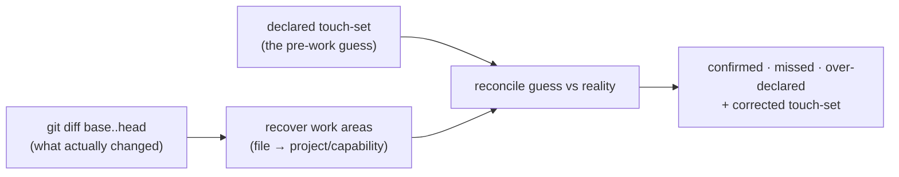

# touch-set-correction — check a mission's guess of what it would change against what it did

Before a Mission runs, someone writes down a **guess** of what it will change — its **declared
touch-set** (a list of work areas, e.g. `sdd/mission-graph`). That guess is what the shared work list
([`mission-graph`](../mission-graph/README.md)) uses to keep clashing Missions apart. But a guess made
*before* the work is wrong sometimes: the Mission quietly touches an area nobody predicted, or predicts
an area it never touches. A wrong guess means the work list can't keep the right Missions apart.

**touch-set-correction** fixes the guess **after the fact**. Once a Mission is done, it looks at the
Mission's real change (its `git diff`), works out which work areas were **actually** touched, and lines
that up against the guess — reporting three things:

- **confirmed** — areas that were both guessed and touched (the guess was right);
- **missed** — areas that were touched but **not** guessed (the dangerous case: the work list never knew
  to guard them);
- **over-declared** — areas that were guessed but never touched (a harmless over-guess).

The **corrected** touch-set is simply what actually happened — the real change is the ground truth. That
corrected list is what the work list's single writer records when the Mission retires, so from then on
collisions are **computed from reality, not from a hand-written guess**.

## Key terms

Plain-language glossary; the word in parentheses is the technical term an engineer may know it by.

| Term | Plain meaning |
|---|---|
| **Mission** | one deliverable piece of work — roughly one branch / one pull request |
| **declared touch-set** | the pre-work **guess** of the work areas a Mission will change |
| **work area** (spec-node) | the atom a touch-set is written in: `project + capability`, e.g. `sdd/mission-graph` — the capability folder a change lives in |
| **actual touch-set** | the work areas the Mission **really** changed, read back from its `git diff` |
| **corrected touch-set** | the actual touch-set — replaces the guess as the truth of record |
| **confirmed / missed / over-declared** | the three-way line-up of guess against reality (see above) |
| **artifact-type** | what *kind* of thing a changed file is (a skill, a suite, a doc…) — resolved per file, **best-effort** (recorded as `unknown` when it does not resolve) |
| **behavioral suite** (`.feature`) | a Given/When/Then contract file (frozen or not); the one file kind that carries **scenarios** — recognized by its `.feature` extension |
| **scenario detail** | for a touched `.feature`, the names of the scenarios its diff changed — recorded as extra detail |
| **unmapped file** | a changed file that sits under no known project/capability — surfaced, never silently dropped |
| **git diff `base..head`** | the Mission's real change, from its merge base to its tip |

## Use Cases

**Subject** — a **read-only, post-hoc reconciliation**: given a Mission's declared touch-set and its
`git diff base..head`, recover the work areas actually touched, line them up against the guess
(confirmed / missed / over-declared), record the finer detail the composed tools surface for free
(each changed file's artifact-type; the changed scenarios of a touched behavioral suite), and return
the corrected touch-set. It **composes three tools**: `git diff` (the changed files),
[`resolve-governances`](../../../../plugins/sdd/skills/resolve-governances/SKILL.md) (each file's
artifact-type), and `gherkin-cli diff` (the changed scenarios of a touched `.feature`).

**Non-goals** — it does **not** decide whether two Missions' touch-sets *collide hard or soft*, run the
**finer-than-node ladder** (file → region → semantic downgrade of a suspected false-hard), descend to a
**region/hunk** tier, do **SSA lowering** or infer symbol-level produce/consume dependencies (all later
parts of issue #189), **write** the correction into the mission graph (it *returns* it; the graph's
single writer appends it at retirement — like `resolve-governances`, it writes nothing), or **predict**
a touch-set before the work (it only corrects one, after). It reports; it does not schedule.

| What you want | What you give it | What you get back | Scenario |
|---|---|---|---|
| **find a missed area** — the Mission touched something nobody guessed | the declared touch-set + the diff | every touched-but-not-declared work area, flagged as **missed** | `Scenario: a node touched in the diff but not declared is reported as missed` |
| **find an over-guess** — a guessed area that was never touched | the declared touch-set + the diff | every declared-but-not-touched area, flagged as **over-declared** | `Scenario: a node declared but not touched in the diff is reported as over-declared` |
| **replace the guess with reality** | the diff | the corrected touch-set = the areas actually touched | `Scenario: the corrected touch-set is the actual touched set, not the declared set` |
| **read the real touched areas off the diff** | the changed files + the project layout | each file mapped to its `project/capability` work area, de-duplicated | `Scenario: a changed file under a capability folder maps to its project-and-capability node` |
| **not lose a stray file** | a changed file under no known project | it is surfaced as **unmapped**, never counted as a touched area | `Scenario: a changed file outside any known project root is surfaced as unmapped` |
| **record the finer detail** — for a touched suite, which scenarios moved | a touched frozen `.feature` in the diff | the names of the scenarios its diff changed, as extra detail on the area | `Scenario: a touched feature records the scenario names its diff changed` |
| **stay inside the lane** — data, not a hazard verdict | any diff | the correction never labels an area's collision hard or soft, and never descends past node/scenario grain | `Scenario: the recorded scenario detail does not reclassify the node collision` |

Every scenario in [`touch-set-correction.feature`](./touch-set-correction.feature) maps to one of these
entries or to a cross-cutting guarantee (deterministic for a fixed diff, read-only, unmapped-files-surfaced,
TOON-by-default / JSON-on-request output).

## How the correction is computed

1. **Read the real change.** `git diff --name-status base..head` lists the changed files (the mechanism
   is a thin call; the tested logic is everything downstream of the file list).
2. **Recover the work area per file** (capability-first convention). A file under a project's root maps
   to `project/capability`, where the **capability** is the first path segment after the matched root —
   so `plugins/sdd/skills/mission-graph/scripts/x.mts` and `.agents/specs/sdd/mission-graph/README.md`
   both recover `sdd/mission-graph`. Files in the same capability collapse to **one** area; a file under
   no known root is **unmapped** (surfaced, never a touched area). The de-duplicated set of recovered
   areas is the **actual touch-set**.
3. **Stamp each changed file's artifact-type** via `resolve-governances` — a **best-effort** annotation
   of the file's *kind*. When it does not resolve (`resolve-governances`' own no-match "classify by
   convention" case), the file is stamped `unknown` and **still counts** toward the actual touch-set —
   node membership comes from the path (step 2), never from the artifact-type.
4. **Record the changed scenarios** of each touched `.feature` via `gherkin-cli diff` — the finer,
   already-mechanized detail (same tool `spec-gate`'s edit-class classifier uses). The scenario rung is
   gated by the **`.feature` extension** (a structural fact, independent of whether artifact-type
   resolved and of whether the suite is frozen — `gherkin-cli diff` reads any `.feature` against its
   base). It is **recorded as detail on the area**, never used here to reclassify a collision — that
   downgrade is the deferred ladder.
5. **Reconcile** the declared touch-set against the actual: **confirmed** = declared ∩ actual, **missed**
   = actual − declared, **over-declared** = declared − actual. The **corrected** touch-set is the actual
   set. Every list is stably ordered so the same diff and guess always give the same answer.

The result is a plain data record. It is **read-only**: nothing is written to the mission graph — the
graph's single writer appends the corrected touch-set when the Mission retires (the lifecycle loop,
deferred to F3).

## Why a guess needs correcting (the monadic gap)

Touch-sets are **predictive** — written before the work, they carry a false-negative risk no build tool
faces (a build tool sees the real dependency graph; a plan only guesses it). The mission graph is
therefore probabilistic, and this tool is the **monadic correction**: the real diff is finer information
that arrives *later*, and it replaces the guess with what actually happened. Design:
[ADR-0025](../../../../artifacts/adr/0025-mission-graph-compiler-scheduler-model.md) (the
predictive-touch-set risk + the corrected-from-diff mitigation) and the cyberfleet-batch design's
**Finer-than-node granularity** section (file-sets are *sourced* — declared, folder-convention, or
**post-hoc git diff** — never *derived*).

## Delivery

Built as the **`touch-set-correction`** engine — `plugins/sdd/skills/touch-set-correction/` — a
self-contained, dependency-free script (the repo's node-≥23.6 / no-extra-tools convention, with a
by-hand fallback when `node` or a composed tool is absent). Pure derivations (`reconcile`, node
recovery, correction assembly) take and return plain data — no fs/network access — kept apart from a
thin seam that runs `git diff`, `resolve-governances`, and `gherkin-cli diff`, so the derivations are
unit-tested over **constructed** file-lists and layouts, never a live diff or the live store.

## Source

- **new** — no prior version. The **Op2** deferral of the **cyberfleet-batch** self-hosting-kernel
  (GitHub issue #189, first bullet); sharpens the mission graph so hazards are **computed, not
  hand-declared**. Depends on Op1.M1 — the [`mission-graph`](../mission-graph/README.md) store
  (PR #197, merged). The finer-than-node ladder and SSA lowering (the rest of #189) remain deferred.
- **Why (design records):** [ADR-0025](../../../../artifacts/adr/0025-mission-graph-compiler-scheduler-model.md)
  (predictive touch-sets + the corrected-from-diff mitigation) and
  [ADR-0026](../../../../artifacts/adr/0026-mission-graph-store.md) (the corrected touch-set is what the
  single writer appends at retirement); the cyberfleet-batch design brief's **Finer-than-node
  granularity** / **Touch-set tool placement** sections.
