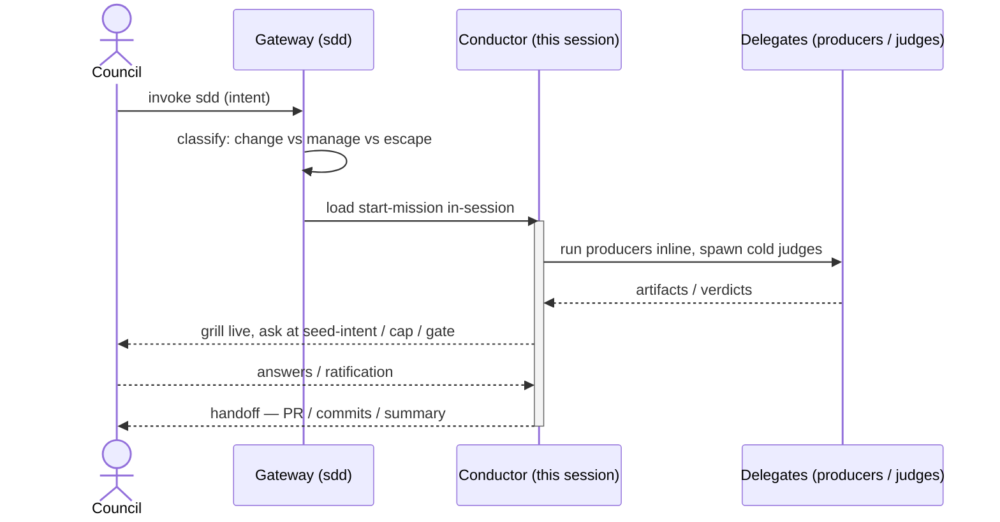
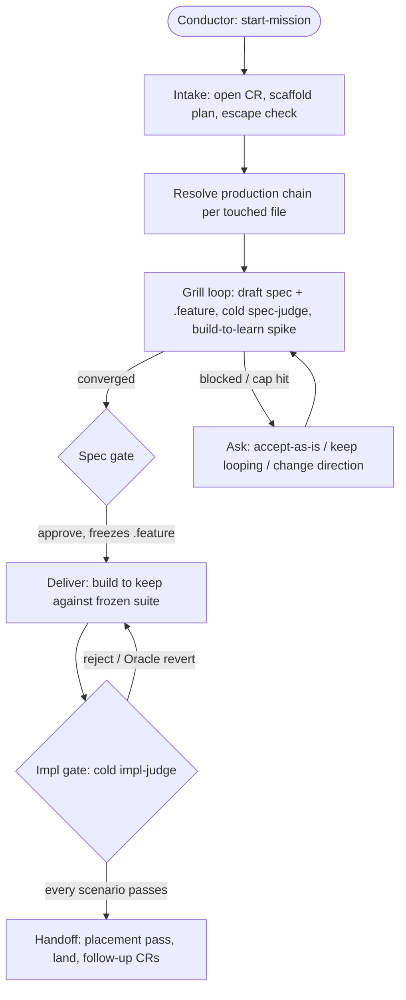
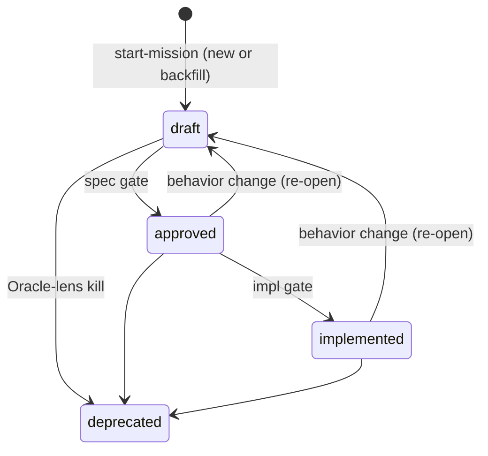

This traces one run of the **Mission loop** — the conductor advancing a single change request (CR) against the project spec — end to end. For the cast of players and the loop model, see the [Overview](/sdd/overview/).

## No relay — the session is the conductor

There is no spawned lead delegate between the gateway and the work. For an attended session, the gateway **loads `start-mission` in the current session** and the work proceeds there — the session itself holds the user channel, grills live, and (within its leash) ratifies. The only exception is headless dispatch: with no user channel, the gateway spawns the **automaton** (`sdd:sdd-automaton`), which runs the identical mission loop but self-asserts within leash and batches `needs-input` up its own relay instead of asking live.

## Intake and routing

The gateway resolves intent to a skill via a two-level menu when the request is bare (never more than four options per `AskUserQuestion`), or skips straight to the matched skill on a fast path ("add a start-mission skill to sdd", "work on \<issue url\>").

| User intent | Handler |
|---|---|
| Make any change to the project (add, revise, implement, land) | `start-mission` |
| Manage the corpus — bootstrap, inspect, audit, housekeeping | `manage` |
| No suite-relevant behavior, or a non-durable artifact | escape — no CR, no record |
| Product / structure / process retrospective, field corrections | the campaign / formation / doctrine / forge loop → a new CR (`start-mission`) |

One project is one durable spec — routing classifies *what the user wants to do to the project*, never which spec in a fleet to pick.

## The mission loop's four phases

A mission carries one CR from intent to a landed result, in **segments** (autonomous sittings, checkpointed via `pause-mission` / `resume-mission`) rather than one unbroken run:

1. **Intake** — recover the request, locate the project spec via `discover-specs`, scaffold `.agents/plans/<cr-ref>-<what>.plan.md`, and run the escape check (no suite-relevant behavior, or non-durable via `resolve-durability`).
2. **Explore** — *build to learn.* Resolve each touched file's production chain (`resolve-governances`), place and classify each node, then loop: grill the user live, write the draft `spec.md` + `.feature`, spawn the cold spec-judge, spike the impl-producer builder to steer the grill. Ends at the **spec gate**.
3. **Deliver** — *build to keep.* Spawn the impl-producer builder against the now-**frozen** suite (the read-set is scoped to the frozen `.feature`, the optional `.solution.md`, and the implementation files — not the prose spec). The **impl gate** spawns the cold impl-judge to verify every frozen scenario.
4. **Handoff** — a Warden placement pass relocates any provisionally-placed node to its blessed home (a pure rename, freeze-preserving), then lands per the project's delivery shape (branch/PR, decomposed by unit of work), with follow-ups filed as new CRs.

## The autonomy leash

At **run start** the conductor evaluates blast radius and the other dimensions and writes a run-level `kind: leash` block to its own `ledger/` shard: `auto-none | auto-spec | auto-all`, with `by: derived | user` and containment `approach[]`. At **each gate** it re-derives the leash against discovered state and either self-asserts within it (`approval.<gate>: { verdict: approve, by: agent, why }` — provisional, landing in an async review queue) or stops with a verdict packet for the human.

| Leash | Self-asserts | Stops at |
|---|---|---|
| `auto-none` | nothing | the spec gate |
| `auto-spec` | the spec gate | the impl gate |
| `auto-all` | both gates | nothing |

**Hard floors always stop, regardless of leash:** **Clearance** (narrowing/deleting an acceptance scenario), **Compatibility** (the semver class exceeds the authorized ceiling), and **Conflict** (a logical contradiction in the suite, not pre-authorizable). Human ratification — writing `by: <name>`, advancing `status` — is reserved to the in-session position holding the real user channel; a headless automaton never writes it, even when a coordinator relays "the user approved."

## Provenance: combat log vs ledger

Two separate stores, never conflated:

| Store | Home | Holds | Lifetime |
|---|---|---|---|
| **Combat log** | `.agents/plans/<cr-ref>.log.jsonl`, beside the plan brief | `report` / `correction` / `halt` — chatty mid-flight detail, each with a write-time UTC `ts` | tracked, deleted at retro once distilled and merged |
| **Ledger** | `ledger/` directory, sibling to the root `spec.md`; one `<cr-ref>.<hash>.jsonl` shard **per CR per writer** | run-start `leash`, `gate` verdicts, Scanner-drafted `strategy` — no `ts` | durable, never deleted, never frozen |

Sharding (one file per writer per CR) makes concurrent appends collision-free by construction — no merge driver is needed. Readers glob `ledger/*.jsonl` (plus a legacy `ledger.jsonl` if present).

## Write-ownership across the flow

| Writer | Writes |
|---|---|
| **The gate (internal step in `start-mission`)** | `status`; the human ratification of `approval` (`by: <name>`); the freeze (`@frozen` tag) |
| **Conductor** | `<!-- open: -->` markers; the `produced-by` map; a provisional self-asserted `approval` (`by: agent`); combat-log `report`/`correction`/`halt`; the ledger `leash` block and self-asserted `gate` lines |
| **Producers** | `spec.md` body, the `.feature`, `<unit>.solution.md` |
| **Scanner** (doctrine loop) | ledger `strategy` lines |
| **Gateway** | nothing — it only classifies and routes |

## The spec's lifecycle

`approved` and `implemented` **freeze** each touched `.feature` (a per-file `@frozen` tag, not a per-project state). The unfreeze trigger is **risk, not phase**: an additive scenario self-clears and stays frozen; a pure `git mv` rename preserves the freeze (letting handoff relocate a node without reopening its contract); only a *narrowing or rewriting* edit is a re-open — a ratified transition back to `draft`, after which the node re-passes its gates.
