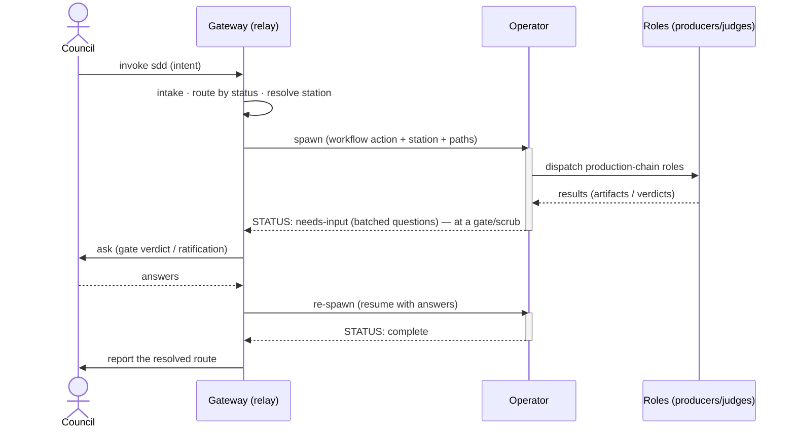
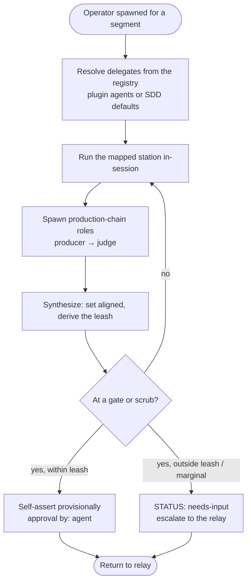
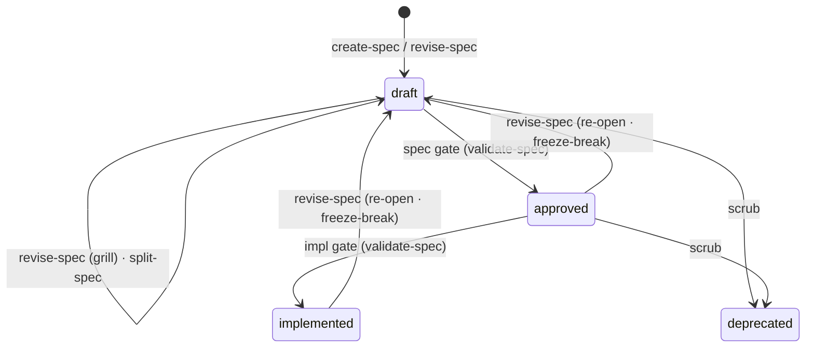

This traces one run of the **Build loop (Mission)** — the Operator advancing a single spec — end to end. For the cast of players and the full five-loop model, see the [Overview](/sdd/overview/).

## The relay model

The **Operator has no user channel.** The only place a human is reached is the **relay** — the gateway (or the station skill that invoked the Operator). Control bounces between the relay and the Operator: the Operator runs autonomously until it hits a checkpoint, escalates upward, and the relay carries the question to the Council and re-spawns the Operator with the answer.

The Operator escalates **only at a gate** (a go/no-go to advance status) or **scrub** (a kill). Between checkpoints it runs to completion without asking.

## Intake and routing

The gateway resolves intent to a **workflow action**, then maps that action to the **station** the Operator runs.

- **Fast path** — when the invocation names both an artifact and an action ("implement the auth spec"), route directly.
- **Two-level menu** — on a bare invocation, a fixed four-option menu (create/backfill · work on existing · manage specs & graph · help me choose), never more than four options.

Routing reads the spec's `status` from frontmatter:

| Status | Workflow action | Station |
|---|---|---|
| no spec, no implementation | Draft spec | `create-spec` |
| no spec, implementation exists | Backfill spec | `create-spec` |
| `draft` (unchecked items / open markers) | Revise spec | `revise-spec` |
| `draft` (complete, clean) | Review at the spec gate | `validate-spec` |
| `approved` | Review at the impl gate | `validate-spec` |
| `implemented` | behavior change → Revise spec (re-open) | `revise-spec` |
| `deprecated` | not implementable → spec management | — |
| oversized / multi-behavior | Split | `split-spec` |
| graph stale | Refresh spec graph | `render-spec-graph` |

## Segment vs mission

A **segment** is one autonomous Operator run — spawned, runs to a checkpoint, returns to the relay. It is the Operator's atomic unit, and it is *finer* than a mission:

- A **mission** is one spec's full journey (`draft → approved → implemented`). A mission is a **sequence of segments** with relay round-trips between them (explore → spec gate → implement → impl gate) — not a single run.
- **Not every segment is a mission step.** The Operator also runs **management segments** that aren't any one spec's journey: `render-spec-graph` (refresh the derived graph) and `split-spec` (decompose one spec into many).

So a segment carries out *either* a mission step (`create-spec` / `revise-spec` / `validate-spec` on one spec) *or* a cross-spec management operation. And segments are the **Operator's** unit — the mission-loop delegate. The **doctrine** loop (Scanner) and **field** loop (usage-feedback) are driven by *other* delegates; their autonomous runs are analogous but are neither segments nor missions in this vocabulary.

## A segment, in detail

Inside one Operator run:

The Operator resolves each role to a plugin agent or an SDD default; if a required role resolves to neither, it **hard-fails closed** with a blocker. It dispatches the producer, then the judge (`producer ≠ judge`), and synthesizes the result.

## The leash — self-assert or stop

At a gate the Operator derives a **leash** from four dimensions of the change: reversibility, blast radius, decision novelty, confidence. If all read safe and the verdict is clean, the gate may be **self-asserted** (the Operator writes a provisional `approval` with `by: agent`) and the run continues — the human reviews asynchronously. If any dimension reads risky or the verdict is marginal, the gate **stops** and escalates for the Council's positional ratification. Freeze-breaks (re-opening an `approved`/`implemented` spec) are always positional. The full derivation lives in `gate-validation-governance`.

## Write-ownership across the flow

A gate changes *who is invoked*, not *who writes what*:

| Writer | Writes |
|---|---|
| **Gate station** (`validate-spec`) | `status`; the human ratification of `approval` (`by: <name>`) |
| **Operator** | `aligned`; a provisional self-asserted `approval` (`by: agent`); the combat-log `report`/`correction` entries; `<!-- open: -->` markers |
| **Producers** | `spec.md` body, the `.feature`, `plan.md`, `tasks.md` |
| **Scanner** (doctrine loop) | combat-log `strategy` entries |
| **Relay** | nothing — it routes and carries the user channel |

## The spec's lifecycle

The stations and gates move a spec through its status:

`approved` and `implemented` **freeze** the `.feature`; changing a frozen contract requires a Council-ratified re-open back to `draft` (a freeze-break), after which the spec re-passes its gates. A spec that has grown too large is decomposed by `split-spec` — with the Council confirming both the split plan and the result — into a project spec plus feature children, each of which then flows through this same lifecycle.
