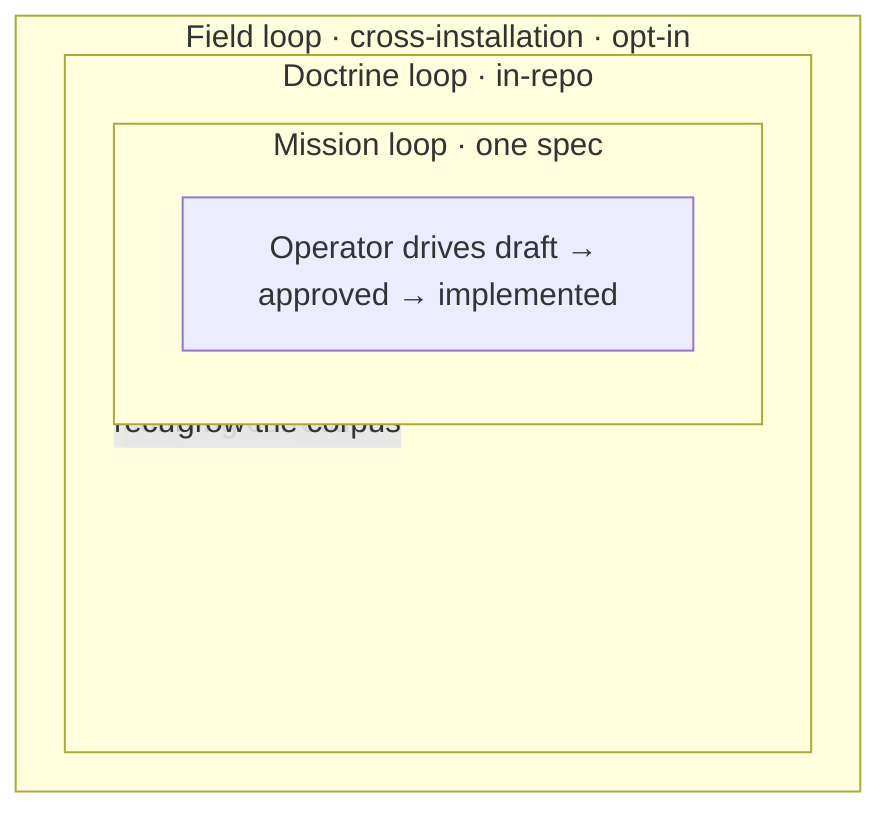

This is the **machinery** of Spec-Driven Development: who does what, and how control moves between them. For *why* SDD exists and what a spec is, see [Spec-Driven Development](/concepts/spec-driven-development/); for the actor theory (Director, Architect, Builder, Strategist), see [The Four Actors](/motive-model/four-actors/). This page maps the moving parts; [Control Flow](/sdd/control-flow/) traces a run end to end.

## The cast

The workflow separates **who decides** from **who is invoked how**. Four kinds of player:

| Player | What it is | Key rule |
|---|---|---|
| **Gateway** (`sdd`) | The entry skill. Intake, routing, and the **relay** that holds the user channel. | Holds *no* production logic; spawns only the Operator. |
| **Operator** (`sdd-orchestrator`) | The lead delegate. Runs one autonomous segment: resolves delegates, runs stations, dispatches roles, synthesizes. | Has **no user channel** — escalates to the relay at gates/scrub. |
| **Stations** | Skills the Operator **runs in-session**: `create-spec`, `revise-spec`, `validate-spec`, `split-spec`, `render-spec-graph`. | A station is **never** spawned as a subagent. |
| **Production-chain roles** | Agents the Operator **spawns**: spec-producer, plan-producer, spec-judge, impl-producer, impl-judge. | `producer ≠ judge`. Resolved from the registry or SDD defaults. |
| **Governances** | Loadable contracts the players read to stay aligned. | The single source of truth for each rule. |
| **Council** (human) | The Conductor who holds motive and accountability. | Owns ratification and kill decisions — reached only through the relay. |

### Station vs role — the load-bearing distinction

A **station** is a *skill the Operator executes itself*, in its own context. A **role** is a *subagent the Operator spawns*. They are not interchangeable: spawning a station as a subagent (`subagent_type: validate-spec`) is illegal and fails. The Operator **runs** `create-spec`; it **spawns** `sdd-scenario-writer`.

## The production chain

Each role resolves to a **plugin agent** (when a plugin covers the domain) or an **SDD default**. The spec-producer is always filled; other roles fill or degenerate to a default. If a required role resolves to neither a plugin agent nor a default, the Operator **hard-fails closed** — it never invents a sentinel.

| Role | SDD default | Loads (actor bar) |
|---|---|---|
| spec-producer | `sdd-scenario-writer` | director + builder governance |
| plan-producer | `sdd-planner` | architect governance |
| spec-judge | `sdd-spec-judge` | director + builder + architect |
| impl-producer | generic Builder (no agent) | builder + architect |
| impl-judge | `sdd-implementer` | builder governance |

Plugins supply domain-aware roles: **ACES** for agent-configuration artifacts, **Quill** for documentation. The registry (`.agents/universal-plugin.json`) maps domain → plugin → role agents; the [plugin contract](#governances) defines the shape.

## The governances

Loadable contracts — each owns one rule set so no player restates it:

| Governance | Owns |
|---|---|
| `lifecycle-governance` | frontmatter schema, status enum, transitions, the freeze re-open |
| `ownership-governance` | who may write each field and artifact |
| `gate-validation-governance` | legal state tuples, the leash, `approval` attribution |
| `spec-governance` | `.feature` format, the `## Use Cases` rule, the granularity heuristic |
| `combat-log-governance` | the two-face provenance record (current-state + append-only ledger) |
| `plugin-contract-governance` | the five delegate roles and the registry shape |
| `director` / `builder` / `architect` governance | each actor's bar (scope, testability, structural fit) |

## The three loops

SDD nests three loops at different altitudes. Each is owned by an actor and run by a delegate.

| Loop | Spec | Delegate | Scope |
|---|---|---|---|
| **Mission** | (every spec) | Operator | one spec's journey draft → approved → implemented |
| **Doctrine** | `sdd-doctrine-loop` | Scanner | reads this repo's combat logs, drafts strategy to improve the corpus |
| **Field** | `sdd-usage-feedback` | (opt-in) | collects real corrections across installations to grow the shared taxonomy |

The mission loop is the everyday path; the doctrine and field loops are how the system learns from what missions reveal. See [Control Flow](/sdd/control-flow/) for the mission loop in detail.
