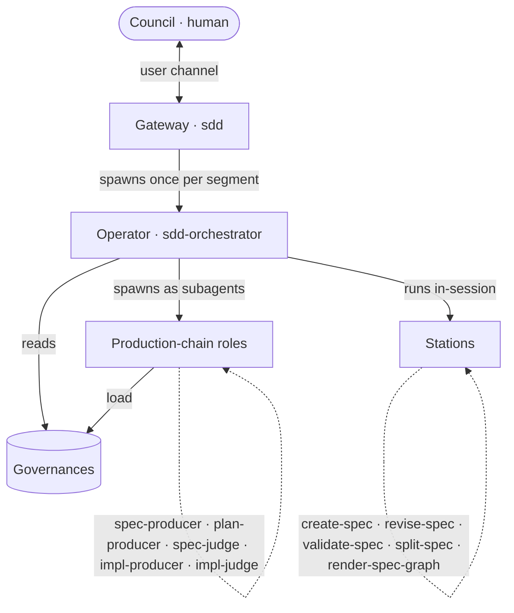
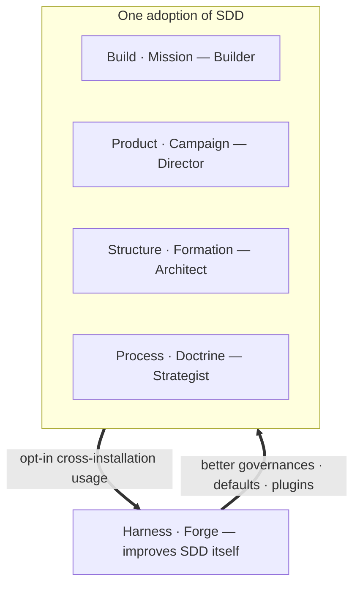

This is the **machinery** of Spec-Driven Development: who does what, and how control moves between them. For *why* SDD exists and what a spec is, see [Spec-Driven Development](/concepts/spec-driven-development/); for the actor theory (Director, Architect, Builder, Strategist), see [The Four Actors](/motive-model/four-actors/). This page maps the moving parts; [Control Flow](/sdd/control-flow/) traces a run end to end.

## The cast

The workflow separates **who decides** from **who is invoked how**. Four kinds of player:

| Player | What it is | Key rule |
|---|---|---|
| **Council** (human) | The Conductor who holds motive and accountability. | Owns ratification and kill decisions — reached only through the relay. |
| **Gateway** (`sdd`) | The entry skill. Intake, routing, and the **relay** that holds the user channel. | Holds *no* production logic; spawns only the Operator. |
| **Operator** (`sdd-orchestrator`) | The lead delegate. Runs one autonomous segment: resolves delegates, runs stations, dispatches roles, synthesizes. | Has **no user channel** — escalates to the relay at gates/scrub. |
| **Stations** | Skills the Operator **runs in-session**: `create-spec`, `revise-spec`, `validate-spec`, `split-spec`, `render-spec-graph`. | A station is **never** spawned as a subagent. |
| **Production-chain roles** | Agents the Operator **spawns**: spec-producer, plan-producer, spec-judge, impl-producer, impl-judge. | `producer ≠ judge`. Resolved from the registry or SDD defaults. |
| **Governances** | Loadable contracts the players read to stay aligned. | The single source of truth for each rule. |

### Station vs role — the load-bearing distinction

A **station** is a *skill the Operator executes itself*, in its own context. A **role** is a *subagent the Operator spawns*. They are not interchangeable: spawning a station as a subagent (`subagent_type: validate-spec`) is illegal and fails. The Operator **runs** `create-spec`; it **spawns** `sdd-scenario-writer`.

## The production chain

Each role resolves to a **plugin agent** (when a plugin covers the domain) or an **SDD default**. The spec-producer is always filled; other roles fill or degenerate to a default. If a required role resolves to neither a plugin agent nor a default, the Operator **hard-fails closed** — it never invents a sentinel.

| Role | SDD default | Loads (actor bar) |
|---|---|---|
| spec-producer | `sdd-scenario-writer` | director + builder governance |
| plan-producer | `sdd-planner` | architect governance |
| spec-judge | `sdd-spec-judge` | director + builder + architect |
| impl-producer | generic Builder (no agent) | builder + architect |
| impl-judge | `sdd-implementer` | builder governance |

Plugins supply domain-aware roles: **ACES** for agent-configuration artifacts, **Quill** for documentation. The registry (`.agents/universal-plugin.json`) maps domain → plugin → role agents; the [plugin contract](#governances) defines the shape.

## The governances

Loadable contracts — each owns one rule set so no player restates it:

| Governance | Owns |
|---|---|
| `lifecycle-governance` | frontmatter schema, status enum, transitions, the freeze re-open |
| `ownership-governance` | who may write each field and artifact |
| `gate-validation-governance` | legal state tuples, the leash, `approval` attribution |
| `spec-governance` | `.feature` format, the `## Use Cases` rule, the granularity heuristic |
| `combat-log-governance` | the two-face provenance record (current-state + append-only ledger) |
| `plugin-contract-governance` | the five delegate roles and the registry shape |
| `director` / `builder` / `architect` governance | each actor's bar (scope, testability, structural fit) |

## The loops

SDD runs as a set of feedback loops. **Four** operate within one *adoption* of SDD — a team using it on their own work — and map one-to-one to the four actors. A **fifth** sits above them and improves SDD *itself*. Each loop carries two names: a **descriptive** one (what it acts on) and a **metaphor** one (the fleet vocabulary that also appears in the prompts).

| Loop (descriptive · metaphor) | Actor | Altitude | Improves |
|---|---|---|---|
| **Build · Mission** | Builder | inner — one spec | builds a single spec, `draft → implemented` |
| **Product · Campaign** | Director | outer — across missions | the product: which features to add, which to deprecate |
| **Structure · Formation** | Architect | outer — across missions | the corpus's organization: dedupe, split, keep the graph coherent |
| **Process · Doctrine** | Strategist | outer — across missions | how we work: codify lessons from missions into the corpus |
| **Harness · Forge** | maintainers | meta — across installations | SDD itself: the `cause` enum, performance, token cost, the plugin roadmap |

### Inner and outer — the double loop

The **Build loop (Mission)** is the inner loop: execute one spec, the Builder's home. The other three actor loops run **across missions**, each asking a different *"are we doing the right thing?"* — **Product** (the right features?), **Structure** (organized right?), **Process** (working right?). That is double-loop learning: *do it right* (Build) versus *do the right thing* along three axes. A mission emits **combat logs**; the three outer loops read them and steer what gets built next.

### The Harness loop (Forge) — SDD improving itself

The four actor loops improve **one team's work**. The **Harness loop** sits one level up and improves **SDD the framework**, fed by opt-in usage across every installation: which `cause` values to add, where SDD is slow or token-hungry, which domain plugins to build next.

This is **recursion**. The Harness loop hands the SDD maintainers the field signal to run their *own* Build / Product / Structure / Process loops — on SDD. Two levels of self-improvement, and the analogies pin them:

- **Process (Doctrine)** = the *instance* improving itself — an agent getting better at its job within a project.
- **Harness (Forge)** = the *platform* improving itself from every instance — Claude Code collecting usage to improve Claude Code.

Because it carries data across the installation (and company) boundary, the Harness loop is **opt-in and privacy-gated** — see `sdd-forge-loop`.

### The metaphor

The loop names are a fleet metaphor that also surfaces in the prompts: a **Mission** is one engagement; the **Campaign** is which theaters to fight and which to abandon; the **Formation** keeps the order of battle coherent; **Doctrine** is codified operating principle distilled from combat; the **Forge** refits the ships themselves from fleet-wide reports. The full translation table — command roles, delegates, sealed orders, project vs inject — is in [The Fleet Metaphor](/sdd/metaphor/).

See [Control Flow](/sdd/control-flow/) for how the Operator runs the Build loop — segments, the relay, and the gates — and how a mission is composed of segments.
