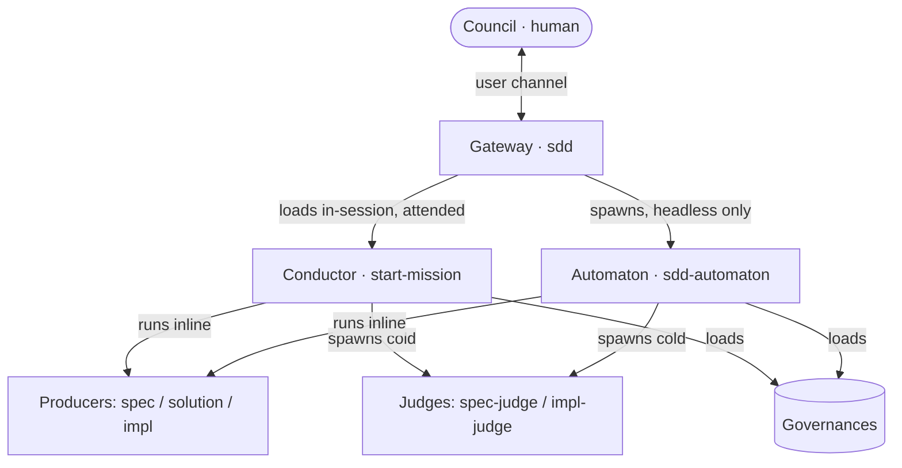

This is the **machinery** of Spec-Driven Development: who does what, and how control moves between them. For *why* SDD exists and what a spec is, see [Spec-Driven Development](/concepts/spec-driven-development/); for the actor theory (Oracle, Architect, Builder, Strategist), see [The Four Actors](/motive-model/four-actors/). This page maps the moving parts; [Control Flow](/sdd/control-flow/) traces a run end to end.

## There is no separate Operator subagent

Earlier designs spawned a lead delegate ("the Operator") between the gateway and the work. The current design does not: **the session that runs the mission loop is the conductor.** For an attended session, the gateway loads `start-mission` in the *same* session — no subagent boundary, no relay round-trip. The only spawned realization of the conductor is the **automaton** (`sdd:sdd-automaton`), used when there is no user channel at all: an unattended scheduler, or fanning out a queue of pre-approved missions. The automaton runs the identical mission loop headless — it self-asserts within its leash and batches `needs-input` instead of asking live.

## The cast

| Player | What it is | Key rule |
|---|---|---|
| **Council** (human) | Holds motive, accountability, and ratification. | The only source of a human-attributed gate verdict. |
| **Gateway** (`sdd`) | The entry skill. Intake, routing, surfacing pending strategy and resumable missions. | Thin classifier — no production logic, no governance loaded, no state written. |
| **Conductor** | The in-session realization: `start-mission` running in the current session (the user in the driver's seat). | Grills live, runs producers inline, spawns only cold judges + the impl-producer builder. |
| **Automaton** (`sdd:sdd-automaton`) | The headless realization of the same conductor role. | Spawned only when there is no user channel; never self-approves a mission. |
| **Judges** | Spawned cold agents: `sdd-spec-judge`, `sdd-impl-judge` (or a plugin's own). | Grader independence — never shares the producer's context. |
| **Governances** | Loadable contracts the players read to stay aligned. | Single source of truth per rule; loaded lazily, not all at once. |

## Non-mission work: `manage`

Not every request changes the project's specified behavior. The gateway's second route, `manage`, is a sibling thin dispatcher for **bootstrap, inspect, audit, and housekeeping** — it loads the matching engine in-session and never opens a CR, invokes a gate, or writes `status`/`approval`. Its engines: `backfill-project-spec` (scaffold a project's first spec), `discover-specs` / `discover-plans` / `concept-index` / `place-node` (inspect), `check-spec-structure` / `formation-loop` (audit and align), `plan-retirement` / `manage-spec-anchors` (housekeeping). A `manage` operation that surfaces a real behavior change hands off to `start-mission`.

## The escape hatch

Not every request becomes a change request (CR). A request with **no suite-relevant behavior**, or one confined entirely to a **non-durable** artifact (resolved per-touched-file by the `resolve-durability` engine — explicit statement, then an optional `.agents/sdd/durability.toml` override table, then a fixed location convention, then fail-closed to durable), **escapes the lifecycle**: no CR opens, no gate runs, no SDD record is written. A mixed request carves the durable parts into a CR and escapes the rest. Escaping doesn't mean stopping — if the artifact-type has a producer with a direct escaped-request entry point (e.g. `define-skill` for the `skill` artifact-type, shipped by the ACED plugin), that producer is invoked directly to do the work.

## The five plugin delegate roles

Every artifact-type resolves to a **production chain** of five roles, each either a plugin's agent or the SDD default. This is the contract a domain plugin (ACED for agent-configuration artifacts, Quill for documentation) implements to teach SDD a new kind of artifact.

| Role | Acts | SDD default |
|---|---|---|
| `spec-producer` | writes `spec.md` + the `.feature` | conductor loads `spec-producer-governance`, authors inline |
| `solution-producer` | writes `<unit>.solution.md` (the durable, ungated design fork) | conductor loads `solution-producer-governance`, authors inline |
| `spec-judge` | judges `spec.md` + the `.feature` at the spec gate | `sdd-spec-judge` — spawned cold |
| `impl-producer` | builds the artifact **and** its verification | conductor dispatches a generic builder loading `impl-producer-governance` |
| `impl-judge` | runs the verification against the frozen `.feature` | `sdd-impl-judge` — spawned cold |

**Producers run inline (or via a mechanical builder), judges always spawn cold.** A plugin delegate — or a model-tuned producer agent named for the slot — is always spawned regardless of role. Resolution reads only `.agents/universal-plugin.json` (`sdd-plugins[]`); it never scans plugin directories. Each plugin declares one or more **squads**, each serving a set of `artifact-type`s with one production chain; a type claimed by two plugins asks the user, recorded in `.agents/sdd/` resolution state (distinct from `produced-by`). A resolved delegate that **recuses** from a subject outside its lens re-resolves that one unit back to the SDD defaults and logs the recusal — never a hard fail. A **required** role with no real delegate and no default **fails closed**.

## The governances

Loadable contracts — each owns one rule set so no player restates it:

| Governance | Owns |
|---|---|
| `lifecycle-governance` | frontmatter schema, status enum, transitions, the freeze re-open trigger |
| `ownership-governance` | who may write each field and artifact; the freeze write-constraint |
| `gate-validation-governance` | legal frontmatter-state tuples, per-node checks, approval attribution |
| `spec-format-governance` / `suite-format-governance` | the `spec.md` skeleton / the `.feature` boolean-Gherkin + `@rubric` + `@frozen` rules |
| `combat-log-governance` | the two-face provenance record: `spec.md` frontmatter (current-state) + the durable sharded `ledger/` directory + the per-mission combat log |
| `plugin-contract-governance` | the five delegate roles and the `.agents/universal-plugin.json` registry shape |
| `oracle-spec` / `builder-spec` / `architect-spec` / `builder-impl` / `architect-impl` governance | each actor's bar at each gate (scope, testability/coverage, structural fit) |

## The loops

SDD runs as a set of feedback loops, one per actor, plus a meta-loop that improves SDD itself. The **Mission** loop is inner (one CR, one spec); the rest fire **across** missions and emit *new* change-requests — nothing re-enters in place.

| Loop | Actor | Fires | Question | Status |
|---|---|---|---|---|
| **Mission** (Build) | Builder | one CR, driven by `start-mission` | is this change built right? | shipped |
| **Campaign** (Product) | Oracle | across missions | are we building the right things — grow/prune capabilities? | conceptual — no dedicated skill yet |
| **Formation** (Structure) | Architect, run by the Warden | post-mission, corpus-wide, continuous | is the corpus organized right? | shipped — `formation-loop` |
| **Doctrine** (Process) | Strategist, run by the Scanner | lifecycle-grained (terminal transition, retro, recurring pattern, drift, token-waste) | what did we learn about how to work? | shipped — `doctrine-loop` |
| **Forge** (Harness) | maintainers, across installations | opt-in, cross-installation | should SDD itself change? | conceptual — no dedicated skill yet |

Formation and Doctrine are **read-only, non-blocking, and evidence-gated**: Formation's Warden self-clears reversible, low-blast structural acts (a coverage-preserving split, a rename) in-session under a provisional marker, and escalates narrowing/contested/class-exceeding acts as a new CR. Doctrine's Scanner only ever **drafts** unratified `strategy` lines to the durable ledger from the committed combat log — the Council alone ratifies (keep) or cuts them; the gateway surfaces the pending count on re-entry but never drafts or ratifies itself.

### The fleet metaphor

These loop names also carry a running fleet metaphor used in the prompts — Mission is "take one territory," Campaign is "which territories to take," Formation is "keep the order of battle coherent," Doctrine is "codify lessons from combat." The full translation table is in [The Fleet Metaphor](/sdd/metaphor/).

See [Control Flow](/sdd/control-flow/) for how the conductor runs the mission loop — intake, explore, the spec gate, deliver, the impl gate, and handoff — and the autonomy leash that governs how much it self-asserts.
