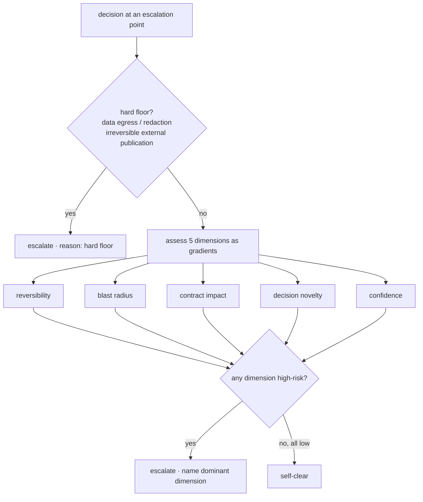

# Autonomy Governance — the risk-assessment rubric

## What

A **governance** (a reference-only skill) that encodes the **risk-assessment rubric** determining, for any agent configuration, **where it self-clears a decision versus escalates to a human**. It is the bar an agent config's *autonomy posture* is evaluated against — not a runtime monolith loaded on every decision.

It **generalizes** the existing `sdd-gate-autonomy` leash (four binary dimensions, wired only to the spec and impl gates) into a **standalone, gradient-based rubric** applicable to **every escalation point** in an agent-config system. It supersets the leash by:

- making the four leash dimensions **gradients** (low → high risk) rather than binary safe/risky reads;
- adding a fifth dimension, **contract impact**, classified semver-style and weighted by user-impact;
- adding a **hard floor** — a class of decisions that never self-clears regardless of computed score;
- applying to **all** escalation points, not just the two SDD gates.

The output, per decision, is a **verdict**: `self-clear` or `escalate`, **naming the dominant risk dimension / reason**. It is consumed at **config-design and eval time** — each agent's escalation posture is baked into its own config and verified against this bar, the same way `improve-skill` evaluates a skill against `skill-design` standards.

> **Load-bearing decision.** The hard floor is checked **first** and is **not score-based**. A high computed confidence never unlocks it. Everything below the floor is the gradient assessment; the floor sits above the gradient entirely.

## Why

The north-star is to **delegate work *and* decisions** to agents as far as is safe, so humans spend their attention on deciding *what to build* rather than rubber-stamping low-risk steps. The lever is governance that **raises an agent's risk-assessment confidence**, moving the self-clear-versus-escalate boundary toward automation.

Today the only autonomy mechanism — the `sdd-gate-autonomy` leash — is **binary** and wired to **two** escalation points (the spec gate and the impl gate). A survey of the SDD surface found roughly **21 other escalation points** that are flat "always human," many of which are risk-gradable and *should* self-clear when the risk is low. This governance makes the dimensions gradients and becomes the **single rubric** every agent config's autonomy posture is tuned and evaluated against.

## The risk dimensions

Five gradient dimensions. Each is assessed **low → high**; low pushes toward self-clear, high toward escalate.

| Dimension | Low risk (toward self-clear) | High risk (toward escalate) |
|---|---|---|
| **Reversibility** | cheap to undo — draft prose, a derived artifact, a tracked file with a cheap revert | destructive, or carrying an actual external side effect (an irreversible publish/release act or data egress). A git-tracked file in a shipped package with a cheap revert is LOW. |
| **Blast radius** | narrow **user-facing** impact — no `blocked-by` dependents, no breaking change, no publish/release act | many `blocked-by` dependents, a breaking user-facing change, or an actual publish/release act. Editing a tracked source file that merely lives in a shipped package, with no dependents and no breaking change, is LOW. Measured by **user-facing impact, not artifact count** — surface location is not a publish act. |
| **Contract impact** | **additive / non-breaking** — a new scenario, a new optional path, a clarification that does not alter an existing scenario's truth | **breaking** — alters or removes an established behavior. Weighted by user-impact: who downstream depends on it and how badly |
| **Decision novelty** | trivial / defaulted, or already human-ratified | a new contestable choice the human has not seen |
| **Confidence** | evidence converges; a clean judge pass; no unresolved markers | a marginal verdict; unresolved `<!-- open: -->` markers |

### Contract impact — the load-bearing nuance

Contract impact is the dimension that makes small frozen features **cheap** instead of re-gating every edit. The signal is **not** "is a freeze being re-opened" — a freeze re-open is not itself the risk. The signal is the **semver class of the change**:

- **Additive / non-breaking** (new scenario, new optional path, clarification that leaves every existing scenario's truth intact) → **low** → self-clears.
- **Breaking** (alters or removes an established behavior) → **high** → escalates.

The class is then **weighted by user-impact**: a breaking change to a behavior with many `blocked-by` dependents is higher than the same change to a leaf nobody depends on. This is what lets a low-risk edit to a frozen spec self-clear rather than forcing a full human re-gate.

## The hard floor

A class of decisions that **never self-clears**, regardless of computed confidence. The floor is an **invariant**, not a threshold — it is checked before the gradient assessment and a high score never unlocks it.

| Hard-floor class | Always |
|---|---|
| **Data egress / redaction** — sensitive data leaving the environment | escalate |
| **Irreversible external publication** | escalate |

A decision that lands in either class escalates even when every gradient dimension reads low. The floor exists because some risks are categorical, not graded — no amount of converging evidence makes leaking sensitive data or an irreversible publish a self-clear.

## The aggregate verdict

The per-decision verdict aggregates the floor and the gradients:

1. **Hard floor first.** If the decision is in a hard-floor class → `escalate`, reason `hard floor`. Stop.
2. **Any single high-risk dimension → `escalate`**, naming that dimension as the dominant reason. (This mirrors the leash's "one risky dimension is enough.")
3. **All dimensions low → `self-clear`.**

> **Weighting — user-facing blast radius is highest.** Among the five gradient dimensions, **user-facing blast radius carries the most weight**. A **high** user-facing-impact reading **dominates the aggregate** and forces `escalate` **even when every other dimension reads low risk**. Blast radius stays measured as **user-facing impact** — `blocked-by` dependents, breaking user-facing changes, or an actual publish/release act — **not artifact count** and **not surface location**: a tracked source file that merely lives in a shipped package, with no dependents and no breaking change, is still low blast radius and does not dominate.

The verdict **always names the dominant dimension / reason** so the consumer can see *why* — `escalate · contract impact (breaking, 4 dependents)`, `self-clear · all low`, `escalate · hard floor (data egress)`.

## The four survey buckets

The survey of escalation points produced four buckets. The rubric must classify representative cases from each correctly.

| Bucket | Meaning | Examples | Rubric behavior |
|---|---|---|---|
| **A** | Already risk-gated — the model being generalized | spec gate, impl gate, leash ceiling, Director-revert | self-clears **when low-risk**, escalates when any dimension is high |
| **B** | Mandatory today, but risk-gradable → *should* self-clear when low-risk | freeze re-open, split-spec checkpoints, dedupe-specs checkpoints, formation-loop cycle surfacing, doctrine keep-or-cut, campaign go/keep, change-request accept, forced spec re-review | self-clears when the change is additive / low-risk — this is the value the governance unlocks |
| **C** | Irreducibly human (intent) — must stay escalate | iteration-cap accept/change, observation accept/decline, operator needs-input, domain disambiguation, escape-hatch classification, inject, gateway 4-option menu | **always escalate**, regardless of computed score — these are intent decisions, not risk decisions |
| **D** | Hard floor — must stay escalate by invariant | forge-loop redaction / data egress | **always escalate** by the hard-floor invariant |

> Buckets **C** and **D** both always escalate, but for **different reasons**: C is escalate-by-intent (the decision *is* the human's to make — it is not a risk computation at all), D is escalate-by-invariant (the hard floor). The rubric encodes both as non-self-clearing but does not conflate them.

## Consumption model

The rubric is a **design/evaluation artifact** — like `skill-design` is for skills — with a **single consumer**: it is **not loaded at runtime by any agent**. The design explicitly **rejects** the "one governance loaded everywhere on every decision" pattern.

| Consumer | When | What it does with the rubric |
|---|---|---|
| **The eval tool / ACES** | **design time** | sets and verifies each agent config's escalation **posture** against the rubric as the bar |

At **runtime** the self-clear-vs-escalate verdict is **made by** the most capable conductor agent — but from that agent's **own baked-in determination logic**, authored to conform to this rubric. The conductor does not *consume the rubric document* at runtime; no runtime actor does. An agent's baked-in logic carries only the rubric dimensions its own decisions actually touch (e.g. the operator's gates touch contract impact but never the hard floor).

### Who makes the runtime verdict — the capable conductor

The runtime self-clear-vs-escalate verdict is a **gradient judgment**, not a lookup. A judgment verdict belongs to **the most capable conductor agent in the system** — in SDD, the opus `sdd-operator` — not to every actor. The contract is phrased portably as **"the most capable conductor agent in the system (in SDD, the opus operator)"** so it survives migration to ACES or any other agent-config system: it binds to the *role* (the capable conductor), never to the literal string `sdd-operator`.

> **Load-bearing decision.** Only the capable conductor makes the verdict. A non-conductor runtime actor neither loads the rubric per decision nor needs a capable model for this purpose — its posture is already settled in its config at design time.

### Outer-loop delegates — Scanner escalates, Warden is rubric-subject

The two outer-loop delegates are **not symmetric**. They differ in *what kind of decision* each reaches, so they differ in whether the rubric applies at all.

| Delegate | Loop | Decision class | Rubric posture |
|---|---|---|---|
| **Scanner** | doctrine | **intent** — a doctrine/process change alters *how we work* for every future mission (like an agile retrospective) | **always escalates**, makes **no self-clear verdict**; stays a less-capable model precisely because it needs no runtime verdict |
| **Warden** | formation | **risk** — structural acts on the spec corpus, gradable per act | **rubric-subject** — a **conductor** that applies the full gradient rubric and makes its own self-clear-vs-escalate verdict per act |

- **The Scanner is intent-class.** Intent never self-clears (it lands in Bucket C). A doctrine/process change is not a risk computation — it changes the playbook for every future mission, so it is the human's to keep or cut. The Scanner therefore **always escalates** and produces **no** self-clear verdict; it stays a less-capable model because it needs no runtime verdict at all (it drafts-always-unratified).
- **The Warden is rubric-subject.** The Warden **is a conductor** — like the operator — so it applies the full gradient rubric per structural act and makes its **own** verdict. It **self-clears** reversible, derivable, low-user-facing-blast acts — re-rendering the derived spec graph, coverage-preserving refactors and consistency fixes — leaving a **provisional agent-attributed marker** in the async review queue. It **escalates** destructive acts (deprecating a spec in a dedupe), contested acts (picking the winning claim in a reconciliation), and breaking changes.

> **No contradiction with "only the capable conductor makes the verdict."** The Warden making its own verdict is *consistent* with that rule because the **Warden is a conductor** (the same class as the operator). The **Scanner** is the non-conductor outer-loop delegate that makes no verdict — it surfaces and stops. The rule binds to the *conductor role*, not to a loop position.

> **Frozen is not a flat escalate.** A Warden act on a **frozen** `.feature` is governed by the **contract-impact semver gradient** above, not by frozen-ness itself: a split/merge that preserves every scenario verbatim is **non-breaking → self-clears**; one that alters or drops a scenario's truth is **breaking → escalates**. Frozen-ness is never the escalate trigger; the semver class of the change is.

### A self-cleared verdict is provisional, never final

A self-clear is **provisional** and **agent-attributed**. It does not make a decision final: a self-cleared verdict lands in an **async human review queue** for ratification. Self-clear advances the work without blocking on a human in-line, but the human still ratifies the trail — self-clear **never** makes a decision final on its own.

This keeps the rubric a **design/evaluation artifact** consumed only at design time — the conductor's runtime verdict comes from its own baked-in logic authored against it, not from loading the rubric at runtime.

## Relationship to the gate contracts

This governance is the **risk-assessment** side. It **cooperates with** — and must not duplicate or contradict — the two existing gate contracts:

- **`sdd-gate-autonomy` (the leash)** — this governance **supersets** it: it adds contract impact and the hard floor, makes the dimensions gradients, and applies to all escalation points rather than the two gates. The leash remains the run-level reach mechanism for the SDD gates.
- **`gate-validation-governance` (gate legality)** — stays the **legality** contract: legal `(status, aligned, markers, .feature, approval)` tuples and approval attribution. This governance never asserts which state tuples are legal or who may write `status`; it only assesses risk and emits a `self-clear | escalate` verdict.

> The two governances **cooperate, they do not overlap**: legality answers *"is this state/approval well-formed?"*; this rubric answers *"may the agent take this step without a human?"*.

## Placement and portability

Ships as an **SDD fallback governance** at `plugins/sdd/skills/autonomy-governance/`, sibling to `architect-governance`, `director-governance`, and `gate-validation-governance`.

The contract is **plugin-portable**. It is **designed to migrate or be enhanced into ACES** — the agent-configuration domain — when ACES is ready to own the agent-config autonomy concern. **ACES is the intended future home.** Nothing in the contract binds it to the SDD plugin; the rubric is a general agent-config-autonomy bar that SDD hosts until ACES adopts it.

## Use Cases

| Trigger | Inputs | Outcome |
|---|---|---|
| An agent author designs an escalation point's posture in a config | the decision at that point, its dimension reads | the posture is set to `self-clear` or `escalate` justified against the rubric |
| A config is evaluated for its autonomy posture (eval time) | an agent config + its escalation points | each point's posture is verified against the rubric; mismatches are flagged |
| A risk-gradable decision is assessed (bucket A/B) | the five dimension reads for the decision | `self-clear` when all low, `escalate` naming the dominant dimension when any is high |
| A contract change is assessed for impact | the change classified semver-style + its `blocked-by` dependents | additive → low → self-clear; breaking → high → escalate, weighted by dependents |
| A decision in a hard-floor class is assessed (bucket D) | the decision + (any) computed confidence | `escalate · hard floor`, regardless of score |
| An intent decision is assessed (bucket C) | the decision + (any) computed score | `escalate` — intent stays human regardless of score |
| The rubric is referenced for portability / future home | the governance contract | the contract names ACES as the intended future home and stays plugin-portable |

## Related

- [`sdd-gate-autonomy`](../sdd-gate-autonomy/spec.md) — the leash this rubric generalizes (four binary dimensions, `auto-none`/`auto-spec`/`auto-all`, ceiling, per-gate re-derivation).
- [`gate-validation-governance`](../../../plugins/sdd/skills/gate-validation-governance/SKILL.md) — the gate-legality contract this rubric cooperates with (legal state tuples, approval attribution).
- **ACES (agent-configuration domain)** — the intended future home for the agent-config autonomy concern; this contract is portable for that migration.

## Artifacts

| Label | Path |
|---|---|
| Spec | `artifacts/specs/autonomy-governance/spec.md` |
| Scenarios | `artifacts/specs/autonomy-governance/autonomy-governance.feature` |
| Governance (impl target) | `plugins/sdd/skills/autonomy-governance/SKILL.md` |
